# 6 创建和维护领域模型（业务建模）

## 6.1 领域模型的概念与价值

### 6.1.1 什么是领域模型

领域模型是业务概念和规则在软件系统中的**模式化抽象表示**，它通过状态模式和工作流模式精确描述业务实体、业务规则和业务流程，是连接业务需求与技术实现的桥梁。

### 6.1.2 模式化领域模型的核心价值

```mermaid
flowchart LR
    A[🎯 业务需求] --> B[🏗️ 模式化领域模型]
    B --> C[🔄 状态模式应用]
    B --> D[🌊 业务流模式应用]
    
    C --> C1[行为状态模式]
    C --> C2[生命周期状态模式]
    C --> C3[结构状态模式]
    C --> C4[事件溯源状态模式]
    C --> C5[正交状态模式]
    
    D --> D1[状态机驱动流]
    D --> D2[事件风暴驱动流]
    D --> D3[业务流程驱动流]
    D --> D4[决策表驱动流]
    D --> D5[协作驱动流]
    D --> D6[计划-执行驱动流]
    D --> D7[数据管道驱动流]
    D --> D8[协商驱动流]
    
    B --> E[💻 技术实现]
    B --> F[🎨 用户界面]
    B --> G[📊 数据模型]
    
    H[🔄 需求变更] --> B
    B --> I[📝 模式化文档输出]

    classDef pattern fill:#e3f2fd,stroke:#1565c0
    classDef tech fill:#e8f5e9,stroke:#2e7d32
    
    class C1,C2,C3,C4,C5,D1,D2,D3,D4,D5,D6,D7,D8 pattern
    class E,F,G tech
```



**模式化统一语言**：为业务人员和技术人员提供基于模式的共同沟通基础
**业务逻辑模式化**：通过状态模式和业务流模式系统化组织业务规则
**架构指导性**：模式选择直接影响系统架构、数据库设计和API设计
**变更可预测性**：业务变化时能够基于模式快速定位影响范围和修改策略

## 6.2 模式驱动的领域模型构建方法论

### 6.2.1 核心建模原则

**原则1：参与者定义系统边界**

- 只有**直接与系统交互**的业务参与者（`«businessActor»`）和参与者（`«actor»`）才出现在模型中
- 参与者代表了系统的边界，所有功能必须服务于参与者的需求

**原则2：模式优先的设计思维**
- 在建模早期就识别并应用**状态模式五维度**和**业务流八模式**
- 这些模式直接影响界面原型、用例分析和技术实现策略

**原则3：价值驱动的内容筛选**
- 任何实体的**属性**或**方法**必须直接或间接服务于参与者交互
- 每个模型元素都应能追溯到具体的参与者需求和业务价值

**原则4：交互方式决定实现策略**
- 参与者与实体类的交互方式由参与者类型决定：
  - **人员参与者** → 通过**用户界面**交互
  - **外部系统参与者** → 通过**API接口**交互

**原则5：分层抽象的文档策略**
- **系统级文档**：描述参与者和核心模式关系
- **用例级文档**：在具体模式实现中描述相关属性和方法

### 6.2.2 模式驱动的构建流程

```mermaid
flowchart TD
    A[📋 需求分析] --> B[👥 识别直接交互的参与者]
    B --> B1[«businessActor»<br>外部业务参与者]
    B --> B2[«actor»<br>内部角色与外部系统]
    
    B1 & B2 --> C[🎯 状态模式维度选择]
    C --> C1[行为状态模式]
    C --> C2[生命周期状态模式]
    C --> C3[结构状态模式]
    C --> C4[事件溯源状态模式]
    C --> C5[正交状态模式]
    
    B1 & B2 --> D[🌊 业务流模式选择]
    D --> D1[状态机驱动流]
    D --> D2[事件风暴驱动流]
    D --> D3[业务流程驱动流]
    D --> D4[其他业务流模式]
    
    C1 & D1 --> E[🏗️ 模式化领域类设计]
    E --> F[🔄 建立模式关联关系]
    F --> G[✅ 模式一致性验证]
    G --> G1[状态模式与业务流模式一致?]
    G1 -->|是| H[📝 系统级模式文档化]
    G1 -->|否| I[🔄 模式调整]
    
    subgraph H [系统级模式文档]
        H1[参与者与模式边界]
        H2[状态模式架构]
        H3[业务流模式协作]
        H4[模式交互规范]
    end

    classDef statePattern fill:#e3f2fd,stroke:#1565c0
    classDef flowPattern fill:#fff3e0,stroke:#ff6f00
    classDef validation fill:#e8f5e9,stroke:#2e7d32
    
    class C1,C2,C3,C4,C5 statePattern
    class D1,D2,D3,D4 flowPattern
    class G validation
```



## 6.3 订单系统领域模型构建实例

### 6.3.1 参与者识别与模式映射

```mermaid
classDiagram
    direction TB
    
    class Customer {
        <<businessActor>>
        +customerId: String
        +name: String
        +placeOrder() Order
        +confirmReceipt() void
    }
    
    class CustomerService {
        <<actor>>
        +staffId: String
        +handleComplaint() void
        +modifyOrder() void
    }
    
    class WarehouseOperator {
        <<actor>>
        +operatorId: String
        +checkInventory() void
        +processShipping() void
    }
    
    class PaymentGateway {
        <<actor>>
        +gatewayId: String
        +processPayment() void
        +refundPayment() void
    }
    
    class LogisticsSystem {
        <<actor>>
        +systemId: String
        +trackShipment() void
        +updateDelivery() void
    }
    
    %% 模式映射关系
    Customer --> OrderLifecycleState : 状态机驱动流
    CustomerService --> OrderBehaviorState : 行为状态模式
    WarehouseOperator --> InventoryStructuralState : 结构状态模式
    PaymentGateway --> PaymentEventSourcedState : 事件溯源状态模式
    LogisticsSystem --> OrderOrthogonalState : 正交状态模式
```



### 6.3.2 五维度状态模式系统化应用

#### 订单生命周期状态模式（Lifecycle State）


**状态转换图**：


#### 支付行为状态模式（Behavior State）


#### 库存结构状态模式（Structural State）


#### 支付事件溯源状态模式（Event Sourced State）


#### 订单正交状态模式（Orthogonal State）


### 6.3.3 业务流模式系统化应用

#### 状态机驱动流（State Machine Driven Flow）

```mermaid
sequenceDiagram
    participant C as Customer<br>«businessActor»
    participant OM as OrderManager<br>«actor»
    participant WS as WarehouseOperator<br>«actor»
    participant O as Order
    participant OS as OrderLifecycleState
    
    Note over C,OS: 下单流程
    C->>O: placeOrder()
    O->>OS: new ShoppingCartState()
    
    C->>O: submit()
    O->>OS: canTransitionTo(PendingPaymentState)
    OS-->>O: true
    O->>OS: transitionTo(PendingPaymentState)
    
    C->>O: pay()
    O->>OS: transitionTo(PaidState)
    O->>WS: notifyShippingRequired()
    
    WS->>O: ship()
    O->>OS: transitionTo(ShippedState)
    O->>C: notifyShipped()
    
    C->>O: confirmReceipt()
    O->>OS: transitionTo(CompletedState)
```



#### 事件风暴驱动流（Event Storming Driven Flow）


#### 业务流程驱动流（Business Process Driven Flow）

```mermaid
flowchart TD
    A[📝 订单提交] --> B[🔄 库存预留]
    B --> C[💳 支付处理]
    C --> D{支付成功?}
    D -->|是| E[📦 订单履约]
    D -->|否| F[❌ 订单取消]
    E --> G[🚚 发货处理]
    G --> H[✅ 订单完成]
    F --> I[🔄 库存释放]
    
    J[⚠️ 异常处理] --> K[⏸️ 流程暂停]
    K --> L[🔧 人工干预]
    L --> M[▶️ 流程恢复]
    M --> C
```



#### 决策表驱动流（Decision Table Driven Flow）

**定价决策表示例**：

| 客户等级 | 订单金额 | 促销活动 | 最终折扣 |
| -------- | -------- | -------- | -------- |
| VIP      | ≥1000    | 双十一   | 25%      |
| VIP      | ≥1000    | 无       | 15%      |
| 普通     | ≥1000    | 双十一   | 20%      |
| 普通     | ≥1000    | 无       | 10%      |
| 任何     | <1000    | 双十一   | 15%      |
| 任何     | <1000    | 无       | 5%       |

### 6.3.4 模式组合应用示例

#### 复杂订单处理：多模式协同


## 6.4 领域模型维护与演进

### 6.4.1 模式驱动的需求变更处理

```mermaid
flowchart TD
    A[📝 新需求/变更请求] --> B[🔍 模式影响分析]
    B --> C{涉及的模式类型}
    
    C -->|状态模式| D[🔄 状态模式扩展]
    C -->|业务流模式| E[🌊 业务流模式调整]
    C -->|模式组合| F[🔀 模式组合优化]
    
    D --> D1[行为状态扩展]
    D --> D2[生命周期状态调整]
    D --> D3[结构状态变更]
    D --> D4[事件溯源增强]
    D --> D5[正交状态扩展]
    
    E --> E1[状态机流程调整]
    E --> E2[事件流优化]
    E --> E3[业务流程重构]
    E --> E4[决策表更新]
    
    F --> G[✅ 模式一致性验证]
    G --> H[📝 模式文档同步]
    
    subgraph H [文档同步]
        H1[状态模式文档]
        H2[业务流模式文档]
        H3[模式交互规范]
        H4[API接口更新]
    end
    
    H --> I[🔄 团队模式评审]
    I --> J[✅ 变更完成]

    classDef statePattern fill:#e3f2fd,stroke:#1565c0
    classDef flowPattern fill:#fff3e0,stroke:#ff6f00
    
    class D1,D2,D3,D4,D5 statePattern
    class E1,E2,E3,E4 flowPattern
```



### 6.4.2 复杂变更示例：优惠券系统（多模式组合）

#### 领域模型更新


#### 多模式协同业务流程

```mermaid
sequenceDiagram
    participant C as Customer<br>«businessActor»
    participant MS as MarketingSystem<br>«actor»
    participant O as Order
    participant CP as Coupon
    participant CLS as CouponLifecycleState
    participant CBS as CouponBehaviorState
    participant CES as CouponEventSourcedState
    
    Note over C,MS: 多模式优惠券使用流程
    C->>O: applyCoupon(couponCode)
    O->>CP: validate()
    CP->>CLS: canApply()
    CLS-->>CP: true
    CP->>CBS: validateConditions(O)
    CBS-->>CP: validationResult
    
    alt 验证通过
        CP->>CBS: calculateDiscount(O)
        CBS-->>CP: discountAmount
        CP->>CES: apply(CouponUsedEvent)
        CES->>MS: recordCouponUsage()
        CP->>CLS: markAsUsed()
        O->>C: 优惠券应用成功
    else 验证失败
        CP->>CES: apply(CouponValidationFailedEvent)
        O->>C: 优惠券不可用
    end
```



## 6.5 模式验证与质量保证

### 6.5.1 模式一致性检查清单

- [ ] **状态模式完整性**：所有业务状态是否都有对应的状态模式覆盖
- [ ] **业务流协调性**：业务流模式是否与状态模式协调一致
- [ ] **模式边界清晰**：各模式职责边界是否清晰，无重叠冲突
- [ ] **参与者对齐**：所有模式是否都服务于已识别的参与者
- [ ] **变更可追溯**：业务变更是否能追溯到具体的模式调整

### 6.5.2 五维度状态模式选择指南

```mermaid
flowchart TD
    Start[状态模式选择] --> Q1{需要管理多个独立状态维度?}
    
    Q1 -->|是| Orthogonal[正交状态模式<br>汽车控制系统/复杂订单状态]
    Q1 -->|否| Q2{需要完整的历史追溯能力?}
    
    Q2 -->|是| EventSourced[事件溯源状态模式<br>支付交易/审计系统]
    Q2 -->|否| Q3{状态影响对象内部结构?}
    
    Q3 -->|是| Structural[结构状态模式<br>保险保单/复杂产品配置]
    Q3 -->|否| Q4{状态转换有严格顺序?}
    
    Q4 -->|是| Lifecycle[生命周期状态模式<br>订单流程/审批流程]
    Q4 -->|否| Behavioral[行为状态模式<br>UI交互/支付处理]
```



### 6.5.3 业务流模式选择指南

```mermaid
flowchart TD
    Start[业务流模式选择] --> Q1{流程有明确状态转换?}
    
    Q1 -->|是| StateMachine[状态机驱动流<br>订单处理/审批工作流]
    Q1 -->|否| Q2{需要事件追溯和重放?}
    
    Q2 -->|是| EventStorming[事件风暴驱动流<br>保险处理/交易系统]
    Q2 -->|否| Q3{流程步骤固定且有依赖?}
    
    Q3 -->|是| BusinessProcess[业务流程驱动流<br>贷款审批/合规审查]
    Q3 -->|否| Q4{基于复杂规则决策?}
    
    Q4 -->|是| DecisionTable[决策表驱动流<br>理赔评估/信用风险]
    Q4 -->|否| Q5{需要多方协作?}
    
    Q5 -->|是| Collaboration[协作驱动流<br>医疗团队/项目团队]
    Q5 -->|否| Q6{按计划分步执行?}
    
    Q6 -->|是| PlanExecute[计划-执行驱动流<br>项目管理/生产计划]
    Q6 -->|否| Q7{数据处理管道?}
    
    Q7 -->|是| DataPipeline[数据管道驱动流<br>ETL处理/报表生成]
    Q7 -->|否| Negotiation[协商驱动流<br>合同谈判/争议解决]
```



### 6.5.4 模式组合验证规则

**有效模式组合示例**：
```yaml
OrderProcessing:
  state_patterns:
    - lifecycle: 订单生命周期
    - event_sourced: 支付事件溯源
    - orthogonal: 多维度状态
  flow_patterns:
    - state_machine: 状态机驱动
    - event_storming: 事件驱动

CampaignManagement:
  state_patterns:
    - behavioral: 优惠券行为
    - structural: 活动结构
  flow_patterns:
    - business_process: 流程驱动
    - decision_table: 规则决策
```

**无效模式组合警示**：
```yaml
AntiPatterns:
  - 事件溯源状态 + 简单业务流程: "过度复杂"
  - 正交状态 + 单一业务流: "设计过度"
  - 行为状态 + 复杂协作流: "模式不匹配"
```

## 6.6 团队协作与模式治理

### 6.6.1 模式评审流程

**四层评审机制**：
1. **业务模式评审**：业务专家验证模式业务准确性
2. **技术模式评审**：架构师验证模式技术可行性
3. **实现模式评审**：开发团队验证模式实现复杂度
4. **测试模式评审**：测试团队验证模式可测试性

### 6.6.2 模式文档规范

**模式文档结构**：
```markdown
# [模式名称] 文档规范

## 模式类型
- 状态模式: [行为/生命周期/结构/事件溯源/正交]
- 业务流模式: [八种模式之一]

## 业务场景
- 适用业务场景描述
- 解决的问题域

## 模式结构
- 类图展示
- 状态转换图
- 序列图示例

## 实施指南
- 实施步骤
- 注意事项
- 常见问题
```

### 6.6.3 模式演进管理

**模式版本控制**：
- 使用Git进行模式定义版本控制
- 每次模式变更提交详细的演进说明
- 维护模式演进历史和使用统计

## 6.7 总结

通过系统化的状态模式五维度和业务流八模式的应用，领域模型从简单的业务概念抽象升级为**模式驱动的业务架构蓝图**。

**关键成功因素**：

1. **模式思维培养**：团队建立模式驱动的设计和沟通方式
2. **模式恰当选择**：根据业务复杂度选择合适的状态和流程模式
3. **模式组合艺术**：掌握多模式协同设计的技巧和原则
4. **持续模式演进**：建立规范的模式变更和文档同步机制

**价值体现**：

- **开发效率**：模式复用减少重复设计工作
- **系统质量**：模式化设计提高系统可维护性和扩展性
- **团队协作**：统一模式语言改善跨角色沟通效率
- **业务响应**：模式化架构支持快速业务变化响应

通过本章的系统化方法论和实践案例，团队可以建立高效的**模式驱动领域建模**能力，为构建高质量、可演进的软件系统奠定坚实基础。

# 6.7 订单系统领域模型概览

## 6.7.1 领域模型概览图


## 6.7.2 概览图制作原则与步骤

### 制作原则

1. **参与者优先原则**
   - 首先识别所有业务参与者和系统参与者
   - 明确区分 `«businessActor»` 和 `«actor»` 的职责边界

2. **聚合根标识原则**
   - 明确标识聚合根，确保业务完整性边界
   - 聚合根负责维护内部实体的业务规则

3. **状态模式显式化原则**
   - 将状态模式作为一等公民在模型中显式展示
   - 明确状态类与领域类的关系

4. **关系最小化原则**
   - 只展示核心的业务关系
   - 避免过度复杂的关联关系

5. **分层展示原则**
   - 参与者层、领域类层、状态模式层清晰分离
   - 使用方向控制阅读流

### 制作步骤

```mermaid
flowchart TD
    A[第一步: 识别参与者] --> B[第二步: 识别聚合根]
    B --> C[第三步: 识别核心实体]
    C --> D[第四步: 识别状态模式]
    D --> E[第五步: 建立关联关系]
    E --> F[第六步: 验证模型完整性]
    F --> G[第七步: 优化布局展示]
```



**详细步骤说明：**

1. **识别参与者**
   - 分析业务场景，识别所有与系统交互的角色
   - 区分业务主角和系统参与者

2. **识别聚合根**
   - 确定业务边界，识别聚合根
   - 确保聚合根具有全局标识

3. **识别核心实体**
   - 围绕聚合根识别相关实体
   - 确定实体间的核心关系

4. **识别状态模式**
   - 分析业务对象的状态变化
   - 识别适用的状态模式类型

5. **建立关联关系**
   - 建立参与者与领域类的关系
   - 建立领域类之间的关系
   - 建立状态模式的关系

## 6.7.3 模型元素识别表

| 步骤       | 元素类型             | 识别原则                                     | 识别结果                                                     |
| ---------- | -------------------- | -------------------------------------------- | ------------------------------------------------------------ |
| **第一步** | **业务参与者**       | 代表外部业务利益相关者，是业务流程的发起者   | `Customer`                                                   |
| **第一步** | **系统参与者**       | 代表内部角色或外部系统，在流程中执行具体任务 | `OrderManager`, `WarehouseOperator`, `PaymentGateway`, `LogisticsSystem` |
| **第二步** | **聚合根**           | 具有全局标识，维护业务完整性边界             | `Order`, `Product`                                           |
| **第三步** | **实体**             | 具有唯一标识的业务对象                       | `OrderItem`, `Payment`, `ShoppingCart`, `Inventory`          |
| **第四步** | **生命周期状态模式** | 业务对象有明确的阶段顺序                     | `OrderLifecycleState` 及其子状态                             |
| **第四步** | **行为状态模式**     | 对象行为随状态显著变化                       | `PaymentBehaviorState` 及其子状态                            |
| **第四步** | **结构状态模式**     | 状态影响对象内部结构组成                     | `InventoryStructuralState` 及其子状态                        |
| **第五步** | **组合关系**         | 整体与部分的强所有权关系                     | `Customer` → `Order`, `Order` → `OrderItem`                  |
| **第五步** | **关联关系**         | 对象间的弱引用关系                           | `OrderItem` → `Product`, `Order` → `Payment`                 |
| **第五步** | **泛化关系**         | 父子类的继承关系                             | 状态类之间的继承关系                                         |
| **第五步** | **依赖关系**         | 参与者与领域类的交互关系                     | 参与者与领域类之间的交互                                     |

通过这个系统化的方法，我们构建了一个完整的订单系统领域模型概览，清晰地展示了参与者、领域类和状态模式之间的关系，为后续的详细设计和实现提供了坚实的基础。