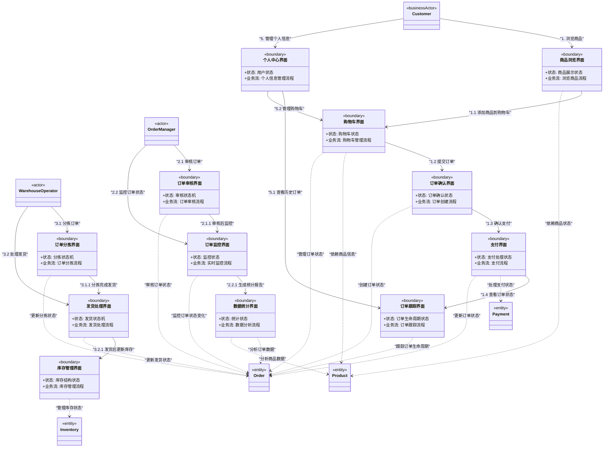

# 7 创建和维护初步界面原型

## 7.1 界面原型的概念与价值

### 7.1.1 什么是模式驱动的界面原型

界面原型是**业务模式在用户交互层的可视化体现**，它基于领域模型中的状态模式、业务流模式和参与者角色，系统化地设计用户界面，确保技术实现与用户体验的一致性。

### 7.1.2 模式化界面原型的核心价值

**模式一致性**：界面设计与业务模式保持高度一致
**开发指导性**：为前端开发提供明确的交互逻辑和状态管理指导
**用户体验可预测**：基于模式的界面设计确保用户操作路径的合理性
**变更可追溯**：业务变化能够快速映射到界面调整

## 7.2 界面原型构建方法论

### 7.2.1 核心设计原则

**原则1：参与者驱动界面设计**
- 每个界面必须服务于具体的**参与者**（`«businessActor»`或`«actor»`）
- 界面功能和信息密度与参与者角色和能力匹配
- 界面跳转路径反映参与者的业务流程

**原则2：状态模式驱动界面状态**
- 界面组件的显示/隐藏、可用/禁用由**状态模式**决定
- 界面实时反映领域对象的状态变化
- 状态转换在界面中有明确的视觉反馈

**原则3：业务流模式驱动界面导航**
- 界面跳转逻辑基于**业务流模式**设计
- 多步骤流程提供清晰的进度指示
- 异常流程有专门的界面处理

**原则4：价值驱动的信息呈现**
- 界面只显示与当前参与者相关的信息和操作
- 重要业务信息在界面中有明确的视觉层次
- 操作结果有及时的反馈机制

### 7.2.2 模式驱动的构建流程

## 7.3 订单系统界面原型构建实例

### 7.3.1 基于参与者分析的界面规划

### 7.3.2 状态模式驱动的界面设计

#### 订单生命周期状态界面映射

#### 状态驱动的界面组件设计

### 7.3.3 业务流模式驱动的界面导航

#### 状态机驱动流的界面设计

#### 业务流程驱动流的界面设计

### 7.3.4 参与者专属的界面设计

#### 消费者界面设计要点

```mermaid
classDiagram
    direction LR
    
    class 消费者界面原则 {
        +操作简单: 3步完成下单
        +信息清晰: 关键信息突出
        +反馈及时: 操作结果明确
        +路径简短: 最小化跳转
    }
    
    class 商品浏览界面 {
        +分类导航清晰
        +搜索功能突出
        +商品卡片简洁
        +一键加入购物车
        +设计目标: 快速找到商品
    }
    
    class 购物车界面 {
        +商品列表直观
        +数量修改便捷
        +总金额实时计算
        +推荐商品智能
        +设计目标: 高效管理购物车
    }
    
    class 订单确认界面 {
        +收货地址醒目
        +支付方式明确
        +优惠信息透明
        +提交按钮突出
        +设计目标: 快速确认信息
    }
    
    消费者界面原则 --> 商品浏览界面 : 指导设计
    消费者界面原则 --> 购物车界面 : 指导设计
    消费者界面原则 --> 订单确认界面 : 指导设计
```

#### 订单管理员界面设计要点

## 7.4 界面原型维护与演进

### 7.4.1 模式驱动的需求变更处理

### 7.4.2 变更示例：新增订单拆分功能

#### 界面原型更新

## 7.5 界面原型验证与质量保证

### 7.5.1 模式一致性检查清单

- [ ] **状态一致性**：界面状态与领域状态模式是否一致
- [ ] **流程完整性**：界面跳转是否覆盖所有业务流路径
- [ ] **角色适配性**：界面复杂度是否匹配参与者能力
- [ ] **操作合理性**：可用操作是否符合当前业务状态
- [ ] **反馈及时性**：状态变化是否有明确的界面反馈

### 7.5.2 用户体验验证指标

### 7.5.3 团队协作规范

**界面原型评审流程**：
1. **业务评审**：产品经理验证业务需求覆盖
2. **交互评审**：交互设计师验证用户体验
3. **技术评审**：开发团队验证技术可行性
4. **测试评审**：测试团队验证可测试性

**版本管理规范**：
- 使用设计系统管理界面组件库
- 建立界面原型版本历史
- 维护界面变更日志和决策记录

## 7.6 总结

通过模式驱动的界面原型设计方法，我们能够：

**确保业务技术一致性**：界面设计与领域模型保持高度一致
**提升开发效率**：清晰的界面规范减少沟通成本
**优化用户体验**：基于模式的交互设计更符合用户心智模型
**支持持续演进**：模式化的设计便于后续维护和扩展

**关键成功因素**：
1. **深度理解业务模式**：准确把握状态模式和业务流模式
2. **用户为中心的设计**：基于参与者需求设计界面
3. **系统化的设计思维**：建立统一的界面设计语言
4. **持续的验证优化**：通过用户测试不断改进界面设计

这种模式驱动的界面原型设计方法，为构建高质量、可维护的用户界面提供了系统化的指导框架。

# 7.7 订单系统界面原型概览

## 7.7.1 界面原型概览图

## 7.7.2 概览图制作原则与步骤

### 制作原则

1. **状态机驱动原则**
   - 每个界面设计基于对应的状态机模式
   - 界面状态与领域状态保持同步

2. **业务流驱动原则**
   - 界面跳转基于业务流模式设计
   - 用例步骤明确标注交互顺序

3. **参与者驱动原则**
   - 每个界面必须服务于具体的参与者
   - 界面功能复杂度与参与者技术能力匹配

4. **用例步骤标记原则**
   - 参与者与界面交互标记具体用例步骤
   - 使用层次化编号标识调用次序

5. **单向依赖原则**
   - 参与者→界面→领域类的单向依赖链
   - 避免循环依赖，确保架构清晰

### 制作步骤

**详细步骤说明：**

1. **识别参与者和用例**
   - 分析系统用户角色和业务用例
   - 确定各参与者的核心业务流程

2. **分析状态机和业务流**
   - 识别每个业务对象的状态机模式
   - 分析业务流程中的状态转换

3. **按状态机设计界面**
   - 为每个重要状态设计对应的界面
   - 确保界面能够反映状态变化

4. **按业务流设计跳转**
   - 基于业务流程设计界面导航
   - 确保用户操作路径符合业务逻辑

5. **标记用例步骤**
   - 为每个交互关系标记具体的用例步骤
   - 使用层次化编号体现调用次序

6. **建立单向依赖**
   - 严格保持参与者→界面→领域类的依赖方向
   - 基于状态机和业务需求建立依赖关系

## 7.7.3 界面元素识别表

| 步骤       | 元素类型         | 识别原则                                 | 识别结果                                                     | 用例步骤         |
| ---------- | ---------------- | ---------------------------------------- | ------------------------------------------------------------ | ---------------- |
| **第一步** | **业务参与者**   | 外部业务利益相关者，使用系统完成业务目标 | `Customer`                                                   | 主要用例执行者   |
| **第一步** | **系统参与者**   | 内部业务角色，负责系统运营和管理         | `OrderManager`, `WarehouseOperator`                          | 管理用例执行者   |
| **第二步** | **消费者界面**   | 基于购物状态机和业务流设计               | `商品浏览界面`, `购物车界面`, `订单确认界面`, `支付界面`, `订单跟踪界面`, `个人中心界面` | 1.x 系列用例     |
| **第二步** | **管理员界面**   | 基于审核状态机和监控业务流               | `订单审核界面`, `订单监控界面`, `数据统计界面`               | 2.x 系列用例     |
| **第二步** | **操作员界面**   | 基于分拣发货状态机和作业流程             | `订单分拣界面`, `发货处理界面`, `库存管理界面`               | 3.x 系列用例     |
| **第三步** | **状态机界面**   | 界面设计直接对应状态机状态               | 所有界面都标注对应状态机                                     | 状态驱动交互     |
| **第四步** | **业务流跳转**   | 界面跳转基于业务流步骤                   | 所有界面间箭头关系                                           | 流程步骤编号     |
| **第五步** | **用例步骤标记** | 交互关系标记具体用例步骤                 | 所有依赖关系标注                                             | 1, 1.1, 1.1.1 等 |
| **第六步** | **状态依赖**     | 界面依赖领域类的状态信息                 | 所有..>依赖关系                                              | 状态数据需求     |

**用例步骤编号说明：**
- **1.x**: 消费者购物流程用例步骤
- **2.x**: 管理员管理流程用例步骤  
- **3.x**: 操作员作业流程用例步骤
- **x.x.x**: 子步骤和详细操作序列

通过这个系统化的方法，我们构建了一个完整的订单系统界面原型概览，清晰地展示了基于状态机和业务流的界面设计，以及参与者与界面类之间的用例步骤交互关系，为后续的界面详细设计和用户体验优化提供了坚实的基础。