# 8 初步的系统架构设计

## 8.1 系统架构设计概述

### 8.1.1 架构设计目标

基于需求规格说明、领域模型和界面原型的综合分析，系统架构设计旨在构建一个**可扩展、高可用、易维护**的分布式系统架构，满足订单业务的高并发处理需求。

### 8.1.2 架构设计原则

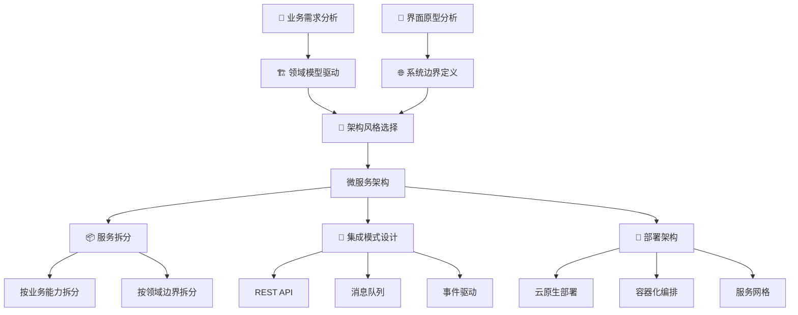

## 8.2 系统总体架构

### 8.2.1 架构层次设计

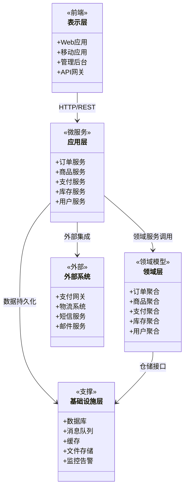

### 8.2.2 微服务架构设计

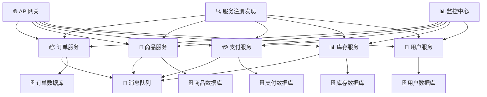

## 8.3 子系统设计与部署

### 8.3.1 核心业务子系统

#### 订单管理子系统

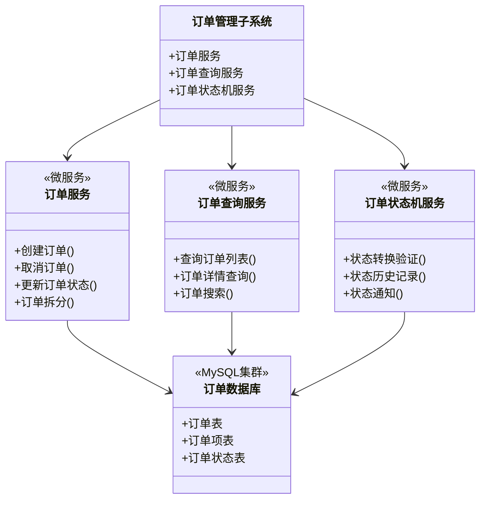

#### 商品管理子系统

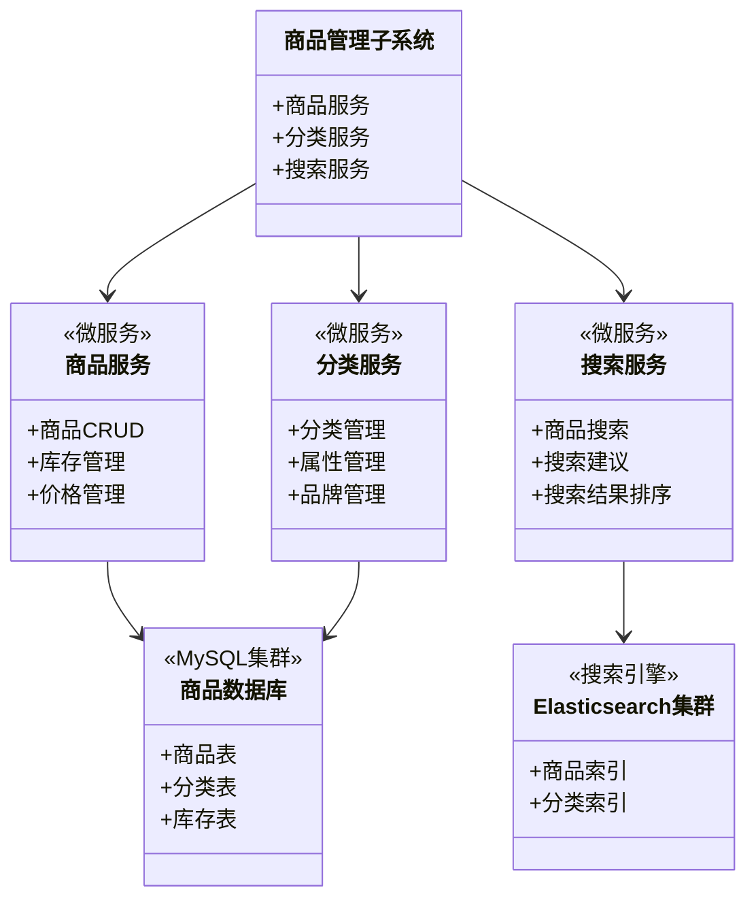

### 8.3.2 支撑子系统

#### 支付处理子系统

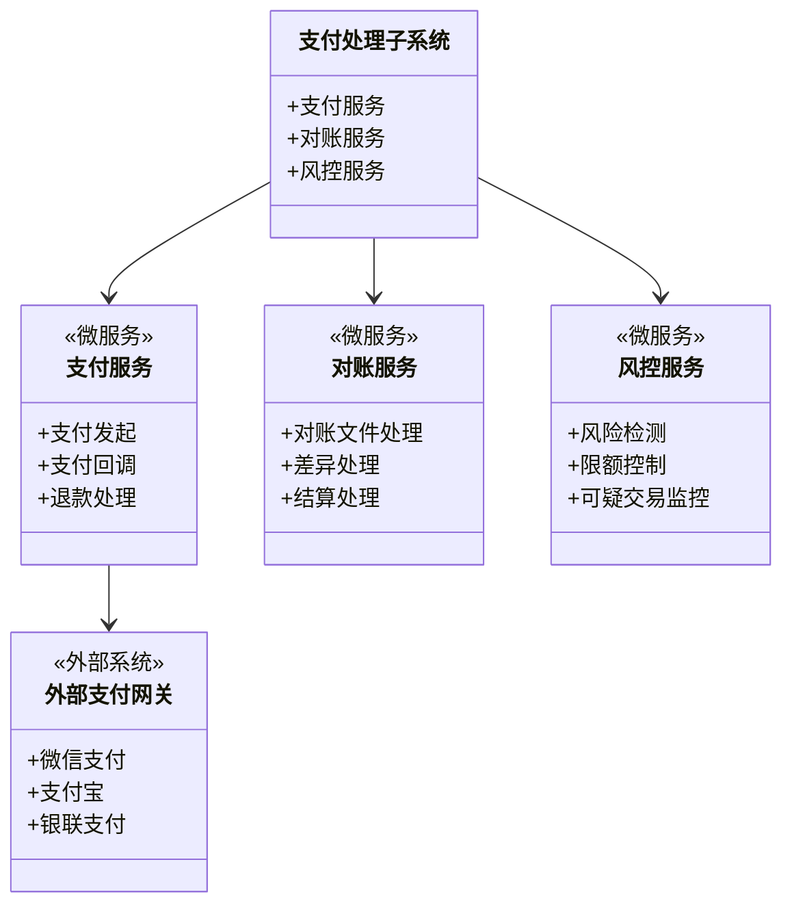

## 8.4 系统交互架构

### 8.4.1 与外部系统交互

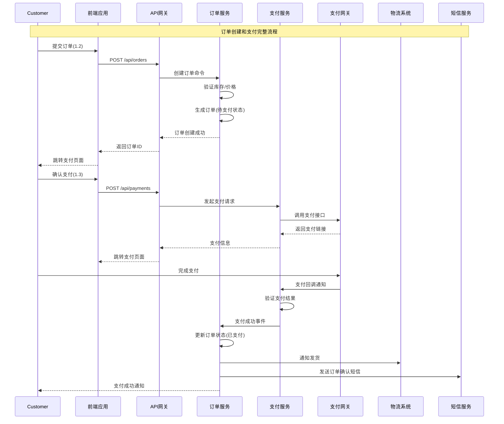

### 8.4.2 内部服务间交互

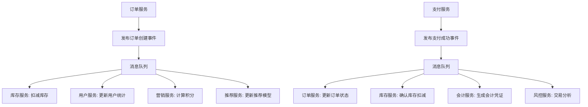

## 8.5 部署架构设计

### 8.5.1 云原生部署架构

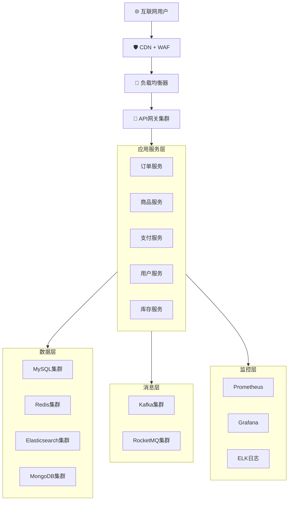

### 8.5.2 多环境部署策略

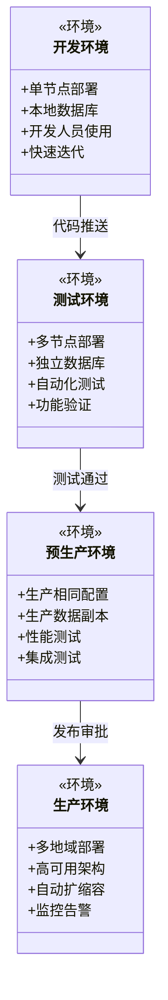

## 8.6 技术栈选择

### 8.6.1 后端技术栈

| 层级           | 技术组件                | 选型理由               |
| -------------- | ----------------------- | ---------------------- |
| **开发框架**   | Spring Boot 3.x         | 生态成熟，开发效率高   |
| **微服务框架** | Spring Cloud            | 与Spring Boot无缝集成  |
| **服务网格**   | Istio                   | 服务治理能力强大       |
| **API网关**    | Spring Cloud Gateway    | 性能优秀，功能丰富     |
| **消息队列**   | Apache Kafka + RocketMQ | 高吞吐，顺序消息       |
| **数据库**     | MySQL + Redis + MongoDB | 关系型+缓存+文档型组合 |
| **搜索引擎**   | Elasticsearch           | 全文搜索，聚合分析     |

### 8.6.2 前端技术栈

| 应用类型     | 技术栈             | 适用场景             |
| ------------ | ------------------ | -------------------- |
| **Web应用**  | Vue 3 + TypeScript | 消费者端，开发效率高 |
| **管理后台** | React + Ant Design | 运营管理，组件丰富   |
| **移动应用** | Flutter            | 跨平台，一致体验     |
| **小程序**   | 原生开发           | 微信生态，用户体验好 |

## 8.7 非功能性设计

### 8.7.1 性能设计

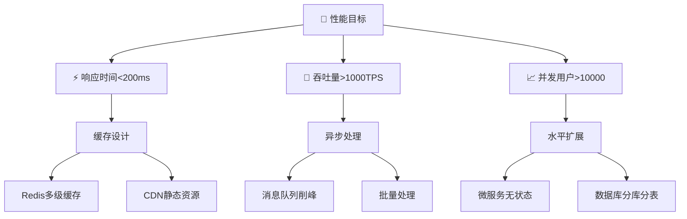

### 8.7.2 可用性设计

- **服务可用性**: 99.95%
- **数据持久性**: 99.999%
- **故障恢复时间**: <5分钟
- **数据备份**: 跨地域多副本

### 8.7.3 安全设计

- **身份认证**: JWT + OAuth 2.0
- **API安全**: 签名验证 + 限流防护
- **数据安全**: 加密传输 + 脱敏处理
- **操作审计**: 全链路日志追踪

## 8.8 架构演进规划

### 8.8.1 阶段化实施

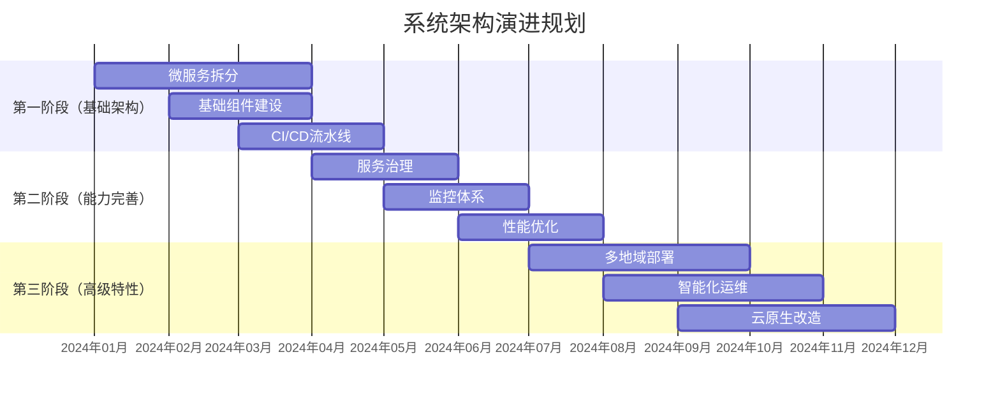

通过这个系统化的架构设计，我们构建了一个基于微服务架构的订单系统，充分考虑了与外部系统的集成、内部服务的协作、部署架构的可扩展性，为系统的顺利实施和长期演进奠定了坚实基础。