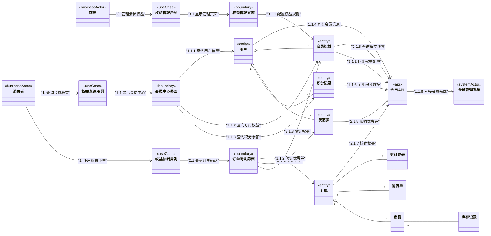

```mermaid
classDiagram
    direction TD
    
    class 消费者 {
        <<businessActor>>
    }
    
    class 仓库管理员 {
        <<actor>>
    }
    
    class 查询物流用例 {
        <<useCase>>
    }
    
    class 发货处理用例 {
        <<useCase>>
    }
    
    class 订单跟踪界面 {
        <<boundary>>
    }
    
    class 发货管理界面 {
        <<boundary>>
    }
    
    class 订单 {
        <<entity>>
    }
    
    class 物流单 {
        <<entity>>
    }
    
    class 仓库出库单 {
        <<entity>>
    }
    
    class 库存记录 {
        <<entity>>
    }
    
    class 物流API {
        <<api>>
    }
    
    class 物流配送系统 {
        <<systemActor>>
    }
    
    %% 仓库发货时序
    仓库管理员 --> 发货处理用例 : "1. 处理订单发货"
    发货处理用例 --> 发货管理界面 : "1.1 显示发货页面"
    发货管理界面 --> 订单 : "1.1.1 查询订单信息"
    发货管理界面 --> 物流单 : "1.1.2 创建物流记录"
    发货管理界面 --> 仓库出库单 : "1.1.3 生成出库单"
    发货管理界面 --> 库存记录 : "1.1.4 更新库存状态"
    
    %% Entity依赖物流API
    物流单 --> 物流API : "1.1.5 调用物流接口"
    仓库出库单 --> 物流API : "1.1.6 记录发货信息"
    订单 --> 物流API : "1.1.7 同步发货状态"
    库存记录 --> 物流API : "1.1.8 同步库存出库"
    
    %% 消费者查询时序
    消费者 --> 查询物流用例 : "2. 查询物流状态"
    查询物流用例 --> 订单跟踪界面 : "2.1 显示跟踪页面"
    订单跟踪界面 --> 订单 : "2.1.1 查询订单状态"
    订单 --> 物流单 : "2.1.2 获取物流信息"
    物流单 --> 物流API : "2.1.3 查询物流轨迹"
    
    %% API对接外部系统
    物流API --> 物流配送系统 : "1.1.9 对接物流公司"

    %% 实体间关系
    订单 "1" -- "1" 支付记录
    订单 "1" -- "1" 物流单
    订单 "1" o-- "*" 商品
    商品 "1" -- "1" 库存记录
```

# 9 对接其他子系统

## 9.1 跨系统对接的概念与价值

### 9.1.1 什么是跨系统对接

跨系统对接是指**本系统与其他业务系统之间建立的业务协作关系**，通过定义清晰的系统边界和接口契约，实现业务流程的无缝衔接和数据的一致性同步。

### 9.1.2 跨系统对接的核心价值

**业务流程连续性**：确保跨系统的业务流程完整顺畅，为用户提供一致的业务体验
**数据一致性**：维护跨系统业务数据的一致性，避免数据冲突和业务逻辑错误
**系统可扩展性**：通过清晰的接口契约支持新系统的快速接入和业务扩展
**维护性**：明确的系统边界和职责划分降低系统复杂度和维护成本

### 9.1.3 对接模式的价值体现

**直接对接模式价值：**
- 业务响应及时，数据实时同步
- 业务流程简单直接，用户体验流畅
- 适用于对实时性要求高的核心业务

**异步对接模式价值：**
- 系统间解耦，提高系统稳定性
- 支持业务峰值削峰填谷
- 适用于非实时性业务和数据同步

**适配器模式价值：**
- 屏蔽外部系统差异，降低集成复杂度
- 支持多版本接口兼容
- 便于外部系统替换和升级

## 9.2 跨系统对接构建方法论

### 9.2.1 核心对接原则

**原则1：业务语义一致性**
- 确保本系统与其他系统对相同业务概念的理解一致
- 建立跨系统的业务术语词典
- 业务状态和枚举值保持语义对应

**原则2：系统边界清晰**
- 明确各系统的业务职责边界
- 确定数据所有权和主维护系统
- 避免跨系统的业务逻辑耦合

**原则3：接口契约稳定**
- 基于业务需求定义稳定的系统接口
- 接口变更保持向后兼容
- 提供清晰的接口文档和版本管理

**原则4：异常处理完备**
- 定义跨系统调用的超时和重试机制
- 设计业务补偿和数据一致性方案
- 建立系统间监控和告警机制

### 9.2.2 对接构建流程

**详细步骤说明：**

1. **业务需求分析**
   - 分析需要与其他系统交互的业务场景
   - 识别跨系统的业务流程和数据依赖

2. **识别外部系统**
   - 确定需要对接的外部系统及其业务职责
   - 分析外部系统的接口能力和限制

3. **分析业务概念映射**
   - 建立本系统与外部系统的业务概念对应关系
   - 识别概念差异和转换需求

4. **设计集成方案**
   - 基于映射关系选择合适的集成模式
   - 设计数据同步和状态一致性方案

5. **定义接口契约**
   - 制定清晰的接口规范和数据结构
   - 定义错误码和异常处理机制

6. **实现适配逻辑**
   - 开发业务概念转换逻辑
   - 实现跨系统调用和数据处理

7. **验证业务完整性**
   - 测试端到端业务流程
   - 验证数据一致性和异常处理

## 9.3 完整业务流程依赖链

### 9.3.1 支付业务流程依赖链

#### 类图展示

#### 交互图展示

### 9.3.2 物流跟踪业务流程依赖链

#### 类图展示

#### 交互图展示

### 9.3.3 会员权益业务流程依赖链

#### 类图展示

#### 交互图展示

### 9.3.4 完整系统对接类图

## 9.4 关键业务系统对接

### 9.4.1 支付业务系统对接

**业务概念映射分析：**

| 本系统业务概念 | 支付系统业务概念 | 业务关系 | 集成方式                   |
| -------------- | ---------------- | -------- | -------------------------- |
| **订单**       | 商户订单         | 完全对应 | 订单编号作为业务关联标识   |
| **支付记录**   | 支付交易         | 业务对应 | 支付交易作为支付记录的来源 |
| **支付状态**   | 支付状态         | 状态对应 | 支付状态业务含义映射       |
| **支付方式**   | 支付渠道         | 完全对应 | 支付方式直接对应           |

### 9.4.2 物流业务系统对接

**业务概念映射分析：**

| 本系统业务概念 | 物流系统业务概念 | 业务关系 | 集成方式             |
| -------------- | ---------------- | -------- | -------------------- |
| **订单**       | 发货单           | 业务对应 | 订单信息转换为发货单 |
| **物流信息**   | 运单             | 完全对应 | 运单信息同步展示     |
| **收货地址**   | 收货信息         | 完全对应 | 地址信息业务格式统一 |

## 9.5 业务集成验证

### 9.5.1 业务流程完整性检查

所有业务流程都形成了完整的依赖链，从业务参与者到外部系统的完整路径确保了业务集成的完整性。

### 9.5.2 业务验收标准

**支付业务验收：**
- 支付方式业务正常
- 支付状态业务同步准确
- 异常情况业务处理合理

**物流业务验收：**
- 物流状态业务同步及时
- 收货确认业务流程完整
- 异常物流业务处理得当

通过这种基于依赖关系的系统对接分析，我们清晰地展示了订单系统与其他业务系统之间的完整交互链路，从业务参与者到外部系统的完整依赖链确保了业务集成的完整性和一致性。

