# 信息化建模过程详解

---

### 1 从混沌到秩序——信息化建模的逻辑演进

本章通过一个简化的**订单系统**案例，清晰地展示将现实需求转化为信息化模型的逻辑演进过程。我们将遵循“先静态后动态，先结构后行为”的原则，逐步构建出系统的完整蓝图。

#### 1.1 初始状态 - 杂乱无章的对象与连接

在建模的起始点，我们面对的是从业务讨论中收集到的一系列零散概念和模糊关系，所有信息都处于未加工的混沌状态。

**逻辑图示（思维导图）**

下面的思维导图直观地展示了这种混沌状态，其中概念被随意归类，连接关系使用非技术性词汇描述。

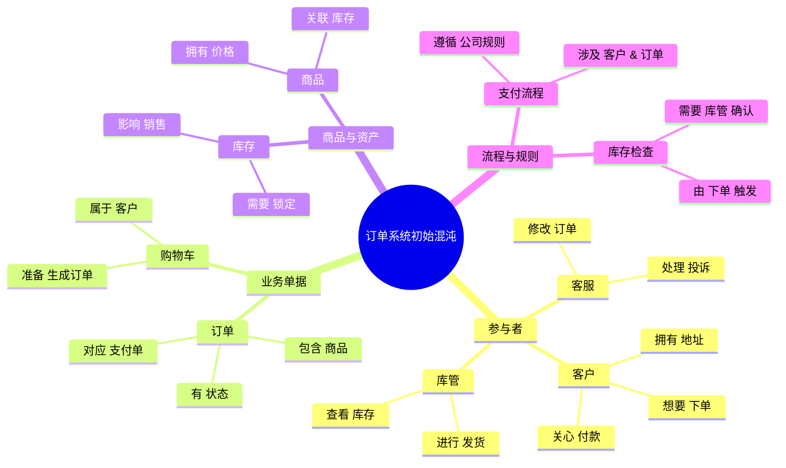

**核心特点**

*   **视角具体而微观**：关注的是具体的实例（如"张三"、"订单#001"），而非抽象的类别
*   **关系与职责混乱**：对象之间的边界不清，连接关系模糊且未被定义
*   **缺乏抽象与归类**：尚未对相似对象进行归纳，也未对连接类型进行区分

**阶段产出**

此阶段的产出是对问题域的原始认知，是所有后续分析设计工作的基础输入。它清晰地表明了为什么我们需要建模——**就是为了从这片混沌中建立秩序**。

#### 1.2 识别与归纳 - 形成类并定义核心属性

基于初始的混沌状态，我们开始进行**抽象**和**归纳**，识别出核心的**类**，并定义它们的静态特征——**属性**。

**逻辑图示（类图）**

类图展示了我们如何将杂乱的思维导图梳理成结构化的静态模型。

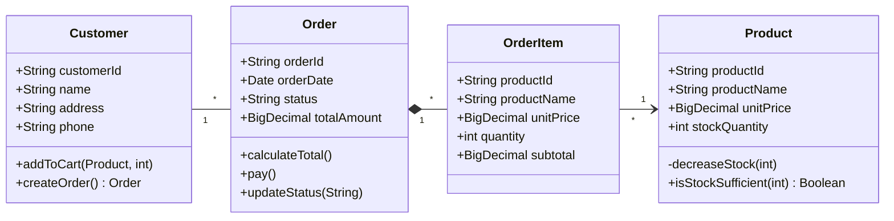

**核心工作**

*   **抽象**：从具体实例中提取共性，形成"类"的概念
*   **定义属性**：明确每一类对象"知道什么"，即它们的状态或数据
*   **建立静态关联**：明确类与类之间存在何种结构性的关系

**阶段产出**

系统的"静态骨架"——类图。它明确了系统中有哪些核心构件、每个构件的内在数据特征，以及构件之间的静态关系。

#### 1.3 定义行为与交互 - 添加方法并描述调用

在静态结构的基础上，我们开始定义类的**动态行为**——**方法**，并描述对象之间为了完成业务目标而进行的**方法调用**序列。

**逻辑图示（时序图）**

时序图生动地描绘了在"用户完成下单"这个场景下，对象之间是如何相互协作的。

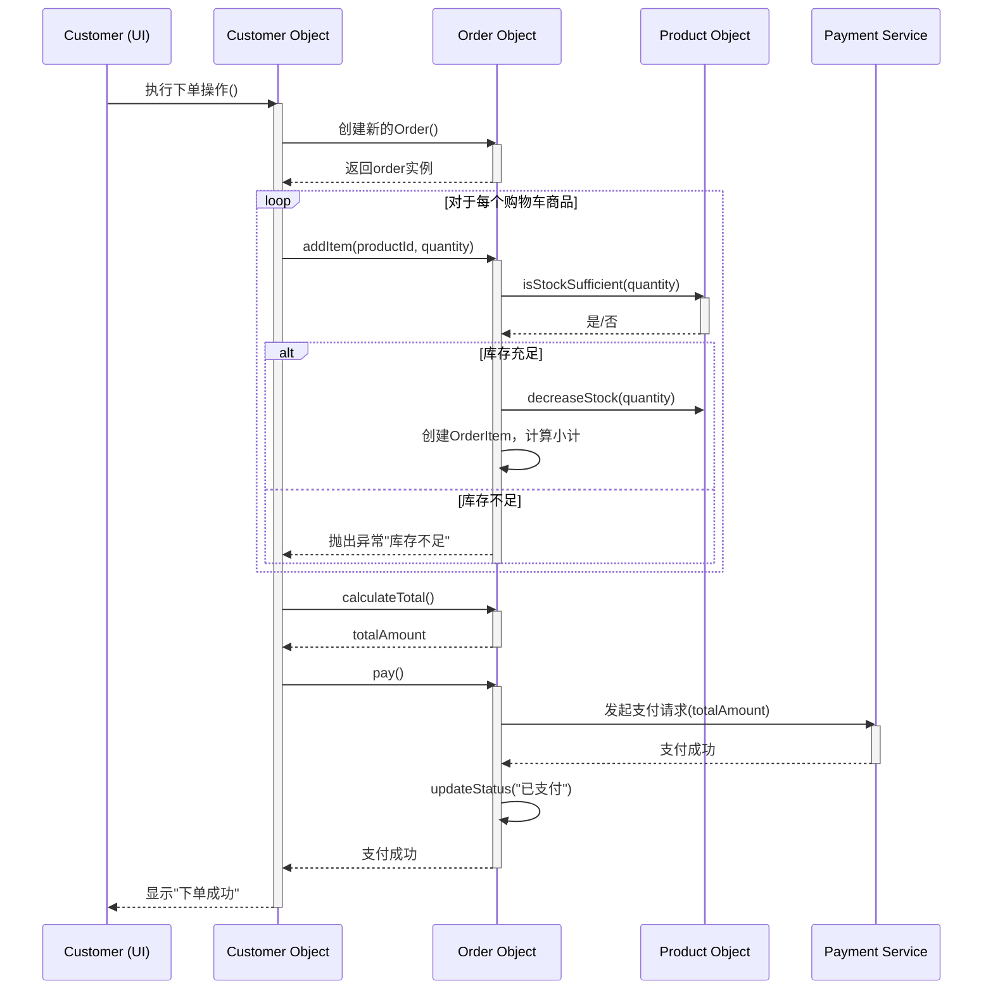

**核心工作**

*   **分配职责**：为每个类定义"能做什么"，即其方法
*   **描述协作**：通过交互图展示对象之间为了完成特定业务目标的消息传递
*   **明确流程**：将业务流程转化为具体的方法调用链

**阶段产出**

系统的"动态行为"模型——包括类的方法定义和关键的交互图。它明确了系统在运行时的行为模式和各组件之间的协作关系。

#### 1.4 动态协作 - 属性值的传递与状态变化

最后，我们通过**状态图**和**数据快照**来观察关键对象在协作过程中，其内部**属性值**和**状态**的具体变化。

**逻辑图示（状态图与数据快照）**

**订单对象的状态变迁**
状态图清晰地展示了`Order`对象的完整生命周期。

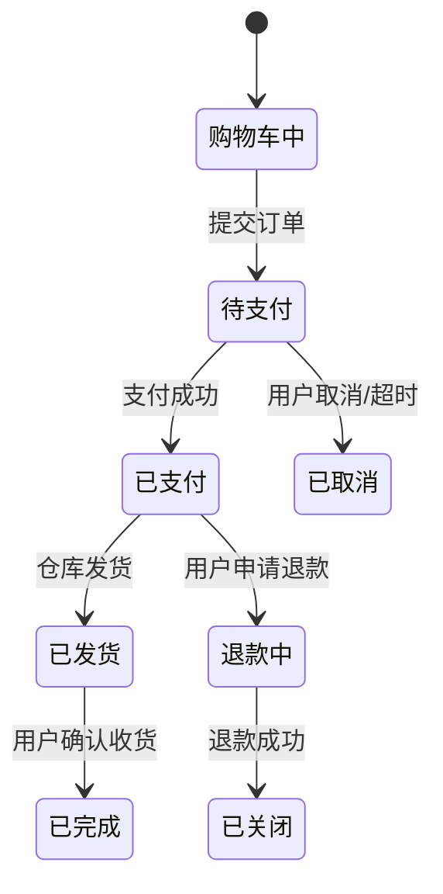

**关键操作后的数据快照**
数据快照展示了核心属性在业务流程中的具体变化。

| 操作                        | Customer.customerId | Order.orderId | Order.status | Order.totalAmount | Product.stockQuantity   |
| :-------------------------- | :------------------ | :------------ | :----------- | :---------------- | :---------------------- |
| **初始状态**                | "C123"              | -             | -            | -                 | 100                     |
| **调用 addItem("P001", 2)** | "C123"              | -             | -            | -                 | **100 → 98** (库存锁定) |
| **提交订单，createOrder()** | "C123"              | **"O789"**    | **"待支付"** | **￥200.00**      | 98                      |
| **支付成功，pay()**         | "C123"              | "O789"        | **"已支付"** | ￥200.00          | 98                      |
| **仓库发货**                | "C123"              | "O789"        | **"已发货"** | ￥200.00          | 98 (实际扣减)           |

**核心工作**

*   **追踪状态变迁**：定义对象生命周期的合法状态和转换路径
*   **监视数据变化**：在关键操作节点，记录和验证核心属性值的正确变化

**阶段产出**

系统的"运行时验证"模型——包括状态机和数据变化追踪。它确保了我们设计的模型不仅在结构上正确，在行为逻辑和数据处理上也符合业务预期。

---

### 2 多维度工作流：空间视角下的并行推进

在第一章中，我们清晰地展示了从混沌到秩序的逻辑建模过程。然而，在实践中，这一过程并非简单的线性序列。**所谓迭代，即在上述过程中，工作不是一步一步地进行，工件也不是一次完成的；这些工作是在不同的工作流中从多个维度并行推进、相互验证、反复验证的过程，工件也是不断生长完善的。**

在不同的阶段，某些工作的确会在不同工作流的某个维度发生得更多。另外，需要特别指出的是，**维度是由于某种价值驱动的某些相关工作形成的一系列工件元素的集合。** 通过适当的工作内容和工件组成的设计（比如用例里面的扩展点，代码中的Mock对象），它们可以相对完整地加入、修改和删除而不影响其他维度的工作和工件内容，使得不同维度的工作和工件内容能够各自相对独立地变化。

本章将深入探讨这一在“空间”（工作流与维度）中协同推进的建模范式。

#### 2.1 核心范式：多价值驱动的工作流

迭代式开发的核心在于，建模工作是在多个由价值驱动的**维度（空间）** 上，沿着**迭代周期（时间）** 并行展开和演进的。这构成了一个立体的、动态的工作网络。

**空间维度：多价值驱动的工作流**

下图从**空间视角**展示了在同一个迭代周期（如Sprint 1）内，不同价值维度下的任务是如何并行推进和相互作用的。它清晰地描绘了工作的“分布”。

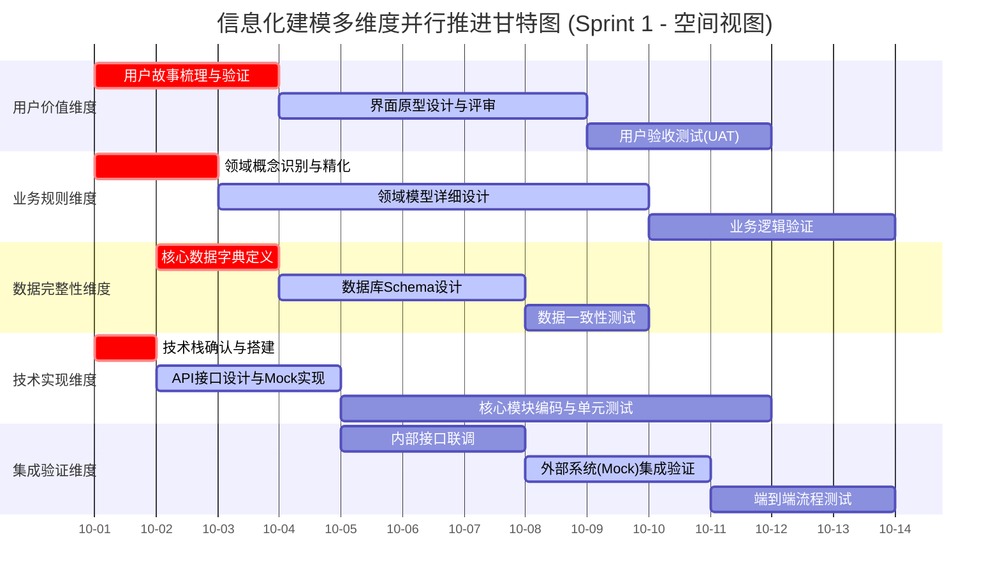

**图解与说明（空间结构）：**
*   **并行性**：五个维度的任务在时间线上几乎同时开始，清晰地展示了“空间”上的并行推进。
*   **关键路径与依赖**：标为`crit`的任务是整个迭代的基石。箭头显示了跨维度的关键依赖，例如`API接口设计与Mock实现`（技术维度）为`内部接口联调`（集成维度）提供了前提。
*   **解耦设计**：“API接口设计与Mock实现”任务是实现技术维度与其他维度解耦的关键。一旦接口和Mock确定，用户价值维度和业务规则维度的工作就可以基于Mock接口相对独立地验证和推进。

#### 2.2 工作流的维度划分与解耦设计

信息化建模过程中的工作流可以按照价值驱动原则划分为多个维度，每个维度都有其特定的关注点和产出工件。

**主要工作流维度：**

1. **用户价值维度**
   - 关注点：用户体验、界面交互、用户故事
   - 核心工件：用户故事地图、界面原型、用户体验规范

2. **业务规则维度**
   - 关注点：领域逻辑、业务流程、业务规则
   - 核心工件：领域模型、业务规则库、流程定义

3. **数据完整性维度**
   - 关注点：数据结构、数据一致性、数据治理
   - 核心工件：数据字典、数据库Schema、数据质量标准

4. **技术实现维度**
   - 关注点：系统架构、技术选型、代码实现
   - 核心工件：架构文档、API规范、源代码

5. **集成验证维度**
   - 关注点：系统集成、接口测试、端到端验证
   - 核心工件：集成方案、测试用例、部署脚本

**解耦设计机制：**

通过接口契约、Mock服务、数据契约等设计手段，各个维度可以相对独立地进行工作和演进：

- **接口先行**：先定义接口规范，各团队基于接口并行工作
- **Mock服务**：提供模拟实现，支持前端和集成测试的早期开展
- **契约测试**：确保各维度实现符合既定契约，减少集成风险
- **数据契约**：明确数据格式和语义，保证数据一致性

#### 2.3 跨维度协作与验证

虽然各个维度相对独立，但它们之间需要通过密集的协作和验证来确保整体一致性。

**协作模式：**

1. **定期同步**：各维度代表定期会晤，同步进展和问题
2. **交叉评审**：不同维度的工作成果进行交叉评审
3. **集成验证**：通过持续集成环境进行早期集成验证
4. **反馈循环**：建立快速的反馈机制，及时调整各维度工作

**验证机制：**

- **用户价值 ↔ 业务规则**：通过用户场景验证业务逻辑的合理性
- **业务规则 ↔ 技术实现**：通过技术实现验证业务规则的可实现性
- **技术实现 ↔ 数据完整性**：通过数据操作验证技术实现的正确性
- **所有维度 ↔ 集成验证**：通过端到端测试验证整体一致性

---

### 3 迭代演进：时间视角下的阶段与里程碑

在第二章讨论了工作流在空间维度上的并行推进后，本章将从时间视角探讨信息化建模的迭代演进过程。迭代开发的核心在于将大型复杂项目分解为多个可管理的时间周期，每个周期都交付可验证的增量价值。

#### 3.1 迭代周期中的能量流动

下图从**时间视角**展示了在一个迭代周期内，工作焦点（能量）如何在四个核心价值维度之间流动与交互，并最终汇聚成可工作的软件增量。它描绘了工作的“演进”。

基于RUP的9个工作流，我为您生成从总工时到工作流、任务、迭代汇总的Sankey图：

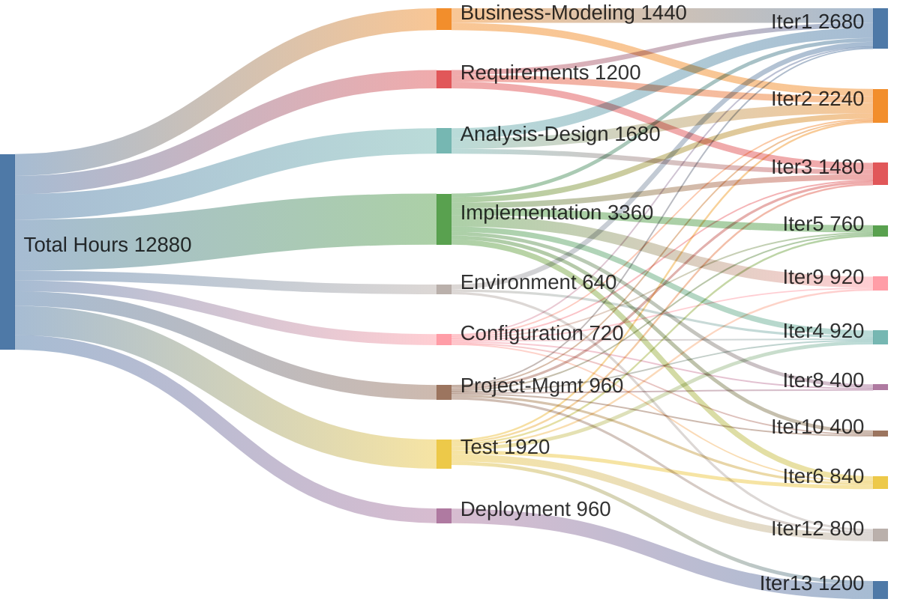

#### 3.2 RUP各迭代工作流重点

##### 3.2.1 **迭代1 (2680h) - 启动与规划**

- 业务建模: 960h (36%)
- 分析设计: 680h (25%)
- 环境设置: 320h (12%)
- 需求分析: 320h (12%)


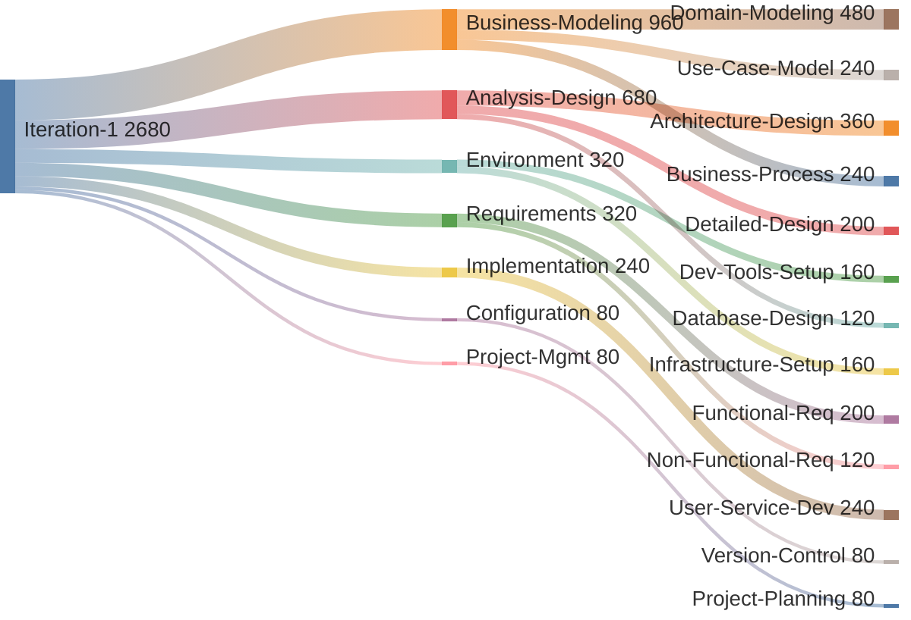

##### 3.2.2 **迭代2 (2240h) - 核心设计**

- 分析设计: 680h (30%)
- 业务建模: 480h (21%)
- 需求分析: 440h (20%)
- 实现开发: 360h (16%)

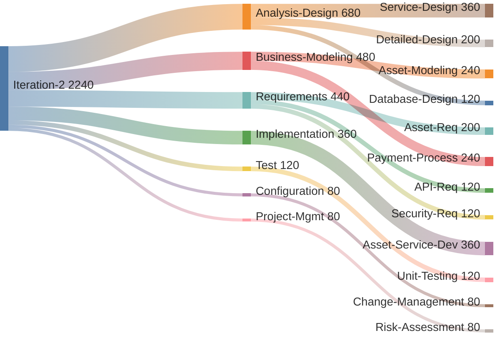

##### 3.2.3 **迭代3 (1600h) - 技术实现**

- 实现开发: 360h (23%)
- 需求分析: 440h (28%)
- 分析设计: 440h (28%)

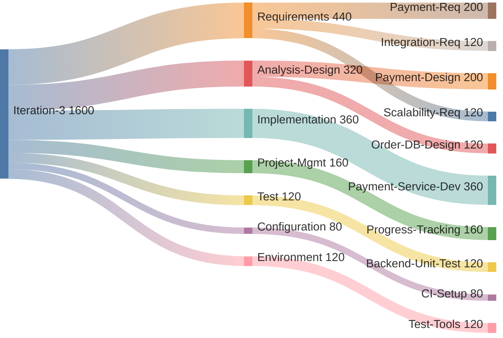

##### 3.2.4 **迭代4-6 (2520h) - 开发测试**

- 实现开发: 1080h (43%)
- 测试: 600h (24%)
- 配置管理: 240h (10%)

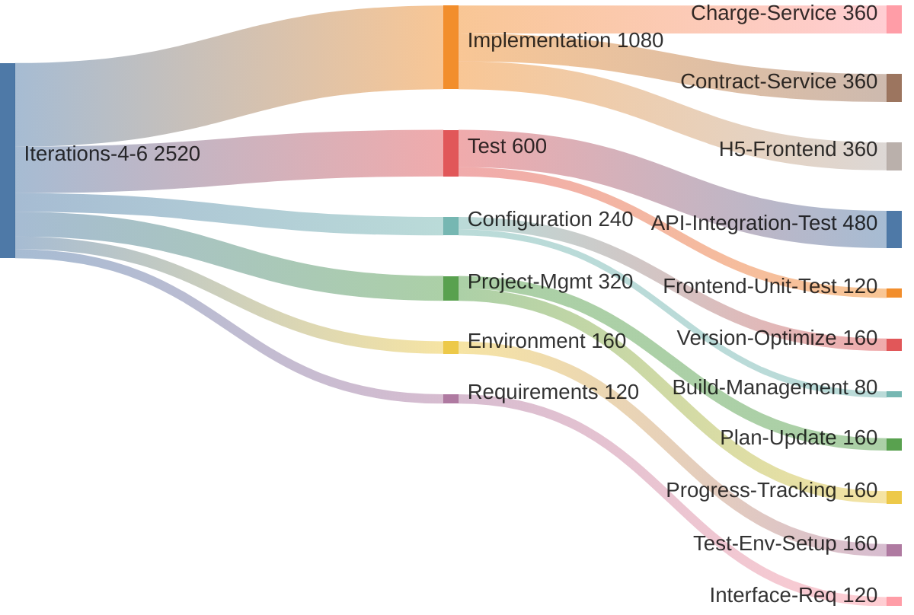
##### 3.2.5  **迭代8-10 (1720h) - 功能完善**

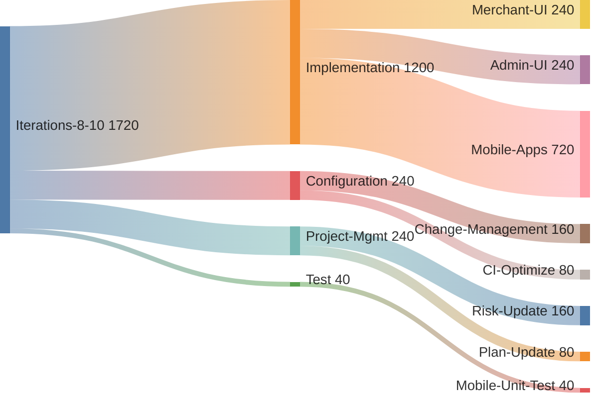

##### 3.2.6 **迭代12-13 (2000h) - 测试部署**

- 测试: 1120h (47%)
- 部署: 960h (40%)
- 项目管理: 160h (7%)

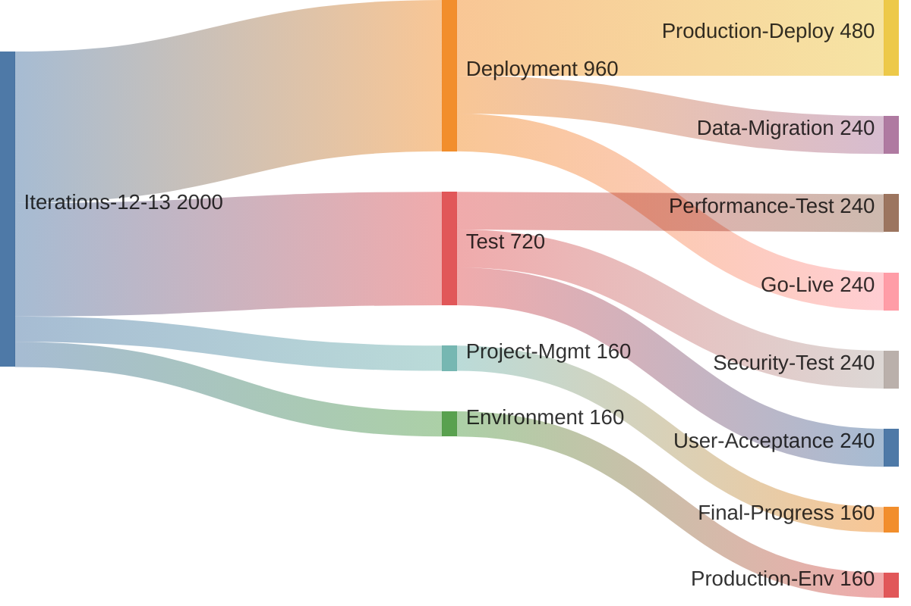

##### 3.2.7 RUP工作流演进模式

1. **业务建模 → 领域模型**，集中在迭代1-2
2. **需求分析→ 需求规格说明和界面原型** ，贯穿迭代1-3，后期减少
3. **分析设计→ 用例分析（分析模型）** 重点在迭代1-3，为开发奠基
4. **实现开发 → 用例实现模式和用例实现（分析设计模型）**从迭代1开始，在迭代4-10达到高峰
5. **测试工作** → 从迭代2开始，在迭代12-13达到高峰
6. **部署工作** → 集中在最后阶段
7. **支撑工作** → 配置、管理、环境贯穿全程

这种分布体现了RUP"计划驱动、迭代开发、风险驱动"的核心原则，确保项目在可控的前提下逐步交付价值。

**图解与说明（时间演进）：**

*   **能量输入**：左侧代表迭代初期从需求分析等准备工作投入的能量。
*   **维度汇聚**：能量被分配到四个核心价值维度，它们是承载工作的主要容器。
*   **交互与精化**：密集的连线代表了迭代中期，维度之间频繁的、双向的验证和影响。这是模型**生长与精化**的核心阶段，能量在不同维度间流动，驱动工件的不断完善。
*   **成果输出**：所有维度的努力在迭代末期汇聚成可工作的软件增量，体现了迭代的**时间目标**。

#### 3.3 关键洞察

1. **前期重设计**: 迭代1-3占50%工时，注重规划
2. **中期重开发**: 迭代4-10专注实现和测试
3. **后期重质量**: 迭代12-13重点测试部署
4. **持续管理**: 项目管理贯穿整个周期
5. **环境支撑**: 环境工作在关键节点投入

这个Sankey图清晰地展示了RUP方法论中工作流在不同迭代阶段的资源分配，体现了迭代式开发的核心理念。

#### 3.2 阶段划分与里程碑设置

信息化建模过程通常可以分为四个主要阶段，每个阶段有明确的里程碑和验收标准。

**3.2.1 初始阶段（Inception）**

**目标**：确定项目愿景、范围和可行性
**关键活动**：
- 需求收集与分析
- 业务案例开发
- 风险评估
- 初始架构规划

**里程碑**：生命周期目标里程碑
- 项目愿景和范围明确
- 关键风险识别和应对策略
- 初步成本和进度估算
- 干系人共识达成

**3.2.2 细化阶段（Elaboration）**

**目标**：建立系统架构基线，降低关键风险
**关键活动**：
- 详细需求分析
- 架构设计和验证
- 核心机制实现
- 制定详细计划

**里程碑**：生命周期架构里程碑
- 稳定的系统架构
- 关键风险已解决或缓解
- 准确的项目估算
- 详细的迭代计划

**3.2.3 构建阶段（Construction）**

**目标**：开发完整的系统功能
**关键活动**：
- 组件开发和测试
- 功能集成
- 用户文档编写
- 部署准备

**里程碑**：初始运行能力里程碑
- 所有规划功能已实现
- 系统通过完整测试
- 用户文档完成
- 部署计划就绪

**3.2.4 移交阶段（Transition）**

**目标**：将系统交付给用户
**关键活动**：
- 用户验收测试
- 问题修复和优化
- 用户培训
- 系统部署

**里程碑**：产品发布里程碑
- 用户验收通过
- 系统在生产环境稳定运行
- 用户能够独立使用系统
- 项目总结和经验教训记录

#### 3.3 迭代演进：工件的生长与跨维度验证

迭代过程体现为工件的不断生长与精化。随着讨论、实现和测试的深入，各个维度的工件开始细化，并发生强烈的跨维度相互作用。

下面的图示从**时空综合视角**展示了在迭代周期中，各个维度的工件如何通过密集的交互而"生长"，并最终收敛为一个稳定的增量。

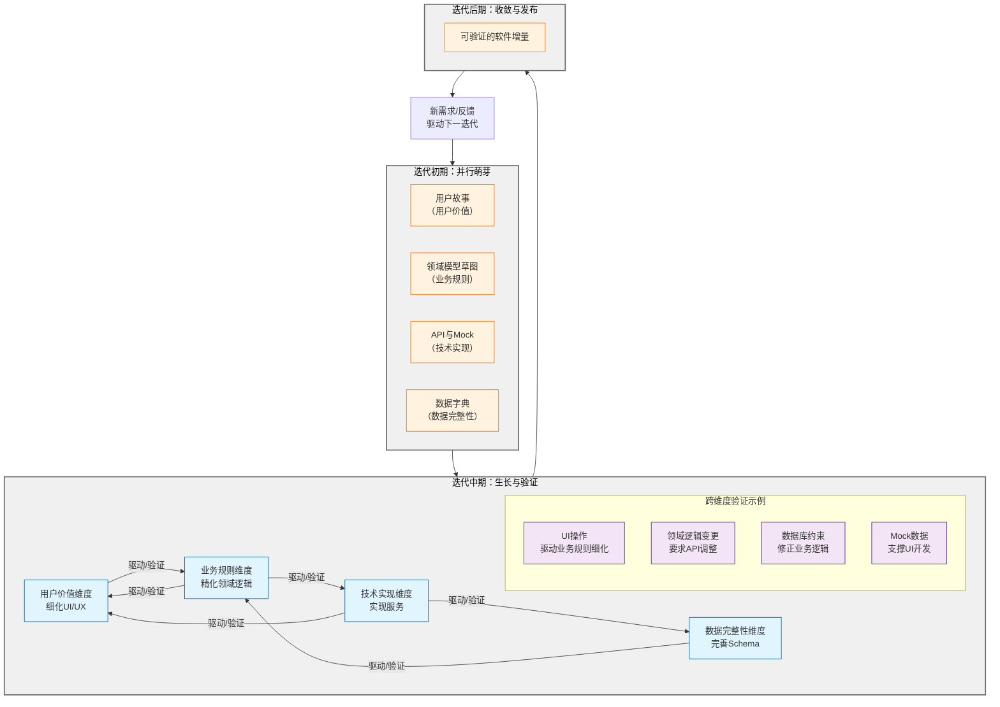

**图解与说明（时空综合）：**

*   **迭代初期（时间）**：各维度工件（用户故事、模型草图、Mock接口等）在空间上**并行启动**，相对粗糙但核心概念已互联。
*   **迭代中期（时间）**：这是**反复验证**的关键阶段，空间上的交互变得密集。
    *   **用户价值 -> 业务规则**：在细化UI时发现异常流程（如"商品库存不足"），驱动领域模型增加校验逻辑和新的状态。
    *   **业务规则 -> 技术实现**：精化领域逻辑时，发现原有API设计无法满足需求，驱动技术实现调整接口或内部算法。
    *   **技术实现 -> 数据完整性**：在编码实现时发现性能瓶颈或数据一致性问题，驱动数据库Schema引入索引或调整表结构。
    *   **技术实现 -> 用户价值**：通过Mock接口，前端开发得以并行，并提前验证用户体验。
*   **迭代后期（时间）**：模型在各维度上达成一致，在空间上**收敛**为可工作的、内聚的软件增量。
*   **循环**：增量的发布带来新的反馈和需求，随即在时间上开启下一轮迭代，模型由此螺旋式上升。

#### 3.4 总结：一个在时空中演进的工作网络

综上所述，迭代式信息化建模呈现为一个**动态的、多维度的、在时空中网络状演进的工作结构**：

1.  **空间上的解耦与并行**：工作被组织到不同的价值维度中（用户、业务、数据、技术、集成），通过接口、Mock、契约测试等设计实现解耦，允许各自在空间上独立变化与演进。
2.  **时间上的迭代与收敛**：多个维度的工作在迭代周期中并行推进，在时间上经历"萌芽-生长-验证-收敛"的循环，每个周期都交付一个可验证的增量。
3.  **时空中的持续验证**：不同维度的工件通过密集的、双向的箭头在时空网络中不断相互验证和精化，这是模型变得健壮和正确的根本保证。
4.  **价值驱动的螺旋上升**：每一个迭代周期都使模型在各个维度上更加完整和深入，推动整个系统持续进化，最终高效、高质地满足复杂的业务需求。

这一范式打破了传统的"瀑布"思维，将建模视为一个在时间与空间坐标中动态平衡和演进的过程，更符合现代软件开发的复杂性和不确定性，为我们构建高质量的信息化系统提供了有效的指导。

---

### 4 AI辅助的软件工程工作流

## 4.1 工作流概述

### 4.1.1 整体流程结构
AI辅助的软件工程工作流采用分阶段、角色明确的协作模式。从需求收集开始，通过AI辅助生成各类工程工件，并由专业人员进行修正复审，最终形成高质量的交付物。

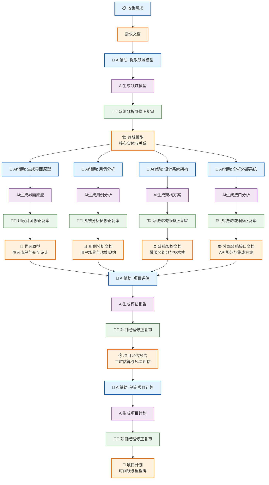

### 4.1.2 核心特点
- **人机协同**：AI负责基础内容生成，人类专家专注质量把控
- **并行处理**：基于领域模型可同时开展多项设计工作
- **质量闭环**：每个工件都经过生成-复审-修正的完整流程
- **角色专业化**：各专业人员负责其专业领域的质量保证

## 4.2 详细工作流程

### 4.2.1 收集需求 → 需求文档
**处理过程**：
- 业务需求收集与分析
- 用户访谈记录整理
- 市场调研数据分析
- 需求优先级排序

**输出工件**：需求文档
- 业务需求规格说明书
- 用户故事地图
- 功能需求列表

### 4.2.2 AI辅助提取领域模型
**AI提示词**：
```
基于以下需求文档，生成领域模型：
1. 识别核心业务实体及其属性
2. 定义实体间的关系
3. 提取业务规则和约束
4. 输出UML类图格式

输入：需求文档
输出：初步领域模型
```

**负责角色**：系统分析员  
**修正重点**：
- 业务实体完整性验证
- 关系定义准确性检查
- 业务规则正确性确认

**输出工件**：领域模型
- 核心实体与关系图
- 业务规则定义
- 领域模型说明文档

### 4.2.3 AI辅助生成界面原型
**AI提示词**：
```
基于领域模型，生成用户界面原型：
1. 设计主要页面布局
2. 定义页面间跳转关系
3. 规划用户交互流程
4. 输出页面流程图和线框图

输入：领域模型
输出：初步界面原型
```

**负责角色**：UI设计师  
**修正重点**：
- 用户体验流程优化
- 界面风格一致性调整
- 交互逻辑合理性验证

**输出工件**：界面原型
- 页面流程与交互设计
- 线框图和布局设计
- 用户体验规范

### 4.2.4 AI辅助用例分析
**AI提示词**：
```
基于领域模型，生成用例分析：
1. 识别系统参与者
2. 定义用例场景
3. 描述正常和异常流程
4. 输出用例图和详细描述

输入：领域模型
输出：初步用例分析
```

**负责角色**：系统分析员  
**修正重点**：
- 用例完整性检查
- 场景覆盖度验证
- 流程逻辑正确性确认

**输出工件**：用例分析文档
- 用户场景与功能规约
- 用例图和场景描述
- 异常处理流程

### 4.2.5 AI辅助设计系统架构
**AI提示词**：
```
基于领域模型，设计系统架构：
1. 划分微服务边界
2. 选择技术栈
3. 设计数据存储方案
4. 规划系统集成方式
5. 输出架构图和组件说明

输入：领域模型
输出：初步架构方案
```

**负责角色**：系统架构师  
**修正重点**：
- 技术可行性评估
- 性能需求考虑
- 系统扩展性设计

**输出工件**：系统架构文档
- 微服务划分与技术栈
- 系统架构图
- 组件设计说明

### 4.2.6 AI辅助分析外部系统
**AI提示词**：
```
基于领域模型，分析外部系统对接：
1. 识别需要对接的外部系统
2. 定义接口规范
3. 设计集成方案
4. 输出接口文档和集成指南

输入：领域模型
输出：初步接口分析
```

**负责角色**：系统架构师  
**修正重点**：
- 接口完整性验证
- 安全机制考虑
- 错误处理机制设计

**输出工件**：外部系统接口文档
- API规范与集成方案
- 接口定义文档
- 集成测试方案

### 4.2.7 AI辅助项目评估
**AI提示词**：
```
基于以下输入进行项目评估：
1. 界面原型 - 评估前端复杂度
2. 用例分析 - 评估业务逻辑复杂度  
3. 系统架构 - 评估技术实现复杂度
4. 外部接口 - 评估集成复杂度
5. 使用标准评估算法计算工时和风险

输入：所有技术工件
输出：初步评估报告
```

**负责角色**：项目经理  
**修正重点**：
- 工时估算合理性分析
- 风险评估准确性验证
- 资源分配方案优化

**输出工件**：项目评估报告
- 工时估算与风险评估
- 资源需求分析
- 技术可行性评估

### 4.2.8 AI辅助制定项目计划
**AI提示词**：
```
基于项目评估报告，制定详细项目计划：
1. 制定开发时间线
2. 设定里程碑节点
3. 规划资源分配
4. 输出甘特图和计划文档

输入：项目评估报告
输出：初步项目计划
```

**负责角色**：项目经理  
**修正重点**：
- 时间安排合理性检查
- 里程碑设置适当性评估
- 风险应对措施完善

**输出工件**：项目计划
- 时间线与里程碑计划
- 资源分配方案
- 风险管理计划

## 4.3 工作模式优势

### 4.3.1 效率提升机制
- **AI基础工作覆盖**：AI生成初步工件，覆盖80%基础内容
-**并行处理能力**：基于统一领域模型，多个工作流可并行开展
-**快速迭代优化**：支持基于反馈的快速重新生成和调整

### 4.3.2 质量保证体系
- **专业分工复审**：各角色专注于自己专业领域的质量把控
-**人工关键修正**：专业人员修正AI输出的20%关键问题
-**持续改进循环**：建立生成-复审-修正的持续改进机制

### 4.3.3 协同工作效益
- **角色职责明确**：每个环节都有明确的负责角色
-**信息传递顺畅**：基于统一工件的协作模式
-**知识积累传承**：通过AI提示词和修正经验积累组织知识

## 4.4 实施要点

### 4.4.1 团队能力建设
- AI工具使用技能培训
- 各专业领域知识深化
- 质量控制标准统一
- 协作流程规范建立

### 4.4.2 过程优化建议
- 持续完善AI提示词模板
- 建立工件质量评估标准
- 优化跨角色协作流程
- 积累最佳实践案例库

### 4.4.3 风险控制措施
- 建立质量检查点
- 设置人工复审阈值
- 制定应急预案
- 定期进行过程审计

通过本章所述的AI辅助工作流，组织能够在保证质量的前提下显著提升软件工程效率，实现更加智能化和规范化的软件开发过程管理。

