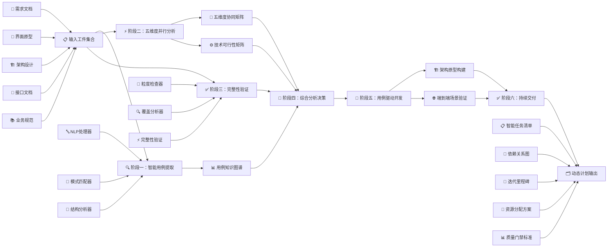
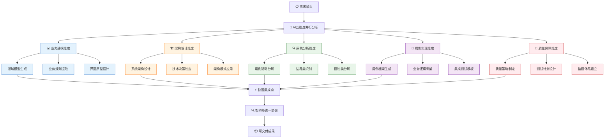
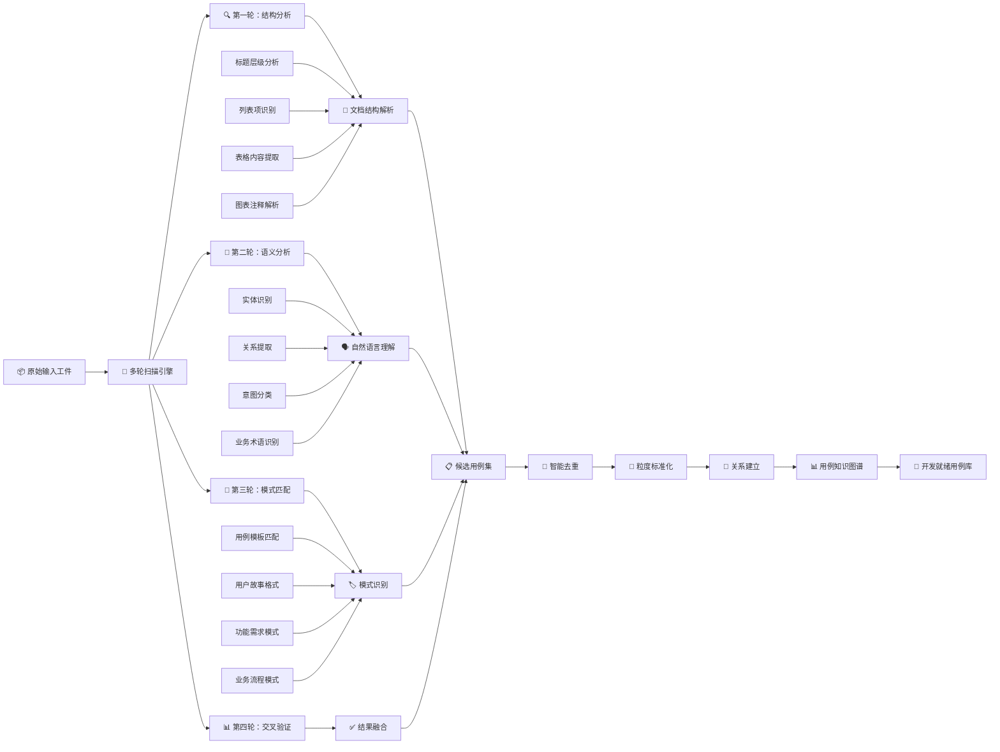
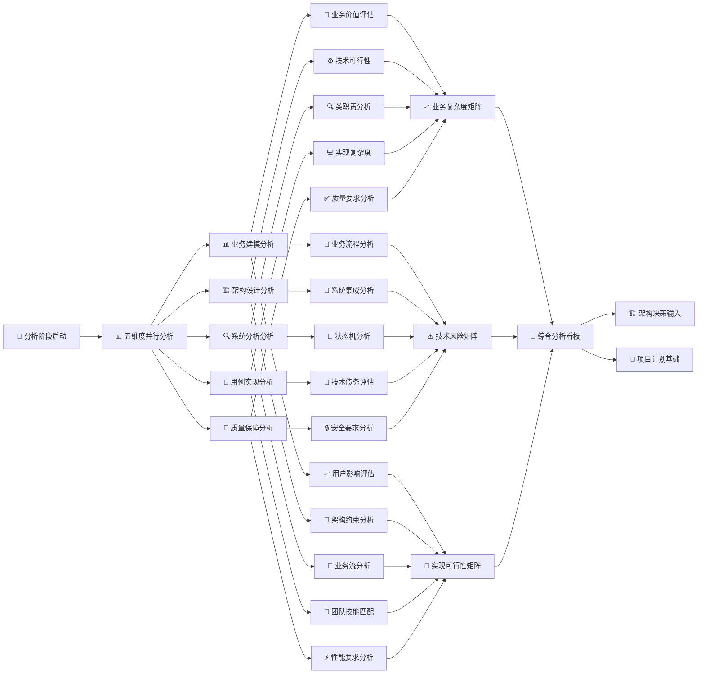
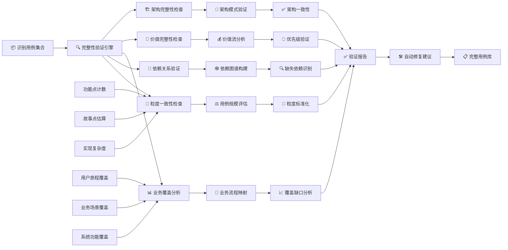
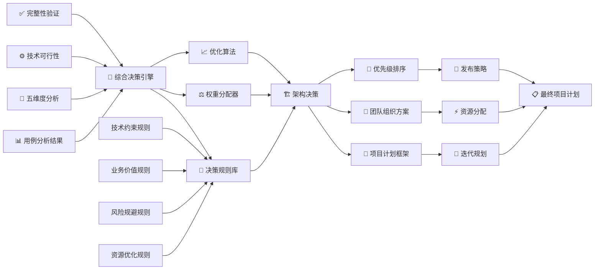
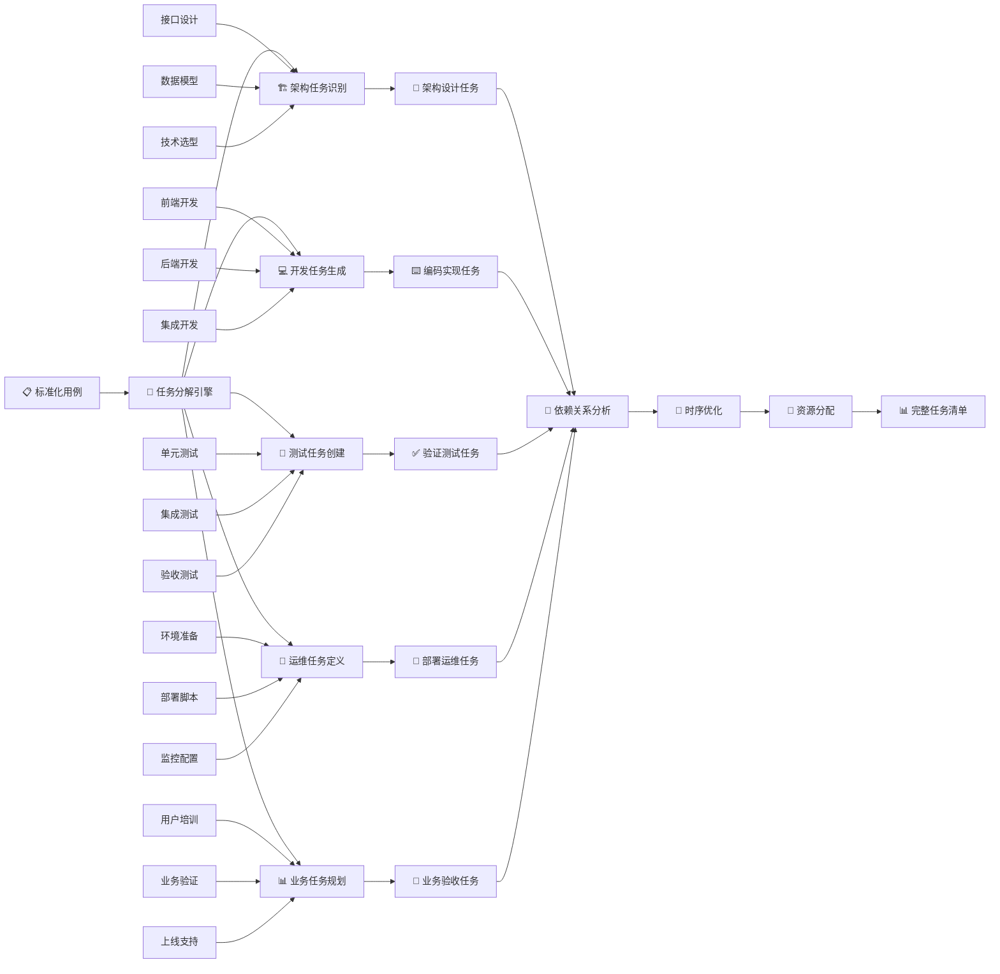
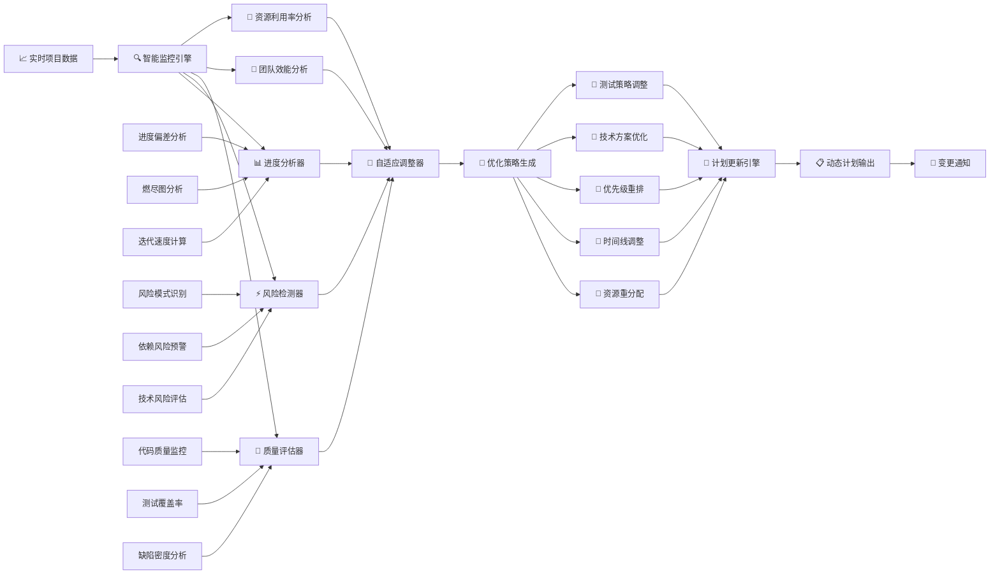

# M2 基于工件的智能项目计划生成算法

## 1. 算法整体架构

### 1.1 六阶段智能规划流程



### 1.2 五维度并行分析架构



## 2. 阶段一：智能用例提取引擎

### 2.1 多模态用例识别流程



### 2.2 用例识别规则库

```javascript
class UseCaseRecognizer {
    constructor() {
        this.patterns = {
            // 业务流优先级模式
            businessFlowPatterns: [
                /^(?:核心|关键|主要).*业务流/i,
                /^(?:购买|支付).*流程/i,
                /^(?:订单|库存).*管理/i,
                /^(?:会员|权益).*系统/i
            ],
            
            // 标题模式
            titlePatterns: [
                /^(?:用例|UC|Use Case)[\s#]*\d*[:：]?\s*(.+)/i,
                /^(?:功能|Feature)[\s#]*\d*[:：]?\s*(.+)/i,
                /^(?:需求|Requirement)[\s#]*\d*[:：]?\s*(.+)/i,
                /^(?:场景|Scenario)[\s#]*\d*[:：]?\s*(.+)/i,
                /^#{1,3}\s+.+(?:用例|功能|需求|场景)/i
            ],
            
            // 内容模式
            contentPatterns: [
                /当([^，]+)时，?(?:用户|系统)?应该?([^。]+)/,
                /(?:用户|管理员)(?:应该|可以|能够)(.+)/,
                /系统(?:应该|需要|必须)(?:提供|支持|实现)(.+)/,
                /实现(.+)功能/,
                /支持(.+)操作/,
                /允许(.+)活动/
            ],
            
            // 结构模式
            structurePatterns: [
                /^[-*]\s*\[.\]\s*.+/,      // 复选框列表
                /^\d+\.\s+.+/,             // 数字列表
                /^[a-z]\.\s+.+/,           // 字母列表
                /^\|\s*.+\s*\|\s*.+\s*\|/  // 表格行
            ]
        };
        
        this.attributeExtractors = {
            actors: [/用户/, /管理员/, /操作员/, /系统/, /外部系统/, /第三方/],
            triggers: [/当/, /如果/, /在.*情况下/, /一旦/, /当.*发生时/],
            preconditions: [/前提/, /假设/, /给定/, /在.*基础上/, /需要.*条件/],
            postconditions: [/结果/, /系统应该/, /用户获得/, /产生/, /输出/],
            exceptions: [/异常/, /错误/, /失败/, /超时/, /无效/],
            priority: [/P0/, /P1/, /P2/, /P3/, /高优先级/, /关键路径/]
        };
    }
    
    // 用例标准化方法
    standardizeUseCase(rawUseCase) {
        return {
            id: this.generateUseCaseId(),
            title: this.normalizeTitle(rawUseCase.title),
            description: rawUseCase.description,
            businessFlow: this.identifyBusinessFlow(rawUseCase),
            priority: this.calculatePriority(rawUseCase),
            actors: this.extractActors(rawUseCase.content),
            triggers: this.extractTriggers(rawUseCase.content),
            preconditions: this.extractPreconditions(rawUseCase.content),
            postconditions: this.extractPostconditions(rawUseCase.content),
            complexity: this.estimateComplexity(rawUseCase),
            dependencies: [],
            relatedComponents: [],
            testScenarios: []
        };
    }
    
    // 识别业务流
    identifyBusinessFlow(useCase) {
        for (let pattern of this.patterns.businessFlowPatterns) {
            if (pattern.test(useCase.title) || pattern.test(useCase.description)) {
                if (pattern.source.includes('购买') || pattern.source.includes('支付')) {
                    return { name: '核心购买业务流', priority: 'P0' };
                } else if (pattern.source.includes('订单') || pattern.source.includes('库存')) {
                    return { name: '订单履约业务流', priority: 'P1' };
                } else if (pattern.source.includes('会员') || pattern.source.includes('权益')) {
                    return { name: '会员权益业务流', priority: 'P2' };
                }
            }
        }
        return { name: '通用业务流', priority: 'P3' };
    }
}
```

## 3. 阶段二：五维度并行分析引擎

### 3.1 五维度并行分析模型



### 3.2 智能分析算法

```python
class FiveDimensionAnalyzer:
    def __init__(self, use_cases, business_context, technical_context):
        self.use_cases = use_cases
        self.business_context = business_context
        self.technical_context = technical_context
        self.analysis_results = {}
    
    def analyze_business_modeling(self):
        """业务建模维度分析"""
        business_analysis = {}
        for use_case in self.use_cases:
            analysis = {
                'business_value': self.calculate_business_value(use_case),
                'user_impact': self.assess_user_impact(use_case),
                'market_priority': self.evaluate_market_priority(use_case),
                'revenue_potential': self.estimate_revenue_potential(use_case)
            }
            business_analysis[use_case.id] = analysis
        return business_analysis
    
    def analyze_architecture_design(self):
        """架构设计维度分析"""
        architecture_analysis = {}
        for use_case in self.use_cases:
            analysis = {
                'technical_feasibility': self.assess_technical_feasibility(use_case),
                'integration_complexity': self.evaluate_integration_complexity(use_case),
                'scalability_requirements': self.identify_scalability_needs(use_case),
                'security_requirements': self.identify_security_requirements(use_case)
            }
            architecture_analysis[use_case.id] = analysis
        return architecture_analysis
    
    def analyze_system_analysis(self):
        """系统分析维度分析"""
        system_analysis = {}
        for use_case in self.use_cases:
            analysis = {
                'boundary_classes': self.identify_boundary_classes(use_case),
                'control_classes': self.identify_control_classes(use_case),
                'entity_classes': self.identify_entity_classes(use_case),
                'state_machines': self.identify_state_machines(use_case),
                'business_flows': self.identify_business_flows(use_case)
            }
            system_analysis[use_case.id] = analysis
        return system_analysis
    
    def analyze_use_case_implementation(self):
        """用例实现维度分析"""
        implementation_analysis = {}
        for use_case in self.use_cases:
            analysis = {
                'development_effort': self.estimate_development_effort(use_case),
                'technical_debt_risk': self.assess_technical_debt_risk(use_case),
                'team_skill_requirements': self.identify_skill_requirements(use_case),
                'testing_complexity': self.evaluate_testing_complexity(use_case)
            }
            implementation_analysis[use_case.id] = analysis
        return implementation_analysis
    
    def analyze_quality_assurance(self):
        """质量保障维度分析"""
        quality_analysis = {}
        for use_case in self.use_cases:
            analysis = {
                'quality_requirements': self.identify_quality_requirements(use_case),
                'performance_targets': self.define_performance_targets(use_case),
                'security_standards': self.identify_security_standards(use_case),
                'compliance_requirements': self.identify_compliance_requirements(use_case)
            }
            quality_analysis[use_case.id] = analysis
        return quality_analysis
```

## 4. 阶段三：完整性验证

### 4.1 多维完整性检查



### 4.2 验证算法实现

```python
class CompletenessValidator:
    def __init__(self, use_cases, business_processes, system_components):
        self.use_cases = use_cases
        self.business_processes = business_processes
        self.system_components = system_components
        self.validation_results = {}
    
    def validate_granularity(self):
        """用例粒度一致性验证"""
        effort_estimates = [uc.effort_estimate for uc in self.use_cases]
        avg_effort = sum(effort_estimates) / len(effort_estimates)
        
        granularity_issues = []
        for use_case in self.use_cases:
            deviation = abs(use_case.effort_estimate - avg_effort) / avg_effort
            if deviation > 0.5:  # 50%偏差
                granularity_issues.append({
                    'use_case': use_case.id,
                    'deviation': deviation,
                    'suggestion': self.get_granularity_suggestion(use_case, avg_effort)
                })
        
        return granularity_issues
    
    def validate_business_coverage(self):
        """业务覆盖验证"""
        coverage_gaps = []
        
        for process in self.business_processes:
            covered = False
            for use_case in self.use_cases:
                if self.does_use_case_cover_process(use_case, process):
                    covered = True
                    break
            
            if not covered:
                coverage_gaps.append({
                    'business_process': process.name,
                    'criticality': process.criticality,
                    'suggested_use_cases': self.suggest_use_cases_for_process(process)
                })
        
        return coverage_gaps
    
    def validate_architecture_consistency(self):
        """架构一致性验证"""
        consistency_issues = []
        
        for use_case in self.use_cases:
            architectural_constraints = self.identify_architectural_constraints(use_case)
            actual_design = use_case.architectural_design
            
            for constraint in architectural_constraints:
                if not self.design_satisfies_constraint(actual_design, constraint):
                    consistency_issues.append({
                        'use_case': use_case.id,
                        'constraint_violation': constraint,
                        'suggested_fix': self.suggest_architectural_fix(constraint)
                    })
        
        return consistency_issues
    
    def validate_dependencies(self):
        """依赖关系完整性验证"""
        dependency_graph = self.build_dependency_graph()
        missing_dependencies = []
        
        for use_case in self.use_cases:
            required_deps = self.identify_required_dependencies(use_case)
            actual_deps = use_case.dependencies
            
            for required_dep in required_deps:
                if required_dep not in actual_deps:
                    missing_dependencies.append({
                        'use_case': use_case.id,
                        'missing_dependency': required_dep,
                        'impact': self.assess_dependency_impact(use_case, required_dep)
                    })
        
        return missing_dependencies
```

## 5. 阶段四：综合分析决策

### 5.1 智能决策矩阵



### 5.2 决策算法核心

```python
class DecisionEngine:
    def __init__(self, analysis_results, constraints, objectives):
        self.analysis = analysis_results
        self.constraints = constraints
        self.objectives = objectives
        self.decision_matrix = {}
    
    def calculate_priority_scores(self):
        """计算用例优先级分数"""
        for use_case_id, analysis in self.analysis.items():
            score = (
                analysis['business_value'] * self.objectives.business_value_weight +
                analysis['technical_feasibility'] * self.objectives.technical_weight +
                analysis['risk_level'] * self.objectives.risk_weight +
                analysis['dependencies'] * self.objectives.dependency_weight +
                analysis['user_impact'] * self.objectives.user_impact_weight
            )
            self.decision_matrix[use_case_id] = score
        
        return sorted(self.decision_matrix.items(), key=lambda x: x[1], reverse=True)
    
    def generate_architecture_decisions(self):
        """生成架构决策"""
        decisions = {
            'technology_stack': self.select_technology_stack(),
            'architecture_pattern': self.choose_architecture_pattern(),
            'deployment_strategy': self.plan_deployment_strategy(),
            'integration_approach': self.determine_integration_approach(),
            'quality_standards': self.define_quality_standards()
        }
        return decisions
    
    def create_project_plan_framework(self):
        """创建项目计划框架"""
        framework = {
            'phases': self.define_project_phases(),
            'milestones': self.set_milestones(),
            'iterations': self.plan_iterations(),
            'deliverables': self.define_deliverables(),
            'quality_gates': self.establish_quality_gates(),
            'risk_mitigation': self.plan_risk_mitigation()
        }
        return framework
    
    def optimize_resource_allocation(self):
        """优化资源分配"""
        resource_plan = {
            'team_structure': self.design_team_structure(),
            'skill_requirements': self.identify_skill_requirements(),
            'training_needs': self.assess_training_needs(),
            'external_resources': self.plan_external_resources()
        }
        return resource_plan
```

## 6. 阶段五：用例驱动开发

### 6.1 智能任务分解引擎



### 6.2 任务生成算法

```python
class TaskGenerator:
    def __init__(self, use_cases, architecture, team_capabilities):
        self.use_cases = use_cases
        self.architecture = architecture
        self.team_capabilities = team_capabilities
        self.tasks = []
    
    def generate_development_tasks(self, use_case):
        """生成开发任务"""
        tasks = []
        
        # 架构师任务
        tasks.extend(self.generate_architect_tasks(use_case))
        
        # 前端任务
        if use_case.has_ui_components:
            tasks.extend(self.generate_frontend_tasks(use_case))
        
        # 后端任务
        tasks.extend(self.generate_backend_tasks(use_case))
        
        # 集成任务
        if use_case.has_integration_points:
            tasks.extend(self.generate_integration_tasks(use_case))
        
        return tasks
    
    def generate_architect_tasks(self, use_case):
        """生成架构师任务"""
        return [
            {
                'type': 'architecture_design',
                'use_case': use_case.id,
                'description': f'设计{use_case.title}的架构方案',
                'effort': use_case.effort_estimate * 0.2,  # 20%开发工作量
                'skills': ['system_design', 'architecture_patterns'],
                'priority': 'P0' if use_case.priority == 'P0' else 'P1'
            },
            {
                'type': 'code_framework',
                'use_case': use_case.id,
                'description': f'生成{use_case.title}的代码框架',
                'effort': use_case.effort_estimate * 0.15,
                'skills': ['code_generation', 'design_patterns'],
                'priority': 'P0' if use_case.priority == 'P0' else 'P1'
            }
        ]
    
    def generate_test_tasks(self, use_case):
        """生成测试任务"""
        test_tasks = []
        
        # 单元测试
        test_tasks.append({
            'type': 'unit_test',
            'use_case': use_case.id,
            'effort': use_case.effort_estimate * 0.3,  # 30%开发工作量
            'dependencies': [f'dev_{use_case.id}'],
            'skills': ['testing', use_case.primary_technology],
            'priority': use_case.priority
        })
        
        # 集成测试
        if use_case.has_integration_points:
            test_tasks.append({
                'type': 'integration_test',
                'use_case': use_case.id,
                'effort': use_case.effort_estimate * 0.2,
                'dependencies': [f'dev_{use_case.id}'],
                'skills': ['integration_testing'],
                'priority': use_case.priority
            })
        
        return test_tasks
    
    def optimize_task_sequence(self):
        """优化任务序列"""
        task_graph = self.build_task_graph()
        critical_path = self.find_critical_path(task_graph)
        optimized_schedule = self.schedule_tasks(task_graph, critical_path)
        return optimized_schedule
```

## 7. 阶段六：持续交付与动态调整

### 7.1 实时监控与自适应调整



### 7.2 动态调整算法

```python
class DynamicPlanner:
    def __init__(self, initial_plan, monitoring_data, adjustment_rules):
        self.initial_plan = initial_plan
        self.monitoring_data = monitoring_data
        self.adjustment_rules = adjustment_rules
        self.adjustment_history = []
    
    def analyze_performance(self):
        """分析项目性能"""
        performance_metrics = {
            'schedule_deviation': self.calculate_schedule_deviation(),
            'quality_metrics': self.assess_quality_metrics(),
            'team_velocity': self.calculate_team_velocity(),
            'risk_level': self.assess_current_risk(),
            'resource_utilization': self.analyze_resource_utilization(),
            'business_value_delivery': self.track_business_value_delivery()
        }
        return performance_metrics
    
    def generate_adjustments(self):
        """生成调整方案"""
        adjustments = []
        
        # 进度偏差调整
        if self.monitoring_data.schedule_deviation > 0.15:  # 15%偏差
            adjustments.extend(self.adjust_schedule())
        
        # 质量指标调整
        if self.monitoring_data.defect_density > self.adjustment_rules.defect_threshold:
            adjustments.extend(self.improve_quality())
        
        # 资源优化调整
        if self.monitoring_data.resource_imbalance > 0.2:  # 20%不均衡
            adjustments.extend(self.rebalance_resources())
        
        # 业务价值调整
        if self.monitoring_data.business_value_delivery < 0.8:  # 80%交付率
            adjustments.extend(self.optimize_business_value_delivery())
        
        return adjustments
    
    def apply_adjustments(self, adjustments):
        """应用调整方案"""
        updated_plan = self.initial_plan.copy()
        
        for adjustment in adjustments:
            if adjustment.type == 'resource_reallocation':
                updated_plan = self.reallocate_resources(updated_plan, adjustment)
            elif adjustment.type == 'schedule_compression':
                updated_plan = self.compress_schedule(updated_plan, adjustment)
            elif adjustment.type == 'priority_reshuffle':
                updated_plan = self.reshuffle_priorities(updated_plan, adjustment)
            elif adjustment.type == 'scope_adjustment':
                updated_plan = self.adjust_scope(updated_plan, adjustment)
        
        return updated_plan
    
    def optimize_business_value_delivery(self):
        """优化业务价值交付"""
        # 识别低价值高成本任务
        low_value_tasks = self.identify_low_value_tasks()
        
        adjustments = []
        for task in low_value_tasks:
            if task.priority != 'P0':
                adjustments.append({
                    'type': 'priority_demotion',
                    'task': task.id,
                    'new_priority': 'P3',
                    'reason': '低业务价值高实现成本'
                })
        
        # 提升高价值任务优先级
        high_value_tasks = self.identify_high_value_tasks()
        for task in high_value_tasks:
            if task.priority != 'P0':
                adjustments.append({
                    'type': 'priority_promotion', 
                    'task': task.id,
                    'new_priority': 'P0',
                    'reason': '高业务价值关键路径'
                })
        
        return adjustments
```

## 8. 资源优化与团队协作

### 8.1 智能资源分配算法

```python
class ResourceOptimizer:
    def __init__(self, tasks, team_members, constraints):
        self.tasks = tasks
        self.team_members = team_members
        self.constraints = constraints
        self.assignment_matrix = {}
    
    def optimize_assignments(self):
        """优化任务分配"""
        # 构建技能匹配矩阵
        skill_matrix = self.build_skill_matrix()
        
        # 考虑工作负载均衡
        workload_matrix = self.calculate_workload()
        
        # 考虑业务优先级
        priority_matrix = self.build_priority_matrix()
        
        # 使用优化算法进行分配
        optimized_assignment = self.solve_assignment_problem(
            skill_matrix, workload_matrix, priority_matrix, self.constraints
        )
        
        return optimized_assignment
    
    def balance_workload(self):
        """工作负载均衡"""
        current_workload = self.calculate_current_workload()
        target_workload = sum(current_workload.values()) / len(current_workload)
        
        adjustments = []
        for member, workload in current_workload.items():
            if workload > target_workload * 1.2:  # 20%超负荷
                # 重新分配任务
                reassigned_tasks = self.reassign_tasks(member, target_workload)
                adjustments.extend(reassigned_tasks)
        
        return adjustments
    
    def build_priority_matrix(self):
        """构建优先级矩阵"""
        priority_matrix = {}
        for task in self.tasks:
            if task.priority == 'P0':
                priority_weight = 1.0
            elif task.priority == 'P1':
                priority_weight = 0.8
            elif task.priority == 'P2':
                priority_weight = 0.6
            else:  # P3
                priority_weight = 0.4
            
            priority_matrix[task.id] = priority_weight
        
        return priority_matrix
```

## 9. 质量与风险控制

### 9.1 全生命周期质量保障

```python
class QualityManager:
    def __init__(self, quality_gates, metrics_thresholds):
        self.quality_gates = quality_gates
        self.metrics_thresholds = metrics_thresholds
        self.quality_metrics = {}
    
    def monitor_quality_metrics(self):
        """监控质量指标"""
        metrics = {
            'code_quality': self.measure_code_quality(),
            'test_coverage': self.measure_test_coverage(),
            'defect_density': self.calculate_defect_density(),
            'build_success_rate': self.measure_build_success(),
            'deployment_frequency': self.track_deployment_frequency(),
            'performance_metrics': self.measure_performance(),
            'security_metrics': self.assess_security()
        }
        
        # 检查是否通过质量门禁
        quality_status = self.check_quality_gates(metrics)
        return quality_status
    
    def enforce_quality_gates(self):
        """执行质量门禁"""
        for gate in self.quality_gates:
            if not self.passes_quality_gate(gate):
                self.trigger_quality_alert(gate)
                self.initiate_corrective_actions(gate)
    
    def assess_security(self):
        """安全评估"""
