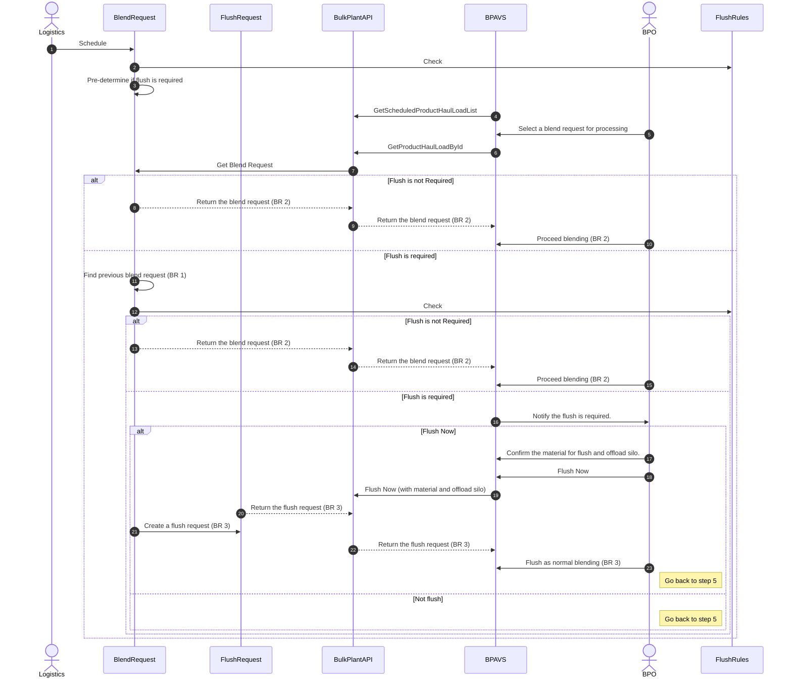

### Flush Request Explanation

- Flush Request is a special type of Blend Request
- Flush Request can be processed as same as Blend Request in BPAVS
- Auto-generated Flush Request is linked to the Blend Request required flush. Information can be copied from the Blend Request
- Flush Request can be created for flush purpose by BPAVS independently. Do we have this use case?
- Flush Request can be used to generate movement journal