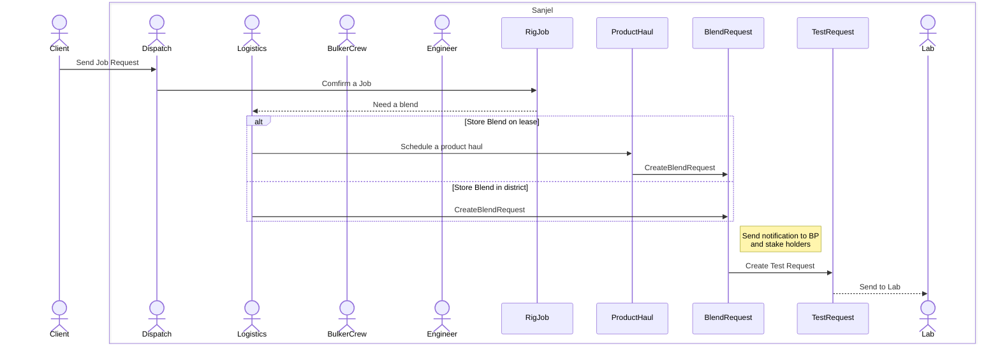
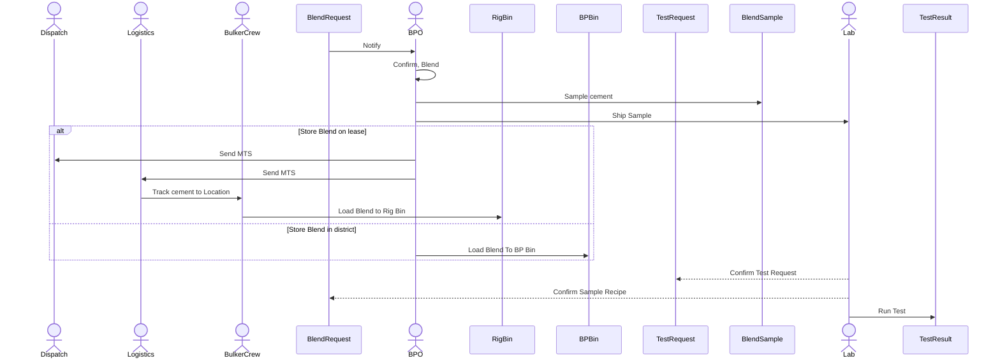
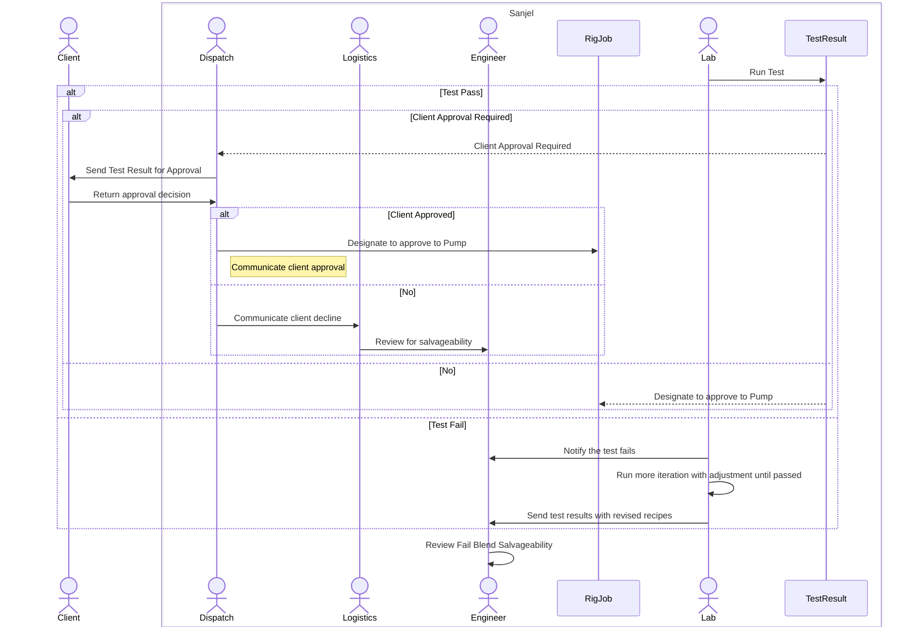
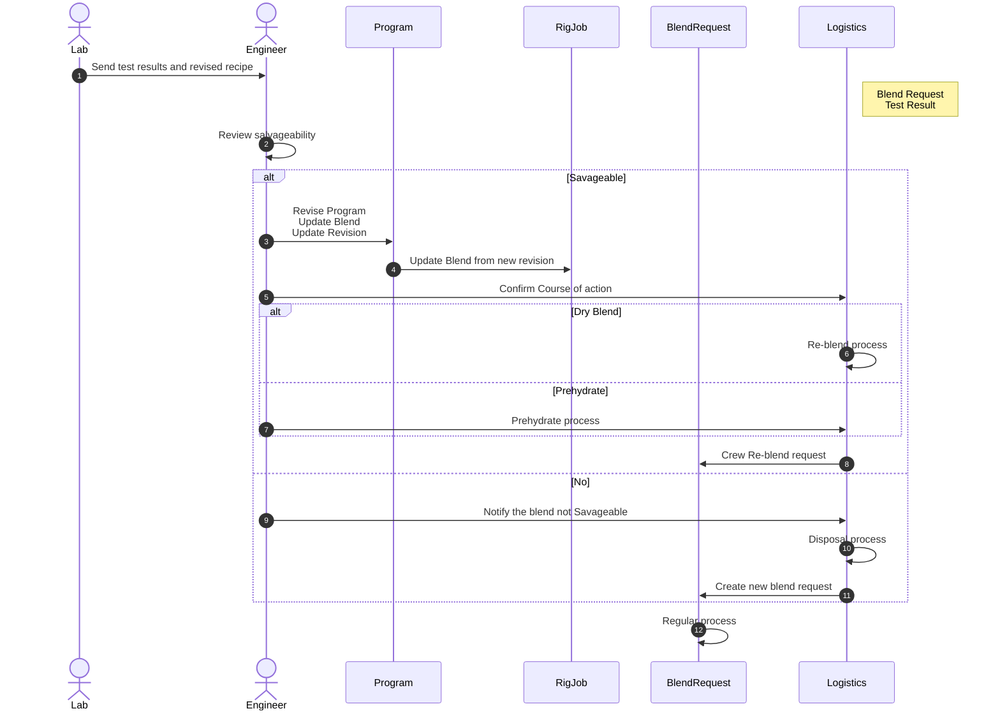
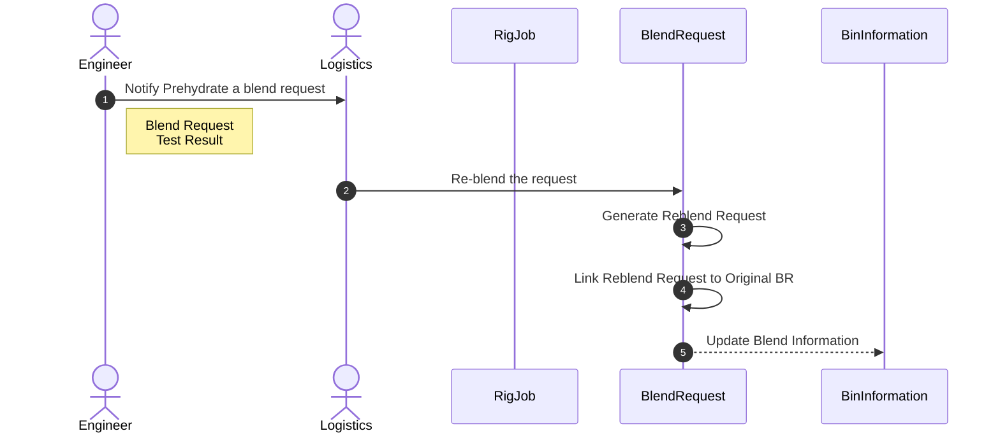

### 1. Blend Request Process

### 2. Blending and Testing Process

### 3. Client Approval Process

### 4. Review fail blend salvageability

### Integration and trigger Points

- Test Request creation 
  - Currently, test request is submitted from program. This may need to move to blend request creation. It will need to support multiple cuts/re-blend/prehydrate processes. Workflow? Maybe
- Blend Sample login
  - Blend sample data is available to populate blend sample list in Lab Database for the blend sample login process. Workflow?No
- Test Result **Publish**
  - Pass
    - RigJob testing status update. Workflow: Yes
    - Blend Request testing status update. Workflow: Yes
  - Fail
    - Engineer Approval Request Creation. Data model doesn't exist. New entity is needed.
- Client Approval Request
  - Blend Request blend testing status needs to be enhanced. Workflow: Yes
  - Client Approval Request Creation. Data model doesn't exist. New entity is needed.
- Client Approved
  - RigJob testing status update. Workflow: Yes
  - Blend Request testing status update. Workflow: Yes
- Client Decline
  - RigJob testing status update. Workflow: Yes
  - Blend Request testing status update. Workflow: Yes
  - Engineer Approval Request creation. Workflow: Yes

- Engineer Approved
  - Call Sheet blend update. Process TBD
  - Blend Request turn over
    - Prehydrate
    - Re-blend
- Engineer Decline
  - Blend Request testing status update. 
  - Blend dispose process TBD
  - New blend request creation.

- Blending progress within Test Request in Lab DB. Workflow: No

All trigger point may send out notification.

Approval form can be available on both a mobile notification and eService Applications.

### Re-blend Scenario

#### Add pre-hydrate additives without blending again.

1. Update program to a new revision. 
2. Update call sheet accordingly.
3. Create Reblend Request with the reference to original blend request. 