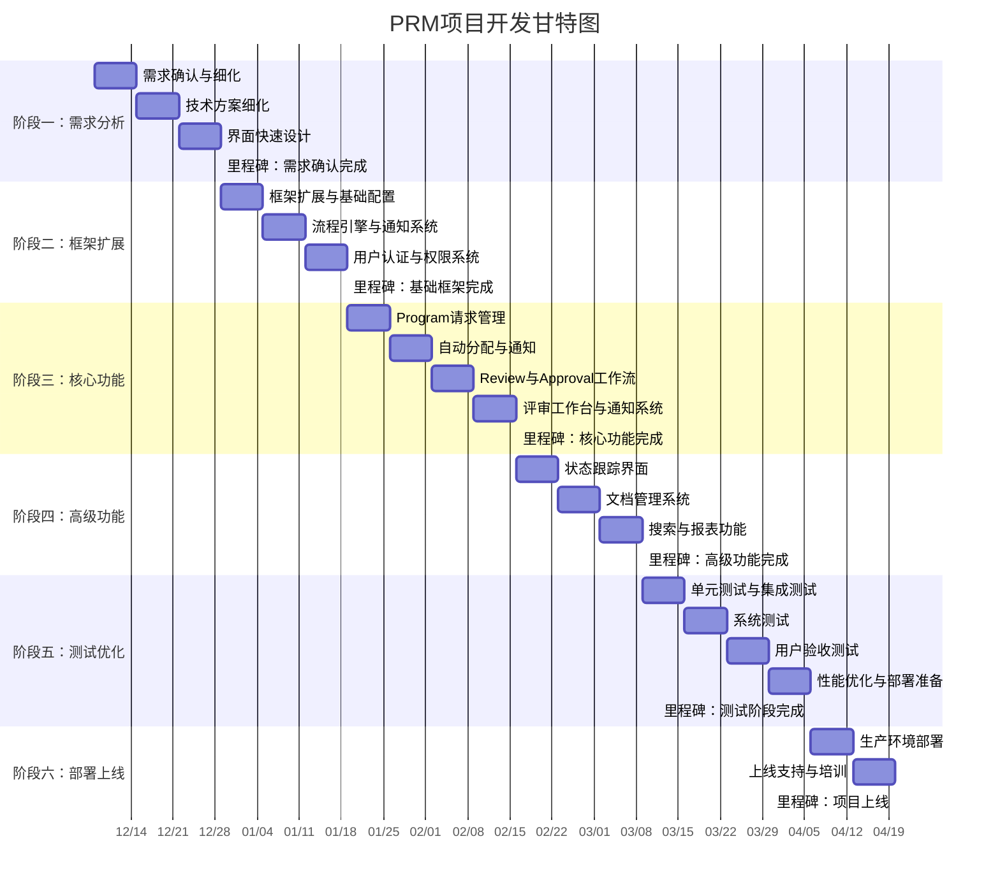
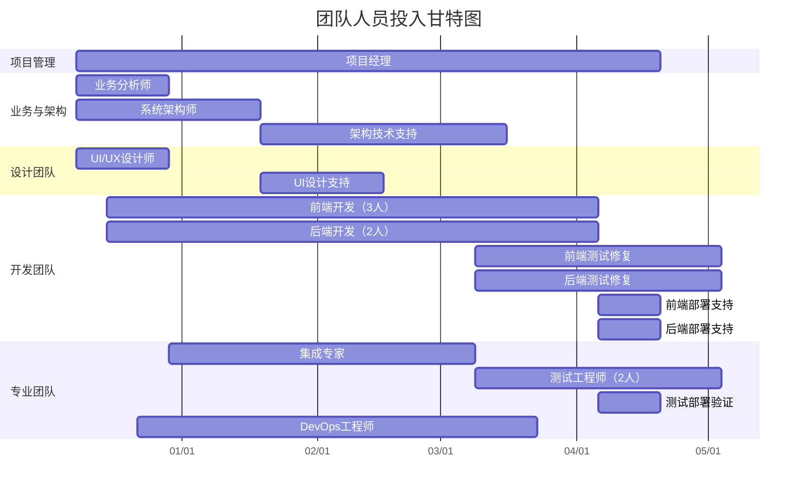

# Program Request Management 项目计划

 

## 📋 项目概述

### 1.1 项目背景
Program Request Management (PRM) 系统旨在自动化 Program 请求管理流程，围绕自研的 PRM 应用实现从请求提交到 Program 批准的全生命周期管理。

### 1.2 项目目标
- **主要目标**：实现 Program 请求管理的全流程自动化
- **业务价值**：提升处理效率30%，减少人工错误50%，实现100%流程可追溯
- **技术目标**：构建可扩展的微服务架构，支持多角色协同工作

### 1.3 项目范围
- **核心功能**：Program 请求提交、自动分配、审批工作流、状态跟踪
- **集成范围**：邮件系统、文档管理系统（如需）
- **用户范围**：6个主要角色，覆盖销售、工程、管理、审批、运营等业务环节
- **技术栈**：.NET 既定技术栈（ASP.NET Core + Blazor + SQL Server），架构与技术细节参见《技术架构设计》文档。

---

## 🤖 AI辅助策略（设计与开发阶段）

### 范围与边界
- 使用阶段：系统设计与开发阶段（不涉生产运行）。
- 工具：设计和开发阶段使用 `DeepSeek`或`Copilot`; 辅助 生成文档，`Mermaid` 图，和代码。
- 边界：AI仅生成初稿与建议；关键逻辑、架构决策与最终版本必须人工评审与签字；不处理生产环境操作与敏感数据。

### 工作流
1. 提示词模板编制（基于项目既定规范与实践）
2. AI初稿生成（场景/图/代码骨架/测试）
3. 人工审阅与修订（留下审阅记录与差异说明）
4. 入库与一致性校验（跨需求、领域、界面、接口、评估）

### 度量目标
- 文档初稿周期缩短 ≥30%
- 用例/模型一致性检查通过率 ≥90%
- 代码评审返工率降低 ≥20%
- 关键路径缺陷密度下降（迭代对比）

---

## 🎯 项目阶段规划

## 📊 项目甘特图



### 甘特图说明
- **总工期**：19周（2025年12月8日 - 2026年4月20日）
- **关键里程碑**：6个主要检查点，用于监控项目进度
- **并行开发**：阶段内任务可以并行执行以提升效率
- **缓冲时间**：各阶段间预留适当缓冲以应对风险

### 关键路径分析
**关键路径**：阶段一 → 阶段二 → 阶段三 → 阶段五 → 阶段六
- 核心功能开发（阶段三）是项目的关键路径
- 高级功能（阶段四）可与测试准备工作适当并行
- 任何关键路径的延迟都会直接影响项目最终交付时间

## 👥 人员投入甘特图



### 人员投入分析
**高峰期**：第7-13周（核心功能+高级功能开发）
- 前端开发：3人 × 7周 = 21人周
- 后端开发：2人 × 7周 = 14人周
- 同时参与：架构师、集成专家、UI设计师支持

**关键角色持续期**：
- 项目经理：全程19周（确保项目管控）
- 开发团队：第2-17周（核心技术实现）
- 测试团队：第14-19周（质量保证）

**资源优化点**：
- 第4-6周：可适当减少前端开发人员（2人足够）
- 第14-17周：开发人员可部分转至其他项目
- UI设计师：可考虑外聘（仅需3周全职）

---

## 🎯 项目阶段规划详情

### 阶段一：需求分析与快速设计 (3周)

**👥 人员投入：**
- 项目经理 (1人)
- 业务分析师 (1人)  
- 系统架构师 (1人)
- UI/UX设计师 (1人)
- 前端开发工程师 (2人，参与设计评审)
- 后端开发工程师 (1人，参与技术评审)

#### 第1周：需求确认与细化
**主要任务：**
- [ ] 业务需求确认会议 (2天)
- [ ] 用户故事细化与优先级排序 (2天)
- [ ] 验收标准定义 (1天)

**AI参与方式：**
- AI 生成用例场景与术语表初稿；一致性/冲突检测报告。
- Mermaid 自动生成用例图/时序图草稿；人工修订入库。

**交付物：**
- 详细需求规格说明书 v1.0
- 系统分析文档 v1.0
- 系统用例文档 v1.0
- 系统原型文档 v1.0
- 系统综合分析文档 v1.0
- 系统评估文档 v1.0
- 业务流程图 v1.0
- 系统协助图 v1.0

**里程碑：** 需求确认完成

#### 第2周：技术方案细化
**主要任务：**
- [ ] 基于现有架构的实施方案细化 (1天)
- [ ] SQL Server数据库设计 (1天)
- [ ] ASP.NET Core Web API接口契约细化 (1天)
- [ ] ASP.NET Core Identity安全策略配置 (1天)
- [ ] 技术风险评估与缓解方案 (1天)

**AI参与方式：**
- DeepSeek 生成接口契约草稿；一致性校验清单。
- 生成技术风险评估报告。

**交付物：**
- 技术实施方案文档
- SQL Server数据库设计文档
- Web API接口规范
- Identity安全配置方案
- 技术风险评估报告

#### 第3周：界面快速设计
**主要任务：**
- [ ] 基于需求文档的界面补充设计 (2天)
- [ ] 设计系统基础规范建立 (1天)
- [ ] 前端组件规划 (1天)
- [ ] 界面开发准备 (1天)

**AI参与方式：**
- DeepSeek 生成界面组件清单与快速原型草稿。
- 辅助生成可访问性检查清单；人工评审与签字。

**交付物：**
- 设计系统基础规范
- 前端组件规划文档
- 界面开发准备文档

**里程碑：** 设计阶段完成

---

### 阶段二：现有框架扩展 (3周)

**👥 人员投入：**
- 项目经理 (1人)
- 系统架构师 (1人)
- 前端开发工程师 (3人)
- 后端开发工程师 (2人)
- 集成专家 (1人，第5周开始)
- DevOps工程师 (1人，第6周开始)

#### 第4周：框架扩展与基础配置
**主要任务：**
- [ ] 现有框架适配与新模块集成 (2天)
- [ ] PRM相关数据模型扩展 (1天)
- [ ] 新页面路由与权限配置 (1天)
- [ ] 基础环境验证 (1天)

**交付物：**
- PRM模块集成代码
- 扩展数据模型
- 页面路由配置
- 环境验证报告

#### 第5周：流程引擎与通知系统
**主要任务：**
- [ ] 流程引擎开发与状态变化监听机制 (2天)
- [ ] 基于状态变化的邮件通知系统 (1天)
- [ ] 文档管理系统集成（如需）(1天)
- [ ] 错误处理与重试机制 (1天)

**交付物：**
- 流程引擎核心模块
- 状态驱动的邮件通知模块
- 文档管理集成（如需）
- 错误处理与重试方案

**扩展集成（可选）：**
- SharePoint 文档库：程序文档版本与权限管理；PRM 端保存外链/ID 引用
- Power Automate 工作流：基于 PRM 状态变化事件触发审批/通知流程；流程状态双向同步
- 安全与合规：应用注册与最小权限访问；状态变化审计日志记录

#### 第6周：用户认证与权限系统
**主要任务：**
- [ ] ASP.NET Core Identity认证系统 (0天)
- [ ] 基于角色的权限管理 (0天)
- [ ] 安全审计功能 (0天)

**交付物：**
- ASP.NET Core Identity认证授权系统
- 角色权限管理模块
- 安全审计功能

**里程碑：** 基础框架完成

---
### 阶段三：核心业务功能开发 (4周)

**👥 人员投入：**
- 项目经理 (1人)
- 系统架构师 (1人，技术支持)
- 前端开发工程师 (3人)
- 后端开发工程师 (2人)
- 集成专家 (1人)
- UI/UX设计师 (1人，界面优化支持)

#### 第7周：Program 请求管理
**主要任务：**
- [ ] Program 请求提交页面开发 (2天)
- [ ] Program 请求验证逻辑 (1天)
- [ ] Program 请求状态管理 (2天)

**交付物：**
- Program 请求提交页面
- Program 验证逻辑
- Program 状态管理组件

#### 第8周：自动分配与通知
**主要任务：**
- [ ] 自动分配规则实现 (2天)
- [ ] 工程师映射逻辑 (1天)
- [ ] 基于状态变化的邮件通知 (2天)

**交付物：**
- 自动分配引擎
- 工程师映射配置
- 邮件通知系统

#### 第9周：Review 与 Approval 工作流
**主要任务：**
- [ ] Program 复杂度颜色编码功能 (1天)
- [ ] Review 与 Approval 页面开发 (2天)
- [ ] 基于颜色编码的审批路由逻辑 (2天)

**交付物：**
- Program 复杂度分类功能
- Review 与 Approval 页面
- 审批路由系统
- 工作流引擎

#### 第10周：评审工作台与通知系统
**主要任务：**
- [ ] 评审界面开发 (2天)
- [ ] 评审流程实现 (2天)
- [ ] 评审历史管理 (1天)

**交付物：**
- 评审工作台
- 评审流程模块
- 历史记录功能

**里程碑：** 核心功能完成

---

### 阶段四：高级功能开发 (3周)

**👥 人员投入：**
- 项目经理 (1人)
- 前端开发工程师 (3人)
- 后端开发工程师 (2人)
- 集成专家 (1人)
- 系统架构师 (0.5人，技术支持)
- DevOps工程师 (0.5人，基础设施准备)

#### 第11周：状态跟踪界面
**主要任务：**
- [ ] Blazor状态可视化界面 (2天)
- [ ] Blazor时间轴组件 (1天)
- [ ] 状态过滤和搜索 (2天)

**交付物：**
- Blazor状态跟踪界面
- Blazor时间轴组件
- 搜索过滤功能

#### 第12周：文档管理系统
**主要任务：**
- [ ] 文档上传下载 (2天)
- [ ] 版本控制功能 (2天)
- [ ] 文档权限管理 (1天)

**交付物：**
- 文档管理模块
- 版本控制系统
- 权限管理

#### 第13周：搜索与报表功能
**主要任务：**
- [ ] 高级搜索功能 (2天)
- [ ] 报表生成系统 (2天)
- [ ] 数据可视化组件 (1天)

**交付物：**
- 搜索功能
- 报表系统
- 数据可视化

**里程碑：** 高级功能完成

---

### 阶段五：测试与优化 (4周)

**👥 人员投入：**
- 项目经理 (1人)
- 测试工程师 (2人，主导)
- 前端开发工程师 (2人，问题修复)
- 后端开发工程师 (2人，问题修复)
- DevOps工程师 (1人，环境配置)
- 系统架构师 (0.5人，性能优化)

#### 第14周：单元测试与集成测试
**主要任务：**
- [ ] xUnit单元测试编写 (3天)
- [ ] ASP.NET Core集成测试开发 (2天)

**交付物：**
- xUnit单元测试套件
- ASP.NET Core集成测试套件
- 测试覆盖率报告

#### 第15周：系统测试
**主要任务：**
- [ ] 功能测试 (2天)
- [ ] 性能测试 (2天)
- [ ] 安全测试 (1天)

**交付物：**
- 功能测试报告
- 性能测试报告
- 安全测试报告

#### 第16周：用户验收测试
**主要任务：**
- [ ] UAT测试执行 (3天)
- [ ] 用户反馈收集 (1天)
- [ ] 问题修复 (1天)

**交付物：**
- UAT测试报告
- 用户反馈文档
- 问题修复记录

#### 第17周：性能优化与部署准备
**主要任务：**
- [ ] 性能优化 (2天)
- [ ] 部署脚本准备 (1天)
- [ ] 监控系统配置 (1天)
- [ ] 备份恢复测试 (1天)

**交付物：**
- 性能优化报告
- 部署文档
- 监控配置
- 备份恢复方案

**里程碑：** 测试阶段完成

---

### 阶段六：部署与上线 (2周)

**👥 人员投入：**
- 项目经理 (1人)
- DevOps工程师 (1人，主导部署)
- 前端开发工程师 (1人，技术支持)
- 后端开发工程师 (1人，技术支持)
- 测试工程师 (1人，最终验证)
- 集成专家 (1人，外部系统集成验证)

#### 第18周：生产环境部署
**主要任务：**
- [ ] 生产环境部署 (2天)
- [ ] 数据迁移 (1天)
- [ ] 系统配置 (1天)
- [ ] 最终测试 (1天)

**交付物：**
- 生产环境系统
- 数据迁移报告
- 系统配置文档

#### 第19周：上线支持与培训
**主要任务：**
- [ ] 用户培训 (2天)
- [ ] 上线支持 (2天)
- [ ] 项目文档整理 (1天)

**交付物：**
- 用户培训材料
- 支持文档
- 项目总结报告

**里程碑：** 项目上线

---

## 👥 人员投入工时统计

### 按阶段工时分布

| 阶段 | 时间范围 | 项目经理 | 业务分析师 | 系统架构师 | UI/UX设计师 | 前端开发 | 后端开发 | 集成专家 | 测试工程师 | DevOps工程师 | **阶段总工时** |
|------|----------|----------|------------|------------|-------------|----------|----------|----------|------------|--------------|--------------|
| 阶段一 | 第1-3周 | 120h | 120h | 120h | 120h | 240h | 120h | - | - | - | **840h** |
| 阶段二 | 第4-6周 | 120h | - | 120h | - | 360h | 240h | 120h | - | 120h | **1,080h** |
| 阶段三 | 第7-10周 | 160h | - | 160h | 160h | 480h | 320h | 160h | - | - | **1,440h** |
| 阶段四 | 第11-13周 | 120h | - | 60h | - | 360h | 240h | 120h | - | 60h | **960h** |
| 阶段五 | 第14-17周 | 160h | - | 60h | - | 320h | 320h | - | 320h | 160h | **1,340h** |
| 阶段六 | 第18-19周 | 80h | - | - | - | 80h | 80h | 80h | 80h | 80h | **480h** |
| **总计** | **19周** | **760h** | **120h** | **520h** | **280h** | **1,840h** | **1,320h** | **480h** | **400h** | **420h** | **6,140h** |

### 工时投入分析

**按角色工时占比：**
```
前端开发工程师：1,840h (30.0%) ████████████████████████████████████████████████
后端开发工程师：1,320h (21.5%) ████████████████████████████████
项目经理：760h (12.4%) ████████████
系统架构师：520h (8.5%) ████████
DevOps工程师：420h (6.8%) ███████
集成专家：480h (7.8%) ████████
测试工程师：400h (6.5%) ███████
UI/UX设计师：280h (4.6%) ██████
业务分析师：120h (2.0%) ███
```

**关键观察：**
- 开发团队工时占比51.5%（前端+后端），符合技术密集型项目特点
- 项目经理全程参与，确保项目管控（12.4%）
- 架构师早期投入大，后期技术支持（8.5%）
- 测试团队集中在中后期，确保质量（6.5%）

### 工时密度分析

| 阶段 | 工时密度 | 峰值人员 | 风险等级 |
|------|----------|----------|----------|
| 阶段一 | 中等 | 6人同时工作 | 低 |
| 阶段二 | 高 | 7人同时工作 | 中 |
| 阶段三 | 极高 | 9人同时工作 | 高 |
| 阶段四 | 高 | 7人同时工作 | 中 |
| 阶段五 | 高 | 8人同时工作 | 中 |
| 阶段六 | 中 | 6人同时工作 | 低 |

**工时密度定义：**
- 中等：< 200小时/周
- 高：200-250小时/周  
- 极高：> 250小时/周（需要密切监控）

---

## 👥 资源分配计划

### 6.1 团队组成

| 角色 | 人数 | 主要职责 | 参与阶段 |
|------|------|----------|----------|
| 项目经理 | 1 | 项目管理、进度控制、风险管理 | 全程 |
| 业务分析师 | 1 | 需求分析、业务流程设计 | 阶段1 |
| 系统架构师 | 1 | 技术架构设计、技术选型 | 阶段1-2 |
| 前端开发工程师 | 3 | UI开发、用户体验优化 | 阶段2-5 |
| 后端开发工程师 | 2 | API开发、业务逻辑实现 | 阶段2-5 |
| 集成工程师 | 1 | 邮件与文档系统集成 | 阶段2-3 |
| UI/UX设计师 | 1 | 界面设计、交互设计 | 阶段1 |
| 测试工程师 | 2 | 测试计划、测试执行 | 阶段4-5 |
| DevOps工程师 | 1 | 部署、运维、监控 | 阶段5-6 |

### 6.2 关键技能要求

**前端团队：**
- Blazor/Razor Pages开发经验
- C#/.NET开发
- 响应式设计
- 组件库开发

**后端团队：**
- ASP.NET Core开发经验
- C#/.NET开发
- RESTful API设计
- 数据库设计 (SQL Server/PostgreSQL)
- 微服务架构

**集成工程师：**
- 邮件系统集成
- 文档系统集成（如需）
- 数据同步机制

---

## ⚠️ 风险管理计划

### 7.1 高风险项目

| 风险项 | 风险等级 | 影响 | 应对措施 | 负责人 |
|--------|----------|------|----------|--------|
| 外部系统接口限制 | 中 | 非核心功能受阻 | 提前进行接口验证，准备备用方案 | 集成工程师 |
| 复杂审批路径异常处理 | 中 | 业务流程中断 | 详细异常场景分析，完善错误处理 | 后端团队 |
| 性能瓶颈 | 中 | 用户体验差 | 性能测试，架构优化 | 全团队 |
| 用户接受度 | 中 | 项目价值无法体现 | 早期用户参与，迭代优化 | 项目经理 |

### 7.2 风险监控机制

**周度风险评估：**
- 每周五进行风险评估会议
- 更新风险登记册
- 调整应对策略

**月度风险回顾：**
- 月度风险趋势分析
- 重大风险升级处理
- 风险应对效果评估

---

## 📊 质量保证计划

### 8.1 质量标准

**代码质量：**
- 代码覆盖率 ≥ 80%
- 代码审查通过率 100%
- 静态代码分析无严重问题

**功能质量：**
- 核心功能测试覆盖率 100%
- 集成测试通过率 ≥ 95%
- 用户验收测试通过率 100%

**性能质量：**
- 关键路径响应时间 < 3秒
- 系统可用性 ≥ 99.5%
- 并发用户支持 ≥ 100

### 8.2 质量门禁

**阶段门禁：**
- 需求确认 → 设计：需求评审通过
- 设计 → 开发：架构评审通过
- 开发 → 测试：代码审查通过
- 测试 → 上线：UAT通过

**质量检查点：**
- 每周代码质量报告
- 每两周功能演示
- 每月质量回顾会议

---

## 📅 关键里程碑

| 里程碑 | 时间 | 交付物 | 成功标准 |
|--------|------|--------|----------|
| 需求确认完成 | 第3周末 | 需求规格书 | 业务方签字确认 |
| 设计阶段完成 | 第3周末 | 设计文档 | 技术评审通过 |
| 基础框架完成 | 第6周末 | 基础系统 | 框架测试通过 |
| 核心功能完成 | 第10周末 | 核心模块 | 功能测试通过 |
| 高级功能完成 | 第13周末 | 完整系统 | 集成测试通过 |
| 测试阶段完成 | 第17周末 | 测试报告 | 质量门禁通过 |
| 项目上线 | 第19周末 | 生产系统 | 用户验收通过 |

---

## 💰 预算估算

### 9.1 人力成本工时统计

**工作日计算：**
- 项目总工期：19周 = 95个工作日
- 每日标准工时：8小时/人/天
- 总可用工时：95天 × 8小时 = 760小时/人

**详细工时分配：**

| 角色 | 人数 | 参与天数 | 日工时 | 总工时 | 小时成本 | 总成本 |
|------|------|----------|--------|--------|----------|--------|
| **项目管理** | | | | | | |
| 项目经理 | 1 | 95 | 8 | 760 | $50 | $38,000 |
| **业务与设计** | | | | | | |
| 业务分析师 | 1 | 15 | 8 | 120 | $45 | $5,400 |
| UI/UX设计师 | 1 | 15 | 8 | 120 | $40 | $4,800 |
| **技术架构** | | | | | | |
| 系统架构师 | 1 | 45 | 8 | 360 | $42 | $15,120 |
| **开发团队** | | | | | | |
| 前端开发工程师 | 3 | 80 | 8 | 1,920 | $45 | $86,400 |
| 后端开发工程师 | 2 | 80 | 8 | 1,280 | $50 | $64,000 |
| **专业支持** | | | | | | |
| 集成专家 | 1 | 40 | 8 | 320 | $55 | $17,600 |
| **测试团队** | | | | | | |
| 测试工程师 | 2 | 40 | 8 | 640 | $38 | $24,320 |
| **运维支持** | | | | | | |
| DevOps工程师 | 1 | 30 | 8 | 240 | $50 | $12,000 |

**人力成本汇总：**
- **总工时**：6,120小时
- **人力成本合计**：$267,640

### 9.2 按阶段工时分析

| 阶段 | 时间范围 | 总工时 | 主要投入人员 | 工时密度 |
|------|----------|--------|--------------|----------|
| 阶段一：需求分析 | 第1-3周 | 840小时 | 业务分析师、架构师、设计师 | 高强度 |
| 阶段二：框架扩展 | 第4-6周 | 1,200小时 | 开发团队、架构师 | 高强度 |
| 阶段三：核心功能 | 第7-10周 | 1,600小时 | 开发团队、集成专家 | 超高强度 |
| 阶段四：高级功能 | 第11-13周 | 1,200小时 | 开发团队、架构师 | 高强度 |
| 阶段五：测试优化 | 第14-17周 | 960小时 | 测试团队、开发团队 | 中高强度 |
| 阶段六：部署上线 | 第18-19周 | 320小时 | DevOps、关键开发 | 中等强度 |

### 9.3 成本效益分析

**工时成本构成：**
- **开发工时**：3,200小时（52.3%）- 核心价值创造
- **测试工时**：640小时（10.5%）- 质量保证
- **架构设计**：360小时（5.9%）- 技术指导
- **项目管理**：760小时（12.4%）- 过程保障
- **其他支持**：1,160小时（18.9%）- 配合与辅助

**小时成本分析：**
- **平均小时成本**：$43.7/小时
- **开发人员平均**：$47.5/小时
- **测试人员平均**：$38/小时
- **专家顾问成本**：$55/小时

### 9.4 其他成本明细

| 项目 | 成本 | 工时等效 | 说明 |
|------|------|----------|------|
| 软件许可 | $18,000 | 412小时 | Visual Studio Enterprise、Azure DevOps、监控系统 |
| 硬件设备 | $20,000 | 458小时 | 开发环境、测试环境硬件投入 |
| 培训费用 | $8,000 | 183小时 | 用户培训、.NET技术培训（含内训时间） |
| 第三方服务 | $12,000 | 275小时 | Azure云服务、外部咨询服务 |
| 应急储备 | $30,000 | 687小时 | 风险应对资金（按$43.7/小时估算） |

**其他成本合计：$88,000**

### 9.5 工时成本对比分析

**内部工时 vs 外部采购：**

| 类别 | 内部工时 | 外部等效 | 成本优势 |
|------|----------|----------|----------|
| 开发实施 | 3,200小时 × $47.5 = $152,000 | 外包约$180,000 | 节省$28,000 |
| 测试验证 | 640小时 × $38 = $24,320 | 外包约$35,000 | 节省$10,680 |
| 架构设计 | 360小时 × $42 = $15,120 | 外包约$25,000 | 节省$9,880 |

**总成本效益：**
- **内部实施总成本**：$355,640
- **外部采购估算**：$420,000+
- **成本节约**：$64,360+（15.3%）

### 9.6 项目总预算

**项目总成本：$355,640**

**成本构成比例：**
- **人力成本**：$267,640（75.2%）
- **其他成本**：$88,000（24.8%）
- **应急储备**：$30,000（8.4%，已包含在其他成本中）

**单位成本指标：**
- **每功能点成本**：$4,450（预估80个功能点）
- **每人天成本**：$350（基于$43.7/小时）
- **每工时产出价值**：按业务价值评估

---

## 📈 成功指标

### 10.1 业务指标

**效率提升：**
- 程序请求处理时间减少 30%
- 人工操作步骤减少 50%
- 流程自动化率达到 85%

**质量改进：**
- 错误率降低 50%
- 流程合规性达到 100%
- 用户满意度 ≥ 4.5/5.0

### 10.2 技术指标

**系统性能：**
- 平均响应时间 < 3秒
- 系统可用性 ≥ 99.5%
- 并发用户支持 ≥ 100

**代码质量：**
- 代码覆盖率 ≥ 80%
- 技术债务控制在可接受范围
- 安全漏洞数量 = 0

---

## 🔄 项目治理

### 11.1 沟通机制

**日常沟通：**
- 每日站会：15分钟，同步进度和问题
- 每周例会：1小时，回顾和计划
- 双周演示：2小时，功能展示和反馈

**正式沟通：**
- 月度指导委员会会议：项目状态汇报
- 季度业务回顾：价值实现评估
- 阶段评审会：阶段成果验收

### 11.2 变更管理

**变更流程：**
1. 变更请求提交
2. 影响分析评估
3. 变更委员会审批
4. 变更实施和验证
5. 变更记录和沟通

**变更控制：**
- 范围变更：项目经理 + 业务负责人审批
- 技术变更：架构师 + 技术负责人审批
- 进度变更：指导委员会审批

---

## 📚 附录

### A. 术语表

| 术语 | 定义 |
|------|------|
| PRM | Program Request Management，程序请求管理系统 |
| Blazor | .NET 前端框架，用于构建交互式 Web UI |
| 复杂度矩阵 | 用于评估程序复杂程度并确定审批路径的四色矩阵 |
| SLA | Service Level Agreement，服务级别协议 |

### B. 参考文档

1. 《基于工件的智能项目计划生成算法》
2. 《Program Request Management 系统需求规格说明书》
3. 《002-技术架构设计.md》
4. 《系统架构设计文档》

### C. 联系信息

**项目核心团队：**
- 项目经理：[姓名] - [邮箱] - [电话]
- 技术负责人：[姓名] - [邮箱] - [电话]
- 业务负责人：[姓名] - [邮箱] - [电话]

**紧急联系：**
- 项目指导委员会：[邮箱]
- 技术支持热线：[电话]

---

**文档版本：** v1.0  
**创建日期：** 2025-12-02  
**最后更新：** 2025-12-02  
**下次更新：** 项目启动后每周更新

---

*此项目计划基于《基于工件的智能项目计划生成算法》生成，结合了系统评估结果和最佳实践。计划将根据项目进展和实际情况进行动态调整。*