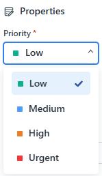

# **Functional Requirements for Phase 1**

1. **Request Intake/Meta Data Fields**

**Description:** When Sales, Dispatch or Engineer submits a new Program Request via email forwarding or portal form, the system logs the request and generates a unique Program ID.

System shall support request submission via:

· Email forwarding
· Web portal form.

**Standard Fields**

Unique Program ID

Client

Subject

~~Requestee~~

Requester

Assigned to

Priority (The Engineers will determine Priority Manually for now, so it does not need to be automatic anymore, however it would be great to color code it as date gets closer)

Due Date

Request Type

Status

Summary log/Activity Log

2.  **Auto-Assignment – Engineers**

**Description:** 

The system uses a Company–Engineer mapping table to automate request assignments.  
This table specifies which Engineer is responsible for each company (e.g., _Enmax → Warren_). When a Program Request is logged or an email is forwarded by Sales/Engineering, the system checks the company name and automatically assigns the request to the correct Engineer based on this mapping.

**Assignment Rules:**

1. If the company exists in the mapping table → assign to the mapped Engineer.

2. If no mapping exists → assign to the Manager–Engineering.

3. If the request is marked urgent or received after business hours → route to the on-call Engineer.

4. Engineers to manually update the on “call guy” on the App daily

**Notifications:**

· The assigned Engineer will receive an **email notification** containing a clickable link to the application.

**Email body options**

Hi [Name],

A job design task has been assigned to you in the program management tool.

Please log in to review and take the necessary action.

(Insert link here)

Thank you

Or

Hi [Name],

A new program from (Company) has been assigned to you.

Please log in to review and take the necessary action.

(Insert link here)

Thank you

· The system will also generate an **in-app notification** to alert the Engineer of the new assignment.

3. **Prioritization**

**Description:** When a Program Request is logged, the system assigns a priority score based on the due date.

**Pre-condition:** Program Request exists with due date

**Priority Rules:**

1. Urgent → Requests due in less than 4 hours.

2. High → Requests due the same day.

3. Medium → Requests due within 2 days.

4. Low → Requests due in more than 2 days.

5. Normal → No due date was given

**System Behavior:**

· The system must apply the rules above consistently without manual intervention.

· Automatic priority assignment is mandatory; without it, the functionality is ineffective.

4. **Review And Approval**

When an Engineer submits a Program for review or Approval, the system routes the program for review or approval based on its matrix color.

The system shall support a structured, color-coded review and approval workflow based on program/job complexity, as well as handle multi-job and multi-program submissions.

**Review and Approval should not be inline with each other, it’s one process or the other (both processes will probably look the same in the system, it’s just what the reviewer/approver does that will be different)**

**Review and Approval Rules (by Color):**

1. **Green** → Peer Review required.

2. **Yellow** → Manager/Lead Review required.

3. **Red** → Manager Approval required.

4. **Black** → Manager + Director/VP Approval required.

**4.1 Review**

When an Engineer manually assigns the program to an Agent for Review, the system shall notify designated Reviewers when a request requires their review. Notifications shall be delivered through both **workflow (in-app)** and **email** channels.

**Pre-condition:** 

· Program draft is complete and marked for review.

· Engineer manually selects who to assign for review.

· System updates status to **“Sent for Review.”**

Assignment Options:

· Assign to a specific person.

· Assign to the **Peer Review** group (one member must accept).

System Behavior:

There will be 3 Notifications

A. Notification 1

· Send notifications to Reviewer(s), notifying them that a review has been assigned to them

· Notifications include:

o Clickable link to the program document in SharePoint.

o Clickable link to the App for accepting/rejecting with comments.

o An interactive interface that allows designated reviewers or approvers to take action on pending requests in the application

 

o Request details (ID, client, service line).

o Review deadline.

· If assigned to peer review, when a Reviewer accepts, the notification disappears for others (similar to Blend Approval behavior).

B. Notification 2 and 3

· Notify requester when:

o Reviewer accepts to review the program

o Reviewers approves or rejects the program.

The system shall log all Review activity, including:

· Approval/rejection date and time.

· Decision outcome.

· Reviewer comments.

If a job type is rejected, it shall automatically return to the Engineer for revision.

4.2 **Approvals**

**Pre-condition:**

· Review is completed and program marked for approval.

· System updates status to “Sent for Approval**.”**

**System Behavior:**

· The system will support multi-job approvals, where each job type (e.g., surface, intermediate, liner) follows its own workflow path.

· The system will support multi-program requests within a single submission.

· The system will send email notifications to the assigned Approver(s), containing:

· Clickable link to the program document in SharePoint.

· Clickable link to the App for accepting/rejecting with comments.

· An interactive interface that allows designated reviewers or approvers to take action on pending requests in the application

· 

· Request details (ID, client, service line).

· Approval deadline.

· The system shall log all approval activities, including:

· Date/time of approval.

· Decision outcome (approved/rejected).

· Approver comments.

· If a job type is rejected, it shall automatically return to the Engineer for revision.

5. **Multi-Level & Multi-Job Approvals**

When a Program Request contains multiple job types, each job type follows its own approval workflow based on its matrix color. The system shall support requests that include multiple job types, each with its own complexity matrix color and associated approval workflow.

**Pre-condition:** Program Request includes multiple job types (e.g., Surface, Intermediate, Liner).

**System Behavior:**

1**.** Each job type within a request may have a different matrix color.

Example: One program could include:

· Green (surface) → Peer Review.

· Yellow (intermediate) → Manager Review.

· Black (Production) → Manager + Director/VP Review.

2.MVP (Minimum Viable Product): The highest authority approver may approve the entire request in a single action.

3.Future Enhancement: The system shall support granular job-by-job approvals, where each job type is reviewed/approved independently.

4.The system shall send email notifications to the assigned Approver(s), containing:

· A link to the App.

· A link to the associated document for review.

5.The system shall log all approval activity, including:

· Approval/rejection date and time.

· Decision outcome.

· Reviewer comments.

6.If a job type is rejected, it shall automatically return to the Engineer for revision.

6. **Status (Time Tracking)**

**Description:** When a Program Request moves through its lifecycle, the system must capture and record timestamps for each stage transition. This enables Engineers, Managers, and Sales to track progress in real time and provides a complete audit trail for reporting, SLA monitoring, and accountability. The Status tab will be used for the tracking.

The Engineer will like to know the status of job at any given time with a quick glance. For each stage, they will like the status to be automatically changed for each stage.

**Required Engineering Team Stages:**

· Open -

· Received -

· Pending -

· In Progress -

· Completed -

· Accept Engineering Design -

· Awaiting Review

· Reviewed

· Awaiting Approval

· Approved

· Sent to Sales / Awaiting Pricing

· Unacknowledged

· Acknowledged

· Sent for Review

· Sent for Approval

**System Behavior:**

1. The system shall capture a timestamp each time a program transitions from one stage to another.

2. The system shall maintain a complete timeline of all stage changes to support reporting, auditing, and SLA tracking.

3. Each stage transition shall be visible to authorized users, ensuring transparency in program status.

4. The system allows exporting or reporting on timestamp data for analysis (e.g., time spent at each stage).

7. **Auto-Assignment – Sales**

**Description:** The system automatically assigns it to the correct Engineer based on the Company name → Engineer mapping.The system shall maintain a **Company–Sales mapping table (Just like the Engineering Mapping table)** to automate assignment of requests to Sales. The table shall define which Sales Rep is responsible for each company (e.g., _Enmax → Manjeet_).

**Assignment Rules:**

5. If the company exists in the mapping table → assign to the mapped Sales.

6. If no mapping exists → assign to the Manager?

**Notifications:**

· The assigned Sales Rep will receive an **email notification** containing a clickable link redirecting them to the App.

· Body of the Email

Hello [Name]

Your program is approved and available for pricing

Thank you

8. **Document Management**

**Description:** When an Engineer or Sales/Dispatch user submits or updates a Program Request, the system must support document management for review and approval. This ensures all related program files, approvals, and revisions are stored in a centralized, auditable repository.

**Pre-condition:**

· A Program Request exists in the system.

· The requestor or Engineer has supporting documents (e.g., stick diagrams, licenses, job procedures).

**Post-condition:**

· Users can attach documents directly into the application.?

· Users can optionally link documents from external storage systems (eService, SharePoint).

· All uploaded or linked files are stored with the Program Request.

· The system maintains revision history for updated documents.

· Approvers can access documents directly during the review/approval process.

· Final approved documents are retained for operational use and audit compliance.

9. **Summary log/ Activity log.**

Similar to what we have in the Job status board. A track of all the Program request activities

10. **High level Workflow and  Diagram**

10.1 **High level Workflow**

1. Receive Program Request

o The process begins when a program request is submitted.

2. Automatic Assignment to Engineers

o Decision Point: Can the request be automatically assigned based on the Company–Engineer mapping?

§ Yes: Automatically assign to Engineer.

§ No: Assign to Engineer Manager.

§ After hours : Assign to on call guy

3. Engineer Accepts and Completes Design

o Assigned Engineer accepts the task and completes the program design.

4. Determine Next Step: Review or Approval

o Decision Point: Is a review or approval required?

§ If Review → Send for Peer Review.

§ If Approval → Send for Approval.

5. Peer Review Path

o Reviewer evaluates the program.

o Decision Point: Pass Review?

§ No: Return to Engineer for revision.

§ Yes: Notify Sales of Approved Program.

6. Approval Path

o Approver evaluates the program.

o Decision Point: Approved?

§ No: Return to Engineer for revision.

§ Yes: Program becomes available for Call Sheet and Sales Pricing.

7. Final Step

o Notify Sales of Approved Program for pricing and further processing.

10 **10.2 Workflow Diagram**

