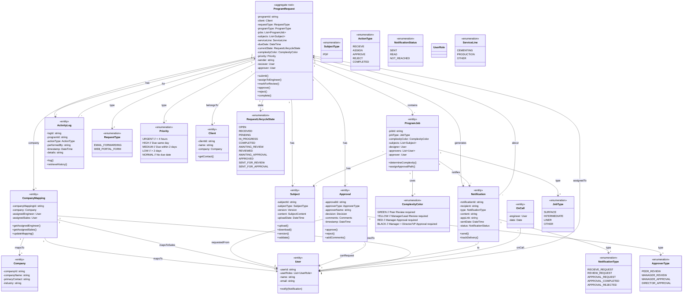

```mermaid
classDiagram
direction TB

class ProgramRequest {
	<<aggregate root>>
	-programId: string
	-client: Client
	-requestType: RequestType
	-programType: ProgramType
	-jobs: List~ProgramJob~
	-subjects: List~Subject~
	-serviceLine: ServiceLine
	-dueDate: DateTime
	-currentState: RequestLifecycleState
	-complexityColor: ComplexityColor
	-priority: Priority
	-sender: string
	-reciever: User
	-approver: User
	+submit()
	+assignToEngineer()
	+markForReview()
	+approve()
	+reject()
	+complete()
}

class ProgramJob {
	<<entity>>
	-jobId: string
	-jobType: JobType
	%% complexityColor 代表审批的人，是否需要上级审批
	-complexityColor: ComplexityColor
	-subjects: List~Subject~
	-designer: User
	%% 使用工作流时不需要审批列表
	-approvers: List~User~
	-approver: User
	+determineComplexity()
	+assignApprovalPath()
}

class Notification {
	<<entity>>
	-notificationId: string
	-recipient: string
	-type: NotificationType
	-content: string
	-appLink: string
	-sentDate: DateTime
	-status: NotificationStatus
	+send()
	+trackDelivery()
}

class ActivityLog {
	<<entity>>
	-logId: string
	-programId: string
	-actionType: ActionType
	-performedBy: string
	-timestamp: DateTime
	-details: string
	+log()
	+retrieveHistory()
}

class Subject {
	<<entity>>
	-subjectId: string
	-subjectType: SubjectType
	-version: Version
	-content: SubjectContent
	-uploadDate: DateTime
	+upload()
	+download()
	+version()
	+validate()
}

class Approval {
	<<entity>>
	-approvalId: string
	-approverType: ApproverType
	-approverName: string
	-decision: Decision
	-comments: Comments
	-timestamp: DateTime
	+approve()
	+reject()
	+addComments()
}

class SubjectType {
	<<enumeration>>
	PDF
}

class ActionType {
	<<enumeration>>
	RECIEVE
	ASSIGN
	APPROVE
	REJECT
	COMPLETED
}

class ApproverType {
	<<enumeration>>
	PEER_REVIEW
	MANAGER_REVIEW
	MANAGER_APPROVAL
	DIRECTOR_APPROVAL
}

class RequestType {
	<<enumeration>>
	EMAIL_FORWARDING
	WEB_PORTAL_FORM
}

class ComplexityColor {
	<<enumeration>>
	GREEN  // Peer Review required
	YELLOW // Manager/Lead Review required
	RED    // Manager Approval required
	BLACK  // Manager + Director/VP Approval required
}

class Priority {
	<<enumeration>>
	URGENT  // < 4 hours
	HIGH    // Due same day
	MEDIUM  // Due within 2 days
	LOW     // > 2 days
	NORMAL  // No due date
}


class NotificationType {
	<<enumeration>>
	RECIEVE_REQUEST
	%% REVIEW APPROVAL 合并
	REVIEW_REQUEST
	APPROVAL_REQUEST
	APPROVAL_COMPLETED
	APPROVAL_REJECTED
}

class NotificationStatus {
	<<enumeration>>
	SENT
	READ
	NOT_REACHED
}

class CompanyMapping {
	<<entity>>
	-companyMappingId: string
	-company: Company
	-assignedEngineer: User
	-assignedSales: User
	+getAssignedEngineer()
	+getAssignedSales()
	+updateMapping()
}

class Company {
	<<entity>>
	-companyId: string
	-companyName: string
	-primaryContact: string
	-industry: string
}

class Client {
	<<entity>>
	-clientId: string
	-name: string
	-company: Company
	+getContact()
}

class OnCall {
	<<entity>>
	-engineer: User
	-date: Date
}

class User {
	<<entity>>
	-userId: string
	-userRoles: List~UserRole~
	-name: string
	-email: string
	+notify(Notification)
}

class UserRole {}

class RequestLifecycleState {
	<<enumeration>>
	OPEN
	RECEIVED
	PENDING
	IN_PROGRESS
	COMPLETED
	AWAITING_REVIEW
	REVIEWED
	AWAITING_APPROVAL
	APPROVED
	SENT_FOR_REVIEW
	SENT_FOR_APPROVAL
}

class ServiceLine {
	<<enumeration>>
	CEMENTING
	PRODUCTION
	OTHER
}

class JobType {
	<<enumeration>>
	SURFACE
	INTERMEDIATE
	LINER
	OTHER
}

ProgramRequest "1" --> "*" ProgramJob : contains
ProgramRequest "1" --> "*" Subject : has
ProgramRequest "1" --> "*" ActivityLog : has
ProgramRequest "1" --> "*" Approval : has
ProgramRequest "1" --> "*" Notification : generates
ProgramRequest "*" --> "1" Client : belongsTo
ProgramRequest "*" --> "1" CompanyMapping : company
ProgramRequest "1" --> "1" RequestType : type
ProgramRequest "1" --> "1" Priority : type
ProgramRequest "1" --> "1" RequestLifecycleState: state

Approval "1" --> "1" ApproverType : type

ProgramJob "*" --> "*" Subject : has
ProgramJob "1" --> "1" ComplexityColor : uses
ProgramJob "1" --> "1" JobType : type
ProgramJob "1" --> "*" Notification : notifies

CompanyMapping "1" --> "1" User : mapsTo
CompanyMapping "1" --> "1" User : mapsToSales

User "*" --> "*" ProgramRequest : assignedTo

Approval "*" --> "1" User : requestedFrom
Approval "*" --> "1" User : canRequest

Notification "*" --> "1" ProgramRequest : about
Notification "*" --> "1" User : to
Notification "1" --> "1" NotificationType : type

ActivityLog "*" --> "1" ProgramRequest : for

CompanyMapping "1" --> "1" Company : mapsTo
CompanyMapping "1" --> "1" User : assignedTo

OnCall "*" --> "1" User : onCall

```
