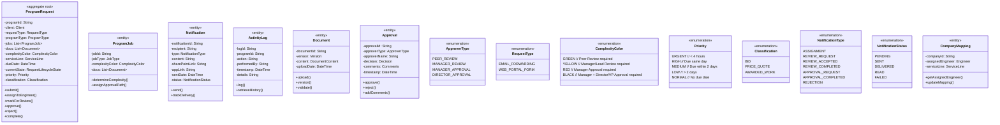

```mermaid
classDiagram
direction TB

class ProgramRequest {
	<<aggregate root>>
	-programId: String
	-client: Client
	-requestType: RequestType
	-programType: ProgramType
	-jobs: List~ProgramJob~
	-docs: List~Document~
	-complexityColor: ComplexityColor
	-serviceLine: ServiceLine
	-dueDate: DateTime
	-currentState: RequestLifecycleState
	-priority: Priority
	-classification: Classification
	+submit()
	+assignToEngineer()
	+markForReview()
	+approve()
	+reject()
	+complete()
}

class ProgramJob {
	<<entity>>
	-jobId: String
	-jobType: JobType
	-complexityColor: ComplexityColor
	-docs: List~Document~
	+determineComplexity()
	+assignApprovalPath()
}

class Notification {
	<<entity>>
	-notificationId: String
	-recipient: String
	-type: NotificationType
	-content: String
	-sharePointLink: String
	-appLink: String
	-sentDate: DateTime
	-status: NotificationStatus
	+send()
	+trackDelivery()
}

class ActivityLog {
	<<entity>>
	-logId: String
	-programId: String
	-action: String
	-performedBy: String
	-timestamp: DateTime
	-details: String
	+log()
	+retrieveHistory()
}

class Document {
	<<entity>>
	-documentId: String
	-version: Version
	-content: DocumentContent
	-uploadDate: DateTime
	+upload()
	+version()
	+validate()
}
	
class Approval {
	<<entity>>
	-approvalId: String
	-approverType: ApproverType
	-approverName: String
	-decision: Decision
	-comments: Comments
	-timestamp: DateTime
	+approve()
	+reject()
	+addComments()
}

class ApproverType {
	<<enumeration>>
	PEER_REVIEW
	MANAGER_REVIEW
	MANAGER_APPROVAL
	DIRECTOR_APPROVAL
}

class RequestType {
	<<enumeration>>
	EMAIL_FORWARDING
	WEB_PORTAL_FORM
}

class ComplexityColor {
	<<enumeration>>
	GREEN  // Peer Review required
	YELLOW // Manager/Lead Review required
	RED    // Manager Approval required
	BLACK  // Manager + Director/VP Approval required
}

class Priority {
	<<enumeration>>
	URGENT  // < 4 hours
	HIGH    // Due same day
	MEDIUM  // Due within 2 days
	LOW     // > 2 days
	NORMAL  // No due date
}

class Classification {
	<<enumeration>>
	BID
	PRICE_QUOTE
	AWARDED_WORK
}

class NotificationType {
	<<enumeration>>
	ASSIGNMENT
	REVIEW_REQUEST
	REVIEW_ACCEPTED
	REVIEW_COMPLETED
	APPROVAL_REQUEST
	APPROVAL_COMPLETED
	REJECTION
}

class NotificationStatus {
	<<enumeration>>
	PENDING
	SENT
	DELIVERED
	READ
	FAILED
}

class CompanyMapping {
	<<entity>>
	-companyId: String
	-assignedEngineer: Engineer
	-serviceLine: ServiceLine
	+getAssignedEngineer()
	+updateMapping()
}
```
