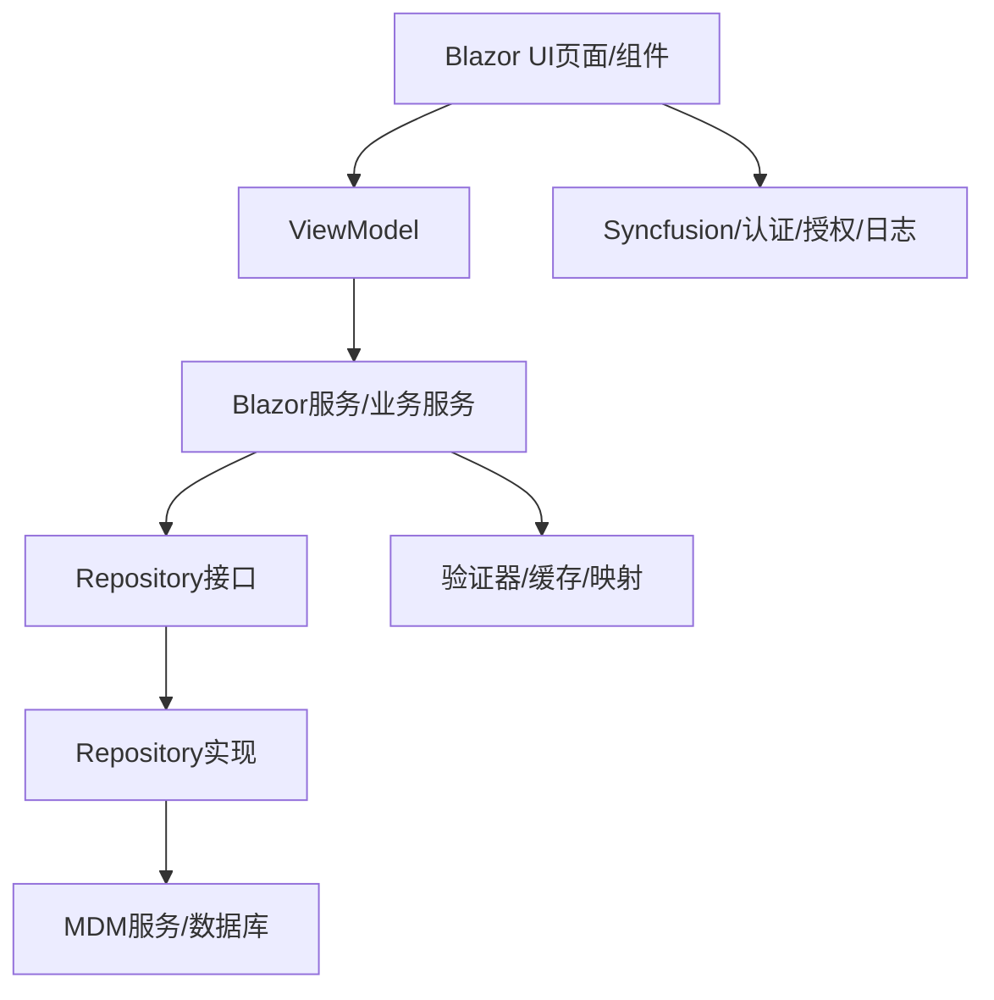
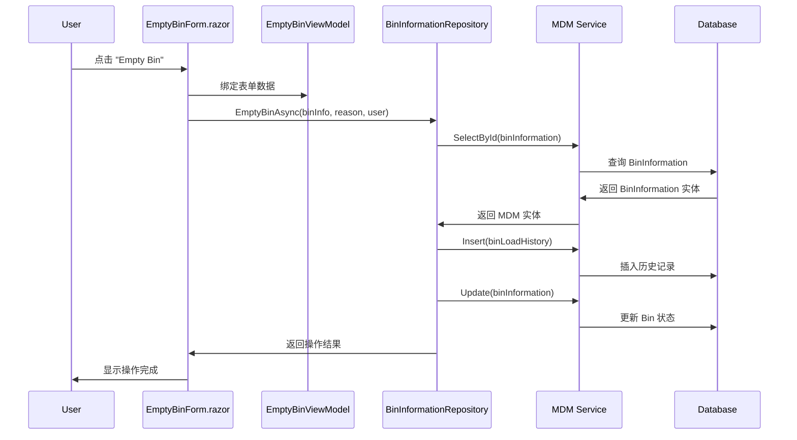
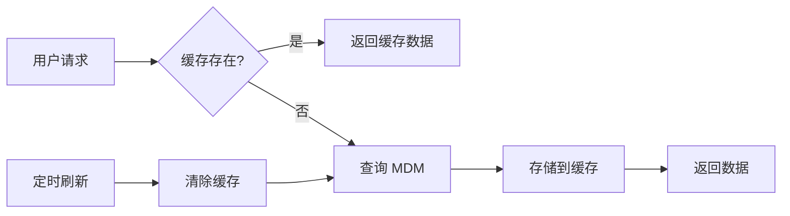

# 系统架构分析（2025年11月）

## 概述

ProgramRequest 是一个基于 ASP.NET Core 6.0 + Blazor Server 的企业级应用系统，为 Sanjel Energy Services 提供业务管理功能，包括产品运输管理、散装工厂管理、作业状态监控等核心业务功能。

## 项目结构与依赖

- 解决方案包含：
  - Sanjel.ProgramRequest.Blazor（前端/页面层，Blazor Server）
  - Sanjel.ProgramRequest.Core（核心业务与服务，领域+基础设施）
  - Sanjel.ProgramRequest.Repositories（数据访问，Repository模式，集成MDM）
  - Sanjel.ProgramRequest.BusinessProcess（业务流程/编排）
  - 各层均有独立的Tests项目，采用NUnit+Moq+FluentAssertions

- 依赖注入：
  - 通过扩展方法AddRepositoryDependencies、AddCoreDependencies批量注册服务、仓储、MDM服务、验证器
  - 支持Singleton/Scoped/Transient多种生命周期
  - 配置项全部采用强类型绑定，支持多环境appsettings

- 主要外部依赖：
  - Syncfusion.Blazor（UI组件）
  - Serilog（结构化日志）
  - Microsoft.Identity.Web（Azure AD认证）
  - FluentValidation（业务验证）
  - SanjelData.\*（MDM主数据集成）

## 系统架构图

```mermaid
graph TB
    subgraph "前端层 (Presentation Layer)"
        A[Blazor Server Pages] --> A1[EmptyBinForm.razor]
        A --> A2[BulkPlant.razor]
        A --> A3[ProductHaul.razor]
        A --> A4[JobStatus.razor]

        B[Razor Components] --> B1[ContextMenu]
        B --> B2[UILoadingModal]
        B --> B3[RequestFormContainer]

        C[ViewModels] --> C1[EmptyBinViewModel]
        C --> C2[BulkPlantBinPanelMenuBusinessObject]
        C --> C3[ProductHaulViewModel]
    end

    subgraph "业务服务层 (Business Service Layer)"
        D[Blazor Services] --> D1[AutoRefreshDataService]
        D --> D2[BulkPlantFilterService]
        D --> D3[CacheRefreshService]

        E[Core Services] --> E1[MappingService]
        E --> E2[ValidationService]
        E --> E3[DependentDataService]
        E --> E4[AuthService]

        F[Business Process] --> F1[ProductHaulProcess]
    end

    subgraph "数据访问层 (Data Access Layer)"
        G[Repository Pattern] --> G1[IBinInformationRepository]
        G --> G2[IProductHaulRepository]
        G --> G3[IDependentDataRepository]

        H[Repository Implementations] --> H1[BinInformationRepository]
        H --> H2[ProductHaulRepository]
        H --> H3[DependentDataRepository]
    end

    subgraph "数据层 (Data Layer)"
        I[Sanjel MDM] --> I1[BinInformation Entity]
        I --> I2[ProductHaul Entity]
        I --> I3[RigJob Entity]

        J[External APIs] --> J1[eService API]
        J --> J2[业务流程 API]
    end

    subgraph "横切关注点 (Cross-Cutting Concerns)"
        K[缓存] --> K1[MemoryCacheService]
        K --> K2[DistributedCacheService]

        L[安全] --> L1[Azure AD Authentication]
        L --> L2[Policy-based Authorization]

        M[日志] --> M1[Serilog]
        M --> M2[Application Insights]
    end

    A --> D
    B --> D
    C --> D
    D --> G
    E --> G
    F --> G
    G --> I
    H --> I
    H --> J
```



## 架构图（简化版）



## 详细架构分析

### 1. 前端层 (Presentation Layer)

#### 1.1 Blazor Server Pages

- **位置**: `src/app/Sanjel.ProgramRequest.Blazor/Pages/`
- **模式**: 基于 Blazor Server 的交互式 Web UI
- **关键特性**:
  - 服务端渲染，客户端通过 SignalR 连接
  - 支持实时数据更新
  - 集成 Syncfusion UI 组件

**EmptyBinForm.razor 组件分析**:

```razor
@using Sanjel.ProgramRequest.Blazor.Pages.BulkPlant._ViewModels
<UILoadingModal IsLoading="_isLoading" />

<EditForm Model="@EmptyBinViewModel" OnValidSubmit="@OnValidSubmitAsync">
    <DataAnnotationsValidator />
    <!-- 表单内容 -->
</EditForm>
```

## 页面与业务流（以EmptyBinForm为例）

- 页面层：
  - EmptyBinForm.razor 作为右键菜单弹窗表单，接收 BinItemContextMenu 参数
  - 通过EditForm绑定EmptyBinViewModel，表单提交触发OnValidSubmitAsync
  - 依赖注入IBinInformationRepository，调用EmptyBinAsync实现业务操作
  - 操作完成后通过EventCallback通知父组件（如RequestFormContainerComponent）

- 业务层：
  - BinInformationRepository 封装所有与Bin相关的数据操作，依赖MDM服务
  - EmptyBinAsync会写入BinLoadHistory，清空Bin状态，更新MDM实体
  - 所有操作均为异步，支持事务和错误处理

- 数据层：
  - 通过MDM服务（如IBinInformationService）访问数据库
  - 所有实体映射通过IMappingService完成

- 典型数据流：
  1. 用户右键点击Bin，弹出菜单，选择“Empty Bin”
  2. 弹出EmptyBinForm，确认后提交
  3. 组件调用仓储接口，仓储调用MDM服务，写入历史并清空Bin
  4. 操作完成后页面刷新，数据同步

## 主要业务模块

- BulkPlant（散装工厂管理）：Bin操作、Blend调整、库存管理、右键菜单
- ProductHaul（产品运输）：运输单创建、调度、状态跟踪
- JobStatus（作业状态）：作业进度、实时监控、报警
- MDM（主数据管理）：所有参考数据、实体、外部接口

## 配置与服务注册

- Program.cs集中注册所有服务、仓储、MDM依赖、UI服务、认证授权、缓存、日志、HttpClient等
- 支持多环境配置，所有敏感信息可通过KeyVault等安全存储
- 所有服务均通过接口注入，便于Mock和单元测试

## 测试策略

- 单元测试：
  - 结构清晰，按功能/模块分文件夹组织
  - 使用NUnit+Moq+FluentAssertions
  - 80%以上覆盖率，Mock外部依赖
- 集成测试：
  - 独立数据库快照，测试前后数据可恢复
  - 完整依赖注入容器，模拟真实运行环境
  - 支持外部接口和MDM集成测试

## 实现模式与最佳实践

- 严格分层：UI/服务/仓储/数据/横切关注点
- 依赖注入+接口驱动，便于扩展和测试
- Repository+Service Layer+Result模式，所有操作有统一结果和错误处理
- FluentValidation全业务验证，所有表单和服务均有验证器
- SOLID原则全面应用，单一职责、开放封闭、接口隔离、依赖反转
- 所有数据访问异步，支持CancellationToken
- 多级缓存，性能优先，支持分布式部署
- 安全优先，所有API和页面均有认证授权，日志审计全覆盖

**关键实现模式**:

- **组件生命周期**: `SetParametersAsync` -> `OnInitialized` -> `OnParametersSet`
- **数据绑定**: 双向绑定使用 `@bind` 指令
- **事件处理**: 异步事件处理模式
- **状态管理**: 组件级状态 + 全局服务状态

#### 1.2 ViewModels

```csharp
public class EmptyBinViewModel
{
    public int Id { get; set; }
    public string Name { get; set; }
}

public class BulkPlantBinPanelMenuBusinessObject
{
    public int BinId { get; set; }
    public int CallSheetId { get; set; }
    public string BinNumber { get; set; }
    public string BulkPlantName { get; set; }
    // 对应 eServiceOnline 项目的参数结构
}
```

**设计模式**:

- **MVVM 模式**: View-ViewModel-Model 分离
- **数据传输对象**: 页面间数据传递的载体
- **业务对象映射**: 对应传统系统参数结构

### 2. 业务服务层 (Business Service Layer)

#### 2.1 Core Services

**MappingService** - 实体映射服务:

```csharp
public class MappingService : IMappingService
{
    public async Task<TModel> MapOneAsync<TMdm, TModel>(TMdm mdmObj)
        where TModel : class, IModel
    {
        return mdmObj is null
            ? null
            : (await MapManyAsync<TMdm, TModel>(new[] { mdmObj })).Single();
    }
}
```

**ValidationService** - 业务规则验证:

- 使用 FluentValidation 进行业务规则验证
- 支持异步验证规则
- 集成到表单验证流程

**DependentDataService** - 依赖数据管理:

- 缓存参考数据 (Rigs, ServicePoints, BlendChemicals)
- 提供数据预加载和刷新机制
- 支持多级缓存策略

#### 2.2 Blazor Services

**AutoRefreshDataService** - 自动数据刷新:

- 实时数据更新机制
- SignalR 集成
- 页面级别的数据同步

**BulkPlantFilterService** - 业务过滤服务:

- 散装工厂数据过滤
- 用户权限相关的数据筛选
- 缓存过滤结果

### 3. 数据访问层 (Data Access Layer)

#### 3.1 Repository Pattern 实现

```csharp
public interface IBinInformationRepository
{
    Task<BinInformation> GetBinInformationAsync(int id);
    Task UpdateBinInformationAsync(BinInformation binInformation, int blendChemicalId, string notes, string userName);
    Task EmptyBinAsync(BinInformation binInformation, string emptyBinReason, string userName = null);
    // 更多业务方法...
}

public class BinInformationRepository : IBinInformationRepository
{
    private readonly IBinInformationService _binInformationService;
    private readonly IMappingService _mappingService;

    public async Task EmptyBinAsync(BinInformation binInformation, string emptyBinReason, string userName = null)
    {
        var mdmBinInfo = _binInformationService.SelectById(new MdmBinInformation() { Id = binInformation.Id });

        // 创建历史记录
        var binLoadHistory = new BinLoadHistory()
        {
            BinInformation = mdmBinInfo,
            OutQuantity = mdmBinInfo.Quantity,
            Remains = 0,
            Description = emptyBinReason,
            Username = userName,
            TimeStamp = DateTime.Now
        };

        _binLoadHistoryService.Insert(binLoadHistory);
        EmptyBin(mdmBinInfo, emptyBinReason);
        _binInformationService.Update(mdmBinInfo);
    }
}
```

**关键特性**:

- **抽象层**: 接口定义业务契约
- **实现层**: 具体的数据访问逻辑
- **映射层**: MDM 实体到业务模型的转换
- **事务管理**: 确保数据一致性

#### 3.2 MDM 集成模式

- **Sanjel MDM**: 主数据管理系统集成
- **实体映射**: MDM 实体 -> 业务模型双向转换
- **缓存策略**: 多级缓存减少数据库访问

### 4. 测试架构

#### 4.1 单元测试

**测试结构**:

```
src/app/Sanjel.ProgramRequest.Blazor.Tests/
├── Pages/
│   └── BulkPlant/
│       ├── BulkPlantBinPanelMenuBuilderTests.cs
│       ├── HaulBlendFormProductHaulLoadTests.cs
│       └── _ViewModels/
├── Policies/
└── Usings.cs
```

**测试模式示例**:

```csharp
[TestFixture]
[Category("Unit")]
public class BulkPlantBinPanelMenuBuilderTests
{
    [Test]
    public void BuildContextMenuItems_Contains_HaulBlendMenu()
    {
        // Arrange & Act
        var menuItems = BulkPlantBinPanelMenuBuilder.BuildContextMenuItems<BulkPlantBinPanelMenuBusinessObject>();

        // Assert
        var haulBlendMenu = menuItems.FirstOrDefault(m => m.Id == BulkPlantMenuOption.HaulBlend.Id.ToString());
        Assert.That(haulBlendMenu, Is.Not.Null, "Haul Blend menu should be present");
    }
}
```

#### 4.2 集成测试

**集成测试基类**:

```csharp
public class SanjelMdmIntegrationBase
{
    protected IServiceProvider Services { get; private set; }

    private void SetServices()
    {
        var servicesCollection = new ServiceCollection();
        servicesCollection.AddRepositoryDependencies(_options);
        servicesCollection.AddCoreDependencies(_options);
        Services = servicesCollection.BuildServiceProvider();
    }
}
```

**特性**:

- **数据库快照**: 测试前后的数据恢复
- **服务容器**: 完整的依赖注入配置
- **Mock 策略**: 外部依赖的模拟

## 技术栈总结

### 前端技术栈

- **Blazor Server**: 服务端渲染的交互式 Web UI
- **Syncfusion**: 企业级 UI 组件库
- **SignalR**: 实时双向通信
- **CSS/SCSS**: 样式管理

### 后端技术栈

- **ASP.NET Core 6.0**: Web 应用框架
- **依赖注入**: 内置 DI 容器
- **Repository Pattern**: 数据访问抽象
- **AutoMapper/手动映射**: 对象映射

### 数据与集成

- **Sanjel MDM**: 主数据管理系统
- **SQL Server**: 关系数据库
- **Memory Cache**: 内存缓存
- **Distributed Cache**: 分布式缓存

### 安全与认证

- **Azure AD**: 身份认证
- **OpenID Connect**: 认证协议
- **Policy-based Authorization**: 基于策略的授权

### 开发与测试

- **NUnit**: 单元测试框架
- **Moq**: Mock 框架
- **FluentAssertions**: 断言库
- **Serilog**: 结构化日志
- **Application Insights**: 应用监控

## 关键设计模式

### 1. SOLID 原则应用

- **单一职责**: 每个类和服务都有明确的单一职责
- **开放封闭**: 通过接口扩展功能，而不修改现有代码
- **里氏替换**: 接口实现可以自由替换
- **接口隔离**: 创建专门的、小而精的接口
- **依赖反转**: 依赖抽象而非具体实现

### 2. Repository Pattern

- **数据访问抽象**: 将数据访问逻辑从业务逻辑中分离
- **可测试性**: 通过接口进行 Mock 测试
- **技术无关性**: 底层数据存储技术的变更不影响业务逻辑

### 3. Service Layer Pattern

- **业务逻辑封装**: 将复杂的业务规则封装在服务层
- **事务管理**: 跨多个仓储的事务协调
- **缓存管理**: 统一的缓存策略实现

### 4. MVVM Pattern (适用于 Blazor)

- **视图模型**: UI 状态和行为的封装
- **数据绑定**: 视图与视图模型的自动同步
- **命令模式**: 用户交互的封装和处理

### 5. Result Pattern

- **错误处理**: 统一的操作结果表示
- **成功/失败**: 明确的操作状态指示
- **错误信息**: 结构化的错误信息传递

## 数据流分析

### 用户操作数据流 (以 EmptyBin 为例)



### 缓存数据流



## 性能优化策略

### 1. 缓存策略

- **内存缓存**: 频繁访问的参考数据
- **分布式缓存**: 跨实例共享的数据
- **多级缓存**: 结合内存和分布式缓存
- **缓存失效**: 基于时间和事件的失效策略

### 2. 数据库优化

- **连接池**: 数据库连接的复用
- **查询优化**: 索引和查询性能调优
- **批量操作**: 减少数据库往返次数
- **分页查询**: 大数据集的分页处理

### 3. UI 优化

- **虚拟化**: `Virtualize` 组件处理大数据集
- **延迟加载**: 按需加载数据和组件
- **防抖处理**: 用户输入的防抖处理
- **预加载**: 预先加载常用数据

## 安全架构

### 1. 身份认证

- **Azure AD 集成**: 企业级身份提供商
- **OpenID Connect**: 标准认证协议
- **JWT Token**: 无状态认证令牌
- **单点登录**: 企业内部系统集成

### 2. 授权机制

```csharp
// 基于策略的授权
services.AddAuthorization(options =>
{
    options.AddPolicy("BulkPlantAccess", policy =>
        policy.RequireClaim("permission", "bulk-plant-read"));
});

// 页面级授权
[Authorize(Policy = "BulkPlantAccess")]
public partial class BulkPlant : ComponentBase
```

### 3. 数据安全

- **输入验证**: 防止注入攻击
- **输出编码**: 防止 XSS 攻击
- **HTTPS**: 传输加密
- **审计日志**: 操作日志记录

## 监控与日志

### 1. 结构化日志

```csharp
_logger.LogInformation("Emptying bin {BinId} by user {UserName}",
    binInformation.Id, userName);
```

### 2. 性能监控

- **Application Insights**: 应用性能监控
- **自定义指标**: 业务相关的性能指标
- **错误跟踪**: 异常和错误的自动捕获

### 3. 健康检查

- **数据库连接**: 数据库可用性检查
- **外部服务**: 依赖服务的健康状态
- **缓存状态**: 缓存服务的可用性

## 部署架构

### 1. 环境配置

```json
{
	"appsettings.Development.json": "开发环境配置",
	"appsettings.Staging.json": "测试环境配置",
	"appsettings.Production.json": "生产环境配置"
}
```

### 2. 容器化

- **Docker**: 应用容器化
- **Kubernetes**: 容器编排 (如适用)
- **负载均衡**: 高可用部署

### 3. CI/CD 流水线

- **构建**: `dotnet build`
- **测试**: `dotnet test`
- **格式化**: `dotnet format`
- **部署**: 自动化部署流程

## 最佳实践总结

### 1. 代码质量

- **命名规范**: 清晰的命名约定
- **代码组织**: 逻辑清晰的文件结构
- **注释文档**: XML 文档注释
- **代码审查**: 团队协作的代码审查

### 2. 性能最佳实践

- **异步编程**: 所有 I/O 操作使用异步模式
- **资源管理**: 正确的资源释放和垃圾回收
- **缓存策略**: 合理的缓存使用
- **数据库优化**: 高效的数据访问模式

### 3. 安全最佳实践

- **最小权限**: 用户和服务的最小权限原则
- **输入验证**: 严格的输入验证
- **错误处理**: 安全的错误信息处理
- **日志记录**: 完整的安全审计日志

### 4. 测试最佳实践

- **测试分类**: Unit 和 Integration 测试分离
- **测试覆盖**: 80% 以上的代码覆盖率
- **Mock 策略**: 外部依赖的合理模拟
- **测试数据**: 可重复的测试数据管理

## 结论

ProgramRequest 系统采用了现代的 .NET 技术栈和成熟的企业级架构模式，具有以下关键优势：

1. **可维护性**: 清晰的分层架构和 SOLID 原则应用
2. **可扩展性**: 基于接口的设计和依赖注入
3. **可测试性**: 完善的单元测试和集成测试框架
4. **性能**: 多级缓存和异步编程模式
5. **安全性**: 企业级安全认证和授权机制

该架构为 Sanjel Energy Services 的数字化转型提供了坚实的技术基础，支持业务的持续增长和系统的长期演进。
