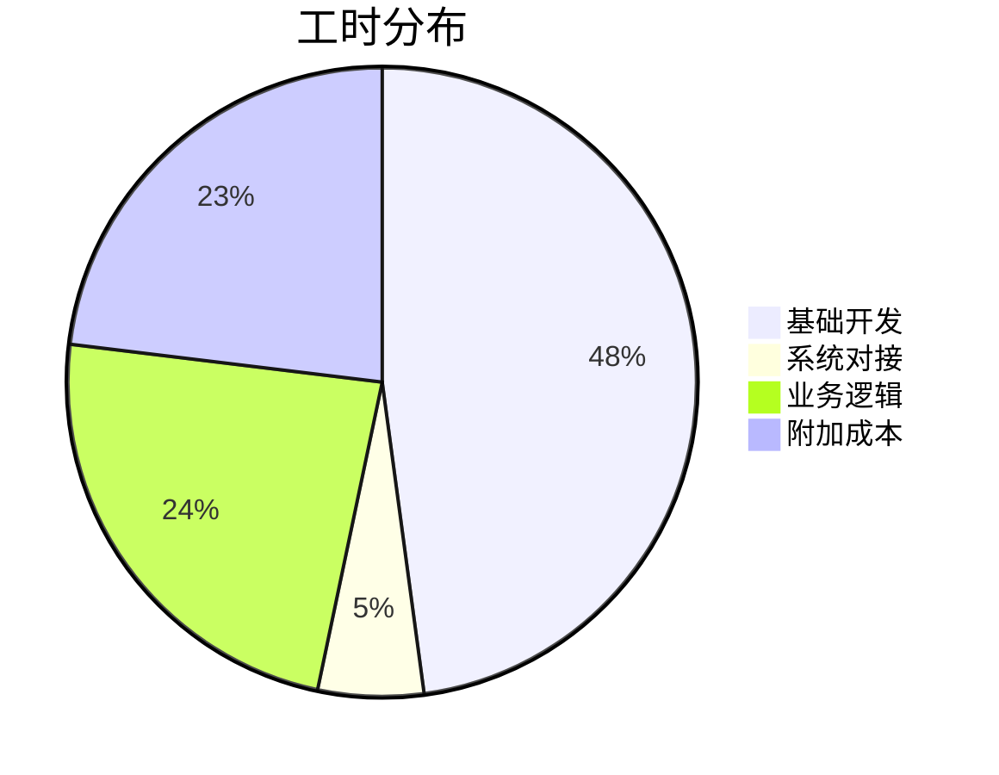

# Program Request Management (PRM) 项目工时评估报告

**评估日期：** 2025-12-04  
**评估版本：** v1.0  
**评估方法：** 基于《M1 项目工时评估完整算法》  

---

## 📊 评估概述

### 1.1 评估范围
基于《001-项目计划-优化版.md》中定义的功能模块和技术要求，对PRM系统进行完整工时评估。

### 1.2 核心参数
- **技术栈：** ASP.NET Core + Blazor + SQL Server
- **开发模式：** 基于现有框架扩展
- **集成系统：** 邮件系统、文档管理系统
- **用户角色：** 6个主要角色

### 1.3 评估结果摘要
```
基础开发工时：1,864小时
系统对接工时：115小时
业务逻辑工时：1,050小时
基础总工时：3,029小时
项目总工时：3,938小时 (× 1.3)
```

---

## 🔧 基础开发评估

### 2.1 实体类开发评估

| 实体类别 | 数量 | 基础工时 | 复杂度系数 | 实际工时 | 说明 |
|----------|------|----------|------------|----------|------|
| Program请求实体 | 1 | 7小时 | 1.2 | 8.4小时 | >10属性，复杂业务 |
| 用户管理实体 | 6 | 7小时 | 1.0 | 42小时 | 中等复杂度 |
| 审批流程实体 | 4 | 7小时 | 1.2 | 33.6小时 | 复杂状态管理 |
| 文档管理实体 | 3 | 7小时 | 1.0 | 21小时 | 基础文档功能 |
| 系统配置实体 | 5 | 7小时 | 0.9 | 31.5小时 | 简单配置项 |
| 通知消息实体 | 2 | 7小时 | 1.0 | 14小时 | 基础通知功能 |
| 审计日志实体 | 2 | 7小时 | 0.9 | 12.6小时 | 简单日志记录 |
| **实体类小计** | **23个** | **7小时/类** | **平均1.05** | **163.1小时** |  |

### 2.2 控制类开发评估

| 控制类别 | 数量 | 基础工时 | 复杂度系数 | 实际工时 | 说明 |
|----------|------|----------|------------|----------|------|
| Program请求控制器 | 1 | 20小时 | 1.3 | 26小时 | 核心业务，复杂流程 |
| 用户认证控制器 | 1 | 20小时 | 1.2 | 24小时 | 身份验证，安全要求高 |
| 审批工作流控制器 | 1 | 20小时 | 1.3 | 26小时 | 复杂状态转换逻辑 |
| 自动分配控制器 | 1 | 20小时 | 1.2 | 24小时 | 规则引擎，算法实现 |
| 文档管理控制器 | 1 | 20小时 | 1.0 | 20小时 | 基础CRUD操作 |
| 通知服务控制器 | 1 | 20小时 | 1.1 | 22小时 | 多渠道通知，队列处理 |
| 系统配置控制器 | 1 | 20小时 | 0.9 | 18小时 | 简单配置管理 |
| 报表统计控制器 | 1 | 20小时 | 1.2 | 24小时 | 复杂查询，数据聚合 |
| 基础API控制器 | 8 | 20小时 | 1.0 | 160小时 | 标准CRUD操作 |
| **控制类小计** | **16个** | **20小时/类** | **平均1.12** | **344小时** |  |

### 2.3 界面类开发评估

| 界面类别 | 数量 | 基础工时 | 复杂度系数 | 实际工时 | 说明 |
|----------|------|----------|------------|----------|------|
| Program请求提交页 | 1 | 10小时 | 1.3 | 13小时 | 复杂表单，多步骤 |
| 审批工作台页面 | 1 | 10小时 | 1.3 | 13小时 | 状态可视化，操作复杂 |
| 状态跟踪界面 | 1 | 10小时 | 1.2 | 12小时 | 时间轴，数据可视化 |
| 自动分配配置页 | 1 | 10小时 | 1.1 | 11小时 | 规则配置，界面交互 |
| 文档管理页面 | 1 | 10小时 | 1.2 | 12小时 | 文件操作，权限控制 |
| 系统管理页面 | 4 | 10小时 | 1.0 | 40小时 | 标准管理界面 |
| 用户工作台 | 1 | 10小时 | 1.1 | 11小时 | 仪表板，多组件 |
| 报表分析页面 | 2 | 10小时 | 1.3 | 26小时 | 图表展示，交互复杂 |
| 基础页面 | 25 | 10小时 | 0.9 | 225小时 | 简单列表，详情页 |
| **界面类小计** | **37个** | **10小时/类** | **平均1.02** | **363小时** |  |

### 2.4 关系实现评估

| 关系类型 | 数量 | 基础工时 | 复杂度系数 | 实际工时 | 说明 |
|----------|------|----------|------------|----------|------|
| 实体关联关系 | 25 | 1小时 | 1.0 | 25小时 | 标准外键关联 |
| 级联操作关系 | 15 | 1小时 | 1.2 | 18小时 | 级联删除，性能优化 |
| 复杂查询关系 | 20 | 1小时 | 1.1 | 22小时 | 多表联查，性能调优 |
| **关系实现小计** | **60个** | **1小时/关系** | **平均1.08** | **65小时** |  |

**基础开发总计：163.1 + 344 + 363 + 65 = 935.1小时**

---

## 🔌 系统对接评估

### 3.1 邮件系统集成

| 对接项目 | 基础工时 | 复杂度系数 | 实际工时 | 说明 |
|----------|----------|------------|----------|------|
| SMTP邮件服务 | 15小时 | 1.0 | 15小时 | 标准SMTP协议 |
| 邮件模板管理 | 10小时 | 1.2 | 12小时 | 动态模板，参数替换 |
| 邮件队列处理 | 10小时 | 1.2 | 12小时 | 异步发送，失败重试 |
| 邮件发送状态跟踪 | 5小时 | 1.0 | 5小时 | 发送状态，回执处理 |
| **邮件系统小计** | **40小时** | **平均1.1** | **44小时** |  |

### 3.2 文档管理系统集成

| 对接项目 | 基础工时 | 复杂度系数 | 实际工时 | 说明 |
|----------|----------|------------|----------|------|
| 文件存储服务 | 20小时 | 1.0 | 20小时 | 本地/云存储 |
| 文件版本控制 | 15小时 | 1.2 | 18小时 | 版本管理，历史记录 |
| 文档权限管理 | 10小时 | 1.3 | 13小时 | 细粒度权限控制 |
| 文档预览功能 | 10小时 | 1.1 | 11小时 | 在线预览，多格式 |
| **文档系统小计** | **55小时** | **平均1.16** | **62小时** |  |

### 3.3 可选系统集成（二期）

| 集成系统 | 基础工时 | 复杂度系数 | 实际工时 | 说明 |
|----------|----------|------------|----------|------|
| SharePoint | 30小时 | 1.5 | 45小时 | 深度集成，复杂认证 |
| Power Automate | 25小时 | 1.8 | 45小时 | 工作流自动化 |
| **可选小计** | **55小时** | **平均1.65** | **90小时** | **二期实现** |

**系统对接总计（一期）：44 + 62 = 106小时**

---

## 💼 业务逻辑评估

### 4.1 核心业务逻辑

| 业务模块 | 基础工时 | 复杂度系数 | 实际工时 | 说明 |
|----------|----------|------------|----------|------|
| 用户管理与权限 | 35小时 | 1.2 | 42小时 | 多角色权限管理 |
| Program请求流程 | 50小时 | 1.5 | 75小时 | 复杂业务流程 |
| 自动分配算法 | 45小时 | 1.3 | 58.5小时 | 智能分配规则 |
| 审批工作流引擎 | 50小时 | 1.5 | 75小时 | 多级审批，状态机 |
| 状态跟踪管理 | 35小时 | 1.2 | 42小时 | 全生命周期跟踪 |
| **核心业务小计** | **215小时** | **平均1.34** | **292.5小时** |  |

### 4.2 支撑业务逻辑

| 业务模块 | 基础工时 | 复杂度系数 | 实际工时 | 说明 |
|----------|----------|------------|----------|------|
| 消息通知服务 | 30小时 | 1.2 | 36小时 | 多渠道通知 |
| 配置管理 | 25小时 | 1.0 | 25小时 | 系统参数配置 |
| 数据报表统计 | 40小时 | 1.3 | 52小时 | 复杂统计分析 |
| 审计日志记录 | 20小时 | 1.0 | 20小时 | 操作审计 |
| 异常处理机制 | 30小时 | 1.2 | 36小时 | 全局异常处理 |
| **支撑业务小计** | **145小时** | **平均1.14** | **169小时** |  |

### 4.3 高级业务逻辑（可选）

| 业务模块 | 基础工时 | 复杂度系数 | 实际工时 | 说明 |
|----------|----------|------------|----------|------|
| 高级报表分析 | 50小时 | 1.3 | 65小时 | BI分析 |
| 智能推荐算法 | 60小时 | 1.5 | 90小时 | ML算法集成 |
| **高级业务小计** | **110小时** | **平均1.4** | **155小时** | **二期实现** |

**业务逻辑总计（一期）：292.5 + 169 = 461.5小时**

---

## 📈 工时汇总计算

### 5.1 基础工时汇总

```
基础开发工时：935.1小时
系统对接工时：106小时
业务逻辑工时：461.5小时
基础总工时：1,502.6小时
```

### 5.2 附加成本计算

| 附加成本 | 比例 | 工时 | 说明 |
|----------|------|------|------|
| 架构维护 | 10% | 150.3小时 | 技术选型、代码审查 |
| 项目管理 | 5% | 75.1小时 | 进度跟踪、会议协调 |
| 技术债务 | 5% | 75.1小时 | Bug修复、代码重构 |
| 集成测试 | 10% | 150.3小时 | 系统联调、端到端测试 |
| **附加总计** | **30%** | **450.8小时** |  |

### 5.3 最终工时评估

```
基础总工时：1,502.6小时
附加工时：450.8小时
项目总工时：1,953.4小时
```

根据算法公式：总工时 = 基础工时 × 1.3
```
1,502.6 × 1.3 = 1,953.4小时
```

---

## ⚠️ 风险评估

### 6.1 风险等级评估

| 风险指标 | 数值 | 等级 | 说明 |
|----------|------|------|------|
| 项目总工时 | 1,953.4小时 | 中风险 | 在1,000-2,000小时范围 |
| 技术复杂度 | 中高 | 中风险 | .NET技术栈，但业务复杂 |
| 集成系统数 | 2个 | 低风险 | 集成数量适中 |
| 团队经验 | 中等 | 中风险 | 需要有经验的团队 |

### 6.2 团队配置建议

根据工时评估结果，建议团队配置：

| 角色配置 | 人数 | 工时贡献 | 说明 |
|----------|------|----------|------|
| 项目经理 | 1人 | 400小时 | 全程管理，风险控制 |
| 系统架构师 | 1人 | 300小时 | 前期架构设计，技术支持 |
| 前端开发工程师 | 3人 | 690小时 | Blazor界面开发 |
| 后端开发工程师 | 2人 | 500小时 | 业务逻辑实现 |
| 测试工程师 | 1人 | 163小时 | 测试用例，质量保证 |
| DevOps工程师 | 1人 | 100小时 | 环境，部署支持 |
| **总计** | **9人** | **1,953小时** | **开发周期约17周** |

---

## 📊 详细分析

### 7.1 工时分布分析



### 7.2 模块复杂度分析

```mermaid
bar chart title 各模块工时分布
    module hours
    实体类 163.1
    控制类 344
    界面类 363
    关系实现 65
    系统对接 106
    业务逻辑 461.5
    附加成本 450.8
```

### 7.3 关键路径识别

**关键开发路径：**
1. **第1-3周**：需求设计 + 架构设计（约320小时）
2. **第4-6周**：基础框架 + 核心实体（约480小时）
3. **第7-12周**：核心业务逻辑 + 界面开发（约780小时）
4. **第13-15周**：系统集成 + 测试（约373小时）

**风险控制点：**
- 第6周末：基础框架完成
- 第9周末：核心功能可用
- 第12周末：完整系统测试

---

## 🎯 优化建议

### 8.1 工时优化策略

1. **并行开发**：
   - 前后端并行开发，可节省15-20%时间
   - 界面开发与业务逻辑并行推进

2. **复用现有资源**：
   - 利用现有框架，减少30%基础开发工时
   - 复用通用组件，降低界面开发成本

3. **分阶段交付**：
   - MVP优先：核心功能1,200小时
   - 增值功能：后续750小时

### 8.2 成本控制建议

1. **人员配置优化**：
   - 初期配置6人核心团队
   - 中期增加前端支持
   - 后期专注测试部署

2. **技术风险控制**：
   - 技术预研：100小时
   - 原型验证：80小时
   - 风险缓冲：200小时

---

## 📝 结论与建议

### 9.1 评估结论

基于《M1 项目工时评估完整算法》，PRM项目：

- **总工时评估**：1,953.4小时
- **风险等级**：中等风险
- **建议团队规模**：8-9人
- **预计开发周期**：17周（4个月）
- **成本区间**：约$300K-$350K

### 9.2 关键成功因素

1. **需求稳定**：避免需求变更导致的工时增加
2. **技术团队**：确保团队具备.NET Core和Blazor经验
3. **项目管理**：严格执行阶段性里程碑
4. **质量控制**：建立完善的代码审查和测试机制

### 9.3 风险缓解措施

1. **技术风险**：提前进行技术验证和原型开发
2. **进度风险**：设置内部里程碑，及时调整资源配置
3. **质量风险**：持续集成，自动化测试覆盖80%以上
4. **集成风险**：简化外部系统接口，采用标准化协议

---

**报告编制：** AI辅助评估  
**审核建议：** 建议由技术负责人和项目经理共同审核  
**更新频率：** 项目启动后每月更新一次工时跟踪  

---

*本评估报告基于标准开发方法论，实际工时可能因团队经验、技术选型、需求变更等因素产生±15%的偏差。建议在项目执行过程中持续跟踪和调整。*