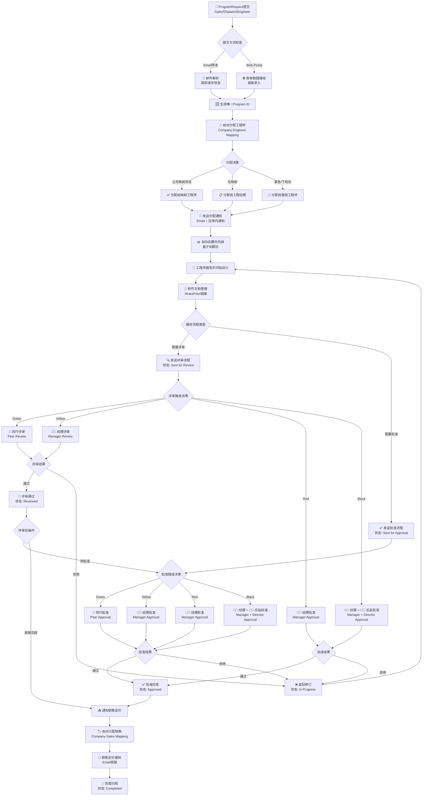
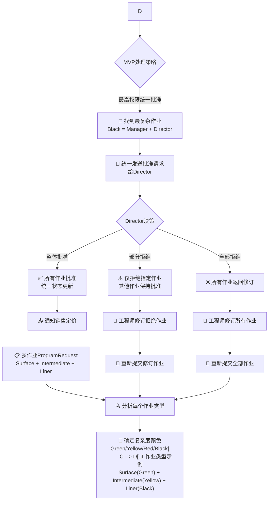
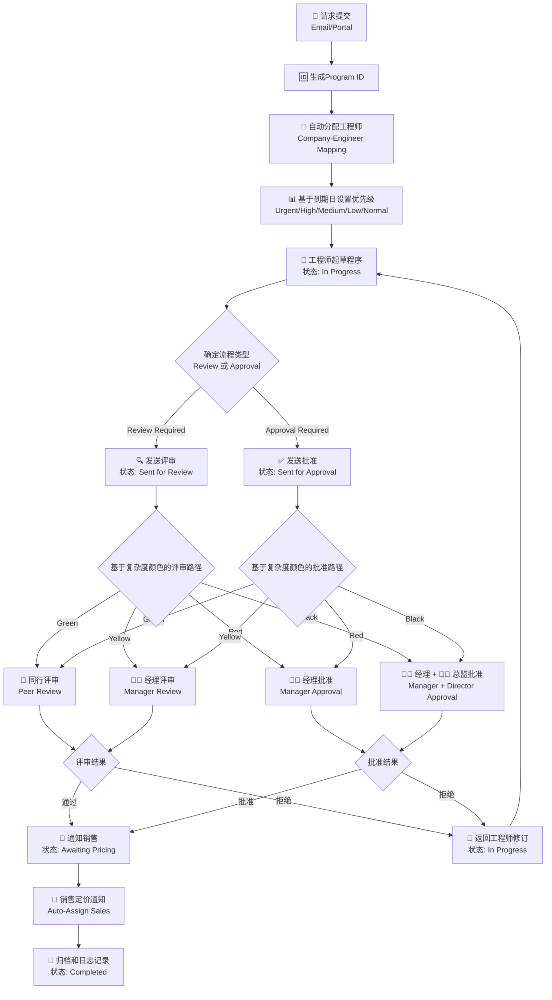
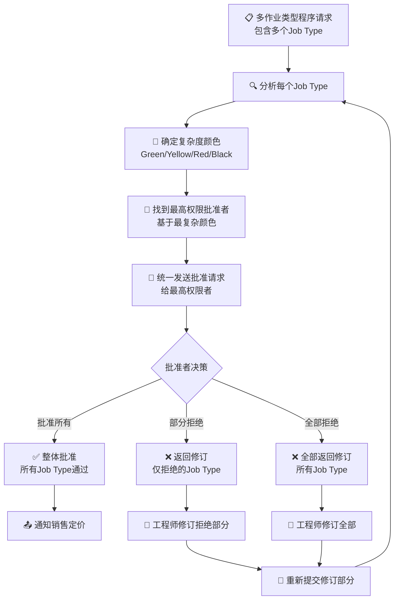
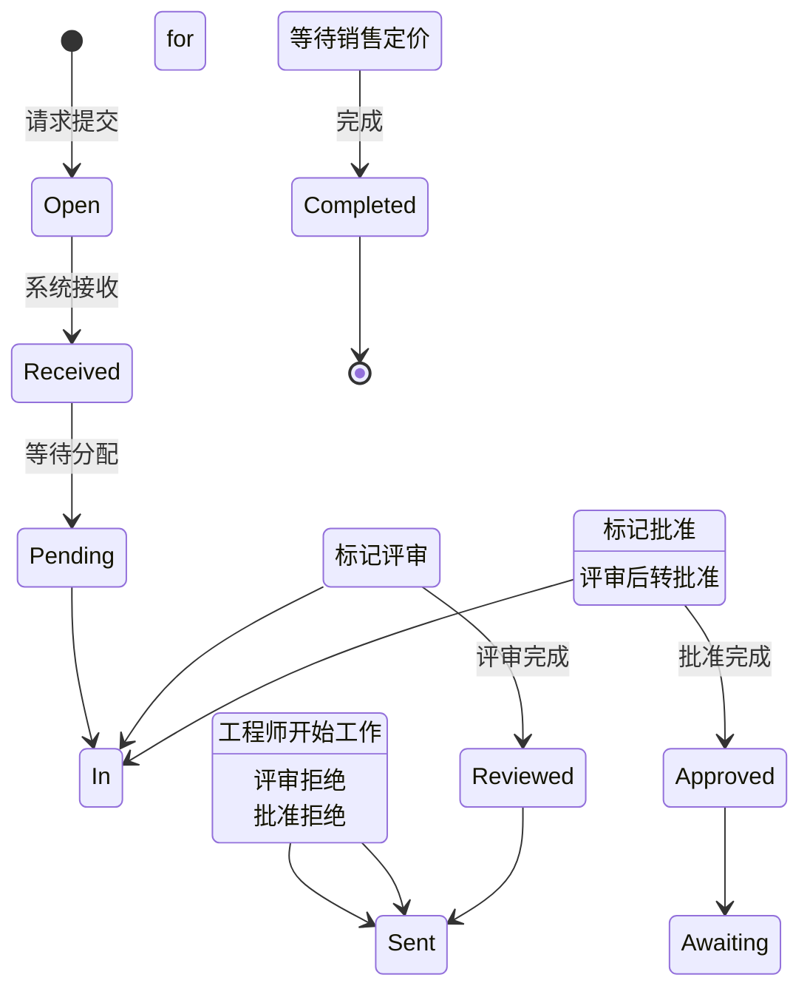
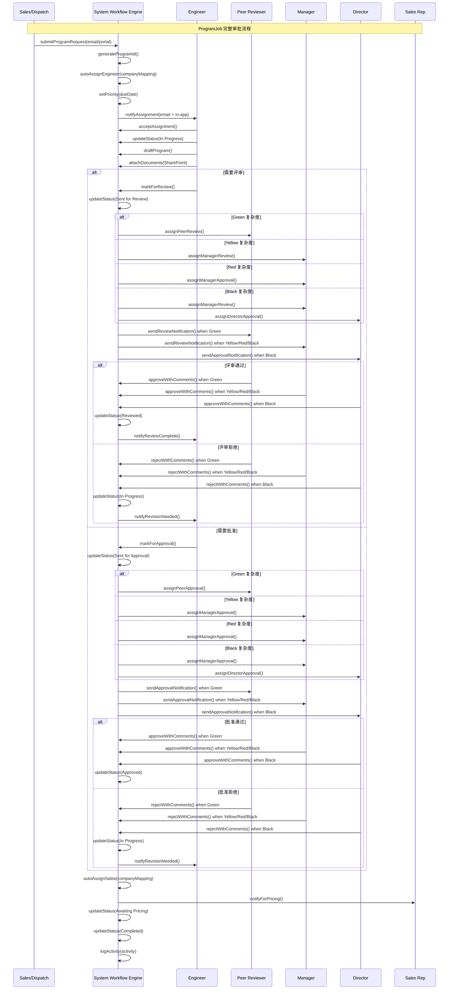

# 流程图

## ProgramRequest审批流程

```mermaid
flowchart TD
	A[📧 ProgramRequest提交<br>Sales/Dispatch/Engineer] --> B{提交方式检查}
	B -->|Email转发| C[📧 邮件解析<br>提取请求信息]
	B -->|Web Portal| D[🌐 表单数据接收<br>直接录入]
	C --> E[🆔 生成唯一Program ID]
	D --> E
	
	E --> F[👤 自动分配工程师<br>Company-Engineer Mapping]
	F --> G{分配决策}
	G -->|公司映射存在| H[✅ 分配给映射工程师]
	G -->|无映射| I[📋 分配给工程经理]
	G -->|紧急/下班后| J[🚨 分配给值班工程师]
	
	H --> K[📧 发送分配通知<br>Email + 应用内通知]
	I --> K
	J --> K
	
	K --> L[📊 自动设置优先级<br>基于到期日]
	L --> M[📝 工程师接受并开始设计]
	M --> N[📎 附件文档管理<br>SharePoint链接]
	N --> O{确定流程类型}
	
	O -->|需要评审| P[🔍 发送评审流程<br>状态: Sent for Review]
	O -->|需要批准| Q[✅ 发送批准流程<br>状态: Sent for Approval]
	
	P --> R{评审路径决策}
	Q --> S{批准路径决策}
	
	R -->|Green| T[👥 同行评审<br>Peer Review]
	R -->|Yellow| U[👨‍💼 经理评审<br>Manager Review]
	R -->|Red| V[👨‍💼 经理批准<br>Manager Approval]
	R -->|Black| W[👨‍💼 经理 + 👨‍💼 总监批准<br>Manager + Director Approval]
	
	S -->|Green| X[👥 同行批准<br>Peer Approval]
	S -->|Yellow| Y[👨‍💼 经理批准<br>Manager Approval]
	S -->|Red| Z[👨‍💼 经理批准<br>Manager Approval]
	S -->|Black| AA[👨‍💼 经理 + 👨‍💼 总监批准<br>Manager + Director Approval]
	
	T --> BB{评审结果}
	U --> BB
	V --> CC{批准结果}
	W --> CC
	X --> DD{批准结果}
	Y --> DD
	Z --> DD
	AA --> DD
	
	BB -->|通过| EE[📝 评审通过<br>状态: Reviewed]
	BB -->|拒绝| FF[❌ 返回修订<br>状态: In Progress]
	CC -->|通过| GG[✅ 批准完成<br>状态: Approved]
	CC -->|拒绝| FF
	DD -->|通过| GG
	DD -->|拒绝| FF
	
	EE --> HH{评审后操作}
	HH -->|转批准| S
	HH -->|直接完成| II[📤 通知销售定价]
	
	GG --> II
	II --> JJ[🏷️ 自动分配销售<br>Company-Sales Mapping]
	JJ --> KK[📧 销售定价通知<br>Email链接]
	KK --> LL[💾 完成归档<br>状态: Completed]
	FF --> M
```

## ProgramRequest多作业类型审批流程

```mermaid
flowchart TD
	A[📋 多作业ProgramRequest<br>Surface + Intermediate + Liner] --> B[🔍 分析每个作业类型]
	B --> C["🎨 确定复杂度颜色<br>Green/Yellow/Red/Black]
	C --> D[📊 作业类型示例<br>Surface(Green) + Intermediate(Yellow) + Liner(Black)"]
	D --> E{MVP处理策略}
	
	E -->|最高权限统一批准| F[👑 找到最复杂作业<br>Black = Manager + Director]
	F --> G[📧 统一发送批准请求<br>给Director]
	G --> H{Director决策}
	
	H -->|整体批准| I[✅ 所有作业批准<br>统一状态更新]
	H -->|部分拒绝| J[⚠️ 仅拒绝指定作业<br>其他作业保持批准]
	H -->|全部拒绝| K[❌ 所有作业返回修订]
	
	I --> L[📤 通知销售定价]
	J --> M[🔄 工程师修订拒绝作业]
	K --> N[🔄 工程师修订所有作业]
	
	M --> O[📝 重新提交修订作业]
	N --> P[📝 重新提交全部作业]
	O --> B
	P --> B
```

## ProgramJob 审批流程

```mermaid
flowchart TD
	A[📧 请求提交<br>Email/Portal] --> B[🆔 生成Program ID]
	B --> C[👤 自动分配工程师<br>Company-Engineer Mapping]
	C --> D[📊 基于到期日设置优先级<br>Urgent/High/Medium/Low/Normal]
	D --> E[📝 工程师起草程序<br>状态: In Progress]
	E --> F{确定流程类型<br>Review 或 Approval}
	
	F -->|Review Required| G[🔍 发送评审<br>状态: Sent for Review]
	F -->|Approval Required| H[✅ 发送批准<br>状态: Sent for Approval]
	
	G --> I{基于复杂度颜色的评审路径}
	I -->|Green| J[👥 同行评审<br>Peer Review]
	I -->|Yellow| K[👨‍💼 经理评审<br>Manager Review]
	I -->|Red| L[👨‍💼 经理批准<br>Manager Approval]
	I -->|Black| M[👨‍💼 经理 + 👨‍💼 总监批准<br>Manager + Director Approval]
	
	H --> N{基于复杂度颜色的批准路径}
	N -->|Green| J
	N -->|Yellow| K
	N -->|Red| L
	N -->|Black| M
	
	J --> O{评审结果}
	K --> O
	L --> P{批准结果}
	M --> P
	
	O -->|通过| Q[📝 通知销售<br>状态: Awaiting Pricing]
	O -->|拒绝| R[🔄 返回工程师修订<br>状态: In Progress]
	P -->|批准| Q
	P -->|拒绝| R
	
	Q --> S[📧 销售定价通知<br>Auto-Assign Sales]
	S --> T[💾 归档和日志记录<br>状态: Completed]
	R --> E
```

## 多作业类型审批流程 (MVP)

```mermaid
flowchart TD
	A[📋 多作业类型程序请求<br>包含多个Job Type] --> B[🔍 分析每个Job Type]
	B --> C[🎨 确定复杂度颜色<br>Green/Yellow/Red/Black]
	C --> D[👑 找到最高权限批准者<br>基于最复杂颜色]
	D --> E[📧 统一发送批准请求<br>给最高权限者]
	E --> F{批准者决策}
	
	F -->|批准所有| G[✅ 整体批准<br>所有Job Type通过]
	F -->|部分拒绝| H[❌ 返回修订<br>仅拒绝的Job Type]
	F -->|全部拒绝| I[❌ 全部返回修订<br>所有Job Type]
	
	G --> J[📤 通知销售定价]
	H --> K[🔄 工程师修订拒绝部分]
	I --> L[🔄 工程师修订全部]
	
	K --> M[📝 重新提交修订部分]
	L --> M
	M --> B
```

## 状态流转图

```mermaid
stateDiagram-v2
	[*] --> Open: 请求提交
	Open --> Received: 系统接收
	Received --> Pending: 等待分配
	Pending --> In Progress: 工程师开始工作
	In Progress --> Sent for Review: 标记评审
	In Progress --> Sent for Approval: 标记批准
	Sent for Review --> Reviewed: 评审完成
	Sent for Review --> In Progress: 评审拒绝
	Sent for Approval --> Approved: 批准完成
	Sent for Approval --> In Progress: 批准拒绝
	Reviewed --> Sent for Approval: 评审后转批准
	Approved --> Awaiting Pricing: 等待销售定价
	Awaiting Pricing --> Completed: 完成
	Completed --> [*]
```

## 详细审批序列图

```mermaid
sequenceDiagram
	participant SD as Sales/Dispatch
	participant SYS as System Workflow Engine
	participant ENG as Engineer
	participant PEER as Peer Reviewer
	participant MGR as Manager
	participant DIR as Director
	participant SALES as Sales Rep
	
	Note over SD,SALES: ProgramJob 完整审批流程
	
	%% 请求提交阶段
	SD->>SYS: submitProgramRequest(email/portal)
	SYS->>SYS: generateProgramId()
	SYS->>SYS: autoAssignEngineer(companyMapping)
	SYS->>SYS: setPriority(dueDate)
	SYS->>ENG: notifyAssignment(email + in-app)
	
	%% 工程师起草阶段
	ENG->>SYS: acceptAssignment()
	ENG->>SYS: updateStatus(In Progress)
	ENG->>SYS: draftProgram()
	ENG->>SYS: attachDocuments(SharePoint)
	
	%% 决策分支
	alt 需要评审
		ENG->>SYS: markForReview()
		SYS->>SYS: updateStatus(Sent for Review)
		
		%% 评审路径
		alt Green 复杂度
			SYS->>PEER: assignPeerReview()
		else Yellow 复杂度
			SYS->>MGR: assignManagerReview()
		else Red 复杂度
			SYS->>MGR: assignManagerApproval()
		else Black 复杂度
			SYS->>MGR: assignManagerReview()
			SYS->>DIR: assignDirectorApproval()
		end
		
		%% 评审通知
		SYS->>PEER: sendReviewNotification() when Green
		SYS->>MGR: sendReviewNotification() when Yellow/Red/Black
		SYS->>DIR: sendApprovalNotification() when Black
		
		%% 评审决策
		alt 评审通过
			PEER->>SYS: approveWithComments() when Green
			MGR->>SYS: approveWithComments() when Yellow/Red/Black
			DIR->>SYS: approveWithComments() when Black
			SYS->>SYS: updateStatus(Reviewed)
			SYS->>ENG: notifyReviewComplete()
		else 评审拒绝
			PEER->>SYS: rejectWithComments() when Green
			MGR->>SYS: rejectWithComments() when Yellow/Red/Black
			DIR->>SYS: rejectWithComments() when Black
			SYS->>SYS: updateStatus(In Progress)
			SYS->>ENG: notifyRevisionNeeded()
		end
		
	else 需要批准
		ENG->>SYS: markForApproval()
		SYS->>SYS: updateStatus(Sent for Approval)
		
		%% 批准路径
		alt Green 复杂度
			SYS->>PEER: assignPeerApproval()
		else Yellow 复杂度
			SYS->>MGR: assignManagerApproval()
		else Red 复杂度
			SYS->>MGR: assignManagerApproval()
		else Black 复杂度
			SYS->>MGR: assignManagerApproval()
			SYS->>DIR: assignDirectorApproval()
		end
		
		%% 批准通知
		SYS->>PEER: sendApprovalNotification() when Green
		SYS->>MGR: sendApprovalNotification() when Yellow/Red/Black
		SYS->>DIR: sendApprovalNotification() when Black
		
		%% 批准决策
		alt 批准通过
			PEER->>SYS: approveWithComments() when Green
			MGR->>SYS: approveWithComments() when Yellow/Red/Black
			DIR->>SYS: approveWithComments() when Black
			SYS->>SYS: updateStatus(Approved)
		else 批准拒绝
			PEER->>SYS: rejectWithComments() when Green
			MGR->>SYS: rejectWithComments() when Yellow/Red/Black
			DIR->>SYS: rejectWithComments() when Black
			SYS->>SYS: updateStatus(In Progress)
			SYS->>ENG: notifyRevisionNeeded()
		end
	end
	
	%% 最终阶段
	SYS->>SYS: autoAssignSales(companyMapping)
	SYS->>SALES: notifyForPricing()
	SYS->>SYS: updateStatus(Awaiting Pricing)
	SYS->>SYS: updateStatus(Completed)
	SYS->>SYS: logActivity(activity)
```
