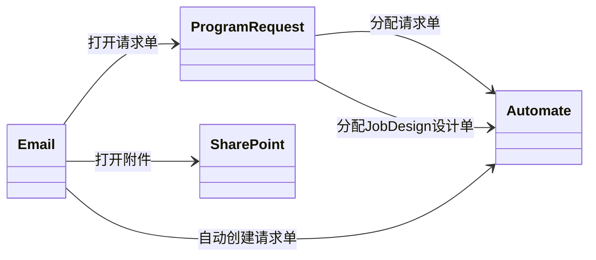

# Program Request Management 系统原型设计文档

## Program Request Management 系统原型

```mermaid
classDiagram
direction LR

Email --> ProgramRequest: 打开请求单
Email --> SharePoint: 打开附件

ProgramRequest --> Automate: 分配请求单
ProgramRequest --> Automate: 分配JobDesign设计单

Email --> Automate: 自动创建请求单
```

## 邮件浏览界面原型
