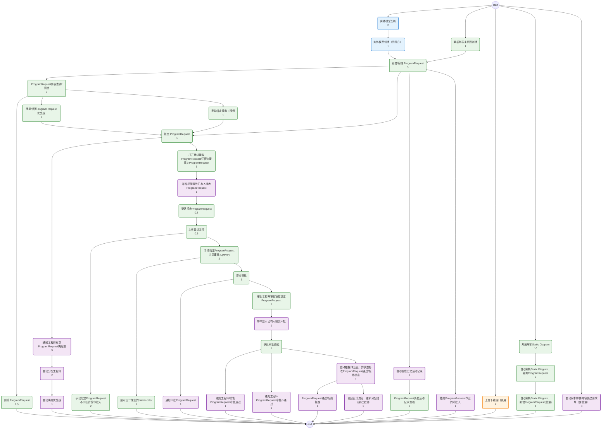

# 项目开发计划

```mermaid
flowchart TB

start(("start"))
eend(("end"))

t01("实体模型分析
2")
t02("实体模型创建（元元方）
1")
t03("数据列表主页面创建
1")
t04("ProgramRequest列表查询/筛选
3")
t05("上传下载接口调用
2")
t06("新增/编辑 ProgramRequest
3")
t07("删除 ProgramRequest
0.5")
t08("手动设置ProgramRequest优先级
1")
t09("手动指定接收工程师
1")
t10("提交 ProgramRequest
1")
t11("自动解析邮件内容创建请求单（含批量）
3")
t12("自动分配工程师
2")
t13("自动确定优先级
1")
t14("通知工程师有新ProgramRequest需处理
5")
t15("打开确认接收ProgramRequest详情链接锁定ProgramRequest
1")
t16("邮件提醒变为已有人接收ProgramRequest
1")
t17("确认接收ProgramRequest
0.5")
t18("系统解析Static Diagram
10")
t19("上传设计文件
0.5")
t20("手动指定ProgramRequest不同设计的审批人
2")
t21("手动指定ProgramRequest共同审批人(MVP)
2")
t22("展示设计作业的matrix color
1")
t23("指定ProgramRequest作业的审批人
1")
t24("通知审批ProgramRequest
1")
t25("审批者打开审批链接锁定ProgramRequest
1")
t26("邮件显示已有人接受审批
1")
t27("通知工程师/销售ProgramRequest审批通过
1")
t28("通知工程师ProgramRequest审批不通过
1")
t29("自动根据作业设计的状态修改ProgramRequest通过/拒绝状态
1")
t30("ProgramRequest通过/拒绝提醒
1")
t31("退回设计流程，重新分配给(原)工程师
2")
t32("自动生成历史活动记录
2")
t33("ProgramRequest历史活动记录查看
2")
t34("提交审批
1")
t35("自动解析Static Diagram，新增ProgramRequest
2")
t36("自动解析Static Diagram，新增ProgramRequest(批量)
1")
t37("确认审批通过
1")

start --> t01
start --> t03
start --> t05
start --> t18
start --> t11

t01 --> t02
t02 --> t06
t03 --> t06
t05 --> eend
t06 --> t04
t04 --> t07
t04 --> t08
t04 --> t09
t06 --> t10
t06 --> t32
t06 --> t23
t07 --> eend
t08 --> t10
t09 --> t10
t10 --> t14
t10 --> t15
t11 --> eend
t12 --> t13
t13 --> eend
t14 --> t12
t15 --> t16
t16 --> t17
t17 --> t19
t18 --> t35
t19 --> t20
t19 --> t21
t20 --> eend
t21 --> t22
t21 --> t34
t22 --> eend
t23 --> eend
t24 --> eend
t25 --> t26
t26 --> t37
t27 --> eend
t28 --> eend
t29 --> t30
t30 --> eend
t31 --> eend
t32 --> t33
t33 --> eend
t34 --> t24
t34 --> t25
t35 --> t36
t36 --> eend
t37 --> t27
t37 --> t28
t37 --> t29
t29 --> t31

classDef dataModeling fill:#e3f2fd,stroke:#1976d2,stroke-width:2px
classDef webPage fill:#e8f5e8,stroke:#388e3c,stroke-width:2px
classDef sharePoint fill:#fff3e0,stroke:#f57c00,stroke-width:2px
classDef workflow fill:#f3e5f5,stroke:#7b1fa2,stroke-width:2px

class t01,t02 dataModeling
class t03,t04,t06,t07,t08,t09,t10,t15,t17,t19,t21,t22,t25,t33,t34,t35,t36,t37,t18,t20 webPage
class t05 sharePoint
class t11,t12,t13,t14,t16,t23,t24,t26,t27,t28,t29,t30,t31,t32 workflow
```
