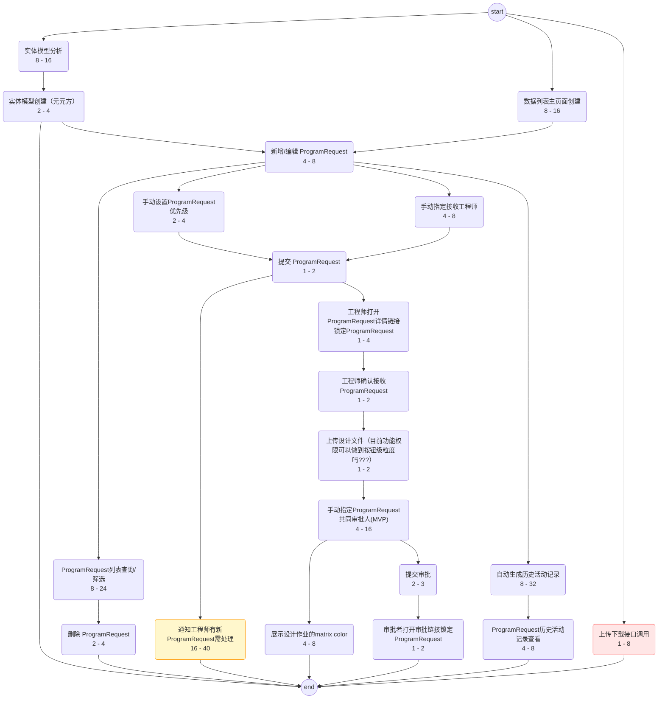

# 阶段一项目开发计划

```mermaid
flowchart TB

start(("start"))
eend(("end"))

t01("实体模型分析
8 - 16")
t02("实体模型创建（元元方）
2 - 4")
t03("数据列表主页面创建
8 - 16")
t04("ProgramRequest列表查询/筛选
8 - 24")
t05("上传下载接口调用
1 - 8")
t06("新增/编辑 ProgramRequest
4 - 8")
t07("删除 ProgramRequest
2 - 4")
t08("手动设置ProgramRequest优先级
2 - 4")
t09("手动指定接收工程师
4 - 8")
t10("提交 ProgramRequest
1 - 2")
t14("通知工程师有新ProgramRequest需处理
16 - 40")
t15("工程师打开ProgramRequest详情链接锁定ProgramRequest
1 - 4")
t17("工程师确认接收ProgramRequest
1 - 2")
t19("上传设计文件（目前功能权限可以做到按钮级粒度吗???）
1 - 2")
t21("手动指定ProgramRequest共同审批人(MVP)
4 - 16")
t22("展示设计作业的matrix color
4 - 8")
t34("提交审批
2 - 3")
t25("审批者打开审批链接锁定ProgramRequest
1 - 2")
t32("自动生成历史活动记录
8 - 32")
t33("ProgramRequest历史活动记录查看
4 - 8")

start --> t01
t01 --> t02
t02 --> eend
t02 --> t06

start --> t03
t03 --> t06
t06 --> t04
t04 --> t07
t07 --> eend

t06 --> t08
t06 --> t09
t08 --> t10
t09 --> t10

t10 --> t14
t10 --> t15
t14 --> eend

t15 --> t17
t17 --> t19
t19 --> t21
t21 --> t22
t21 --> t34
t22 --> eend
t34 --> t25
t25 --> eend

t06 --> t32
t32 --> t33
t33 --> eend

start --> t05
t05 --> eend

%% Highlight t05 node with a different color
style t05 fill:#ffe6e6,stroke:#ff4d4d,stroke-width:1px
style t14 fill:#fff7cc,stroke:#ff9900,stroke-width:1px
```
