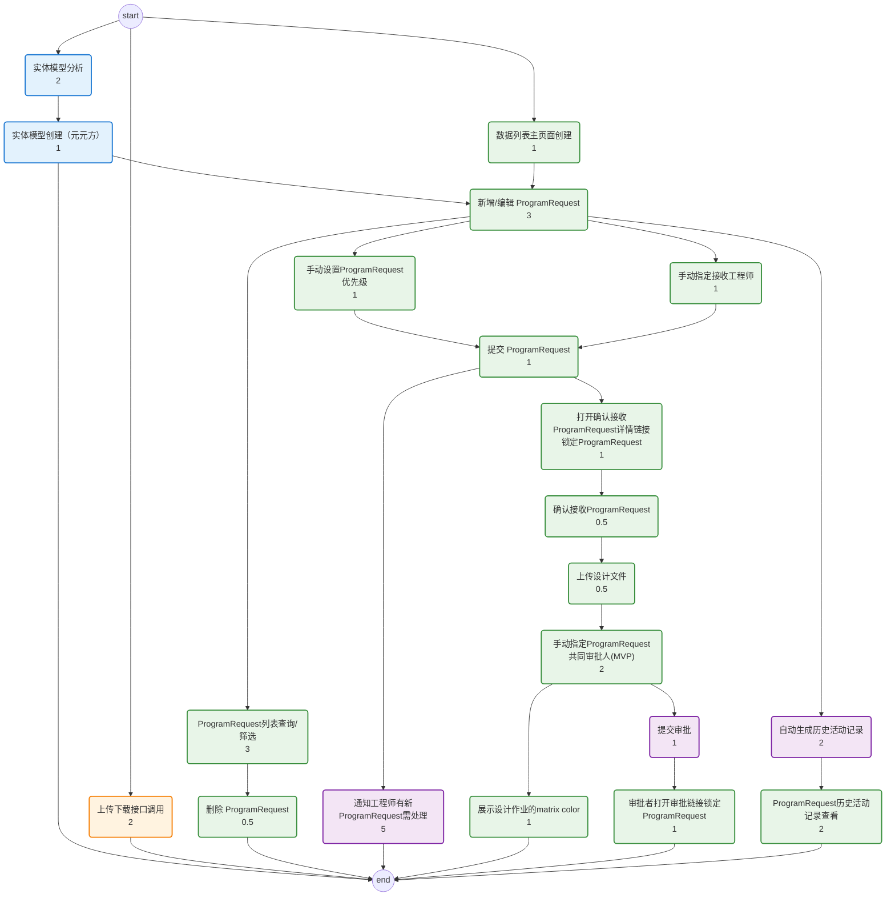

# 阶段一项目开发计划

```mermaid
flowchart TB

start(("start"))
eend(("end"))

t01("实体模型分析
2")
t02("实体模型创建（元元方）
1")

t03("数据列表主页面创建
1")
t04("ProgramRequest列表查询/筛选
3")
t06("新增/编辑 ProgramRequest
3")
t07("删除 ProgramRequest
0.5")
t08("手动设置ProgramRequest优先级
1")
t09("手动指定接收工程师
1")
t10("提交 ProgramRequest
1")
t15("打开确认接收ProgramRequest详情链接锁定ProgramRequest
1")
t17("确认接收ProgramRequest
0.5")
t19("上传设计文件
0.5")
t21("手动指定ProgramRequest共同审批人(MVP)
2")
t22("展示设计作业的matrix color
1")
t25("审批者打开审批链接锁定ProgramRequest
1")
t33("ProgramRequest历史活动记录查看
2")

t05("上传下载接口调用
2")

t14("通知工程师有新ProgramRequest需处理
5")
t32("自动生成历史活动记录
2")
t34("提交审批
1")

start --> t01
t01 --> t02

start --> t03
start --> t05

t02 --> t06
t03 --> t06

t06 --> t04
t06 --> t08
t06 --> t09
t06 --> t32

t04 --> t07

t08 --> t10
t09 --> t10

t10 --> t14
t10 --> t15

t15 --> t17

t17 --> t19

t19 --> t21

t21 --> t22
t21 --> t34

t34 --> t25

t32 --> t33

t02 --> eend
t05 --> eend
t07 --> eend
t14 --> eend
t22 --> eend
t25 --> eend
t33 --> eend

classDef dataModeling fill:#e3f2fd,stroke:#1976d2,stroke-width:2px
classDef webPage fill:#e8f5e8,stroke:#388e3c,stroke-width:2px
classDef sharePoint fill:#fff3e0,stroke:#f57c00,stroke-width:2px
classDef workflow fill:#f3e5f5,stroke:#7b1fa2,stroke-width:2px

class t01,t02 dataModeling
class t03,t04,t06,t07,t08,t09,t10,t15,t17,t19,t21,t22,t25,t33 webPage
class t05 sharePoint
class t14,t32,t34 workflow
```
