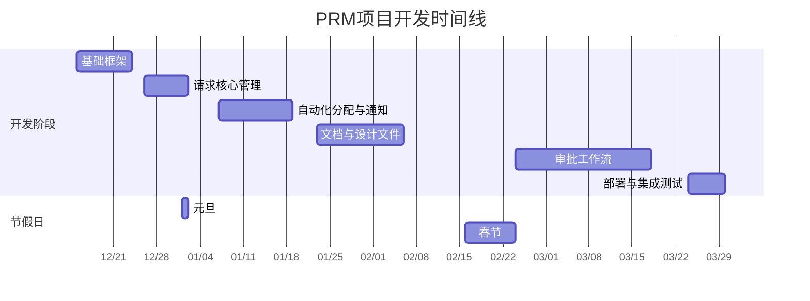

### **PRM项目开发计划**

| 功能分类                | 任务序列 (中文-英文-#任务号)                                 | 预估工时 |   所需工作日   |    计划起止日期 (工作日)     |
| :---------------------- | :----------------------------------------------------------- | :------: | :------------: | :--------------------------: |
| **1. 基础框架**         | 1.1 实体模型分析（entityModelAnalysis #458）  1.2 实体模型创建（entityModelCreation #459）  1.3 数据列表主页（dataListMainPage #460）  1.4 程序请求列表查询（programRequestListQuery #461）  1.5 上传下载集成（uploadDownloadIntegration #462） |  **72**  |     **9**      | **2025-12-15 至 2025-12-25** |
| **2. 请求核心管理**     | 2.1 创建/编辑程序请求（createEditProgramRequest #463）  2.2 删除程序请求（deleteProgramRequest #464）  2.3 手动优先级设置（manualPrioritySetting #465）  2.4 手动工程师分配（manualEngineerAssignment #466）  2.5 提交程序请求（submitProgramRequest #467） |  **52**  |     **7**      | **2025-12-26 至 2026-01-06** |
| **3. 自动化分配与通知** | 3.1 邮件解析自动化（emailParsingAutomation #468）  3.2 通知工程师新请求（notifyEngineersNewRequests #469）  3.3 自动确定优先级（autoDeterminePriority #471） 3.4 打开程序请求详情链接（openProgramRequestDetailsLink #472）  3.5 通知请求已被接受（notifyRequestAccepted #473）  3.6 确认接收程序请求（confirmReceiveProgramRequest #474） |  **92**  |     **12**     | **2026-01-07 至 2026-01-22** |
| **4. 文档与设计文件**   | 4.1 上传设计文件（uploadDesignFiles #475）  4.2 静态图表解析（staticDiagramParsing #477） 4.3 自动解析图表-单请求（autoParseDiagramSingleRequest #493）  4.4 自动解析图表-批量（autoParseDiagramBatchRequests #494） | **108**  |     **14**     | **2026-01-23 至 2026-02-12** |
| **5. 审批工作流**       | 5.1 分配通用审批人-MVP（assignCommonApproversMVP #478） 5.2 显示矩阵颜色（displayMatrixColor #479）  5.3 分配作业审批人（assignJobApprovers #480）  5.4 通知审批人（notifyApprovers #481）  5.5 打开审批链接（openApprovalLink #482）  5.6 通知审批已被接受（notifyApprovalAccepted #483）  5.7 自动生成活动历史（autoGenerateActivityHistory #484）  5.8 查看程序请求历史（viewProgramRequestHistory #485） 5.9 提交审批（submitForApproval #486）  5.10 确认审批通过（confirmApprovalPass #487）  5.11 通知审批通过（notifyApprovalPass #488）  5.12 通知审批拒绝（notifyApprovalReject #489）  5.13 更新程序请求状态（updateProgramRequestStatus #490）  5.14 审批状态通知（approvalStatusNotification #491）  5.15 返回设计工作流（returnToDesignWorkflow #492） | **176**  |     **22**     | **2026-02-24 至 2026-03-25** |
| **6. 部署与集成测试**   | 6.1 系统环境搭建部署  6.3 系统集成测试                  |  **40**  |     **5**      | **2026-03-24 至 2026-03-30** |
| **开发阶段总计**        |                                                              |          | **69个工作日** | **2025-12-15 至 2026-03-30** |

### **📅 项目时间线与关键节点**

