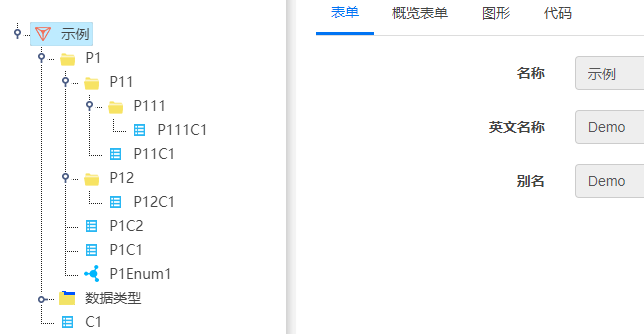
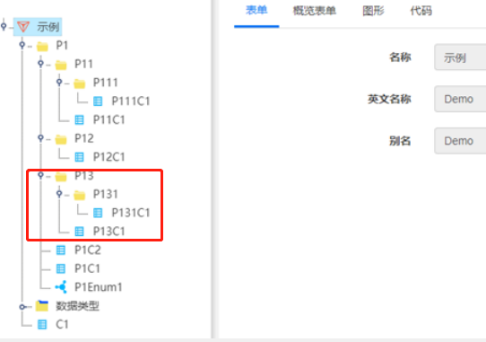
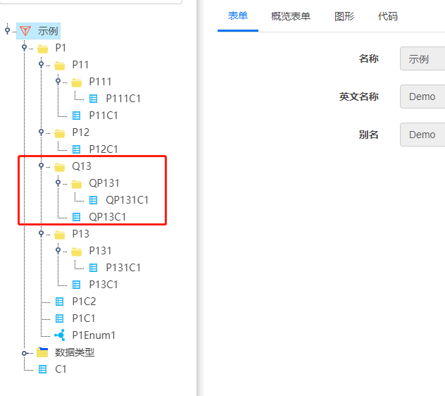
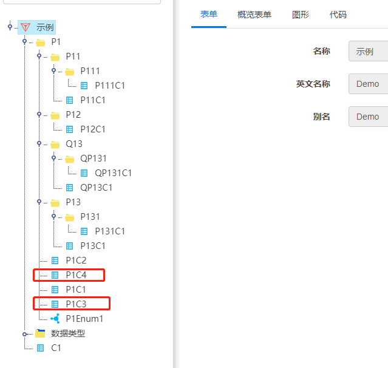

# 导入导出

## 导入导出

**注**：导入导出所有元素都是元素限定名，即包含命名空间。

### 导出

#### 模型示例



1. **模型导出**
   - 选中根节点，点击导出按钮，可以导出当前模型全部模型描述文件。

   **文档内容示例**：
   ```csharp
   Model Demo;

   Package Demo.P1;

   Package Demo.P1.P11;

   Package Demo.P1.P11.P111;

   class Demo.P1.P11.P111.P111C1
   {
   …
   }

   class Demo.P1.P11.P11C1
   {
   …
   }

   Package Demo.P1.P12;

   class Demo.P1.P12.P12C1
   {
   …
   }

   association Demo.P1.P12.ASSOP12C1P11C1
   {
   …
   }

   class Demo.P1.P1C1
   {
   …
   }

   class Demo.P1.P1C2
   {
   …
   }

   enum Demo.P1.P1Emum1
   {
   …
   }

   class Demo.C1
   {
   …
   }
   ```

2. **在CIM中选中一个包P1，点击导出按钮，可以导出当前包以下的全部模型描述文件**

   **文档内容示例**：
   ```csharp
   Package Demo.P1;

   Package Demo.P1.P11;

   Package Demo.P1.P11.P111;

   class Demo.P1.P11.P111.P111C1
   {
   …
   }

   class Demo.P1.P11.P11C1
   {
   …
   }

   Package Demo.P1.P12;

   class Demo.P1.P12.P12C1
   {
   …
   }

   class Demo.P1.P1C1
   {
   …
   }

   class Demo.P1.P1C2
   {
   …
   }

   enum Demo.P1.P1Emum1
   {
   …
   }
   ```

3. **在CIM中选中一个实体或枚举，点击导出按钮，当以导出当前实体的模型描述文件**

   - **选中实体P1C2, 文档内容示例**：
     ```csharp
     class Demo.P1.P1C2
     {
     …
     }
     ```

   - **选中枚举P1Emum1, 文档内容示例**：
     ```csharp
     enum Demo.P1.P1Emum1
     {
     …
     }
     ```

4. **导出的模型描述文件即时自动下载，同时保存在服务器端，包含生成的代码项目中**
   - 整个模型的描述文件是在转换时生成的。用户自己导出的文件则是自动下载，在代码模型中可以看到模型描述文件。

### 导入

1. **在CIM中选中一个包P1，点击导入按钮，上传一个包模型描述文件，该包被导入到选中的包中**

   **注意点**：导入时，根据第一个包的限定名以‘.’分隔，截取最后一个字符串作为当前导入包的内嵌的包的名字，无‘.’不用截取。

   - **导入文档内容示例1-当前模型包导入（应用较少）**：
     ```csharp
     Package Demo.P1.P13;

     Package Demo.P1.P13.P131;

     class Demo.P1.P13.P131.P131C1
     {
     …
     }

     class Demo.P1.P13.P13C1
     {
     …
     }
     ```

**导入结果**



   - **导入文档内容示例2-其他模型包导入（应用较多）**：
     ```csharp
     Package Sanjel.Q1.Q13;

     Package Sanjel.Q1.Q13.QP131;

     class Sanjel.Q1.Q13.QP131.QP131C1
     {
     …
     }

     class Sanje.Q1.Q13.QP13C1
     {
     …
     }
     ```



2. **在CIM中选中一个包P1，点击导入按钮，上传一个实体模型描述文件，该实体被导入到选中的包中**

   **导入文档内容示例**：
   ```csharp
   class Demo.P1.P1C3
   {
   …
   }

   class Demo.P1.P1C4
   {
   …
   }
   ```



3. **如果要覆盖，就是删除旧的实体或包，在当前包内重新导入**
   - 此操作会引起转换记录的丢失，从而引起目标模型中相关设置的丢失，当前转换记录是根据元素的id记录的，操作顺序改为导入时选择覆盖可避免原有元素记录丢失，但仅保证原有元素没有变更下的元素的转换记录的保持。
