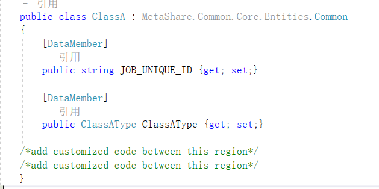

# CommonCore接口说明

## 例如：实体如下图



### CommonDao <T>

#### 方法1：`SelectBy(IContext context, T item, IList<string> byColumnNames)`
```csharp
List<T> SelectBy(IContext context, T item, IList<string> byColumnNames);
```

**示例代码**：
```csharp
List<ClassA> classAs = this.Dao.SelectBy(context, new ClassA { JOB_UNIQUE_ID = jobUniqueId }, new List<string> { "JOB_UNIQUE_ID" });
```

#### 方法2：`SelectBy(IContext context, T item, IList<string> byColumnNames)`
```csharp
List<T> SelectBy(IContext context, T item, IList<string> byColumnNames);
```

**示例代码**：
```csharp
List<ClassA> items = this.SelectBy(pager, new ClassA { ClassAType = new MyTest2.Entities.ClassAType{ Id = classATypeId } }, new List<string> { "ClassATypeId" });
```

#### 方法3：`SelectBy(IContext context, Expression<Func<T, bool>> expression)`
```csharp
List<T> SelectBy(IContext context, Expression<Func<T, bool>> expression);
```

**示例代码**：
```csharp
List<ClassA> classAs1 = this.Dao.SelectBy(context, classA => classA.Name == "classA1");
List<ClassA> classAs2 = this.Dao.SelectBy(context, classA => classA.Name.Contains("classA1"));
List<ClassA> classAs3 = this.Dao.SelectBy(context, classA => classA.ClassAType.Id == 1);
```

#### 方法4：`SelectBy(IContext context, Expression expression)`
```csharp
List<T> SelectBy(IContext context, Expression expression);
```
