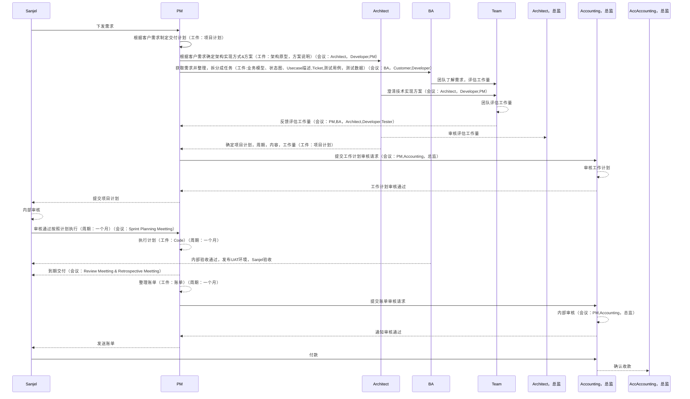
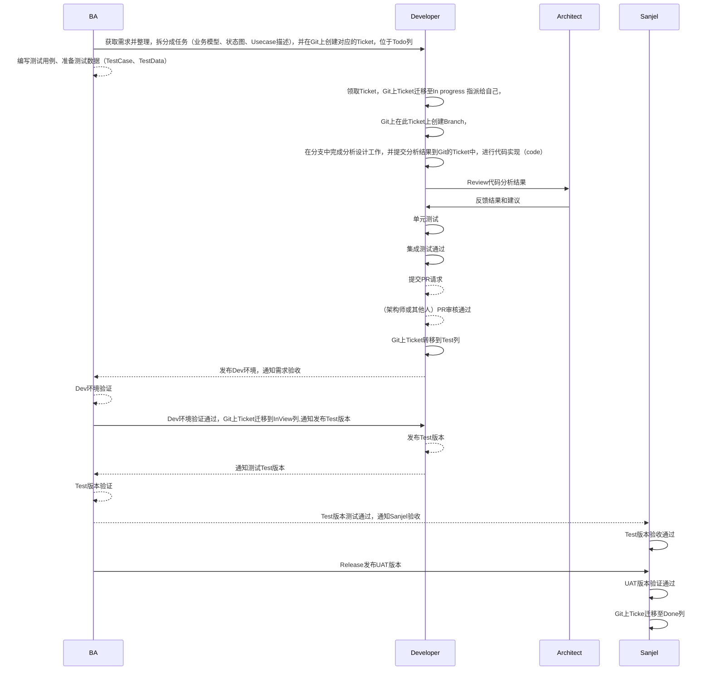
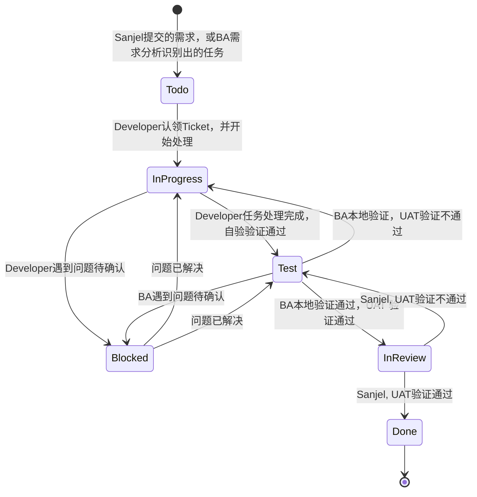

# 项目流程（Project Process）

项目Sprint周期：1个月。

1. Sanjel下发需求
2. PM of  MetaShare根据客户需求制定交付计划（工件：项目计划）
   1. 工作量评估
      1. Architect :根据客户需求确定架构实现方式&方案（工件：架构原型，方案说明）（会议：Architect，Developer,PM）
      2. BA :获取需求并整理，拆分成任务（工件:业务模型、状态图、Usecase描述,Ticket,测试用例，测试数据）（会议：BA，Customer,Developer）
      3. Team  :团队了解需求，评估工作量
      4. Architect->>Team :澄清技术实现方案（会议：Architect，Developer,PM）
      5. Team  :团队评估工作量
      6.  团队反馈:反馈评估工作量（会议：PM,BA，Architect,Developer,Tester）
      7. Architect，总监 :审核评估工作量
      8. PM :确定项目计划，周期，内容，工作量（工件：项目计划）
   2. PM向Accounting，总监 :提交工作计划审核请求（会议：PM,Accounting，总监）
   3. Accounting，总监 :审核工作计划
      1. Accounting，总监 :工作计划审核通过
3. PM向 Sanjel 提交项目计划
4. Sanjel内部审核
5. Sanjel通过项目计划 ，PM按照计划执行（周期：一个月）（会议：Sprint Planning Meetting）
   1. PM执行计划（工件：Code）（周期：一个月）
   2. BA :内部验收通过，发布UAT环境，Sanjel验收
   3. PM:到期交付（会议：Review Meetting & Retrospective Meetting）
6. PM-->> PM :整理账单（工件：账单）（周期：一个月）
   1. PM->> Accounting，总监:提交账单审核请求
   2. Accounting，总监-->> Accounting，总监:内部审核（会议：PM,Accounting，总监）
   3. Accounting，总监-->> PM:通知审核通过
7. PM :发送账单给Sanjel 
8.  Sanjel:付款
9.  Accounting:确认收款

# 任务开发流程（Ticket Developer Process）

1. BA获取需求并整理，拆分成任务（业务模型、状态图、Usecase描述），并在Git上创建对应的Ticket，位于Todo列
2. BA-->>BA  :编写测试用例、准备测试数据（TestCase、TestData）
3. Developer:领取Ticket，Git上Ticket迁移至In progress 指派给自己，
   1. Developer :Git上在此Ticket上创建Branch，
   2. Developer :在分支中完成分析设计工作，并提交分析结果到Git的Ticket中，进行代码实现（code）
   3. Architect :Review代码分析结果
   4. Architect- :反馈结果和建议
   5. Developer :单元测试
   6. Developer :集成测试通过
   7. Developer :提交PR请求
   8. Developer:（架构师或其他人）PR审核通过
4. Developer :Git上Ticket转移到Test列
   1. Developer-->> BA :发布Dev环境，通知需求验收
   2. BA-->> BA :Dev环境验证
   3. BA->> Developer :Dev环境验证通过，Git上Ticket迁移到InView列,通知发布Test版本
   4. Developer-->> Developer :发布Test版本
   5. Developer-->> BA :通知测试Test版本
   6. BA-->> BA :Test版本验证
5. BA :Test版本测试通过，通知Sanjel验收
6. Sanjel :Test版本验收通过
7. BA :Release发布UAT版本
8. Sanjel :UAT版本验证通过
   1. Sanjel :Git上Ticke迁移至Done列

# 任务状态迁移(Ticket State Diagram)

## 状态说明(Status Declaration)

- No Status: 任务来源

  - 1、 Raw Requirement 从用户处采集到的原始需求，它不限于形式，由业务分析员采用最适用于用户的沟通方式和表述方式，获取到用户对业务愿景、场景、期望、想法的描述。如用户故事、用例、图示、思维导图、界面原型，等各种方式。
    2、Change Request，根据对原始需求的分析，分解用户期望目标，预估实现目标的最大系统边界，定义系统改变要求。
  - 3、Bug：
    - 开发周期内，如果是当前开发的功能测试不通过，直接打回In Progress，把存在的问题写在回帖中，让开发员去修改，不需要重写测试步骤
    - 如果测试中发现的是其他问题，需要写重现步骤，在有文档的情况下，需要与原需求文档进行链接，如果是需求变化了，要补充需求变更文档。这时创建新的Bug，发回给Customer进行Inview，确认是bug后，再发回到ToDo，确认优先级，安排修复。 
  - 4、BA经过对需求的分析，通过设计，形成的一系列工作目标，每个工作目标应该只局限于一个系统或子系统或组件或模块的系统边界内。如有必要，可以根据实际需要形成层次结构。一个需求所产生的backlog的集合逻辑上与需求是等价的，并可以相互验证。
  - BA获取到新的需求活任务后记录在此。
- To do：通过在Backlog基础上的在系统边界内的进一步分析和设计，可以形成程序员可执行的任务，任务的粒度应控制在单个子系统环境可测试的规模，测试要求能够自动化运行。可用于开发人员的开发工作。
- In Progress:进行中的任务，领取任务后责任人修改为自己，完成对应的单元测试、集成测试后任务迁移到Test，并更新责任人为BA。Test失败，Review失败，迁移到此状态，并更新责任人为BA.
- Blocked：In Progress、Test中的任务进行时被其他团队成员的进度所影响而无法进行的工作迁移到此状态。
- Test. 根据Backlog中的目标定义，形成可操作的目标检测流程。通过Test Case的设计，可以对应设计数据结构、交互界面进行验证，任务或功能测试不通过迁移到Failed，如发现新的BUG，新增一个BUG到Ready列，并明确注明于此相关的需求或任务，并更新责任人为开发负责人。
- InReview：客户进行功能验收，验证通过迁移到Done，任务结束。

## 任务链接

任务需要细分成多个子任务时，在子任务中增加父任务链接，父任务中增加子任务链接，可相互查看。

新增BUG中增加对应的任务或需求链接，并在需求或任务中增加BUG链接，可相互查看。

Blocked：任务中增加影响当前任务进行的任务链接，可查看由什么任务影响导致阻塞。

# 角色和职责(Roles And  Responsibilities)

| 角色            | 职责                                                         | 工件                                                         |
| --------------- | ------------------------------------------------------------ | ------------------------------------------------------------ |
| BA              | 与客户沟通获取原始需求,并进行分解、分析，进一步的细化并整理为可实现的任务。可制定个人工作计划，并独立完成本职工作。 | Use Case、用户故事、界面原型绘制，测试用例、测试数据的准备，系统功能验证，任务拆分Tikcet。 |
| Developer       | 根据业务分析、系统分析结果实现功能，并完成单元测试、集成测试，有自主分析能力，可以提出合理的建议和意见。 | 制定个人工作计划、实现功能代码，单元测试代码，集成测试代码，及时确认和修复缺陷 |
| Project Manager | 跟踪项目进度、控制项目成本，规范团队内部工作流程，           | 项目计划，账单                                               |
| Scrum Master    | 负责组织早会，协调项目组员之间的工作，帮助大家解决支撑类的工作问题。 | 工时记录                                                     |
| Architect       | 协助PM完成工作量评估，对于技术难点予以提供解决方案，并对团队的代码成果进行Review，确保代码符合架构要求，保证交付质量。 | 代码，架构原型                                               |

