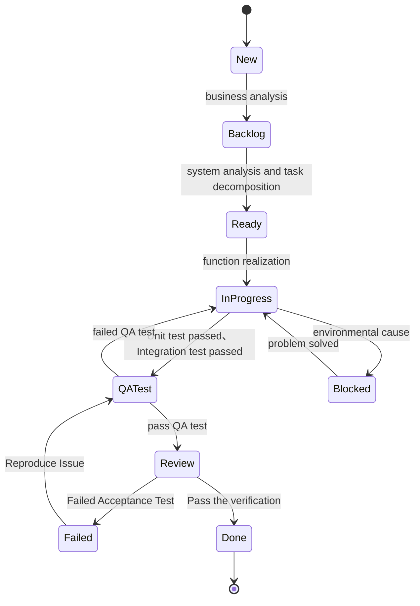
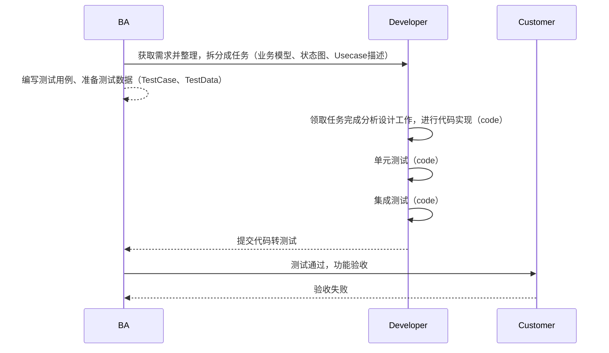

# 开发流程

## 状态说明

- New: 任务来源

  - 1、 Raw Requirement 从用户处采集到的原始需求，它不限于形式，由业务分析员采用最适用于用户的沟通方式和表述方式，获取到用户对业务愿景、场景、期望、想法的描述。如用户故事、用例、图示、思维导图、界面原型，等各种方式。
    2、Change Request，根据对原始需求的分析，分解用户期望目标，预估实现目标的最大系统边界，定义系统改变要求。

  - 3、Bug：

    - 开发周期内，如果是当前开发的功能测试不通过，直接打回In Progress，把存在的问题写在回帖中，让开发员去修改，不需要重写测试步骤
    - 如果测试中发现的是其他问题，需要写重现步骤，在有文档的情况下，需要与原需求文档进行链接，如果是需求变化了，要补充需求变更文档。这时创建新的Bug，发回给Customer进行Review，确认是bug后，再发回到New，确认优先级，安排修复。 
    
    BA获取到新的需求活任务后记录在此。
    

- Backlog，BA经过对需求的分析，通过设计，形成的一系列工作目标，每个工作目标应该只局限于一个系统或子系统或组件或模块的系统边界内。如有必要，可以根据实际需要形成层次结构。一个需求所产生的backlog的集合逻辑上与需求是等价的，并可以相互验证。
- Ready：通过在Backlog基础上的在系统边界内的进一步分析和设计，可以形成程序员可执行的任务，任务的粒度应控制在单个子系统环境可测试的规模，测试要求能够自动化运行。可用于开发人员的开发工作。
- In Progress:进行中的任务，领取任务后责任人修改为自己，完成对应的单元测试、集成测试后任务迁移到Test，并更新责任人为BA。
- Blocked：In Progress、Test中的任务进行时被其他团队成员的进度所影响而无法进行的工作迁移到此状态。
- QA Test. 根据Backlog中的目标定义，形成可操作的目标检测流程。通过Test Case的设计，可以对应设计数据结构、交互界面进行验证，任务或功能测试不通过迁移到Failed，如发现新的BUG，新增一个BUG到Ready列，并明确注明于此相关的需求或任务，并更新责任人为开发负责人。
- Failed：Test失败，Review失败，迁移到此状态，并更新责任人为BA.
- Review：客户进行功能验收，验证通过迁移到Done，任务结束。

## 任务链接

任务需要细分成多个子任务时，在子任务中增加父任务链接，父任务中增加子任务链接，可相互查看。

新增BUG中增加对应的任务或需求链接，并在需求或任务中增加BUG链接，可相互查看。

Blocked：任务中增加影响当前任务进行的任务链接，可查看由什么任务影响导致阻塞。

# 角色和职责

| 角色            | 职责                                                         | 工件                                                         |
| --------------- | ------------------------------------------------------------ | ------------------------------------------------------------ |
| BA              | 与客户沟通获取原始需求,并进行分解、分析，进一步的细化并整理为可实现的任务。可制定个人工作计划，并独立完成本职工作。 | UseCase、用户故事、界面原型绘制，测试用例、测试数据的准备，系统功能验证，任务拆分。 |
| Developer       | 根据业务分析、系统分析结果实现功能，并完成单元测试、集成测试，有自主分析能力，可以提出合理的建议和意见。 | 制定个人工作计划、实现功能代码，单元测试代码，集成测试代码，及时确认和修复缺陷 |
| Project Manager | 跟踪项目进度、控制项目成本，规范团队内部工作流程，           |                                                              |
| Scrum Master    | 负责组织早会，协调项目组员之间的工作，帮助大家解决支撑类的工作问题。 |                                                              |

