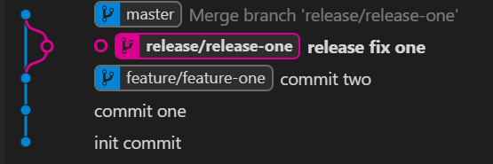
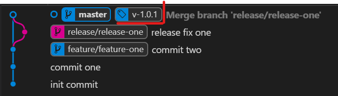

# Base Concepts of Gits -- Difference from Subversion

Everyone owns local repository and can be version controlled on local. Once the change is done, local repository can be updated from Github and push local change to Github.

# Git setup on Windows Desktop

## Install Git on local machine

<https://git-scm.com>

After Git installation, you are able to open a command line window by running "Git Bash".

### Configure Git on local machine

1.  Configure username

```bash
$ git config --global user.name "Adam Wang"
```

2.  Configure user's email

```bash
$ git config --global user.name "awang\@sanjel.com"
```

## Install favorite text editor on local machine

We use Notepad++ as example.

<https://notepad-plus-plus.org>

### Configure Notepad++ as default editor

1.  Right-click "This PC", and then click "Properties" to open the "System" window.

2.  Click "Advanced system settings" to open the "System Properties" window.

3.  Click "Environment Variables" to open the "Environment Variables" window.

4.  Click "Path" variable entry to highlight it within the "User variables for \[username\]" list.

5.  Click "Edit" button to open "Edit environment variable" window.

6.  Click "Browse" button to open "Browse For Folder" window.

7.  Locate the text editor installation folder. E.g. C:\\Program Files (x86)\\Notepad++. Then click "OK". The installation folder will be added in the environment variable list.

8.  Click "OK" on all opened windows to save the change.

9.  Test text editor. Type in "notepad++" in Git Bash command line, notepad++ app will be opened.

10. Specify Notepad++ as the editor for Git.
```bash
$ git config core.editor "notepad++ -multiInst -nosession"
```
# Set up a Git repository on local

1.  Create a folder as the home of your Git repositories. E.g. D:\\code.

```bash
$ cd /d/ 
$ mkdir code
```
2.  Get into "code" home folder
```bash
$ cd code
```
3.  Initialize a repository for your application. E.g. MyApp
```bash
$ git init MyApp
```
> A new folder "MyApp" is created under code folder, and a folder .git is created underneath which is local Git database.

4.  Get into "MyApp" folder. In comman line window the folder path will show as "/d/code/MyApp (master)". That means the folder is created as master branch as default.

5.  View the repository status.

```bash
$ git status
```
# Move existing code from SVN to a Git repository

1.  Export existing code files from SVN to local repository folder.

2.  Check Git repository status.
```bash
$ git status
```
> You will see the imported folders/files are listed under "Untracked files" in red color.

3.  Add imported folders/files to git repository to be tracked.

```bash
$ git add .
```
4.  View the repository status, all added files are displayed under "Changes to be committed:" in green color. That means the files are staged.

5.  Commit the changes to local repository.
```bash
$git commit -m "Import code from SVN"
```
6.  Check Git repository status.
```bash
$ git status
```
> You will see "Nothing to commit, working tree clean". That means all files are committed.

# Link local repository to GitHub repository

## Create Repository on GitHub

1.  Login into your organization account on GitHub, create a private repository named "MyApp".

2.  You may find some information for Git operation under "Code" tab page.

## Link Local Repository to GitHub Repository

1.  Link local repository to GitHub repository
```bash
$ git remote add origin https://github.com/Your-Company/MyApp.git
```
2.  Check remote links
```bash
$ git remote -v
```
> It will find remote references which show like following:

> > Origin https://github.com/Your-Company/MyApp.git (fetch)

> > Origin https://github.com/Your-Company/MyApp.git (push)

3.  Push local repository to GitHub repository
```bash
$ git push -u origin master
```
> Command line console will show the progress local code being pushed to GitGub.

# Working with GitHub Locally


## Git vs Subversion

Git maintains a local repository which allows user to commit changes to local. So, it is convenient to monitor changes and roll back changes before push to server.

When Git is working with GitHub copy, it is very similar with Subversion. Local repository needs to pull server copy to allow local changes merged with other changes committed to GitHub. Once the merge is done, the conflicts are solved, the local copy needs to be pushed to GitHub.

We can consider Git is two step Subversion operations. To take the advantage of this feature. We would encourage developers to make commitment to local more often, basically on task level.

Let's make some mapping between Git vs Subversion to help easy learning. But you have to pay attention that the concepts might not be exactly same.

### Git:Clone vs SVN: Checkout

They are very similar, both of commands are to download a copy of remote repository to local.

```bash
$ git clone https://github.com/Sanjel-Energy-Services/eServiceOnline.git /d/code
```

Other than using Git command line, you also can download code with GUI tools, e.g. Git Desktop, Visual Studio, etc. If you are experiencing network slowness and cannot finish the code downloading, you may download the Zip file from repository web page. Zip file is much smaller than source code files. After you download the full copy of code, other operation might be very light weight.


### Git: Pull vs SVN:Update

Before you commit your working copy to GitHub, you must merge the changes made by other people. Git will merge the changes automatically and mark the conflict if exists. The conflict is marked in the files. However, Git doesn't mark conflict files explicitly as Subversion does. It doesn't have separate files of original version, local version and merge version.


### Git: Push vs SVN: Commit

They are very similar.

#### Steps to commit local changes with Git

1.  Stage local changes
```bash
$ git add .
```
2.  Commit changes to local repository
```bash
$ git commit -m "Description of the change"
```
3.  Pull the change from GitGub
```bash
$ git pull
```
4.  Fix conflicts. Once you have pulled changes from GitHub, if there are conflicts generated in files, you may find them out with command line.
```bash
$git diff --name-only --diff-fliter=U
```
5.  Stage the changes. Remember, Git doesn't hold your change staging against the unsolved conflicts. Once the files are staged, you are not able to find them out by using command line in step 4.
```bash
$ git add .
```
6.  Commit changes to local repository
```bash
$ git commit -m "Description of the conflict fix"
```
7.  Push changes to GitHub
```bash
$ git push.
```
Tips: To find all unresolved conflicts under your folder, following command may be easier and reliable.
```bash
$ grep -r "\<\<\< HEAD" \*
```
### Git: clean/reset vs SVN: cleanup/revert

1.  Revert all changes in tracked files
```bash
$ git reset -- hard
```
2.  Remove new added untracked files
```bash
$ git clean -f -d
```

# Git Branching (based on GitFlow)

The idea behind Branching  is to have a  better release process, bug fixing and features as the code keep an organized history. Plus, the code history is more readable by the team members.

## Concepts:

### Branch

 A branch is used to encapsulate the code changes when you want to fix bugs, add new features or start a release process.

Common commands.

| Command  | Description  |
|---|:--|
|git branch| Lists all of the branches in the repository (the same as git branch --list). |
| git branch <branch> | Creates a new branch called <branch> but does not checks out the new branch. |
| git branch -d <branch> | Deletes a branch. If there are unmerged changes, Git does not allow you to delete it. |
| git branch -D <branch> | Forces delete the branch, even if there are unmerged changes. Execute this command when you are sure to delete it permanently. |
| git branch -m <branch> | Moves or renames the current branch to <branch>. |
| git branch -a | Lists all the remote branches. |


###Feature Branch
To work on some new features without interfering with the master branch. That is where feature branches come in. You can easily switch back and forth between branches so that you do not need to commit a big bunch of code. 

1. First, be sure to *pull* the last commits and create a new branch from the `master` branch
```bash
$ git checkout master
$ git fetch
$ git pull
```


2. Create and switch to  a new feature branch using the pattern <feature>/<Feature name>.
```bash
$ git checkout -b feature/feature-one
```
 

 

After working on the feature and commit changes and the code is **STABLE** the branch must be [merged](#-Merge) to the master branch and is recommended to delete the old (feature branch)


### Merge

The main use of git merge is to combine commits of two branches, To merge we follow these steps.

1. Firstly, show the condition of the working branch. It gives you a chance to see which changes have been arranged, which haven’t. 
```bash
$ git status
```

    

2. Switch to the receiving branch, in this case `master` branch

```bash
$   git checkout <receiving branch>
```

    

3. Fetch and pull latest commits from origin/master to update. 

   ```bash
   $ git fetch
   $ git pull
   ```

   

4. Execute the merge with the name of the branch to be merged into the `master` branch

   ```bash
   $ git merge <branch name> 
   ```

    

   After merging the graph shows the two branches with the last commit

    

   


### Release

The code in the **release branch** is deployed onto a suitable test environment, tested, and any problems are fixed directly in the release branch. This **deploy -> test -> fix -> redeploy -> retest** cycle continues until you’re happy that the release is good enough to release to production.

```bash
$ git checkout -b release/release-one
```

 


### Tag

Tags are references showing particular points in a git history.  
The function of tagging is to keep track of a version of the code in the  git history. Tags don’t change. After a tag is created, it has no history of commits.

1.- View tag list

```bash
$ git tag
```

```bash
$ git tag <name>
```


