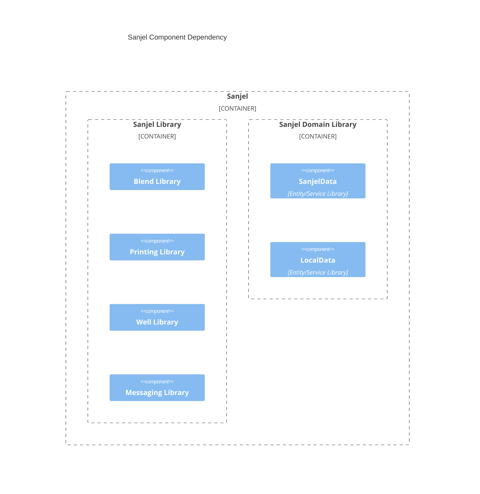

```mermaid
C4Component
    title Sanjel Component Dependency

	Container_Boundary(SNJ, "Sanjel") {
        Container_Boundary(SNJLib, "Sanjel Library") {
            Component(Blend, "Blend Library")
            Component(PRINT, "Printing Library")
            Component(WELL, "Well Library")
            Component(MSG, "Messaging Library")
	    }

    	Container_Boundary(SnjDM, "Sanjel Domain Library") {
        	Component(SanjelData, "SanjelData", "Entity/Service Library")
        	Component(LocalData, "LocalData", "Entity/Service Library")
    	}
    }
    

```

