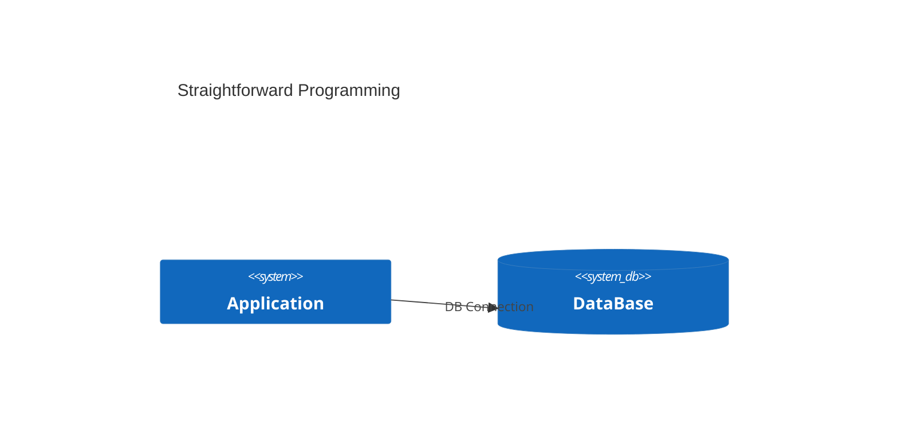
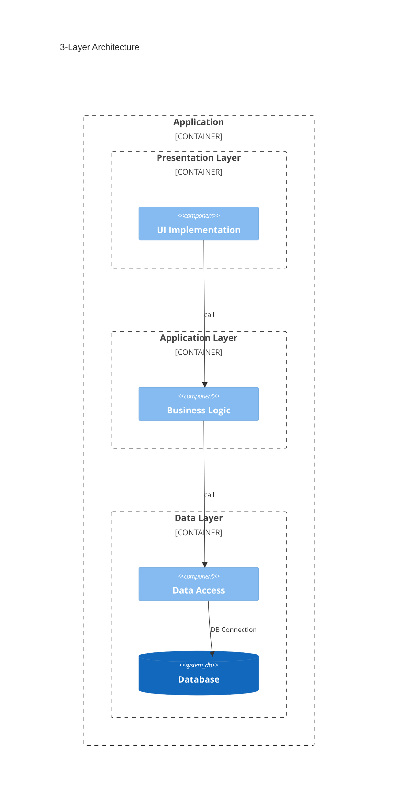
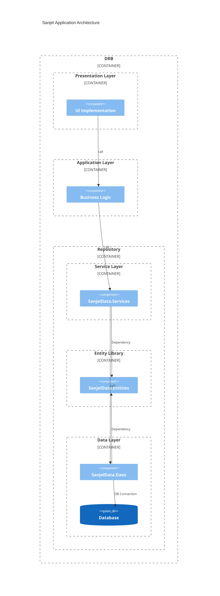

```mermaid
C4Context
      title Straightforward Programming
        	System(App, "Application")
        	SystemDb(DB, "DataBase")
	Rel(App, DB, "DB Connection")
      UpdateLayoutConfig($c4ShapeInRow="6", $c4BoundaryInRow="1")

```

```mermaid
C4Context
      title 3-Layer Architecture
      
        Container_Boundary(App, "Application") {
        Container_Boundary(PT, "Presentation Layer") {
        		Component(UII, "UI Implementation")
	        }
        Container_Boundary(AT, "Application Layer") {
        		Component(BL, "Business Logic")
	        }
        Container_Boundary(DT, "Data Layer") {
        		Component(DAO, "Data Access")
        SystemDb(DB, "Database")
	        }
        }
	Rel(UII, BL, "call")
	Rel(BL, DAO, "call")
	Rel(DAO, DB, "DB Connection")

      UpdateLayoutConfig($c4ShapeInRow="1", $c4BoundaryInRow="1")

```

```mermaid
C4Context
      title Sanjel Application Architecture
      
        Container_Boundary(App, "DRB") {
        Container_Boundary(PT, "Presentation Layer") {
        		Component(UII, "UI Implementation")
	        }
        Container_Boundary(AT, "Application Layer") {
        		Component(BL, "Business Logic")
	        }
        Container_Boundary(SRV, "Repository") {
            Container_Boundary(SR, "Service Layer") {
                    Component(SSS, "SanjelData.Services")
            	}
            Container_Boundary(ETT, "Entity Library") {
                    Component(Entity, "SanjelData.Entities")
            	}
            Container_Boundary(DT, "Data Layer") {
                    Component(SDAO, "SanjelData.Daos")
            SystemDb(DB, "Database")
            	}
	        }
        }
	Rel(UII, BL, "call")
	Rel(BL, SSS, "call")
	Rel(SSS, SDAO, "call")
	Rel(SSS, Entity, "Dependency")
	Rel(SDAO, Entity, "Dependency")
	Rel(SDAO, DB, "DB Connection")

      UpdateLayoutConfig($c4ShapeInRow="6", $c4BoundaryInRow="1")

```

