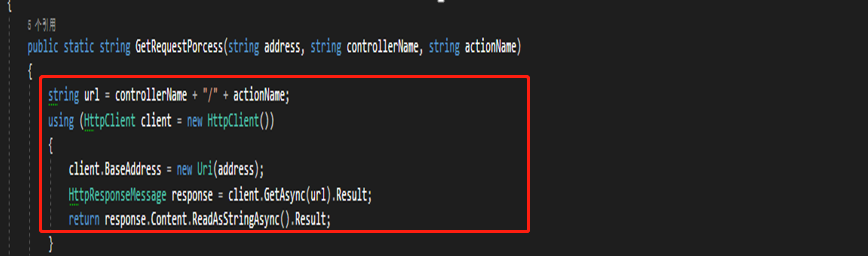
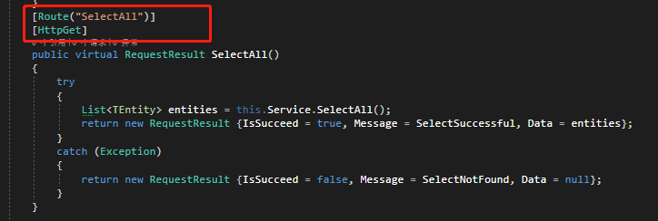
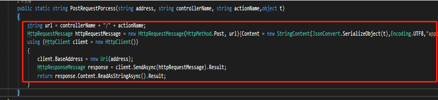
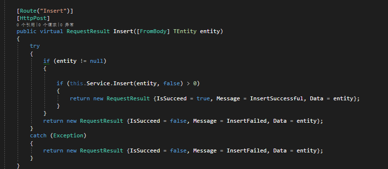

# Eservice API操作文档

Eservice API操作文档

Eservice API操作文档

©MetaShare Inc.

12/5/2018

如果使用Eservice API

## 修订记录

| 日期       | 修改人   | 修改说明   |
|------------|----------|-----------|
| 2018-12-05 | 季少龙   | 初稿       |

## 目录

1. [引言](#引言)
   - [目的](#目的)
   - [背景](#背景)

## 引言

### 目的

方便项目与项目之间的服务调用。

### 背景

1.2.1 主要的调用方式分为两种方式：Get请求和Post请求。

### Get请求

（一）Get请求如下图去请求API

**Get API的定义**

例如：`SelectAll`方法，定义的时候需要定义方法为Get方法，并且设置路由为`SelectAll`，这样前台调用如上图那样，修改`actionName`为`SelectAll`。

### Post请求

（二）Post请求

需要注意的是`httpRequestMessage`中需要传入`content`对象，也就是你需要操作的对象，这里需要把对象序列化成Json，通过`httpRequestMessage`中发送过去。

**Post API的定义**

例如：`Insert`方法，定义的时候需要定义方法为Post方法，并且设置路由为`Insert`，这样前台调用如上图那样，修改`actionName`为`Insert`，并且需要如上图那样使用`httpRequestMessage`将`insert`对象序列化为json放到`httpRequestMessage`中的`content`。

目前并没有遵循restful设计风格。只是单纯的webapi形式去调用，目前还没有`httpPut`、`httpDelete`等等，如果后续加入，会继续更新文档。
