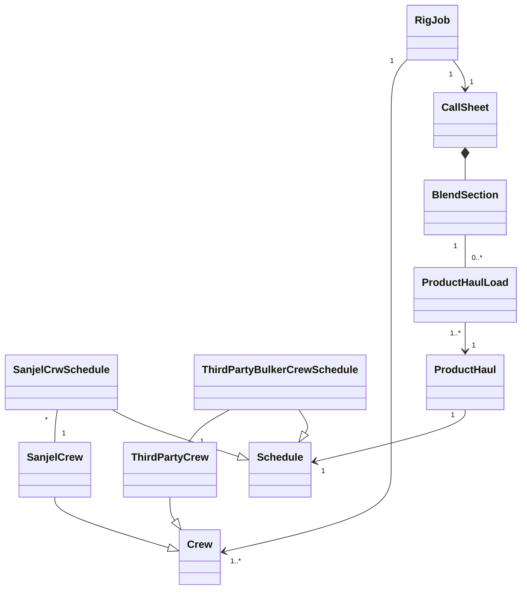

# Online - Rig Job Data structure and version explanation 

## Version Management Mechanism

In SanjelData database, we use version control to implement transaction history.

- Id and system_id

  Id is the unique identifier for an entity record,  e.g. a rig has one id. System_id is the unique identifier for a database record, e.g. a rig may have multiple database records due the status changes in the past, they have same id and different system_id.

- Effective record 

  - Effective_end_datetime is the maximum date time, which is '9999-12-31 23:59:59.0000000'
  - For one active entity, there is only one effective record. When a update operation happens against an entity record, the effective_end_datetime of latest database record will be updated to current timestamp, and a new database record will be created with maximum date time. So if you select database record of an entity by id, you will get a chain of database record which perfectly linked up by timestamp shows the life history of the entity.

- Entity_status

  -  0 is active

  - 1 is inactive

     A record entity_status can be inactive only when the record is deleted which caused by deletion action from user end. So normally we don't have to look at this status if not necessary. However it is a shortcut to disable a record to remove error record from surface.

- Version evolution

  - Version 1, when a record is created, its version
  - When an update action is executed on a 

  

## Rig

### Status

​	1 - Active

​	2 - DownForMaintenance

​	3 - DownForHoldingEquipment

​	4 - DownForWeather

​	5 - DownForNewLeaseOrLicenses

​	6 - Deactivated

- Rig can be switched to any status to another, always the last record is effective.

## Rig Job

Rig Job presents 3 types of jobs.

- Rig management job. If dispatch changes a rig status, a new rig job will be created as the transaction record  which Job Life Status is 0
- Job Alert job. If dispatch creates a job alert, a new rig job will be created which Job Life Status as 1
- Operation job. If dispatch creates a call sheet to start the operation job work flow, a rig job will be created and the status can be switched among 2 - 8 according to the operation.

### Status

​	2 - Pending

​	3 - Confirmed

​	4 - Scheduled

​	5 - Dispatched

​	6 - Canceled

​	7 - In Progress

​	8 - Completed

​	9 - Deleted

### State Machine 

### What is IsListed?

Since rig job is for scheduling jobs on a rig, there may be multiple effective jobs scheduled on a rig at a moment. Normally dispatch only needs to know which the most recent upcoming job, so we display one rig job per rig on RigBoard to save space. And also, if the Rig is down, it will show latest job information with  Pink color background as a listed job.

If there are multiple jobs at a time, there future jobs will be hidden. Use the "Future Job" checkbox can display them on the board. 

## Product Haul

### Product Haul Status

- 1 - Pending

- 2 - Scheduled
- 3 - InProgress
- 4 - OnLocation 

Product Haul Load Status

- 1 - Scheduled
- 2 - OnLocation