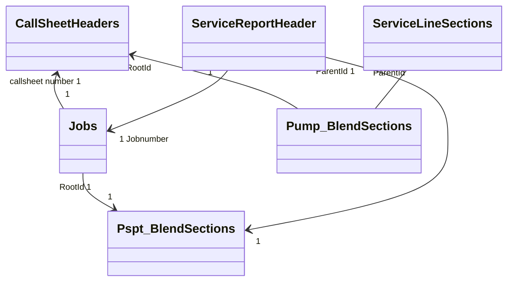
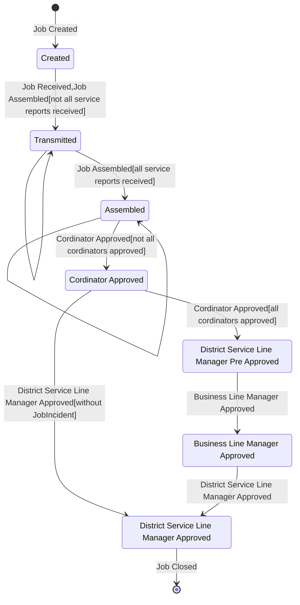

# Domain Model

```mermaid
classDiagram
class Jobs
class CallSheetHeaders
class ServiceLineSections
class Pump_BlendSections
class Pspt_BlendSections
class ServiceReportHeader

CallSheetHeaders"callsheet number 1"<--"1" Jobs
CallSheetHeaders "RootId"<-- Pump_BlendSections
ServiceLineSections "ParentId"-- Pump_BlendSections
Jobs "RootId 1" -->"1"Pspt_BlendSections
ServiceReportHeader "1" -->"1 Jobnumber"Jobs
ServiceReportHeader "ParentId 1" -->"1"Pspt_BlendSections


```

# Work Flow

```mermaid
stateDiagram
s1:Created
s2:Transmitted
s3:Assembled
s4:Cordinator Approved
s5:District Service Line Manager Pre Approved
s6:District Service Line Manager Approved
s7:Business Line Manager Approved
[*]-->s1:Job Created
s1-->s2:Job Received,Job Assembled[not all service reports received]
s2-->s2
s2-->s3:Job Assembled[all service reports received]
s3-->s3
s3-->s4:Cordinator Approved[not all cordinators approved]
s4-->s5:Cordinator Approved[all cordinators approved]
s4-->s6:District Service Line Manager Approved[without JobIncident]
s5-->s7:Business Line Manager Approved
s7-->s6:District Service Line Manager Approved
s6-->[*]:Job Closed
```

# Process View

## 

