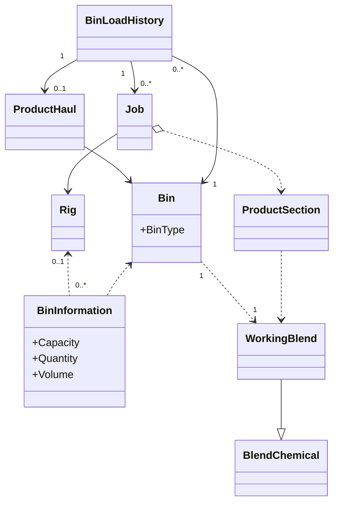
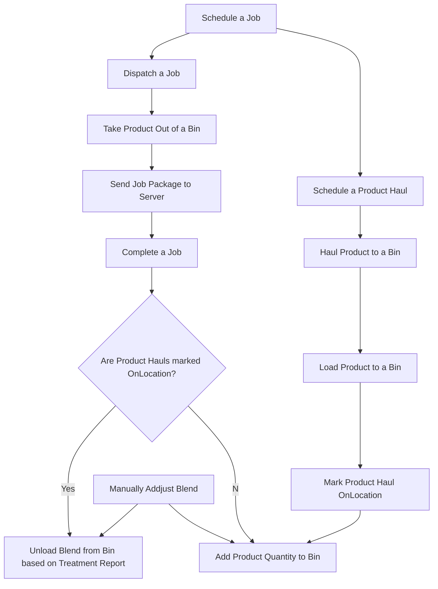

# Bin Management

## Current issue

- Bin Capacity unit of measure should be Cubic Meters, this should be in master data.
- Product Haul on location is not updating Bin
- Blend bulk density calculation has not completed yet.  

- 

## Model

### Workflow

### Acceptance Criteria

- Bin tracking list needs to be maintained to show the history of blend loading/unloading and remains
  - When a product is on location, blend is loaded to the bin, add up to remains. Product haul and unit number/driver name need to be referenced.
  - When a job is done, blend is unloaded from bin which reference treatment report pumping history.
  - When a dispatcher adjusts the blend and remains of a bin, dispatcher name needs to captured, a notes must be entered.
- Blend is unique determined by base blend plus additives. Blend description must be exactly same to prevent similar but not exact same blend being loaded to the same bin.
- Bin content information needs to be shown on the RigBoard notes section, attached to manual notes. In the form of "PT1910: 10t  SurfaceMIX + Adds" format. When mouse pointer hovers over the notes, tooltips show blend detail description other than "+ Adds" abbreviate format. 

### Calculation

Tonnage = Pumped Volume * Density / ( 1 + Mix Water)

### Notes

In current design, we use blend description to differentiate working blend in operation, so we can avoid to create a new entity if not necessary. However, some key properties of working blend won't be carried over to bin information, eg. Mix Water, Density, Bulk Density, et. We need to review this and introduce new entity if necessary.

### Use Case

- Product Haul On Location

- Update Blend in Bin
  - It is hard to ask user to enter blend description in proper format, the workaround is to update blend name only, and leave blend description as null. If next time, product haul on location can match the name but the description in bin information is null,  backfill blend description from product haul.
  - When job package is transferred to server, bin amount will be updated automatically based on tonnage in bin information from field.
- View Bin load/unload history

### To Be Determined

- Talked to Chris Chubey and T'ien, we may add a new field to eService "Sanjel Storage Equipment", named "Tonnage Transferred". Make this mandatory for field supervisor, so we may calculate amount of the cement in the bin accurately. This will satisfy the scenario which cement transferred between bins or back to bulk plant.

