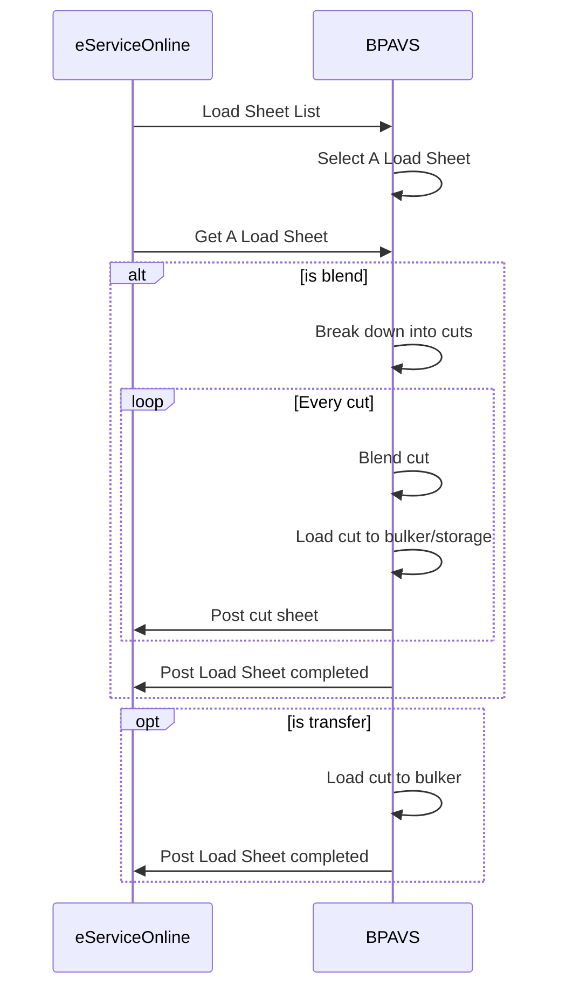
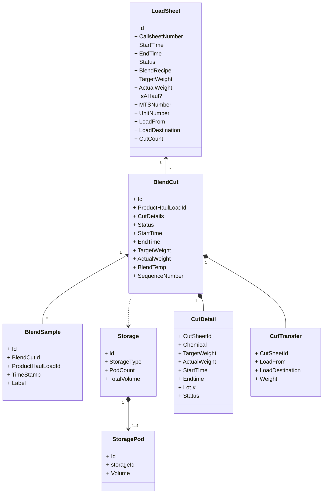

### Design Highlights

- Capture all timestamps per actions
- Data post on cut level.  Can be on chemical level if needed.
- MTS only generated on transfer to bulker/B-Train for a haul.
- MTS will be saved on server to be accessed across all system if needed.
- Load sheet also covers blend transfer request.
- Future movement journal integration with AX

### Design Details

#### Cut Status

