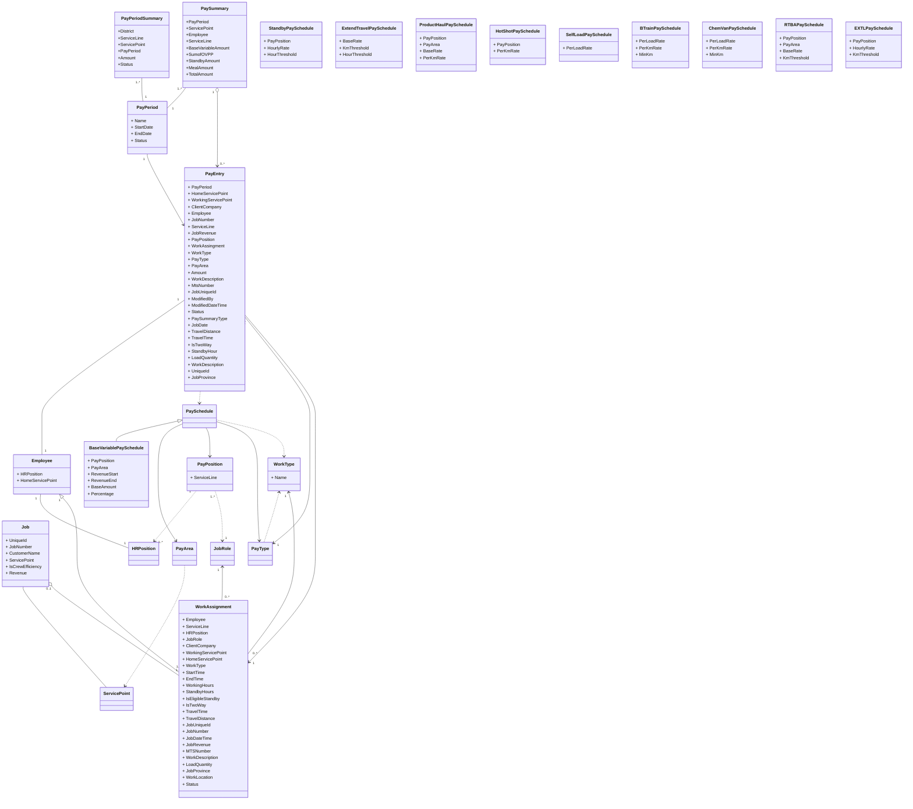

## SharePoint List

- All entities in the domain model have database tables.

- Reference data can be transferred to SharePoint lists. 

- All generated variable pay data in SharePoint list will be transferred to database.

- In SharePoint list, the master data may be referenced by Name in the form of text only, it must be copied from master list without any modification.

   

## Data Dictionary

### PayPeriod

| Name                    | Start Date | End Date   | Pay Date   | Due Date   |
| ----------------------- | ---------- | ---------- | ---------- | ---------- |
| 02/07/2021 - 02/20/2021 | 02/07/2021 | 02/20/2021 | 03/12/2021 | 03/02/2021 |

#### PayPeriod Name naming convention

- Regular Pay Period Name:     [Start Date(MM/DD/YYYY)] - [End Date(MM/DD/YYYY)] 

  Example: 10/18/2020 – 10/31/2020

  This is for the pay period set up across company. 

- Extra Pay Period Name:     [Start Date(MM/DD/YYYY)] - [End Date(MM/DD/YYYY)] _\[District Abbreviation\][Sequence Number]

  Example: 10/18/2020 – 10/31/2020_GP1

  This is for the pay period set up on demand to handle pay entries after regular pay period is cut off. E.g. Terminated Employee, etc.

 In reference data there is data for naming 1, the Regular Pay Period Name.  Naming 2 is created on demand manually. We will need to discuss the process to create it.

### PayrollStatus

| Name            | Value |
| --------------- | ----- |
| Open            | 1     |
| CutOff          | 2    |
| Pending | 4     |
| Approved        | 8     |
| Closed          | 16     |

### Pay Types, Pay Summary Type and Payroll Mapping
| Type | Service Line | Pay Summary Type | ADP Description | Earning Code |
|--|--|--|--|--|
| Base Variable Pay | Primary Cementing | Variable Pay | HOS PRIM | 19 |
| Crew Efficiency Bonus | Primary Cementing | OVPP | OVPP | 66 |
| Extended Travel | Primary Cementing | OVPP | OVPP | 66 |
| Hot Shot | Primary Cementing | OVPP | OVPP | 66 |
| Product Haul | Primary Cementing | OVPP | OVPP | 66 |
| B-Train | Primary Cementing | OVPP | OVPP | 66 |
| Chemical Van | Primary Cementing | OVPP | OVPP | 66 |
| Self-Load | Primary Cementing | OVPP | OVPP | 66 |
| Standby | Primary Cementing | Standby/Ext | Standby | 68 |
| MealAllowance |  | MealAllowance | MealAllowance | 69 |
| RTBA | Remedial Cementing | OVPP | RTBA | 23 |
| Extend Location Premium | Remedial Cementing | Standby/Ext | EXTLPrem | 12 |
| Base Variable Pay | Remedial Cementing | Variable Pay | HOS REM | 37 |

## Base Variable Pay 

#### Base Variable Pay Schedule example

| Id   | Area | Position     | Revenue Start | Revenue End | Base Amount | Percentage Rate |
| ---- | ---- | ------------ | ------------- | ----------- | ----------- | --------------- |
| 1    | W    | Supervisor 4 | $0            | $10,001     | $320        | 0               |
| 2    | W    | Supervisor 4 | $10,001       | $20,001     | $370        | 0               |
| 3    | W    | Supervisor 4 | $20,001       | $1,000,001  | $370        | 0               |
| 4    | W    | Supervisor 4 | $20,001       | $1,000,001  | 0           | 0.00465         |

#### Calculation Formula

1.  Look for base variable pay schedules by job revenue, pay area and pay position.
2.  Base Amount rule, get fixed base amount directly.
3.  Percentage Rate rule, job revenue deducts revenue start amount, times percentage rate.
4. Sum up both values.

#### Example:

An employee with Supervisor 4 position worked on a job which made revenue $35,000 in West area.

1. Revenue falls in the range in rule 3 and 4.

2. According to rule 3, we can get base amount is $370

3. According to rule4, we use job revenue to deduct revenue start to get $15,000, then times percentage rate 0.00465 to get $69.75.

4. We will get total variable pay amount $439.75

   

## Crew Efficiency Bonus

| Id | PayAsPosition | PayRatio |
| ---- | ------- | ---------- |
| 1   | Operator 3 | 0.5      |

#### Crew Efficiency Bonus Calculation Formula 

1. If IsCrewEfficiency is true,  look up pay schedule to get PayAsPosition

2. Use PayAsPosition and Base Variable Pay calculation formula to get total pay amount, then multiply by PayRation to get bonus amount

   

## Extended Travel Bonus 

#### Extend Travel Pay Schedule Example

| Id | Base Rate | Km Threshold | Hour Threshold |
| ---- | ------- | ---------- | ---- |
| 1   | $84 | 600 | 7 |

#### Extend Travel Bonus Calculation Formula 

1. If IsTwoWay is false,  look up pay schedule by the conditions of Travel Distance > Km Threshold or Travel Time >Hour Threshold.

2. If schedule is found, Base Rate is the pay amount.
3. If schedule is not found, the pay amount is 0.

## Standby

#### Standby Pay Schedule Example

| Id   | Pay Position | Hourly Rate | Hour Threshold |
| ---- | ------------ | ----------- | -------------- |
| 1    | Supervisor 1 | $16         | 8              |
| 2    | Operator 1   | $15         | 8              |
| 3    | Support      | $14         | 8              |

#### Standby Pay Calculation Formula

1. If IsEligibleStandby is true, look up pay schedule by Pay Position.
2. If schedule found, multiply standby hours by Hourly Rate to get pay amount.

3. If schedule is not found, the pay amount is 0.

## B-Train Transport Bonus

#### B-Train Transport Pay Schedule Example

| Id   | Per Load Rate | Per Km Rate | Min Km |
| ---- | ------------- | ----------- | ------ |
| 1    | $70           | 0.25        | 300    |

#### B-Train Transport Pay Calculation Formula

1. Look up pay schedule.
2. If the schedule is found, multiply Per Load Rate by LoadQuantity to get the Off-Load amount;then if Travel Distance < Min km, then multiply Per Km Rate by Min Km else multiply Per Km Rate by Travel Distance 
3. Sum up two amounts to be the pay amount.

## Chemical Van Transport Bonus

#### B-Train Transport Pay Schedule Example

| Id   | Per Load Rate | Per Km Rate | Min Km |
| ---- | ------------- | ----------- | ------ |
| 1    | $20           | 0.25        | 300    |

#### B-Train Transport Pay Calculation Formula

1. Look up pay schedule.
2. If the schedule is found, multiply Per Load Rate by LoadQuantity to get the Off-Load amount; then if Travel Distance < Min km, then multiply Per Km Rate by Min Km else multiply Per Km Rate by Travel Distance 
3. Sum up two amounts to be the pay amount.

## Hot Shot Bonus

#### Hot Shot Pay Schedule Example

| Id   | Per Km Rate |
| ---- | ----------- |
| 1    | 0.25        |

#### Hot Shot Bonus Calculation Formula 

1. Look up pay schedule.
2. If the schedule is found, multiply Per Km Rate by Travel Distance to get the pay amount.

## Self-Load Bonus

#### Self-Load Pay Schedule Example

| Id   | Per Load Rate |
| ---- | ------------- |
| 1    | $40           |

#### Self-Load Pay Calculation Formula

1. Look up pay schedule.
2. If the schedule is found, multiply Per Load Rate by LoadQuantity to get the pay amount.

## Product Haul Pay

#### Product Haul Pay Schedule Example

| Id   | Area | Per Haul Rate | Per Km Rate |
| ---- | ---- | ------------- | ----------- |
| 1    | W    | $150          | 0.10        |

#### Product Haul Pay Calculation Formula

1. Look up pay schedule by Pay Area.
2. If the schedule is found, multiply Per Km Rate by Travel Distance, then get  Per Haul Rate 
3. Sum up two amounts to be the pay amount.

## Remedial Travel Bonus Adjustment (RTBA)

#### Remedial Travel Bonus Adjustment Pay Schedule Example

| Id   | Base Rate | Km Threshold |
| ---- | --------- | ------------ |
| 1    | $70       | 600          |

#### Remedial Travel Bonus Adjustment Calculation Formula 

1. If IsTwoWay is false,  look up pay schedule by the conditions of Travel Distance > Min Km.

2. If schedule is found, Base Rate is the pay amount.
3. If schedule is not found, the pay amount is 0.

## Extended Location Premium

#### Extended Location Premium Pay Schedule Example

| Id   | Pay Position        | Hourly Rate | Hour Threshold |
| ---- | ------------------- | ----------- | -------------- |
| 1    | Supervisor-Remedial | $46         | 11             |
| 2    | Operator-Remedial   | $35         | 11             |
| 3    | Support-Remedial    | $28         | 11             |

#### Extended Location Premium Calculation Formula

1. If IsEligibleStandby is true, Look up pay schedule by Pay Position.
2. If schedule found, multiply standby hours by Hourly Rate to get pay amount.

3. If schedule is not found, the pay amount is 0.

