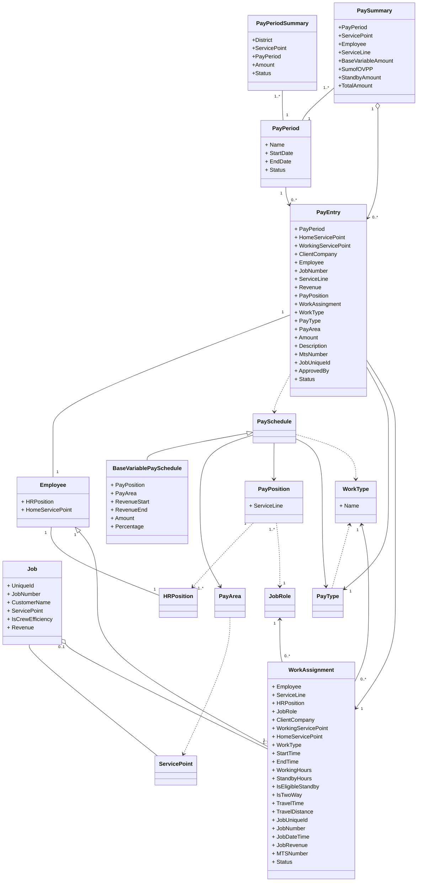

## SharePoint List

- All entities in the domain model have database tables.

- Reference data can be transferred to SharePoint lists. 

- All generated variable pay data in SharePoint list will be transferred to database.

   

## Data Dictionary

### WorkAssignmentStatus

| Name      | Value |
| --------- | ----- |
| Completed | 4     |
| Approved  | 8     |

### PayrollStatus

| Name            | Value |
| --------------- | ----- |
| Open            | 1     |
| PendingApproval | 2     |
| Approved        | 4     |
| Closed          | 8     |

## Base Variable Pay Calculation Formula

#### BaseVariablePaySchedule class structure

| Properties   |
| ------------ |
| PayPosition  |
| PayArea      |
| RevenueStart |
| RevenueEnd   |
| BaseAmount     |
| PercentageRate    |

#### Base Variable Pay Schedule example

|Id| Area | Position | Revenue Start | Revenue End | Base Amount | Percentage Rate |
| -- | ---- | ------------ | ------- | ---------- | ---- | ---- |
|1| W    | Supervisor 4 | $0      | $10,001    | $320 | 0 |
|2| W    | Supervisor 4 | $10,001 | $20,001    | $370 | 0 |
|3| W    | Supervisor 4 | $20,001 | $1,000,001 | $370 | 0 |
|4| W    | Supervisor 4 | $20,001 | $1,000,001 | 0 | 0.00465 |

#### Calculation Formula

1.  Look for base variable pay schedules by job revenue, pay area and pay position.
2.  Base Amount rule, get fixed base amount directly.
3.  Percentage Rate rule, job revenue deducts revenue start amount, times percentage rate.
4. Sum up both values.

#### Example:

An employee with Supervisor 4 position worked on a job which made revenue $35,000 in West area.

1. Revenue falls in the range in rule 3 and 4.
2. According to rule 3, we can get base amount is $370
3. According to rule4, we use job revenue to deduct revenue start to get $15,000, then times percentage rate 0.00465 to get $69.75.
4. We will get total variable pay amount $439.75

