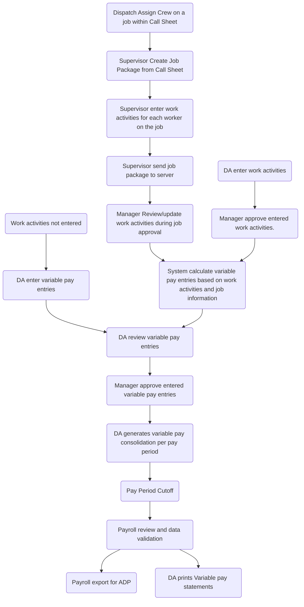
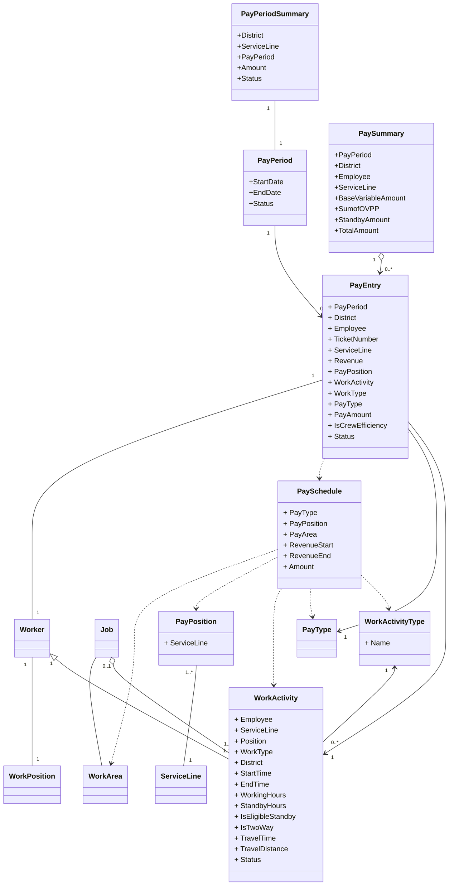

Problem solved in Variable Pay calculation

1. Eligibility
   1. position eligibility
   2. job eligibility

Scenarios

1. Normal Cementing Job.

Client calls for a cementing service. Dispatch assigns a crew to perform cementing service. Crew arrives camp. Supervisor exports call sheet and create job package.  Crew prepare equipment and products. Crew drives to well location. Crew arrives on location. Crew performs cementing service successfully. Supervisor enter job information in job package. Supervisor send job package information to server. Crew leaves location. Crew arrives camp. 

Shelly:

Supervisor not sure if the position correct is not.

Job transmitted, manager modify the bonus section details. 

DA make notes for product haul, or other factors needed for pay calculation. 

I need samples for one period variable pay include the marked bonus sheet. All printouts.

How many hours you spend on variable pay preparation? Can you break down to the pay types?

Final approval by manager exists.

When a product haul goes out, it is on call sheet. 

Only Hot shot not on the job.

James Willet:

Job package come to server. update job digitally. Bonus sheet update 

MBA - Misc Bonus Authorization

employee submit work log. paper or excel.

-- idea, employee time tracker app. Part function already existing in Journey management?

meal allowance sheet submitted.

data collected in eService not match current pay practice.

crew efficiency - write on bonus sheet.

stand-by, charge offset between charging client and actual happen in Sanjel.

on/off location will be entered accurately once we move to digital, we can force supervisor.

Further Questions.

Is bonus area determined by Job LSD or empolyee's district or job district?

Note

Today product haul is not prinited on bonus sheet, it goes through separate work flow which is handled manually.

Project Focus

1. Field data integrity and accuracy. Improve data entry efficiency at same time.

Jan 25, 2021 Feedback:

Supervisor doesn't know the pay level thing.

Susie: Some logic mapping

Exceptions: employee may get paid earlier the regular pay period, such like layoff situation.

Job approval may be delayed to leave the payment to later pay period.

Feb 18, 2021 Feedback.

Susie: Pay Area is determined by where the Job actually took place – well location. 

Feb 22, 2021 Susie - Pay position mapping

1. If     an supervisor’s position title is Supervisor 1, he is the supervisor on a     Primary Job, he will be paid Supervisor 1 variable pay. This is a direct     mapping,  it is straightforward.
2. If     an supervisor’s position title is Supervisor 1, he is the operator on a     Primary Job, he will be paid Operator 3 variable pay. All level     supervisors will be paid at Operator 3 if he is an operator, is it right? CORRECT
3. If     a supervisor’s position title is Supervisor 3, he is the support on a     Primary Job, he will be paid Support variable pay . All level supervisors     will be paid at Support if he is an operator, is it right? CORRECT – Support is one level of pay for Primary

 

For remedial jobs, the variable pay will be paid as the employee position on the job regardless his HR position level. CORRECT

 

Feb 24, 2021 Amy

We use the province to see where the job was worked vs where a person is assigned to.  

Feb 24, 2021 Susie

the 300 kms means the employee will be paid a minimum of 300 kms mileage even if he/she only drives , for example, 200 kms. If the employee driver more than 300 kms then the mileage is paid on the actual amount. We want to make sure the employee is paid a minimum amount for mileage when earning a transportation bonus. 

March 17, 2021 Shelly

If a bulk driver hauls the blend up the day before or that day and does not stay for the job, he will get a product haul.

If the bulk driver hauls up that day and stays for the job he will get a support on the variable pay. 

# Definitions

- Hours of Service,  A.K.A. Length of the time for the job: From On Location Time to Off Location Time.
- Variable Pay Area: Area the job is completed (east or west of the 5th meridian)
  - Question: Is it determined by Service Point or LSD?
- Variable Pay Position:  job position performed on job not the HR position held.
- Job Revenue: Approved ticket revenue.
- One way travel time: Crew travel from camp to well site location
- Two way travel time: The total time that the crew set out from camp and return to camp.
- One way travel distance: Crew travel from camp to well site location.
- Two way travel distance: The total distance that the crew set out from map and returned.
- Job Date: The date of crew is on location.
- Variable Pay Schedule: the rule set of the variable pay calculation to employee's work activities.

# Responsibilities

## Dispatch

- When dispatch schedule a job, crews must be assigned from Rig Board. The crew information will be populated in Call Sheet

## Supervisor
- Supervisor needs to toggle "Is Multi-Well job?"
- When supervisor creates a job package from a call sheet, all on site crew members will be populated in Work Activities section. These information are carried over from Call Sheet. Includes
  - Employee Name
  - Service Line
  - Job Position
  - Work Type (default as job type)
- Supervisor needs to fill in following before sending job package to server
  - Start Time (default as On Location Time)
  - End Time (default as Off Location Time)
  - Standby Hours
  - Two Way Travel Time
  - Two Way Travel Distance
  - Description (if applicable).

- Supervisor needs to add any work activities beyond job type itself. e.g. Self Load.

*** We have two solution for this,  in eService or eService Express.

## Manager

- Manager needs to approve billing information of job ticket.

- Manager needs to toggle if the job was completed or failed or incomplete?

- Manger needs to toggle if a job meets Crew Efficiency Bonus criteria.

- Manager needs to verify following items, update and approve each work activity related to a job.

  *** (We have two options, in eService Or Power Apps)

  -  Start/End Time, Length Time will be automatically calculated
  - Standby hours
  -  Job Position
  - Travel Distance
  - Travel Time
  - Toggle "Is Extended Travel?" based on Travel Distance and Travel Time
  - Description, adding notes if needed

- Manager can approve all work activities related to one single job at one time. Pay entry generation process will be triggered.

- Manager can approve individual work activity added by DA or modified by DA. Pay entry generation process will be triggered.

- Manager can approve DA entered pay entry or modified pay entry.

- Manager can approve Pay Summary.  

## District Admin

- DA can enter work activity based on submitted evidence, the manager approval process will be triggered.
- DA can modify approved but not paid work activity, the manager approval process will be triggered.
- DA can review pay entry and modify pay entry if system calculation is not correct. Manager approval process will be triggered.
- DA can enter pay entry for system not supported pay type upon evidence. Manger approval process will be triggered.
- DA can trigger period cut off to generate pay summaries. Once the pay period is cut off, all approved work activity and pay entries are locked as PAID, modification and deletion are not allowed.
- DA can review pay summary.
- DA can export 

IDEAL situation for base variable pay: Once manager approves work activities in a ticket, pay entries will be generated automatically and ready to be paid. No human interference is needed

## Design Principles

- Extendibility for OVPP items.
- 

## Component Breakdown

### Work Activity Acquisition & Approval

ES-1. eService Job Bonus Section Modification to Work Activity

ES-2. eService Job Approval Modification

- Add Variable Pay Factors (UI/Logic/Database)

### Variable Pay Management

VP-1. Model creation and code generation

VP-2. Master Data Management Interface and data preparation

VP-3. Work Activity Creation

- Triggered by Job Package approval, copy Work Activity data to work activity database, approved status is default.

VP-4. Variable Pay Calculator Implementation

VP-5. Work Activity Management Interface Implementation

VP-6. Pay Entry Management Interface Implementation

VP-7. Pay Summary Management Interface Implementation

VP-8. Pay Period Summary Management Interface Implementation

VP-9. Pay Statement printout

VP-10. Pay Period Summary export for ADP

Test-1. eService Test: Supervisor data entry and Manager job approval.

Test-2. Work Activity Review: Enter work activity, review and approve work activity.

Test-3. Pay Entry Review: Enter Pay Entry, review pay entry.

Test-4. Pay Summary Review: Approval, print Pay Statement

Test-5. Pay Period Summary Review: Export for ADP

What will happen if we don't have work activity component?

If mistake is found during pay entry approval,  the source data must be fixed in call sheet and eService doesn't have versioned data, the traceability requirement can not be satisfied.

