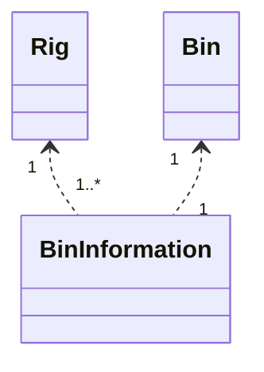
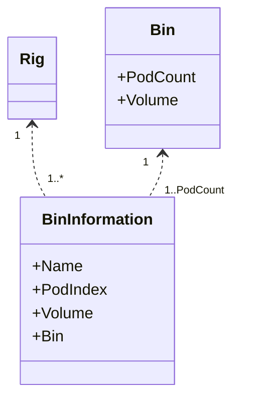

BinInformation Multi-pod Support Refactoring

Currently BinInformation is a relationship class implement a One-to-Many relationship between Bin and Rig. 

In current  project, We have expanded Rig concept to Operation   Site, which includes bulk plant and project bulk plant. And we have also added in the multiple pod structure to Bin. On RigBoard and Bulk Plant Board, We will display Pod level information instead of Bin level information.

Only Laydown Skid type bin has 3 pod, other type bins are all only have one type.

Refactoring Tasks

1. Historical BinInformation data update.

   - all podIndex should be 1. We only have P-Tank and Mega Silo in the past.

   - Populate Bin Number to Name column.

     ** above script has been added to product_haul_enhancement_release.sql document

2. Refactor eServiceOnline code to update the relationship between Bin and BinInformation for display.

   Each Bin has number of PodCount BinInformation records, combination key is Bin + PodIndex.

   - RigBoard/Bulk Plant Board existing display function should show as before, but the Bin column text should be from BinInformation name, not Bin Name.

3. Refactor "Assign Bin" function on RigBoard and Bulk Plant Board.

   1. Display Pod Count and Volume after the Bin Number is selected, they are read-only.

   2. Display Pod Information input forms according to Bin Pod Count. Default Pod Name as [Bin Number]-[Pod Index], e.g. 1567-1, 1567-2, 1567-3, etc. 

   3. Save BinInformation records as many as Bin Pod Count. Pod Index should be correct.

      UI Mock is in SVN. 

4. Add PodIndex to ProductHaulLoad. 

5. Check and Refactor "Schedule Blend"/"Reschedule Blend" in Bulk Plant Board, "Load to Bin" field should be filled by the BinInformation name shown in the cell right-clicked.  Reschedule Blend should allow user to change the Bin from a bin list of the current Bulk Plant.

5. Check and Refactor "Schedule Product Haul" in Rig Board, "Load to Bin" list should be filtered with BinInformation.

7. All schedule/reschedule function should save the ProductHaulLoad with correct PodIndex.

6. Print Load Sheet from Product Haul menu, bin number should be BinInformation Name.