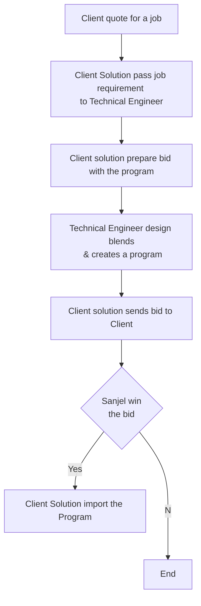
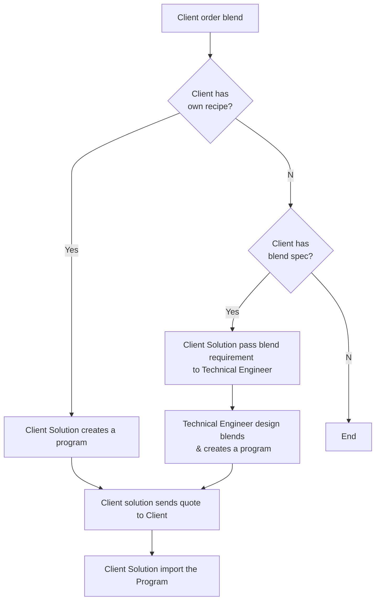
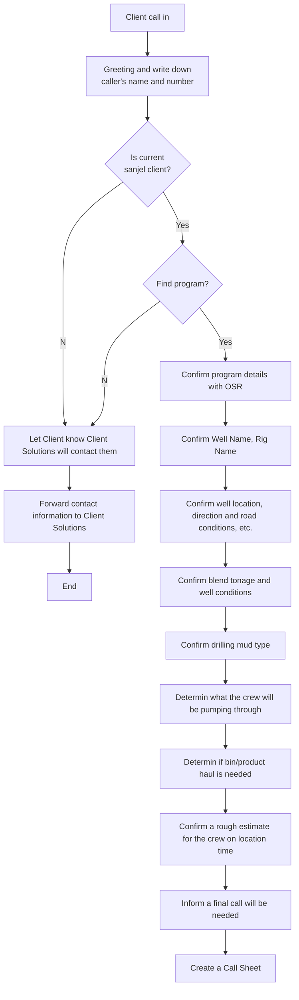
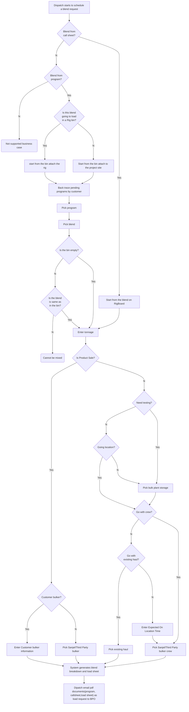
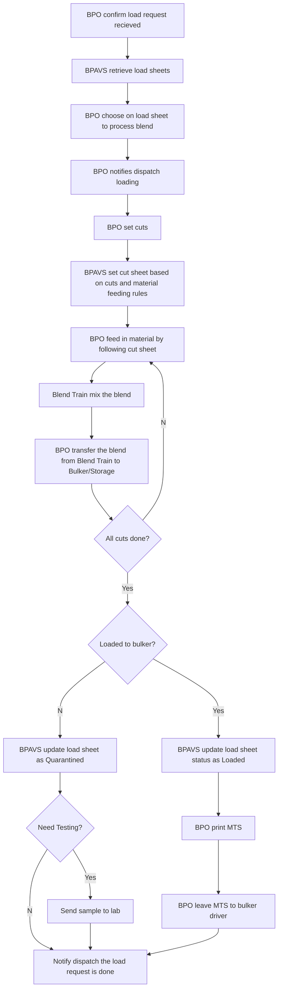
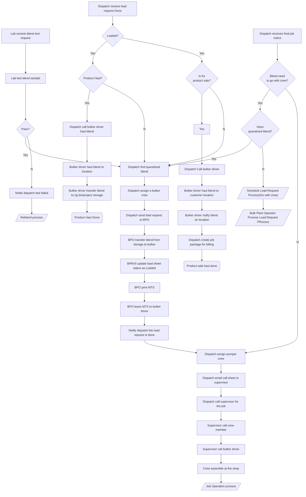

## 1.Quote for a job

```mermaid
graph TD
A[Client quote for a job]
A1[Client Solution pass job requirement <br>to Technical Engineer ]
A2[Technical Engineer design blends<br> & creates a program]
A7[Client solution prepare bid with the program]
A3[Client solution sends bid to Client]
A4{Sanjel win<br/>the bid}
A5[End]
A6[Client Solution import the Program]
A-->A1
A1-->A7
A7-->A2
A2-->A3
A3-->A4
A4--No-->A5
A4--Yes-->A6

```

## Order Blend

```mermaid
graph TD
A[Client order blend]
A1[Client Solution creates a program]
B{Client has<br />own recipe?}
C{Client has<br />blend spec?}
C1[Client Solution pass blend requirement <br>to Technical Engineer ]
C2[Technical Engineer design blends<br> & creates a program]
A3[Client solution sends quote to Client]
A5[End]
A6[Client Solution import the Program]
A-->B
B--Yes-->A1
B--No-->C
C--Yes-->C1
C--No-->A5
C1-->C2
C2-->A3
A3-->A6
A1-->A3
```

## 2.Taking a Client Call

```mermaid
graph TD
A["Client call in"]
B[Greeting and write down <br>caller's name and number]
C{Is current<br> sanjel client?}
E[Forward contact information to Client Solutions]
D[Let Client know Client Solutions will contact them]
F{Find program?}
G[Confirm program details with OSR]
H[Confirm Well Name, Rig Name]
I[Confirm well location, <br>direction and road conditions, etc.]
J[Confirm blend tonage and well conditions]
K[Confirm drilling mud type]
L[Determin what the crew will be pumping through]
M[Determin if bin/product haul is needed]
N[Confirm a rough estimate for the crew on location time]
O["Inform a final call will be needed"]
P[Create a Call Sheet]
Z[End]
A-->B
B-->C
C--No-->D
C--Yes-->F
F--No-->D
F--Yes-->G
D-->E
E-->Z
G-->H
H-->I
I-->J
J-->K
K-->L
L-->M
M-->N
N-->O
O-->P

```

## 3.Schedule Load Request

```mermaid
graph TD

A[Dispatch starts to schedule a blend request]
B{"Blend from<br> call sheet?"}
C[Start from the blend on RigBoard]
D{Blend from <br> program?}
E{Is this blend<br> going to load <br>in a Rig bin?}
F(Not supported business case)
G[start from the bin attach the rig]
H[Start from the bin attach to the project site]
I[Back trace pending programs by customer]
J[Pick program]
K[Pick blend]
L{Is the bin empty?}
M{Is the blend<br> is same as<br> in the bin?}
N[Enter tonnage]
O(Cannot be mixed)
P{Need testing?}
Q[Pick bulk plant storage]
R{Going location?}
S{Go with crew?}
T[Pick Sanjel/Third Party bulker crew]
U["Dipatch email pdf documents(program, callsheet,load sheet) as load request to BPO"]
V[Enter Expected On Location Time]
W[System generates blend breakdown and load sheet]
X{Go with <br>existing haul?}
Y[Pick existing haul]
Z{Is Product Sale?}
Z1{Customer bulker?}
Z2[Pick Sanjel/Third Party bulker]
Z3[Enter Customer bulker information]
A-->B
B--Yes-->C
B--No-->D
D--Yes-->E
D--No-->F
E--Yes-->G
E--No-->H
H-->I
G-->I
I-->J
J-->K
K-->L
L--No-->M
C-->N
L--Yes-->N
M--Yes-->N
M--No-->O
N-->Z--No-->P
P--Yes-->Q
P--No-->R
R--No-->Q
Q-->S
R--Yes-->S
S--Yes-->T
S--No-->X
V-->T
T-->W
W-->U
X--No-->V
X--Yes-->Y
Y-->W
Z--Yes-->Z1--No-->Z2-->W
Z1--Yes-->Z3-->W
```

## 4.Bulk Plant Operator Process Load Request

```mermaid
graph TD
A[BPO confirm load request recieved]-->B["BPAVS retrieve load sheets"]
B-->C["BPO choose on load sheet to process blend"]
C-->C1["BPO notifies dispatch loading"]
C1-->D["BPO set cuts"]
D-->E["BPAVS set cut sheet based on cuts and material feeding rules"]
E-->F["BPO feed in material by following cut sheet"]
F-->G["Blend Train mix the blend"]
G-->H["BPO transfer the blend from Blend Train to Bulker/Storage"]
H-->H1{All cuts done?}
I1{Loaded to bulker?}
H1--Yes-->I1
I["BPO print MTS"]
I1--Yes-->K
I1--No-->L[BPAVS update load sheet as Quarantined]
H1--No-->F
K-->I
K["BPAVS update load sheet status as Loaded"]
I-->J["BPO leave MTS to bulker driver"]
M{Need Testing?}
L-->M
M--Yes-->N[Send sample to lab]
M--No-->O[Notify dispatch the load request is done]
N-->O
J-->O
```

## 5.Dispatch Call Out 

```mermaid
graph TD
I[Lab receive blend test request]
J[Lab test blend sample]
K{Pass?}
A[Dispatch receive load request Done]
A1{Loaded?}
A2{Is for<br>product sale?}
A3[Dispatch Call bulker driver]
A4[Bulker driver haul blend to customer location]
A5[Bulker driver notify blend on location]
A6[Dispatch create job package for billing]
A7(Product sale haul done)
B[Dispatch receives final job notice]
C[Dispatch assign pumper crew]
D{Product Haul?}
E["Dispatch call bulker driver haul blend"]
F[Bulker driver haul blend to location]
G["Bulker driver transfer blend to rig bin/project storage"]
H(Product Haul Done)
L[Notify dispatch test failed]
M[/Reblend process/]
N[Dispatch send load request to BPO]
O[BPO transfer blend from storage to bulker]
P[Dispatch find quaratined blend]
Q[Dispatch assign a bulker crew]
R["BPO print MTS"]
S["BPAVS update load sheet status as Loaded"]
T["BPO leave MTS to bulker driver"]
U[Notify dispatch the load request is done]
V["Dispatch email call sheet to supervisor"]
W["Dispatch call supervisor for the job"]
X["Supervisor call crew member"]
Y["Supervisor call bulker driver"]
Z[Crew assemble at the shop]
Z1[/Job Operation process/]
Z2{Blend need <br>to go with crew?}
Z3{Have <br>quaratined blend?}
Z4[/"Schedule Load Request Process(Go with crew)"/]
Z5[/Bulk Plant Operator Process Load Request PRocess/]
A1--Yes-->A2--No-->P
A2-->Yes-->A3-->A4-->A5-->A6-->A7
A-->A1--Yes-->D
B-->Z2
Z2--No-->C
Z2--Yes-->Z3
Z3--No-->Z4-->Z5
Z3--Yes-->P
I-->J-->K--No-->L-->M
K--Yes-->P
P-->Q-->N-->O-->S-->R-->T-->U
D--No-->P
D--Yes-->E-->F-->G-->H
U-->C
C-->V
V-->W-->X-->Y-->Z-->Z1
```

