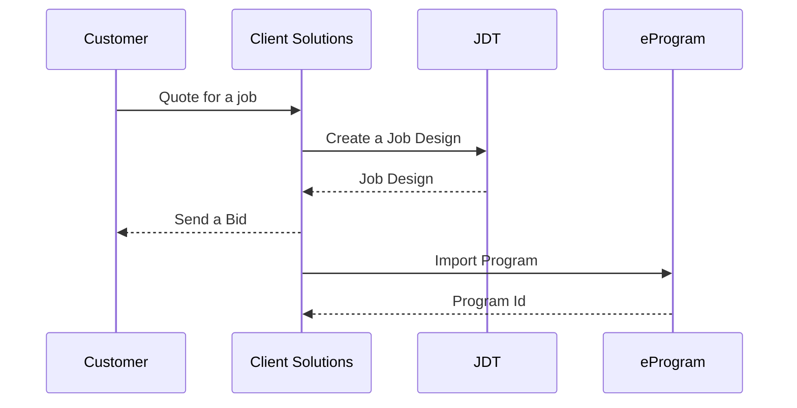
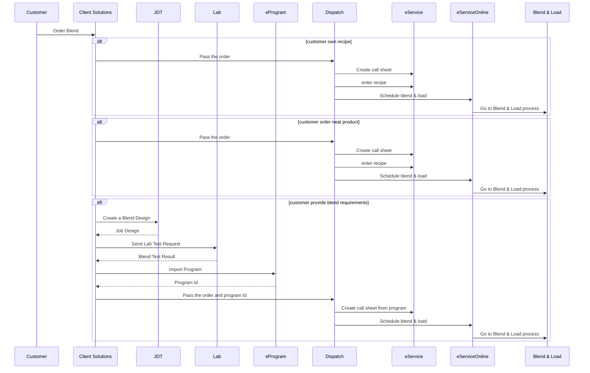
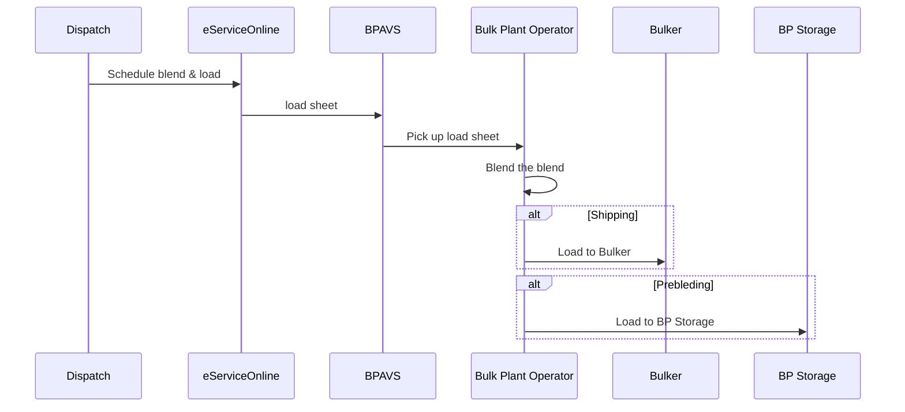

## Customer Quote for a Job

```mermaid
sequenceDiagram
participant CU as Customer
participant CS as Client Solutions
participant JDT
participant EPRG as eProgram
CU->>CS: Quote for a job
CS->>JDT: Create a Job Design
JDT-->>CS: Job Design
CS-->>CU: Send a Bid
CS->>EPRG: Import Program
EPRG-->>CS: Program Id

```

## Customer Order Blend

```mermaid
sequenceDiagram
participant CU as Customer
participant CS as Client Solutions
participant JDT
participant Lab
participant EPRG as eProgram
participant DP as Dispatch
participant ES as eService
participant EO as eServiceOnline
participant BL as Blend & Load
CU->>CS: Order Blend
alt customer own recipe
CS->>DP: Pass the order 
DP->>ES: Create call sheet
DP->>ES: enter recipe
DP->>EO: Schedule blend & load
EO->>BL: Go to Blend & Load process
end
alt customer order neat product
CS->>DP: Pass the order 
DP->>ES: Create call sheet
DP->>ES: enter recipe
DP->>EO: Schedule blend & load
EO->>BL: Go to Blend & Load process
end
alt customer provide blend requirements
CS->>JDT: Create a Blend Design
JDT-->>CS: Job Design
CS->>Lab: Send Lab Test Request
Lab-->>CS: Blend Test Result
CS->>EPRG: Import Program
EPRG-->>CS: Program Id
CS->>DP: Pass the order and program Id
DP->>ES: Create call sheet from program
DP->>EO: Schedule blend & load
EO->>BL: Go to Blend & Load process
end


```

### Schedule Blend & Load Process

```mermaid
sequenceDiagram
participant DP as Dispatch
participant EO as eServiceOnline
participant BPAVS
participant BPO as Bulk Plant Operator
participant Bulker
participant BS as BP Storage
DP->>EO: Schedule blend & load
EO->>BPAVS: load sheet
BPAVS->>BPO: Pick up load sheet
BPO->>BPO:Blend the blend
alt Shipping
BPO->>Bulker:Load to Bulker
end
alt Prebleding
BPO->>BS:Load to BP Storage
end

```

