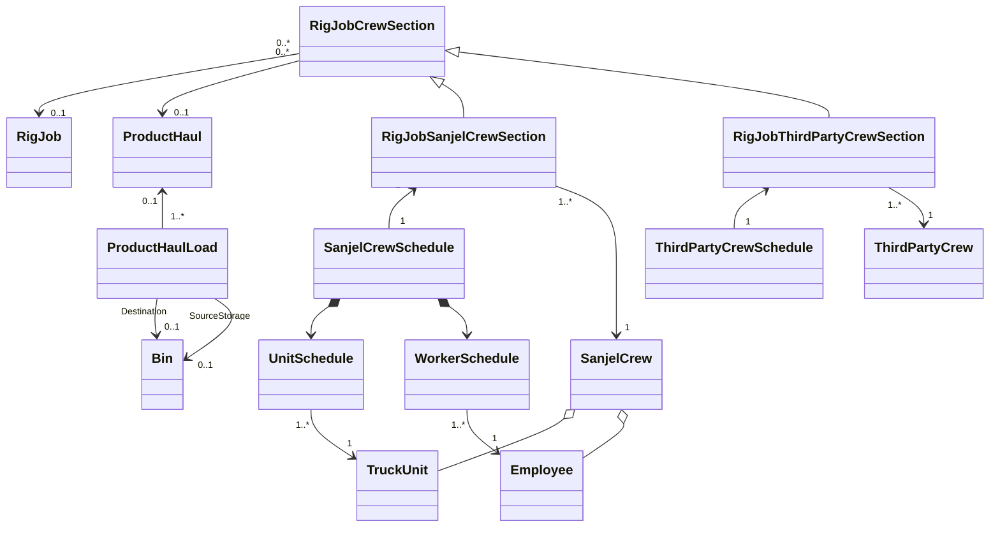
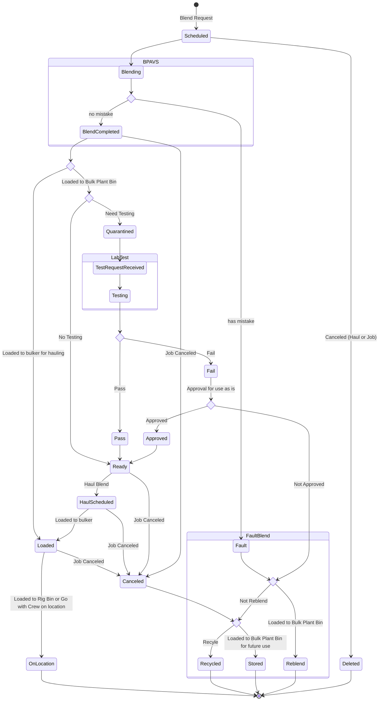

### Domain Model

```mermaid
classDiagram
class Bin
class ProductHaul
class ProductHaulLoad
class RigJobSanjelCrewSection
class RigJobThirdPartyCrewSection
class SanjelCrewSchedule
class ThirdPartyCrewSchedule
class UnitSchedule
class WorkerSchedule
class RigJob
class SanjelCrew
class ThirdPartyCrew
class RigJobCrewSection
class Employee
class TruckUnit
ProductHaul"0..1"<--"1..*" ProductHaulLoad
SanjelCrew o-- TruckUnit
SanjelCrew o-- Employee
RigJobCrewSection "0..*" -->"0..1"RigJob
RigJobCrewSection "0..*" -->"0..1"ProductHaul
RigJobSanjelCrewSection" 1"<--"1"SanjelCrewSchedule
RigJobThirdPartyCrewSection "1"<--"1"ThirdPartyCrewSchedule
RigJobSanjelCrewSection "1..*"-->"1"SanjelCrew
RigJobThirdPartyCrewSection "1..*" -->"1"ThirdPartyCrew
RigJobCrewSection<|--RigJobSanjelCrewSection
RigJobCrewSection<|--RigJobThirdPartyCrewSection
UnitSchedule"1..*"-->"1"TruckUnit
WorkerSchedule"1..*"-->"1"Employee
SanjelCrewSchedule *--> UnitSchedule
SanjelCrewSchedule *--> WorkerSchedule
ProductHaulLoad"Destination"-->"0..1"Bin
ProductHaulLoad"SourceStorage"-->"0..1"Bin


```

### Product Haul Load State Machine

```mermaid
stateDiagram
state is_product_haul <<choice>>
state is_blend_test_passed <<choice>>
state is_approved <<choice>>
state is_stored_for_future <<choice>>
state has_mistake <<choice>>
state need_testing <<choice>>
state is_reblend <<choice>>
state BPAVS {
s3: Blending
s3-->has_mistake
s4: BlendCompleted
}
state LabTest {
s8: TestRequestReceived
s9: Testing
}
s1: Scheduled
s2: OnLocation
s5: Loaded
s6: HaulScheduled
s7: Quarantined
s10:Ready
s11:Fail
s13: Deleted
s14:Canceled
s15:Approved
s18:Pass

[*]-->s1: Blend Request
s1-->s3
has_mistake-->s4: no mistake
has_mistake-->s19: has mistake
s19-->is_reblend
s4-->is_product_haul
is_product_haul-->need_testing: Loaded to Bulk Plant Bin
need_testing-->s7:Need Testing
s7-->s8
need_testing-->s10: No Testing
s8-->s9
s9-->is_blend_test_passed
is_blend_test_passed-->s18:Pass
s18-->s10
is_blend_test_passed-->s11:Fail
s11-->is_approved:Approval for use as is
is_approved-->s15:Approved
is_approved-->is_reblend:Not Approved
s14-->is_stored_for_future
is_stored_for_future-->s16: Loaded to Bulk Plant Bin for future use
is_stored_for_future-->s12:Recyle
is_product_haul-->s5: Loaded to bulker for hauling
s15-->s10
s10-->s6: Haul Blend
s6-->s5: Loaded to bulker
s5-->s2: Loaded to Rig Bin or Go with Crew on location
state FaultBlend {
s19:Fault
is_reblend-->is_stored_for_future:Not Reblend
is_reblend-->s17: Loaded to Bulk Plant Bin
s16:Stored
s17:Reblend
s12:Recycled
}
s2-->[*]
s12-->[*]
s16-->[*]
s17-->[*]
s5-->s14:Job Canceled
s6-->s14:Job Canceled
s10-->s14:Job Canceled
s4-->s14:Job Canceled
s1-->s13: Canceled (Haul or Job)
s13-->[*]

```

## Process View

