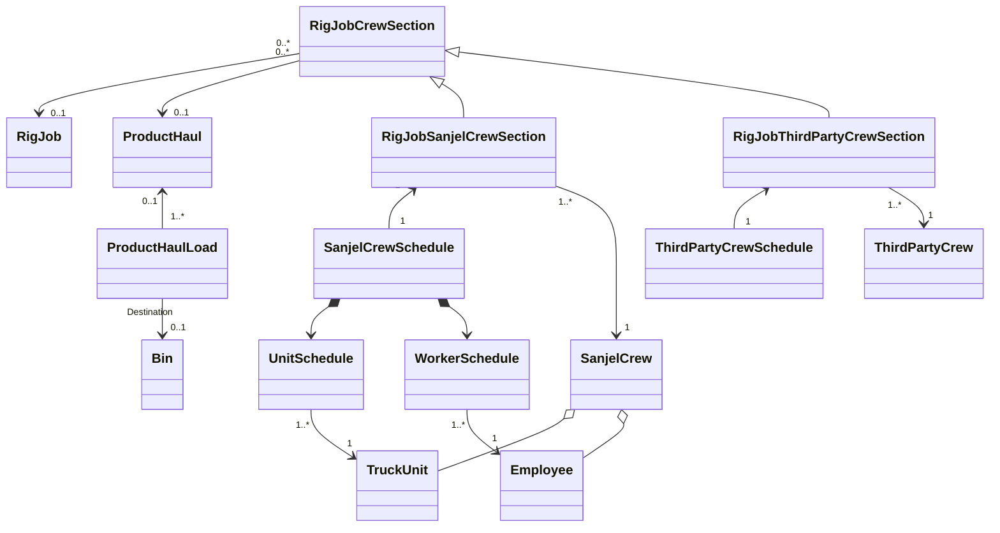
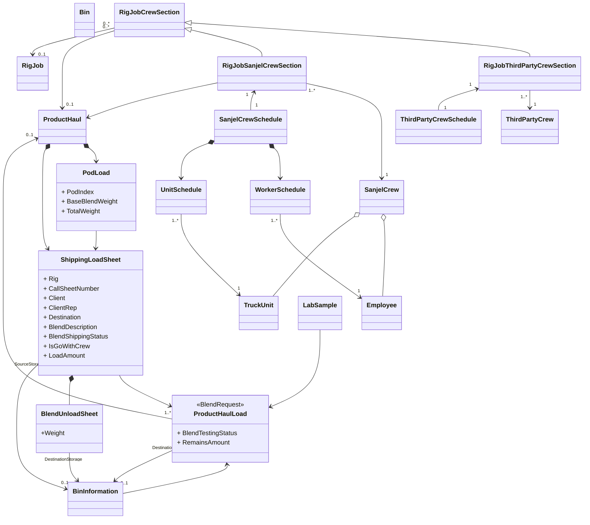
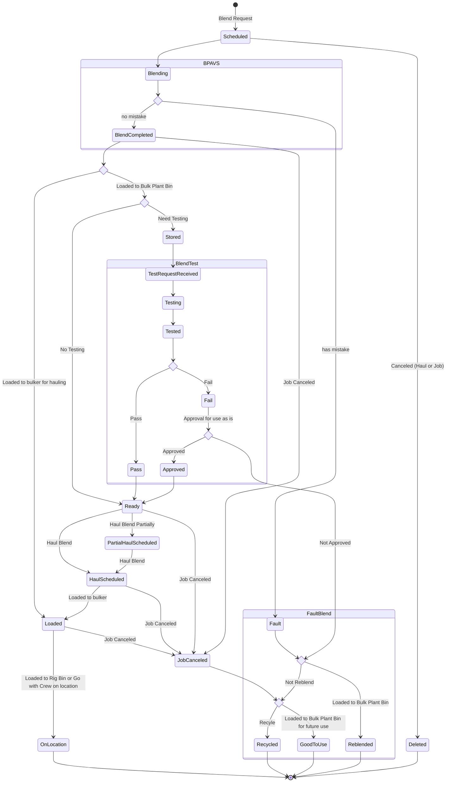
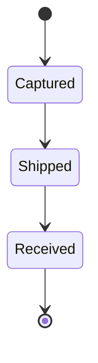

### Domain Model

## Refactor version 1

## Domain Model

### Product Haul Load State Machine

### Lab Sample State Machine

## Process View

## Wish List

- Schedule blend request without bin
  - BPAVS need to fill in the bin and update backend

- Schedule product haul with two bins - spit load
- Destination bins on MTS
- BPAVS need to be able to update "Loaded" status
- BPAVS sampling function and auto log in Lab Database
- Re-blend with blended blend.