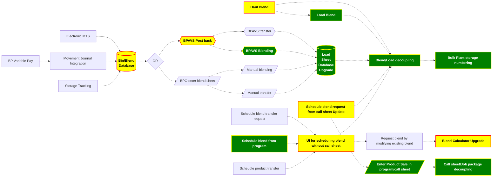

Goal

- Every batch blend has a blend request
- Fail blend request should be generated from a blend request
- Every batch blend offload  destination should be captured
- Every blend/product haul transfer/haul needs to be captured
- 
