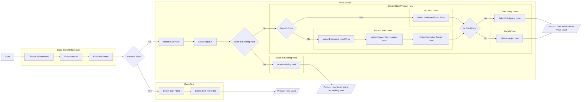

根据以上流程，Create Product Haul from Rig Job Blend 总共有六种情况，所以除了测试验证的用例，只有六个测试就足够了。

那么Reschedule Product Haul 只对Product Haul框内Not Load to existing haul的情况进行Reschedule，那么有四种情况的product haul需要做对应的测试。因为Go With Crew和Is Third Party之间没有依赖关系，可以分别测。你可以对比一下我们确定的五个测试用例，思考一下这五个用例是否完备地测试了所有路径？

那么Reschedule Product Haul Load需要对哪些情况进行测试呢？它涉及到可以回溯到Blend Test和Is existing haul，情况会更多一些。如果你按从上至下的逻辑顺序去思考设计测试用例，会清晰很多。

记住，Create Product Haul from Rig Job Blend 测试用例的结果是Reschedule的测试用例的前提条件。在测试用例中一定要写清楚，这样在后面我们创建测试计划的时候，可以有效地组合，结省时间。

