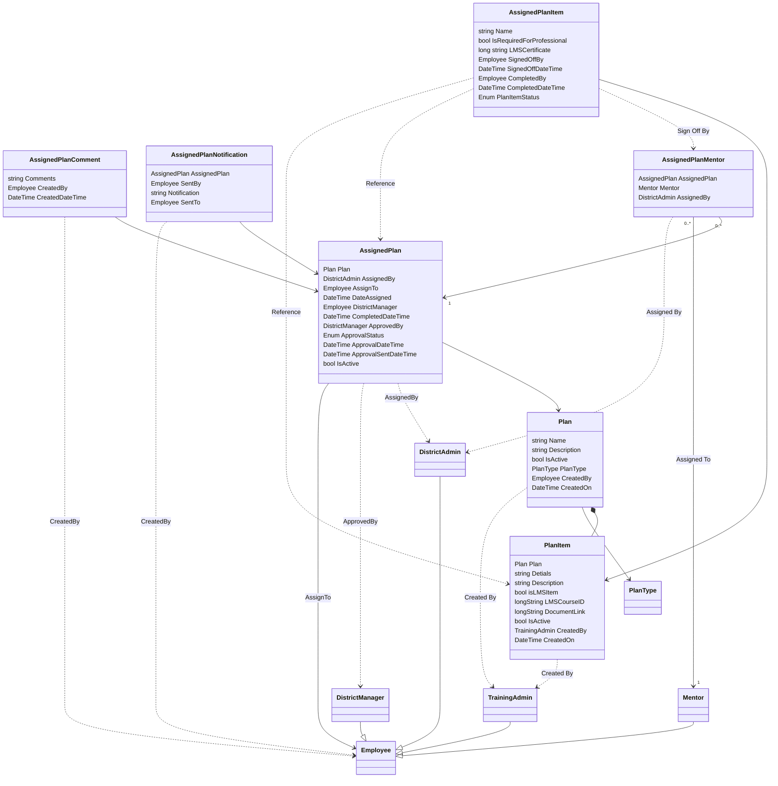
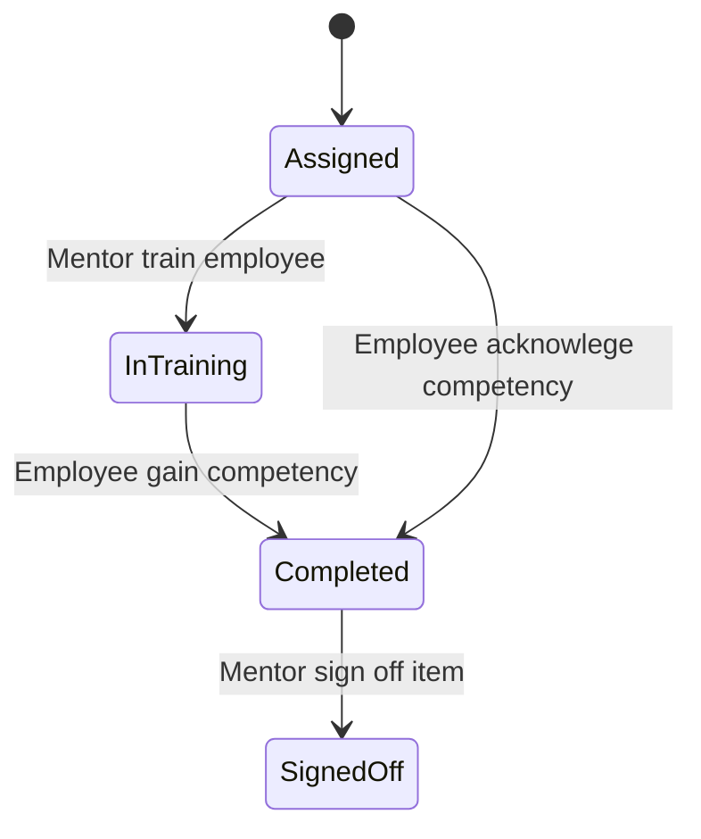

## Workforce Readiness App Domain Model


## AssignedPlanItem Life Cycle




## AssiginedPlan Life Cycle


```mermaid
stateDiagram
state "Assigned" as s1
state "InProgress" as s2
state "Completed" as s3
state "Approved" as s4
[*] --> s1
s1-->s2 :Training is Started
s2-->s3: All items are completed
s3 -->s4:District Manager Approval
s4-->s2: Training Admin revoke approval


