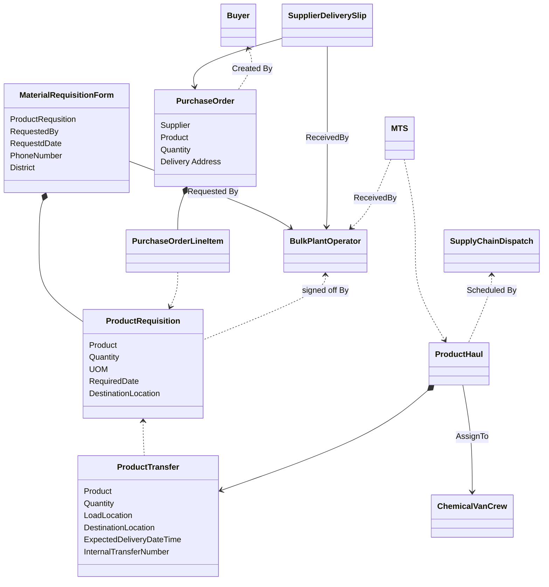

```mermaid
classDiagram
class BulkPlantOperator
class Buyer
class ChemicalVanCrew
class MaterialRequisitionForm{
ProductRequsition
RequestedBy
RequestdDate
PhoneNumber
District
}
class ProductRequisition{
Product
Quantity
UOM
RequiredDate
DestinationLocation
}
class ProductTransfer{
Product
Quantity
LoadLocation
DestinationLocation
ExpectedDeliveryDateTime
InternalTransferNumber
}
class PurchaseOrder{
Supplier
Product
Quantity
Delivery Address
}
class SupplierDeliverySlip
class PurchaseOrderLineItem
class MTS
class ProductHaul
class SupplyChainDispatch
MaterialRequisitionForm *-- ProductRequisition
MaterialRequisitionForm -->BulkPlantOperator:Requested By
PurchaseOrderLineItem..>ProductRequisition
PurchaseOrder*--PurchaseOrderLineItem
ProductRequisition<..ProductTransfer
SupplierDeliverySlip-->PurchaseOrder
SupplierDeliverySlip-->BulkPlantOperator:ReceivedBy
ProductHaul-->ChemicalVanCrew:AssignTo
MTS..>BulkPlantOperator:ReceivedBy
MTS..>ProductHaul
ProductHaul*-->ProductTransfer
SupplyChainDispatch<..ProductHaul:Scheduled By
Buyer<..PurchaseOrder:Created By
BulkPlantOperator<..ProductRequisition:signed off By
```

