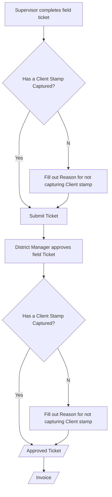

## Solution Proposal for Client stamp tracking

The solution will be implemented in eService application. The tracking flags are mandatory in eService for field ticketing and manager approval. This will help enforce the business process and allow all parties to be aware of client stamp missing  and the causes.

Once the data is submitted to server, it will be exposed to AR and sales in BI dataset for further tracking and analysis.

 This process will not block current process for invoice generation and OVPP processing.

### Business Process for client stamp tracking

### Solution Description

1. If the field supervisor has captured client stamp, he will toggle the checkbox "Is a Client Stamp Captured?" and fills in the stamp information.
2. If for any reason, the field supervisor is not able to capture the client stamp, he needs to fill out the reason in "Reason for not capturing Client Stamp"
3. The "Client Stamp Details" is mandatory for field ticket.
4. The supervisor submit ticket server
5. When district manager approves the ticket, the "Has a Client Stamp Captured?" checkbox will carry over the value from service ticket, district manager can modify it if field flag is wrong.
6. If for any reason, the checkbox is not toggled, the district manager needs to fill out the reason in "Reason for not capturing Client Stamp" within "Client Stamp Upon Approval".
7. Once the ticket is approved, the invoice will be generated.
8. All above tracking information will be available in daily job data in PowerBI. Sales and AR can use it for tracking and analysis purpose

### UI Mock

- Job Package From Local

- Job Packages Awaiting Approval

