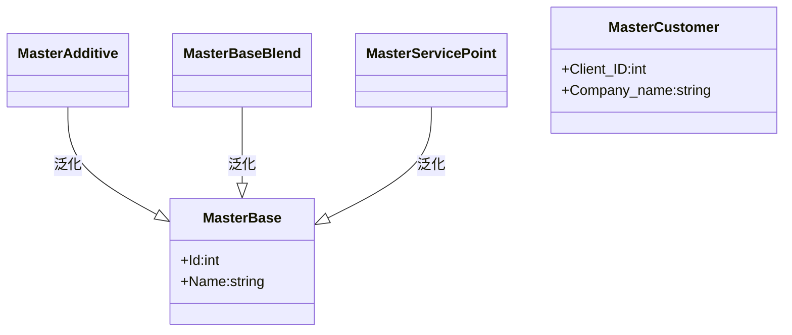
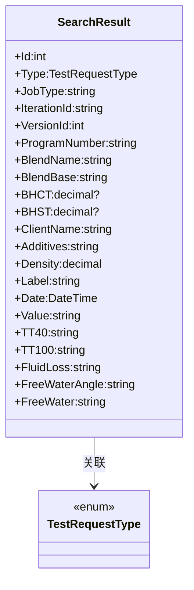
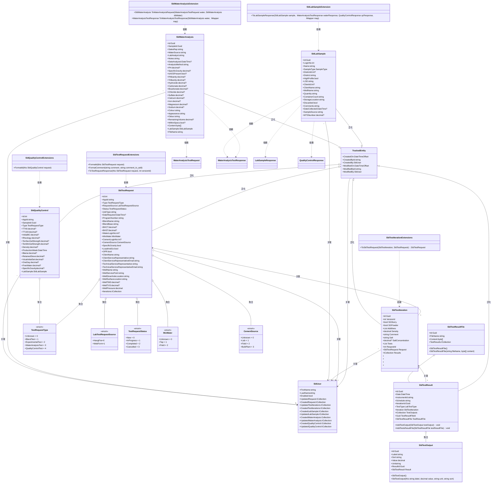

## MasterData

#### Include MasterBase、MasterAdditive、MasterBaseBlend、MasterCustomer、MasterServicePoint,those is from database view.

## SearchData

#### Include SearchResult,TestRequestType(enum)

## SldTest

#### Include TrackedEntity、SldTestIteration、SldTestRequest、SldLabSample、SldQualityControl、SldTestOutput、SldTestResult、SldTestResultFile、SldWaterAnalysis

