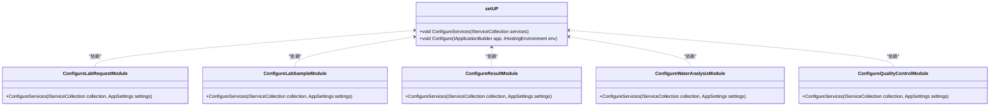
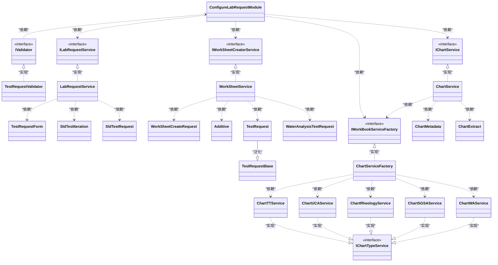

# LabDataBase原程序设计的结构

## api的三部分数据

api部分分为三个部分的数据，第一部分是存储在本数据库的数据，第二部分是利用视图链接其他的数据库SanJelData数据库、eservice6数据库的数据，第三部分是利用视图链接的本数据库的数据。

本地数据库的数据有一部分是利用.net 身份验证体系author产生的数据，这部分不用处理，要整合到目前的大系统和元元方中，已经有了现有的验证体系。另一部分是存储实验数据的这是重要部分。这几个表分别是：SldLabSamples、SldQualityControls、SldTestIterations、SldTestOutput、SldTestRequests、SldTestResult、SldTestResultFiles、SldWaterAnalysis

视图链接其他数据库：链接SanjelData的视图：Additives_View、BaseBlends_View。链接eservice6数据库的视图：Customers_View、ServicePoints_View。

视图链接本数据库：LabDatabaseView

## 枚举

项目包含几个枚举Enum，这是共同用到的，TestRequestType、LabTestRequestSource、TestRequestStatus、MixWater、CementSource

TestRequestType: 测试类别Unknown = 0,BlendTest = 1,ExperimentalTest = 2,WaterAnalysisTest = 3,QualityControlTest = 4，主要用的是BlendTest此值被hangfire引用、和QualityControlTest被Api中QualityControlService引用。

LabTestRequestSource：提交来源，HangFire=0，WebForm=1，目前webform的值并没有起作用，页面的提交并没有进行此项赋值，HangFire进行了赋值。

MixWater：水源，tap水龙头、field野外

CementSource:水泥来源

## SanjelData、eservice6的视图，可用（作元元方实体）

## 本地数据视图（可用作元元方实体）：

## 主数据库部分[Domian Entity]

#### 包括：SldLabSamples、SldQualityControls、SldTestIterations、SldTestOutput、SldTestRequests、SldTestResult、SldTestResultFiles、SldWaterAnalysis

### 可导入元元方的实体类，这里面有个问题，就是某些类的id的类型Guid,这块好像元元方没有这个数据类型。这块还需要和现有的user进行整合。

## 原项目的业务逻辑部分，这块user部分可以和现有系统进行整合。

## 业务扩展部分Framework Mechanism

```mermaid

classDiagram
graph TB
class SldLabSampleExtension{
+ToLabSampleResponse(SldLabSample sample,  WaterAnalysisTestResponse waterResponse, QualityControlResponse qcResponse, IMapper map)
}
class SldQualityControlExtensions{
+FormatId(this SldQualityControl request)
}
class SldTestIterationExtensions{
+ToSldTestRequest(SldTestIteration, SldTestRequest):SldTestRequest
}
class SldWaterAnalysisExtension{
+SldWaterAnalysis ToWaterAnalysisRequest(WaterAnalysisTestRequest water, SldWaterAnalysis dbWater)
+WaterAnalysisTestResponse ToWaterAnalysisTestResponse (SldWaterAnalysis water,  IMapper map)
}
class SldTestRequestExtensions{
+FormatId(this SldTestRequest request)
+FormatComment(string comment, string comment_to_add)
+ToTestRequestResponse(this SldTestRequest request, int versionId)
}
```

### 项目.net core setup 初始化注册服务。

### 提交实体验证【用的相关技术：FluentValidation】

### 主体业务

Api Control返回值，利用AutoMapper的map格式返回值。原项目的文件结构，是接口文件（controller文件）进行划分，有models和services，其中models是包含了提交和回执以及搜索时的传参实体；services相当于业务逻辑处理主程序。

如果整合lab到主系统主要修改services,可以保留现有的逻辑结构，另外把EF的数据查询【expression】变为元元方形式的。

### 身份验证：IdentityServer

    var connectionString = Configuration.GetConnectionString("SQLServerDbConnectString"); // 数据库配置系统应用用户数据上下文
            services.AddDbContext<ApplicationDbContext>(options => options.UseSqlServer(connectionString));
            services.AddIdentity<ApplicationUser, IdentityRole>().AddEntityFrameworkStores<ApplicationDbContext>().AddDefaultTokenProviders();

原系统的身份验证需要去掉，切换为主系统的验证。

## lab request

lab sample

WaterAnalysis

QualityControl

Result

### 原项目程序可分为一下3个部分：

1.权限管理系统，按角色进行权限界定

2.前台提交的接口，数据实体转化

3.后台的数据处理，写入数据库，返给前台数据

LabDatabase原项目整合到sanjel系统中，两种方案。

第一个方案是完全的重写，前后台完全不要了，按新的模式重新开发，这有个问题，这个新部分是整合在现有的某个系统内，还是重新做一套。

第二个方案是在现在的基础上，把后台整入现有系统。把前台还按目前的angular的方式，进行交叉整合。这样的代价成本要比第一种方案小。

要按第二种方案整合后台部分：

1.原项目利用的异步模式，sanjel目前不是，可以考虑把异步模式去掉。

2.ajax交互需要遵照原来的模式提交和返回数据。

3.把原来数据交互EF模式替换为元元方模式。

4.权限整合部分，也要遵照原LabDatabase项目进行数据格式等的整合。

5.要用元元方的技术就需要做下适应修改，原项目部分主键ID数据类型为guid，这个可以考虑把这个ID主键取消，并且把他的字段名字转变一下，并且转化为string形式，如果有外键都跟着变一下。另外重新增加主键ID设置为Int形式。重新赋值，外键也重新跟着设置。

6.整合业务逻辑层即中间层，融合目前系统和原LagDatabase项目的业务逻辑

7.如果涉及angular前台的修改可做部分修改，尽可能的前台不做大的调整。

8.HangFire定时任务的整合，如果整合的好，基本不用动。

### 按第二种模式整合前台部分：

1.权限部分，根据角色展示可访问访问菜单，按照目前的权限给后台传权限。如果需要修改，可以做修改以适应性的坐下修改。

2.其他部分最好也不修改，后台做最大的适应。

### Angular知识：

win10下进入文件夹，地址栏输入cmd即可进入该文件的命令工具。

ng serve命令是启动内存执行

ng build -prod 是最小打包，打包后部署到网站服务器即可，可能webconfig有问题，可以删除。

ng generate component 模块名 创建新模块命令

ng generate service 模块名 创建服务 import { [Injectable]} from '@angular/core';Injectable是服务的标记

##### 中文版教程：https://angular.cn/docs

*ngIf 判断是否显示条件，例如

。

*ngFor of 循环<li *ngFor="let item of data">{{item.name}}</li>

ngSwitch *ngSwitchCase witch case

[ngStyle]="{'color': 'red'}"

[ngClass]="{'first': true, 'second': true, 'third': false}"

<ng-container *ngIf="hero">and saw {{hero.name}}. I waved</ng-container>是一个分组元素，但它不会污染样式或元素布局

<ng-content select="[name=layoutCenter]"></ng-content><app-my-component name="layoutCenter"></app-my-component> 复用模板

[(ngModel)]="value" 双向绑定

主ui用的 bootstrap,列表用的ngx-datatable，columnMode：force可伸缩模式

下拉框：ng-select

起始页面：app.component的部分

组件结构：html、和ts文件，其中spec.ts的文件是测试文件。ts文件结构import、@[Component]、export class

项目名字修改：app.component.ts 里的title和index.html的title

RXJX处理异步：在 RxJS 中，Observable （可观察对象）是最为核心的概念，Angular 应用中产生的异步数据都会包装成 Observable 对象然后返回，它是数据的集合和源头，后续的所有操作都要围绕着 `Observable` 对象进行展开。其实在 HTTP 服务中使用 RxJS 也很简单：调用 Observable 对象的 `subscribe()`方法订阅通知，一旦 HTTP 请求完成，Observable 对象就会向订阅者发送数据。

注意：在http请求中，必须调用subscribe()，否则请求不会发送

### LabDatabase  前端：

前端：大量使用map和实体，和后端的提交和返回数据类型呼应。

前端主要菜单：search、sample login、lab request、experimentral、h2o analysis、Qualitity control、Admin[这个菜单主要是用户管理，后面要整合原系统的用户这个忽略。]

可设置环境变量，如果生成代码，修改environment里的environment.prod.ts里的值，然后执行命令：ng build --prod 。打包代码。放入iis等网站服务器下可以执行，压缩里面有个web.congfig，这个文件应该是有问题，可以删除。

页面结构：

起始页面：app.component.html。此里面的app-header、app-sidebar分别对应：shared/layout/head 头部、shared/layout/sidebar 昨部分。router-outlet是各个控件也就是主页面部分，其设置在app-routing.module.ts中，其设置在RouterModule.forRoot。

子菜单及路径设置在各个子文件夹下的XXXX-routing.moudule.ts

权限：app-routing.module.ts中CanActivate 作为权限判断，routes中的data则是设置当前页面的可访问角色设置。routes中 path: '',  pathMatch: 'full',  redirectTo: 'home'则是设置初始的页面跳转。

登录：登录适用的jwt的验证机制，登录后把登录数据jwttoken和用户名及角色都存入了localstorage。

按菜单划分，从app.component.html按显示页面的链接找到相应的组件，每个组件在一个对应的文件夹下，里面的额service是与服务器交互的业务逻辑。

Searche:调用的api是“/search”

Sample login:调用的api是“/labSamples”

Lab request:此调用api是"/labrequest"，TestRequestType为BlendTest

Experimental:此调用api是"/labrequest"，TestRequestType为ExperimentalTest

H2o analysis:调用的api是“/wateranalysis”

Quality control:调用的api是“/qualityControl”

## Angular 环境变量：

environments文件夹下有关于环境变量的定义。

angular.json有环境变量的设置。

按环境变量进行生成：

ng build --prod --configuration=production

其中production是指angular.json中设置的configurations中的对象名字。

### HangFire 定时任务

支持基于队列的任务处理：任务执行不是同步的，而是放到一个持久化队列中，以便马上把请求控制权返回给调用者。         

 BackgroundJob.Enqueue(() => Console.WriteLine("Simple!"));         

延迟任务执行：不是马上调用方法，而是设定一个未来时间点再来执行。        

 BackgroundJob.Schedule(() => Console.WriteLine("Reliable!"), TimeSpan.FromSeconds(5));        

循环任务执行：一行代码添加重复执行的任务，其内置了常见的时间循环模式，也可基于CRON表达式来设定复杂的模式。

RecurringJob.AddOrUpdate(() => Console.WriteLine("Transparent!"), Cron.Minutely);//注意最小单位是分钟

在项目的setup.cs中的config中设置启动项。

config中可以设置访问路径：app.UseHangfireDashboard，可以在线查看hangfire的UI。

### 数据库整合

因为有的数据库表的主键是guid,但目前元元方里不能实现这个功能，所以我们必须把主键类型改为int，如果只是空表则无关紧要直接设计就行，要导入原来数据，由于涉及外键，则要一起改掉，并且把外键的关系一起改掉。可以把主键Id改个名字作为备注，重新建立int类型的主键。

整合用户部分，与现有系统的用户进行关联，老数据的用户信息可以设置为空也可以指定到某个用户。

整合现有系统的版本控制机制，添加相应的字段。

## 错误

数据表SldQualityControls缺少字段 'FreeWater'、 'SpecificGravity' 。

### 时间估算【在原来基础上继续使用angular】

|     模块     |                           详细说明                           |  时间估算  |
| :----------: | :----------------------------------------------------------: | :--------: |
|   整合数据   | 把Lab部分的数据模型，整合现有系统的用户权限部分，导入元元方生成数据。 |  2~3人/日  |
|   整合业务   | 整合Lab后端api的业务进入现有模型驱动系统，生成业务层。要在保证HangFire和前台做最小的代价整合。 |  3~4人/日  |
| 移植HangFire | HangFire定时任务尽最大可能不影响现有流程，如果有轻微影响做具体调整。 | 0.5~1人/日 |
|   前端部分   |         前端部分的移植，尽最大可能保证现有前台逻辑。         |  2~3人/日  |
|   数据导入   |        编写脚本，特别是注意外键的处理，把数据导入新表        |  2~3人/天  |
|     测试     |                           详细测试                           |  4~5人/日  |

时间估算【完全整合进入本地系统】

|     模块     |                           详细说明                           |  时间估算  |
| :----------: | :----------------------------------------------------------: | :--------: |
|   整合数据   | 把Lab部分的数据模型，整合现有系统的用户权限部分，导入元元方生成数据。 |  2~3人/日  |
|     web      | 整合Lab的api业务及前端形成新的web页面，考虑全新的页面框架，权限及操作页面，并且要整合业务流程。 | 13~15人/日 |
| 移植HangFire | HangFire定时任务尽最大可能不影响现有流程，如果有轻微影响做具体调整。 | 0.5~1人/日 |
|   数据导入   |        编写脚本，特别是注意外键的处理，把数据导入新表        |  2~3人/天  |
|     测试     |                           详细测试                           |  4~5人/日  |

### 当前架构

### 前端保留，替换后端方案架构

### 完全替换方案架构

