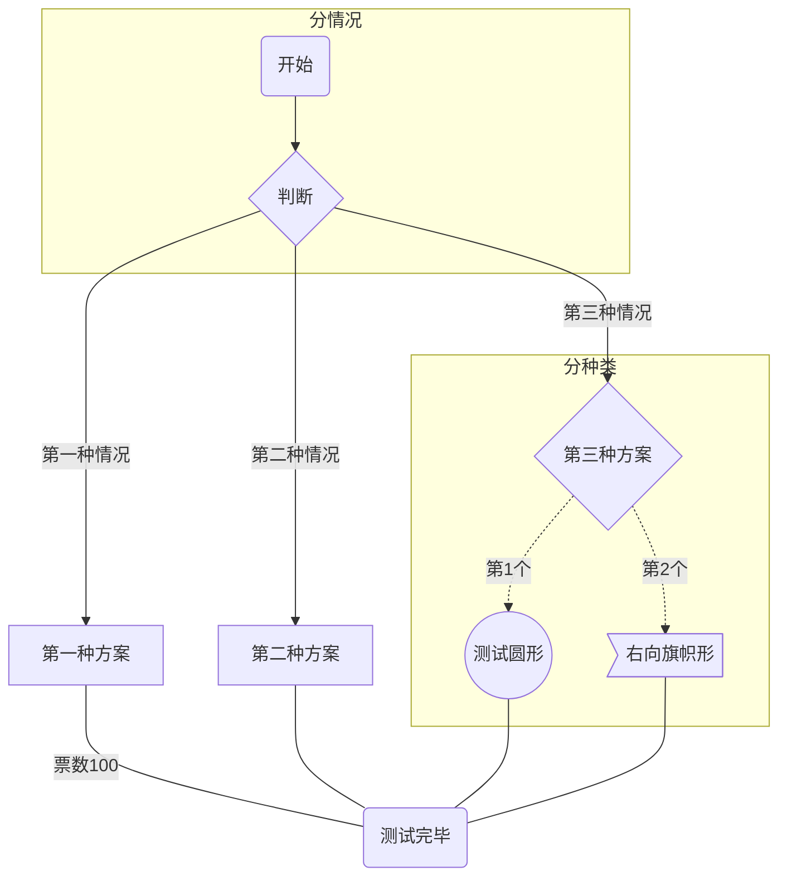
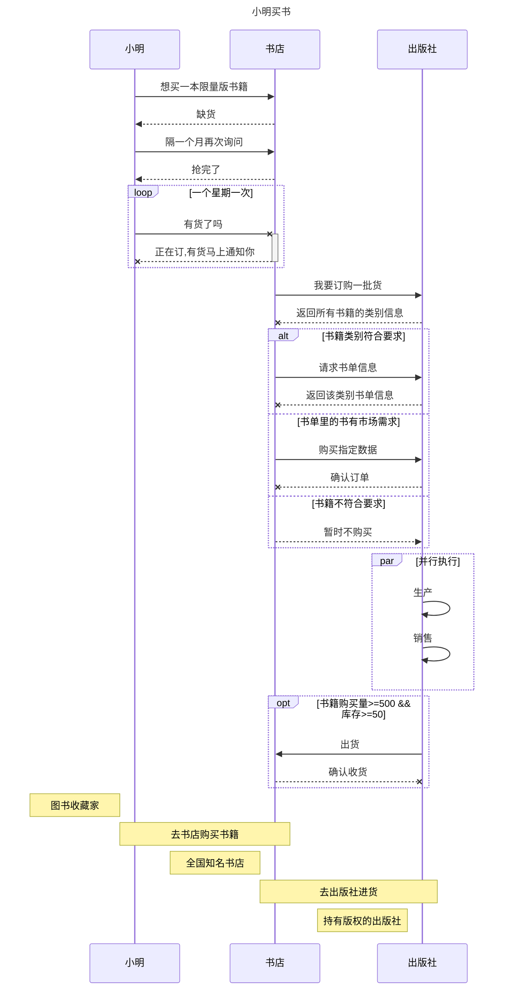
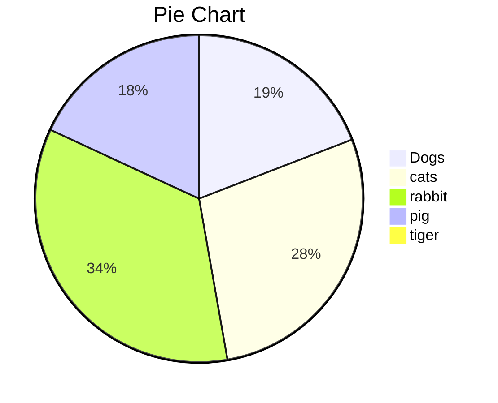
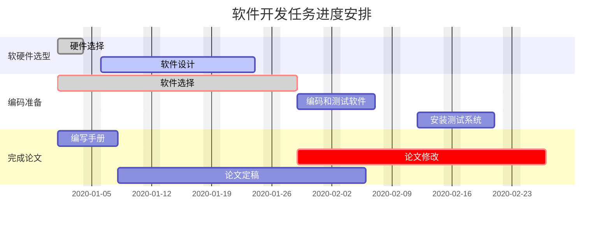

## 流程图



## 序列图

|      |                                  |
| ---- | -------------------------------- |
| ->   | 无箭头的实线                     |
| -->  | 无箭头的虚线                     |
| ->>  | 有箭头的实线(主动发出消息)       |
| -->> | 有箭头的虚线(响应)               |
| -x   | 末端为X的实线(主动发出异步消息)  |
| --x  | 有箭头的实线(以异步形式响应消息) |

sequenceDiagram
Title: 小明买书

participant consumer as 小明
participant store as 书店
participant publisher as 出版社

consumer ->> store: 想买一本限量版书籍
store -->> consumer: 缺货
consumer ->> store: 隔一个月再次询问
store -->> consumer: 抢完了
loop 一个星期一次
consumer -x +store: 有货了吗
store --x -consumer: 正在订,有货马上通知你
end

store ->> publisher: 我要订购一批货
publisher --x store: 返回所有书籍的类别信息

alt 书籍类别符合要求
store ->> publisher: 请求书单信息
publisher --x store: 返回该类别书单信息
else 书单里的书有市场需求
store ->> publisher: 购买指定数据
publisher --x store: 确认订单
else 书籍不符合要求
store -->> publisher: 暂时不购买
end

par 并行执行
publisher ->> publisher : 生产
publisher ->> publisher : 销售
end

opt 书籍购买量>=500 && 库存>=50
publisher ->> store : 出货
store --x publisher : 确认收货
end

Note left of consumer : 图书收藏家
Note over consumer,store : 去书店购买书籍
Note left of store : 全国知名书店
Note over store,publisher : 去出版社进货
Note left of publisher : 持有版权的出版社



## 饼图

pie
 title Pie Chart
 "Dogs" : 386
 "cats" : 567
 "rabbit" : 700
 "pig":365
 "tiger" : 15



## 甘特图

```csharp
gantt
 dateFormat  YYYY-MM-DD    //底部的时间格式
 title     Adding GANTT diagram functionality to mermaid   //甘特图名称
 excludes   weekends               //周末有休息

 section A         //可以理解为一个功能模块
 task1        :done,des1, 2014-01-06,2014-01-08   //可以理解为这个功能模块的各项进度安排
 task2        :active,des2, 2014-01-09, 3d      //以下参数都是合法的
 task3        :des3, after des2, 5d          //我们等一下每个都试一下
 task4        :crit, done, 2014-01-06,24h
 task5        :crit, done, after des1, 2d
 task6        :crit, active, 3d
 task7        :crit, 5d
 task8        :2d
 task9        :1d
 ...         :[参数1:crit,可不填],[参数2:active,done,可不填表示待完成],[参数3:小名],
 [参数4:开始时间],[参数5:结束时间]
 section B
 section C 
 ...
```



