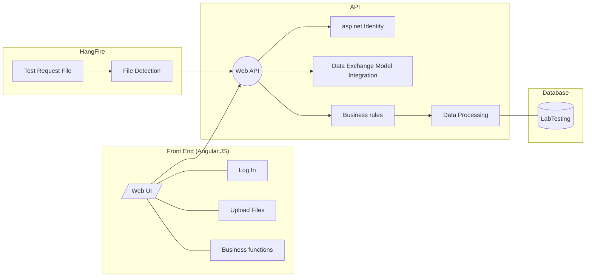
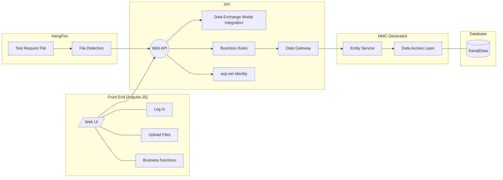
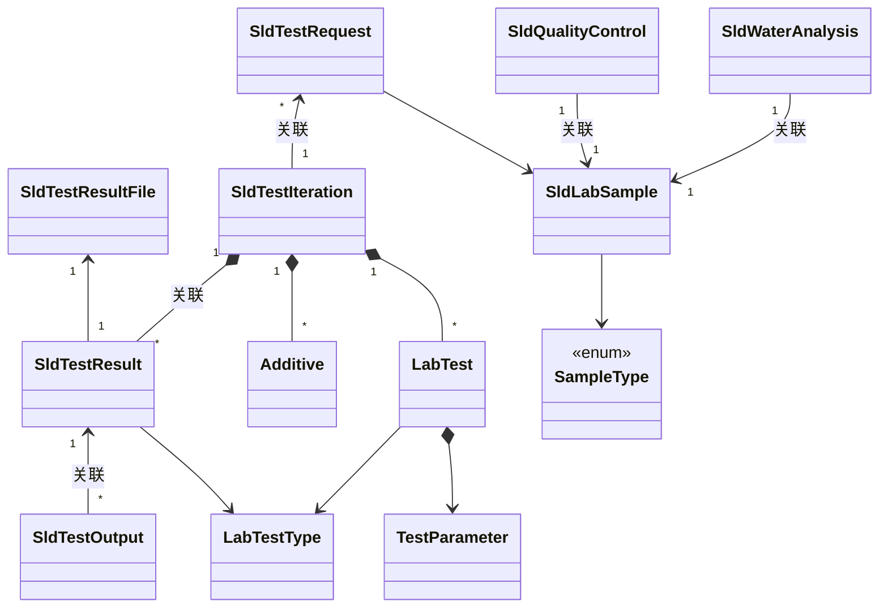
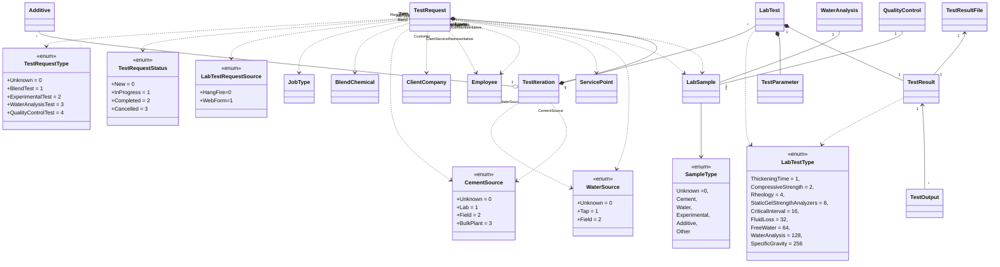
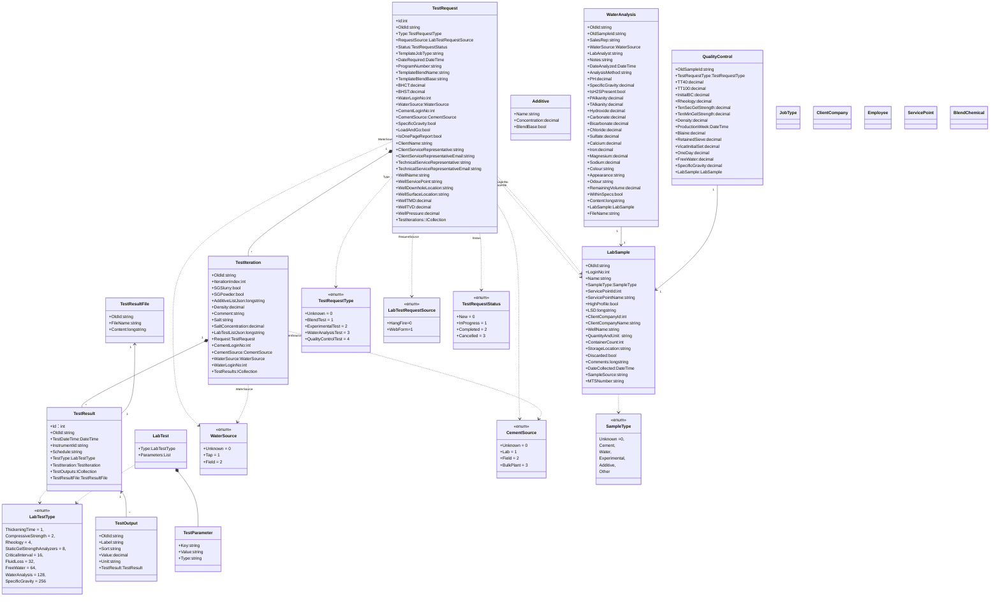

# Sanjel Lab Database Architecture Upgrade Plan

## Architecture Evolution

### 当前架构

### 前端保留，替换后端方案架构

## Project goal

- Refactor application domain model to merge in to SanjelData model
- Replace the original lab data database and data processing layer by MMC generated database and entity/data access layer.
- Migrate data from original lab database to new database
- Keep the whole solution running without any change from end user point of view.

### Out of scope

In this project, we are not to add the associations to master data entities. This will be considered in next phase development with new enhancement requriements.

## Previous Business Model (Revers-engineered from code)

## Domain Model

* Added implication relationship between TestRequest and LabSample, it was two integer number reference only.

## Implementation Model

### Naming Change Note

#### Enum MixWater is renamed as WaterSource

#### TestRequest

| SldTestRequest (old entity)               | TestRequest （new entity)                  | Notes                                                        |
| ----------------------------------------- | ------------------------------------------ | ------------------------------------------------------------ |
| +Id:GUID                                  | +OldId:string                              | Renamed and re-typed. 旧的键值，需要检视一下是否有保留的必要。 |
| +AppId:string                             |                                            | Deleted. 代码中特别标注了NotMapped，需要看一下有什么特列作用。 |
| +JobType:string                           | +TemplateJobType:string                    | Renamed. 确认业务语义，暂时不映射JobType Master Data         |
| +BlendName:string                         | +TemplateBlendName:string                  | Renamed. 确认业务语义，暂时不映射BlendChemical Master Data   |
| +BlendBase:string                         | +TemplateBlendBase:string                  | Renamed. 确认业务语义，暂时不映射BlendChemical Master Data   |
| +WaterLoginNo:int                         |                                            | Use  as-is for now. 它是映射到LabSample中的Water类型的记录，暂不关联 |
| +MixWater:MixWater                        | +WaterSource:WaterSource                   | Renamed. 确认业务语义，MixWater有在SanjelData模型中已有定义  |
| +CementLoginNo:int                        |                                            | Use  as-is for now. 它是映射到LabSample中的Water类型的记录，暂不关联 |
| +OPR:bool                                 | +IsOnePageReport:bool                      | Renamed. 确认业务语义                                        |
| +SpecificGravity:bool                     |                                            | Can it be deleted? 业务语义没找到，需要确认前端代码依赖      |
| +ClientName:string                        |                                            | Use  as-is for now. 暂不关联 ClientCompany                   |
| +ClientServiceRepresentative:string       |                                            | Use  as-is for now. 暂不关联 Employee                        |
| +TechnicalServiceRepresentative:string    |                                            | Use  as-is for now. 暂不关联 Employee                        |
| +WellServicePoint:string                  |                                            | Use  as-is for now. 暂不关联 ServicePoint                    |
| +Iterations:ICollection<SldTestIteration> | +TestIterations:ICollection<TestIteration> | MMC 命名规则                                                 |
|                                           | +RquestedOn：DateTime                      | 新属性，在旧的系统里它利用了系统追踪属性。但是它在用户界面上有明确业务语义 |
|                                           | +RequestedBy: string                       | 新属性，在旧的系统里它利用了系统追踪属性。但是它在用户界面上有明确业务语义 |

#### TestIteration

| SldTestIteration（old entity)       | TestIteration (new entity)           | Notes                                                        |
| ----------------------------------- | ------------------------------------ | ------------------------------------------------------------ |
| +Id:GUID                            | +OldId:string                        | Renamed and re-typed. 旧的键值，需要检视一下是否有保留的必要。 |
| +VersionId:int                      | +IterationIndex:int                  | Renamed. 确认业务语义                                        |
| +Additives:List<Additive>           | +AdditiveListJson:longstring         | Renamed. 确认业务语义，MMC暂不扩展增加Additive实体           |
| +Tests:List<LabTest>                | +LabTestListJson:longstring          | Renamed. 确认业务语义，MMC暂不扩展增加LabTest，TestParameter实体 |
| +Results:ICollection<SldTestResult> | +TestResults:ICollection<TestResult> | MMC 命名规则                                                 |

#### TestResult

| SldTestResult（old entity)        | TestResult (new entity)        | Notes                                                        |
| --------------------------------- | ------------------------------ | ------------------------------------------------------------ |
| +Id:GUID                          | +OldId:string                  | Renamed and re-typed. 旧的键值，需要检视一下是否有保留的必要。 |
| +Iteration:SldTestIteration       | +TestIteration:TestIteration   | MMC 命名规则                                                 |
| +TestResultFile:SldTestResultFile | +TestResultFile:TestResultFile | New Type                                                     |
| +Date:DateTime                    | +TestDateTime:DateTime         | Renamed，原名无业务语义                                      |

#### TestOutput

| SldTestOutput（old entity) | TestOutput (new entity) | Notes                                                        |
| -------------------------- | ----------------------- | ------------------------------------------------------------ |
| +Id:GUID                   | +OldId:string           | Renamed and re-typed. 旧的键值，需要检视一下是否有保留的必要。 |
| +Result:SldTestResult      | +TestResult:TestResult  | MMC 命名规则                                                 |

#### TestResultFile

| SldTestResultFile（old entity) | TestResultFile (new entity) | Notes                                                        |
| ------------------------------ | --------------------------- | ------------------------------------------------------------ |
| +Id:GUID                       | +OldId:string               | Renamed and re-typed. 旧的键值，需要检视一下是否有保留的必要。 |
| +Content:byte[]                | +Content:longstring         | 数据类型变化，以适应MMC定义                                  |

#### LabSample

| SldLabSample（old entity) | TestResultFile (new entity) | Notes                                                        |
| ------------------------- | --------------------------- | ------------------------------------------------------------ |
| +Id:GUID                  | +OldId:string               | Renamed and re-typed. 旧的键值，需要检视一下是否有保留的必要。 |
| +Name:string              |                             | MMC实体基类提供同名属性                                      |
| +DistrictId:int           | +ServicePointId:int         | Renamed，MMC 命名规则，同时更新对MasterData的实体指向        |
| +District:string          | +ServicePointName:string    | Renamed，MMC 命名规则，同时更新对MasterData的实体指向        |
| +ClientId:int             | +ClientCompanyId:int        | Renamed，MMC 命名规则，同时更新对MasterData的实体指向        |
| +ClientName:string        | +ClientCompanyName:string   | Renamed，MMC 命名规则，同时更新对MasterData的实体指向        |
| +MTSNumber:decimal        | +MTSNumber:string           | Re-typed, 原类型定义不符合业务流程定义                       |
| +Quantity:string          | +QuantityAndUnit: string    | Renamed，MMC 命名规则, Quantity 是计量属性的标准命名，预留给以后系统改进 |
| +ContainerCount:string    | +ContainerCount:int         | Re-typed, 原类型定义不符合业务流程定义                       |

#### WaterAnalysis

| SldWaterAnalysis（old entity) | WaterAnalysis (new entity) | Notes                                                        |
| ----------------------------- | -------------------------- | ------------------------------------------------------------ |
| +Id:GUID                      | +OldId:string              | Renamed and re-typed. 旧的键值，需要检视一下是否有保留的必要。 |
| +SampleId:GUID                | +OldSampleId:string        | Renamed and re-typed. 旧的键值，需要检视一下是否有保留的必要。 |
|                               | +LabSample:LabSample       | Add association with LabSample                               |
| +Content:byte[]               | +Content:longstring        |                                                              |
| +WaterSource:string           | +WaterSource:WaterSource   | Re-typed, 原类型定义不符合业务流程定义，目前没有数据。       |

#### QualityControl

| QualityControl（old entity) | QualityControl (new entity)      | Notes                                                        |
| --------------------------- | -------------------------------- | ------------------------------------------------------------ |
| +Id:int                     | Id:int                           | It can be aligned with MMC generated ID                      |
| +SampleId:GUID              | +OldSampleId:string              | Renamed and re-typed. 旧的键值，需要检视一下是否有保留的必要。 |
| +Type:TestRequestType       | +TestRequestType:TestRequestType | MMC 命名规则                                                 |
|                             | +LabSample:LabSample             | Add association with LabSample                               |

 

## Database Table Structure Mapping 

*** 原来这里比对的类型没有可比性，把它改成数据表的比对，可以用做数据转换的依据***。这部分等到新的数据库生成出来后再填充

##### TestOutput[the source table name is SldTestOutput]

| Field name                   | Source Data Type | MMC Field Name | MMC Create SqlServer Data Type | MMC Code Data Type |
| ---------------------------- | ---------------- | -------------- | ------------------------------ | ------------------ |
| Id【need change name】       | uniqueidentifier | OldId          | nvarchar(255)                  | string             |
|                              |                  | Id             | int                            | int                |
| Label                        | nvarchar(255)    | Label          | nvarchar(255)                  | string             |
| Value                        | decimal(18, 2)   | Value          | decimal(18, 2)                 | decimal            |
| Unit                         | nvarchar(255)    | Unit           | nvarchar(255)                  | string             |
| ResultId【need change name】 | uniqueidentifier | OldResultId    | nvarchar(255)                  | string             |
|                              |                  | TestResultId   | int                            | int                |
| Sort                         | nvarchar(255)    | Sort           | nvarchar(255)                  | string             |

##### TestResult[the source table name is SldTestResult]

| Field name                           | Source Data Type  | MMC Field Name      | MMC Create SqlServer Data Type | MMC Data Type |
| ------------------------------------ | ----------------- | ------------------- | ------------------------------ | ------------- |
| Id【need change name】               | uniqueidentifier  | OldId               | nvarchar(255)                  | string        |
|                                      |                   | Id                  | int                            | int           |
| CreatedOn                            | datetimeoffset(7) |                     |                                | datetime      |
| CreatedById                          | nvarchar(450)     |                     |                                | string        |
| ModifiedOn                           | datetimeoffset(7) | modified_datetime   | datetime2(7)                   | datetime      |
| ModifiedById                         | nvarchar(450)     | modified_user_id    | nvarchar(255)                  | string        |
| Date                                 | datetime2(7)      | TestDateTime        | datetime2(7)                   | datetime      |
| InstrumentId                         | nvarchar(MAX)     | InstrumentId        | nvarchar(255)                  | string        |
| Schedule                             | nvarchar(MAX)     | Schedule            | nvarchar(255)                  | string        |
| IterationId【need change name】      | uniqueidentifier  | OldIterationId      | nvarchar(255)                  | string        |
|                                      |                   | IterationId         | int                            | int           |
| TestType                             | int               | TestType            | int                            | LabTestType   |
| TestResultFileId【need change name】 | uniqueidentifier  | OldTestResultFileId | nvarchar(255)                  | string        |
|                                      |                   | TestResultFileId    | int                            | int           |

##### LabSample[the source table name is SldLabSample]

| Field name             | Source Data Type  | MMC Field Name    | MMC Create SqlServer Data Type | MMC Data Type |
| ---------------------- | ----------------- | ----------------- | ------------------------------ | ------------- |
| Id【need change name】 | uniqueidentifier  | OldId             | nvarchar(255)                  | string        |
|                        |                   | Id                | int                            | int           |
| CreatedOn              | datetimeoffset(7) |                   |                                | datetime      |
| CreatedById            | nvarchar(450)     |                   |                                | string        |
| ModifiedOn             | datetimeoffset(7) | modified_datetime | datetime2(7)                   | datetime      |
| ModifiedById           | nvarchar(450)     | modified_user_id  | nvarchar(255)                  | string        |
| LoginNo                | int               | LoginNo           | int                            | int           |
| Name                   | nvarchar(MAX)     | Name              | nvarchar(100)                  | string        |
| DistrictId             | int               | ServicePointId    | int                            | int           |
| District               | nvarchar(MAX)     | ServicePointName  | nvarchar(255)                  | string        |
| HighProfile            | bit               | HighProfile       | bit                            | bool          |
| LSD                    | nvarchar(MAX)     | LSD               | nvarchar(255)                  | string        |
| ClientId               | int               | ClientCompanyId   | int                            | int           |
| ClientName             | nvarchar(MAX)     | ClientCompanyName | nvarchar(255)                  | string        |
| WellName               | nvarchar(MAX)     | WellName          | nvarchar(255)                  | string        |
| Quantity               | nvarchar(MAX)     | QuantityAndUnit   | nvarchar(255)                  | string        |
| ContainerCount         | nvarchar(MAX)     | ContainerCount    | nvarchar(255)                  | string        |
| StorageLocation        | nvarchar(MAX)     | StorageLocation   | nvarchar(255)                  | string        |
| Discarded              | bit               | Discarded         | bit                            | bool          |
| Comments               | nvarchar(MAX)     | Comments          | nvarchar(255)                  | string        |
| SampleType             | int               | SampleType        | int                            | LabSampleType |
| DateCollected          | datetime2(7)      | DateCollected     | datetime2(7)                   | datetime      |
| MTSNumber              | decimal(18, 2)    | MTSNumber         | decimal(18, 2)                 | decimal       |
| SampleSource           | nvarchar(MAX)     | SampleSource      | nvarchar(255)                  | string        |

##### WaterAnalysis[the source table name is SldWaterAnalysis]

| Field name                    | Source Data Type  | MMC Field Name    | MMC Create SqlServer Data Type | MMC Data Type |
| ----------------------------- | ----------------- | ----------------- | ------------------------------ | ------------- |
| Id【need change name】        | uniqueidentifier  | OldId             | nvarchar(255)                  | string        |
|                               |                   | Id                | int                            | int           |
| CreatedOn                     | datetimeoffset(7) |                   |                                | datetime      |
| CreatedById                   | nvarchar(450)     |                   |                                | string        |
| ModifiedOn                    | datetimeoffset(7) | modified_datetime | datetime2(7)                   | datetime      |
| ModifiedById                  | nvarchar(450)     | modified_user_id  | nvarchar(255)                  | string        |
| SampleId【need change name】  | uniqueidentifier  | OldSampleId       | nvarchar(255)                  | string        |
|                               |                   | SampleId          | int                            | int           |
| SalesRep                      | nvarchar(MAX)     | SalesRep          | nvarchar(255)                  | string        |
| WaterSource                   | nvarchar(MAX)     | WaterSource       | nvarchar(255)                  | string        |
| LabAnalyst                    | nvarchar(MAX)     | LabAnalyst        | nvarchar(255)                  | string        |
| Notes                         | nvarchar(MAX)     | Notes             | nvarchar(255)                  | string        |
| DateAnalyzed                  | datetime2(7)      | DateAnalyzed      | datetime2(7)                   | datetime      |
| AnalysisMethod                | nvarchar(MAX)     | AnalysisMethod    | nvarchar(255)                  | string        |
| PH                            | decimal(18, 2)    | PH                | decimal(18, 2)                 | decimal       |
| SpecificGravity               | decimal(18, 2)    | SpecificGravity   | decimal(18, 2)                 | decimal       |
| IsH2SPresent                  | bit               | IsH2SPresent      | bit                            | bool          |
| PAlkanity                     | decimal(18, 2)    | PAlkanity         | decimal(18, 2)                 | decimal       |
| TAlkanity                     | decimal(18, 2)    | TAlkanity         | decimal(18, 2)                 | decimal       |
| Hydroxide                     | decimal(18, 2)    | Hydroxide         | decimal(18, 2)                 | decimal       |
| Carbonate                     | decimal(18, 2)    | Carbonate         | decimal(18, 2)                 | decimal       |
| Bicarbonate                   | decimal(18, 2)    | Bicarbonate       | decimal(18, 2)                 | decimal       |
| Chloride                      | decimal(18, 2)    | Chloride          | decimal(18, 2)                 | decimal       |
| Sulfate                       | decimal(18, 2)    | Sulfate           | decimal(18, 2)                 | decimal       |
| Calcium                       | decimal(18, 2)    | Calcium           | decimal(18, 2)                 | decimal       |
| Iron                          | decimal(18, 2)    | Iron              | decimal(18, 2)                 | decimal       |
| Magnesium                     | decimal(18, 2)    | Magnesium         | decimal(18, 2)                 | decimal       |
| Sodium                        | decimal(18, 2)    | Sodium            | decimal(18, 2)                 | decimal       |
| Colour                        | nvarchar(MAX)     | Colour            | nvarchar(255)                  | string        |
| Appearance                    | nvarchar(MAX)     | Appearance        | nvarchar(255)                  | string        |
| Odour                         | nvarchar(MAX)     | Odour             | nvarchar(255)                  | string        |
| RemainingVolume               | decimal(18, 2)    | RemainingVolume   | decimal(18, 2)                 | decimal       |
| WithinSpecs                   | bit               | WithinSpecs       | bit                            | bool          |
| Content【there some problem】 | varbinary(MAX)    | Content           | text                           | longstring    |
| FileName                      | nvarchar(MAX)     | FileName          | nvarchar(255)                  | string        |

##### QualityControls[the source table name is SldQualityControls]

| Field name                   | Source Data Type  | MMC Field Name    | MMC Create SqlServer Data Type | MMC Data Type   |
| ---------------------------- | ----------------- | ----------------- | ------------------------------ | --------------- |
| Id【need change name】       | uniqueidentifier  | OldId             | nvarchar(255)                  | string          |
|                              |                   | Id                | int                            | int             |
| CreatedOn                    | datetimeoffset(7) |                   |                                | datetime        |
| CreatedById                  | nvarchar(450)     |                   |                                | string          |
| ModifiedOn                   | datetimeoffset(7) | modified_datetime | datetime2(7)                   | datetime        |
| ModifiedById                 | nvarchar(450)     | modified_user_id  | nvarchar(255)                  | string          |
| SampleId【need change name】 | uniqueidentifier  | OldSampleId       | nvarchar(255)                  | string          |
|                              |                   | SampleId          | int                            | int             |
| Type                         | int               | TestRequestType   | int                            | TestRequestType |
| TT40                         | decimal(18, 2)    | TT40              | decimal(18, 2)                 | decimal         |
| TT100                        | decimal(18, 2)    | TT100             | decimal(18, 2)                 | decimal         |
| InitialBC                    | decimal(18, 2)    | InitialBC         | decimal(18, 2)                 | decimal         |
| Rheology                     | decimal(18, 2)    | Rheology          | decimal(18, 2)                 | decimal         |
| TenSecGelStrength            | decimal(18, 2)    | TenSecGelStrength | decimal(18, 2)                 | decimal         |
| TenMinGelStrength            | decimal(18, 2)    | TenMinGelStrength | decimal(18, 2)                 | decimal         |
| Density                      | decimal(18, 2)    | Density           | decimal(18, 2)                 | decimal         |
| ProductionWeek               | datetime2(7)      | ProductionWeek    | datetime2(7)                   | datetime        |
| Blaine                       | decimal(18, 2)    | Blaine            | decimal(18, 2)                 | decimal         |
| RetainedSieve                | decimal(18, 2)    | RetainedSieve     | decimal(18, 2)                 | decimal         |
| VicatInitialSet              | decimal(18, 2)    | VicatInitialSet   | decimal(18, 2)                 | decimal         |
| OneDay                       | decimal(18, 2)    | OneDay            | decimal(18, 2)                 | decimal         |
| FreeWater                    | decimal(18, 2)    | FreeWater         | decimal(18, 2)                 | decimal         |
| SpecificGravity              | decimal(18, 2)    | SpecificGravity   | decimal(18, 2)                 | decimal         |

##### TestRequests[the source table name is SldTestRequests]

| Field name                          | Source Data Type  | MMC Field Name                      | MMC Create SqlServer Data Type | MMC Data Type        |
| ----------------------------------- | ----------------- | ----------------------------------- | ------------------------------ | -------------------- |
| Id【need change name】              | uniqueidentifier  | OldId                               | nvarchar(255)                  | string               |
|                                     |                   | Id                                  | int                            | int                  |
| CreatedOn                           | datetimeoffset(7) |                                     |                                | datetime             |
| CreatedById                         | nvarchar(450)     |                                     |                                | string               |
| ModifiedOn                          | datetimeoffset(7) | modified_datetime                   | datetime2(7)                   | datetime             |
| ModifiedById                        | nvarchar(450)     | modified_user_id                    | nvarchar(255)                  | string               |
| Type                                | int               | Type                                | int                            | TestRequestType      |
| JobType                             | string            | TemplateJobType                     | nvarchar(255)                  | string               |
|                                     |                   |                                     |                                |                      |
| DateRequired                        | datetime2(7)      | DateRequired                        | datetime2(7)                   | datetime             |
| ProgramNumber                       | nvarchar(255)     | ProgramNumber                       | nvarchar(255)                  | string               |
| BlendName                           | nvarchar(60)      | TemplateBlendName                   | nvarchar(255)                  | string               |
| BlendBase                           | nvarchar(MAX)     | TemplateBlendBase                   | nvarchar(255)                  | string               |
| BHCT                                | decimal(18, 2)    | BHCT                                | decimal(18, 2)                 | decimal              |
| BHST                                | decimal(18, 2)    | BHST                                | decimal(18, 2)                 | decimal              |
| MixWater                            | int               | WaterSource                         | int                            | MixWater             |
| CementSource                        | int               | CementSource                        | int                            | CementSource         |
| SpecificGravity                     | bit               | SpecificGravity                     | bit                            | bool                 |
| LoadAndGo                           | bit               | LoadAndGo                           | bit                            | bool                 |
| OPR                                 | bit               | IsOnePageReport                     | bit                            | bool                 |
| ClientName                          | nvarchar(255)     | ClientName                          | nvarchar(255)                  | string               |
| ClientServiceRepresentative         | nvarchar(255)     | ClientServiceRepresentative         | nvarchar(255)                  | string               |
| ClientServiceRepresentativeEmail    | nvarchar(255)     | ClientServiceRepresentativeEmail    | nvarchar(255)                  | string               |
| TechnicalServiceRepresentative      | nvarchar(255)     | TechnicalServiceRepresentative      | nvarchar(255)                  | string               |
| TechnicalServiceRepresentativeEmail | nvarchar(255)     | TechnicalServiceRepresentativeEmail | nvarchar(255)                  | string               |
| WellServicePoint                    | nvarchar(255)     | WellServicePoint                    | nvarchar(255)                  | string               |
| WellDownholeLocation                | nvarchar(255)     | WellDownholeLocation                | nvarchar(255)                  | string               |
| WellSurfaceLocation                 | nvarchar(255)     | WellSurfaceLocation                 | nvarchar(255)                  | string               |
| WellTMD                             | decimal(18, 2)    | WellTMD                             | nvarchar(255)                  | decimal              |
| WellTVD                             | decimal(18, 2)    | WellTVD                             | nvarchar(255)                  | decimal              |
| WellPressure                        | decimal(18, 2)    | WellPressure                        | nvarchar(255)                  | decimal              |
| WellName                            | nvarchar(255)     | WellName                            | nvarchar(255)                  | string               |
| Status                              | int               | Status                              | int                            | TestRequestStatus    |
| CementLoginNo                       | int               | CementLoginNo                       | int                            | int                  |
| WaterLoginNo                        | int               | WaterLoginNo                        | int                            | int                  |
| RequestSource                       | int               | RequestSource                       | int                            | LabTestRequestSource |

##### TestIterations[the source table name is SldTestIterations]

| Field name             | Source Data Type  | MMC Field Name    | MMC Create SqlServer Data Type | MMC Data Type |
| ---------------------- | ----------------- | ----------------- | ------------------------------ | ------------- |
| Id【need change name】 | uniqueidentifier  | OldId             | nvarchar(255)                  | string        |
|                        |                   | Id                | int                            |               |
| CreatedOn              | datetimeoffset(7) |                   |                                | datetime      |
| CreatedById            | nvarchar(450)     |                   |                                | string        |
| ModifiedOn             | datetimeoffset(7) | modified_datetime | datetime2(7)                   | datetime      |
| ModifiedById           | nvarchar(450)     | modified_user_id  | nvarchar(255)                  | longstring    |
| VersionId              | int               | IterationIndex    | int                            | int           |
| Additives              | nvarchar(MAX)     | AdditiveListJson  | text                           | longstring    |
| Density                | decimal(18, 2)    | Density           | decimal(18, 2)                 | decimal       |
| Tests                  | nvarchar(MAX)     | LabTestListJson   | longstring                     | string        |
| RequestId              | int               | RequestId         | int                            | int           |
| Comment                | nvarchar(MAX)     | Comment           | text                           | longstring    |
| SGPowder               | bit               | SGPowder          | bit                            | bool          |
| SGSlurry               | bit               | SGSlurry          | bit                            | bool          |
| Salt                   | nvarchar(60)      | Salt              | nvarchar(255)                  | string        |
| SaltConcentration      | decimal(18, 2)    | SaltConcentration | decimal(18, 2)                 | decimal       |

##### TestResultFiles[the source table name is SldTestResultFiles]

| Field name             | Source Data Type | MMC Field Name | MMC Create SqlServer Data Type | MMC Data Type |
| ---------------------- | ---------------- | -------------- | ------------------------------ | ------------- |
| Id【need change name】 | uniqueidentifier | OldId          | nvarchar(255)                  | string        |
|                        |                  | Id             | int                            | int           |
| FileName               | nvarchar(255)    | FileName       | nvarchar(255)                  | string        |
| Content                | varbinary(MAX)   | Content        | text                           | longstring    |

## Technical Spikes

### Compare TrackedEntity and ObjectVersion

| TrackedEntity field | data type      | ObjectVersion field | data type | How to solve it |
| ------------------- | -------------- | ------------------- | --------- | --------------- |
| CreatedOn           | DateTimeOffset | ×                   |           | add new         |
| CreatedById         | string         | ×                   |           | add new         |
| CreatedBy           | SldUser        | ×                   |           | add new         |
| ModifiedOn          | DateTimeOffset | ModifiedDateTime    | DateTime  | change          |
| ModifiedById        | string         | ×                   |           | change          |
| ModifiedBy          | SldUser        | ×                   |           | add new         |

#### How to solve the problem for TrackedEntity dependent ObjectVersion

在 2022-05-13 00:27，Adam Wang

TrackedEntity的作用。它解决了什么问题？达到了它的目的了吗？

 我可以告诉你的是MMC方案中的版本控制与TrackedEntity是不同的机制，它们不是一样的解决方案，不能直接对比它们的数据结构。版本控制是通过记录每一次数据的更改，来达到追踪操作历史的目的，它是一个完备的数据记录的追踪方案。而且你在试图将它们关联起来时，你把两层模型又混到了一起。你还是没有建立起分层的概念。看一下架构图，思考一下两个机制的作用域。

在 2022-05-18 04:07，Adam Wang 写道： 

* 为什么要加parent class?
我给你讲过，如果在前端有这些信息的需要，那么就应当有业务上的语义描述，那么就做为实体的一个属性去明确定义。如果只是起到跟踪记录的作用，那么就用VersionedObject中的信息就可以了。 

首先，你要去查代码，看看TrackedEntity的各个属性在前台有没有明确用到，如果有，在相应的新实体中可能需要明确定义一个属性，如CreatedBy。这样避免在实现中需要在Versioned历史记录中去找。

第二，理解两种机制的不同。TrackEntity只是一个平的结构，它记录了记录创建时间和创建人，以及最后一次修改时间和修改人。而VersionedObject机制保留了一个记录的所有历史记录。如果要对应的话，VersionedObject 的第一个版本就是创建版本，对应了TrackedEntity的创建时间和创建人；VersionedObject 的最后一个版本就是最新版本，对应了TrackedEntity的最后一次修改时间和修改人。

由此可见，原来数据库的一个记录转到新的数据库应当是一条或两条记录。所以你以上数据库相关的对应的错误的。

第三，根据第二条结论，对照数据库系统记录的定义，思考如何进行转换。

### GUID type ID change to INT type ID

如果用数据库脚本进行转换，那么所有的继续自TrackEntity的类对应的新的实体都要保留OldId这个属性。因为在数据转换中不可能一次把关联实体生成出来。所以必然要分几步转。也就是你最新的想法。

> 新的表是ID是int,把老表的id存入新表为OldId，并且把老表的外键id也加入old存储。当新表导入数据的时候，把id和关联id存入。根据关联oldid值把新表的id存入。
>  比如TestResult和TestResultFiles，TestResult中的TestResultFileId 在新表中oldTestResultFileId,新的关系用TestResultFileId存储，导入的时候给oldTestResultFileId赋原来的值，TestResultFileId值设置为0，
>  然后根据oldTestResultFileId和TestResult的oldid查询到TestResult的新导入生成的int Id值。

### Old database column types vs MMC generated database column types

The MMC don't have data type for "uniqueidentifier"、“datetimeoffset”、“byte[]”。

there are several solutions:

1.Perfect MMC,Add these data types.this method should Wait for the MMC team to solve the problem and can't control the time.

2.changed to othere method,"uniqueidentifier"=>"string",“datetimeoffset”=>"datetime2",“byte[]”=>"ntext",read file content changed to string,if content is table can changed to json then convert to string.

3.other method.I didn't think of any better way.

so I proposal the second method.

### Solute DataBase DataType of Byte[]

File convert to Byte[],can use convert a file stream to a string then save to database,then use convert  string to file stream.

private const int BufferSize = 1024 * 8;

        /// 

        /// 将流转换成字符串
    /// 

        /// <param name="s">文件留</param>
        /// <returns>流的字符形式</returns>
        public static string ToBase64String(Stream s)
        {
    
            byte[] buff = null;
            StringBuilder rtnvalue = new StringBuilder();
    
            using (System.IO.BinaryReader br = new System.IO.BinaryReader(s))
            {
                do
                {
                    buff = br.ReadBytes(BufferSize);
                    rtnvalue.Append(Convert.ToBase64String(buff));
    
                } while (buff.Length != 0);
    
                br.Close();
            }
    
            return rtnvalue.ToString(); ;
        }

/// 

/// 返回一个只读流
/// 

/// <param name="content">文件的二进制形式</param>
/// <returns></returns>
public static Stream FromBase64String(string content)
{
       //临时文件
   string file = Path.Combine(Setting.MailAttachmentTempDocument, Guid.NewGuid().ToString()) + ".tmp";
            
       try
      {
            using (Stream sw = new System.IO.FileStream(file, FileMode.Create, FileAccess.Write, FileShare.None))
            {
                //缓存
        byte[] buff = new byte[BufferSize];
    
                StringBuilder sb = new StringBuilder(content);
    
                int bufLenght = Convert.ToBase64String(buff).Length;
                int startindex = 0;
    
                //大于缓存数组大小的时候
                while (sb.Length - startindex >= bufLenght)
                {
                    buff = Convert.FromBase64String(sb.ToString(startindex, bufLenght));
                    //写入流
                    sw.Write(buff, 0, buff.Length);
                    startindex += bufLenght;
                }
    
                //小于缓存数组的时候
                if (sb.Length - startindex > 0)
                {
                    buff = Convert.FromBase64String(sb.ToString(startindex, sb.Length - startindex));
                    sw.Write(buff, 0, buff.Length);
                }
    
                sw.Close();
            }
    
            return new FileStream(file, FileMode.Open, FileAccess.Read, FileShare.Delete);
      }
      finally
     {
          if(File.Exists(file))
          {
                  File.Delete(file);
          }
      }
}

### 结论

综合以上难点的理解和解决思路，什么方法是比较合适的呢？

## Task Breakdown

Identity part 、enum、post and request entity remain.

** Enum needs to be added to SanjelData model.

Change entity framework to mmc and add gateway project to connect mmc,change service file to connect database with gateway.

1. Original solution investigation. 【15人/天】 - Done
2. Architecture design.【5人/天】
3. Abstract SLD entity model for MMC.【2人/天】
4. Enter entity model in SanjelData model in MMC.【2人/天】
5. Generate SanjelData code in MMC to update SanjelMDM project.【1人/天】
6. Add GateWay project in Lab project and references to SanjelData projects.【2人/天】
7. Organize data and import to new table.【3人/天】
8. Change SLD entity data of entity framework to GateWay function.【4人/天】
9. Testing and debug.【4人/天】
