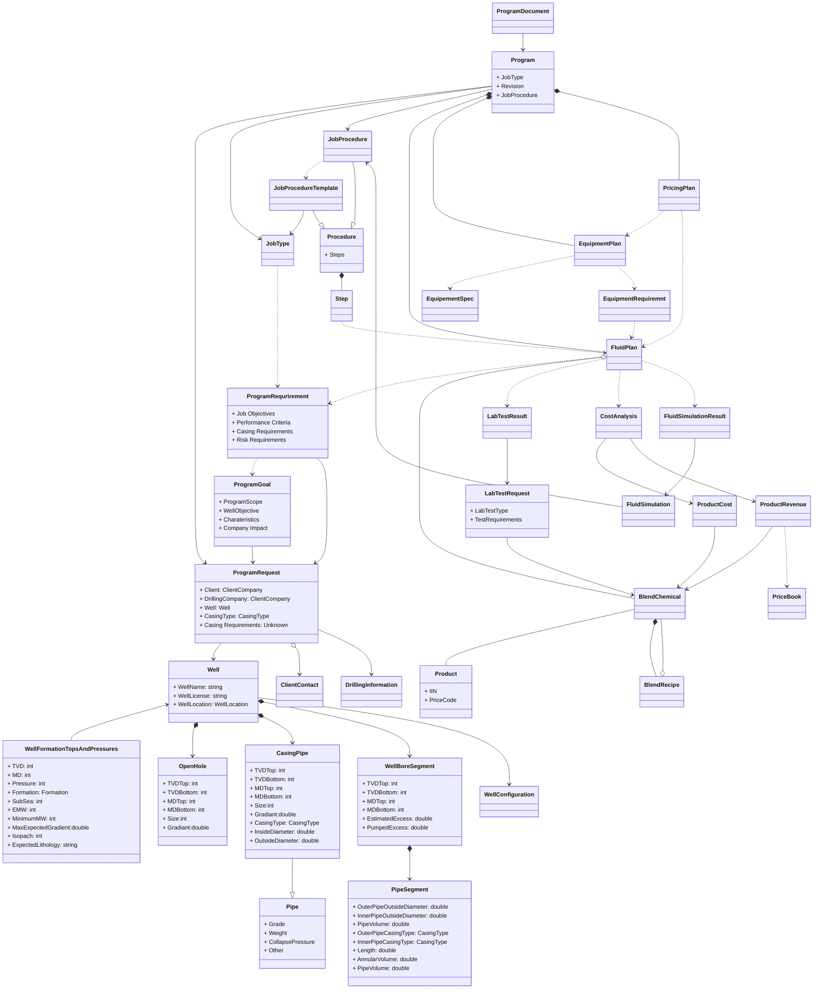

# Job Design Conceptual Model

```mermaid
classDiagram
graph LR
class Well {
+ WellName: string
+ WellLicense: string
+ WellLocation: WellLocation
}
class WellFormationTopsAndPressures {
+ TVD: int
+ MD: int
+ Pressure: int
+ Formation: Formation
+ SubSea: int
+ EMW: int
+ MinimumMW: int
+ MaxExpectedGradient:double
+ Isopach: int
+ ExpectedLithology: string
}
class OpenHole {
+ TVDTop: int
+ TVDBottom: int
+ MDTop: int
+ MDBottom: int
+ Size:int
+ Gradiant:double
}
class CasingPipe {
+ TVDTop: int
+ TVDBottom: int
+ MDTop: int
+ MDBottom: int
+ Size:int
+ Gradiant:double
+ CasingType: CasingType
+ InsideDiameter: double
+ OutsideDiameter: double
}
class Pipe {
+ Grade
+ Weight
+ CollapsePressure
+ Other
}
class WellBoreSegment {
+ TVDTop: int
+ TVDBottom: int
+ MDTop: int
+ MDBottom: int
+ EstimatedExcess: double
+ PumpedExcess: double
}
class PipeSegment {
+ OuterPipeOutsideDiameter: double
+ InnerPipeOutsideDiameter: double
+ PipeVolume: double
+ OuterPipeCasingType: CasingType
+ InnerPipeCasingType: CasingType
+ Length: double
+ AnnularVolume: double
+ PipeVolume: double
}
class WellConfiguration
Well<--WellFormationTopsAndPressures
Well *--> OpenHole
Well *--> CasingPipe
Well *--> WellBoreSegment
Well --> WellConfiguration
WellBoreSegment *--> PipeSegment
CasingPipe --|> Pipe

class ProgramRequest {
 + Client: ClientCompany
 + DrillingCompany: ClientCompany
 + Well: Well
 + CasingType: CasingType
 + Casing Requirements: Unknown
}
ProgramRequest --> Well
ProgramRequest o--> ClientContact
ProgramRequest --> DrillingInformation
class ClientContact
class DrillingInformation

class ProgramGoal {
+ ProgramScope
+ WellObjective
+ Charateristics
+ Company Impact
}

ProgramGoal --> ProgramRequest
ProgramRequrirement ..> ProgramGoal
ProgramRequrirement --> ProgramRequest

class ProgramRequrirement {
+ Job Objectives
+ Performance Criteria
+ Casing Requirements
+ Risk Requirements
}
class Program {
+ JobType
+ Revision
+ JobProcedure
}
Program --> ProgramRequest
Program --> JobType
JobType ..> ProgramRequrirement

class JobProcedureTemplate
JobProcedureTemplate --> JobType
JobProcedure..>JobProcedureTemplate
Program --> JobProcedure
class Procedure {
+ Steps
}
JobProcedureTemplate --|> Procedure
JobProcedure --|> Procedure
Step ..> FluidPlan
Procedure *--Step
class FluidPlan
Program *-- FluidPlan
FluidPlan ..>ProgramRequrirement
class BlendRecipe
FluidPlan o--BlendChemical
BlendChemical -- Product
BlendChemical *-- BlendRecipe
BlendRecipe o-- BlendChemical
class Product {
+ IIN
+ PriceCode
}
class LabTestRequest {
+ LabTestType
+ TestRequirements
}
LabTestRequest --> BlendChemical
LabTestResult --> LabTestRequest
FluidPlan ..>LabTestResult

class ProductCost
ProductCost-->BlendChemical
ProductRevenue-->BlendChemical
ProductRevenue..>PriceBook

class CostAnalysis
CostAnalysis -->ProductCost
CostAnalysis -->ProductRevenue
FluidPlan..>CostAnalysis

class FluidSimulation
FluidSimulation-->JobProcedure
FluidSimulationResult -->FluidSimulation
FluidPlan ..>FluidSimulationResult

class EquipmentRequiremnt

EquipmentRequiremnt ..>FluidPlan

class EquipmentPlan
Program *-- EquipmentPlan
EquipmentPlan ..>EquipementSpec
EquipmentPlan ..>EquipmentRequiremnt

class PricingPlan
Program *-- PricingPlan
PricingPlan ..>EquipmentPlan
PricingPlan ..>FluidPlan

class ProgramDocument
ProgramDocument --> Program
```

